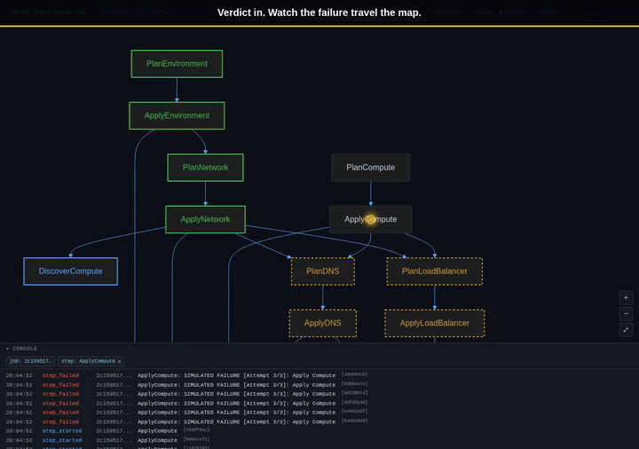
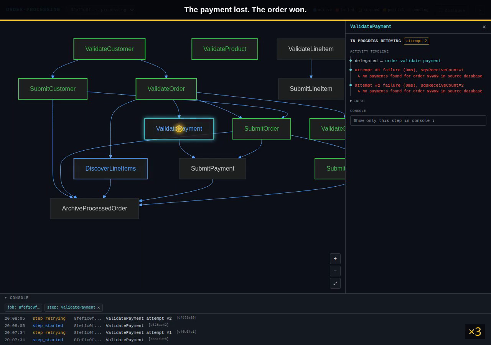
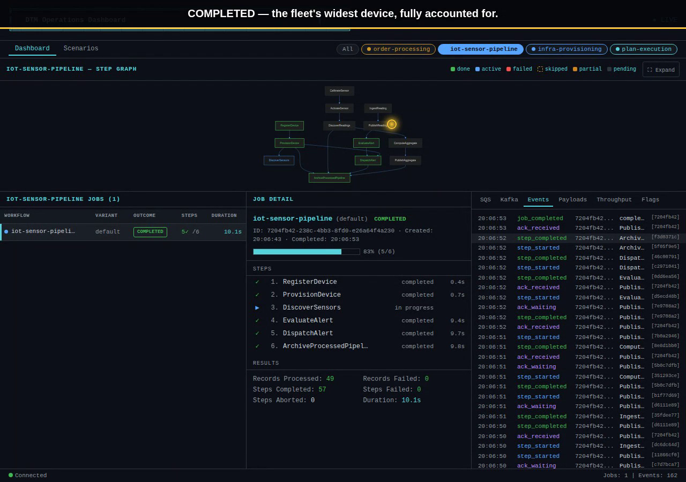
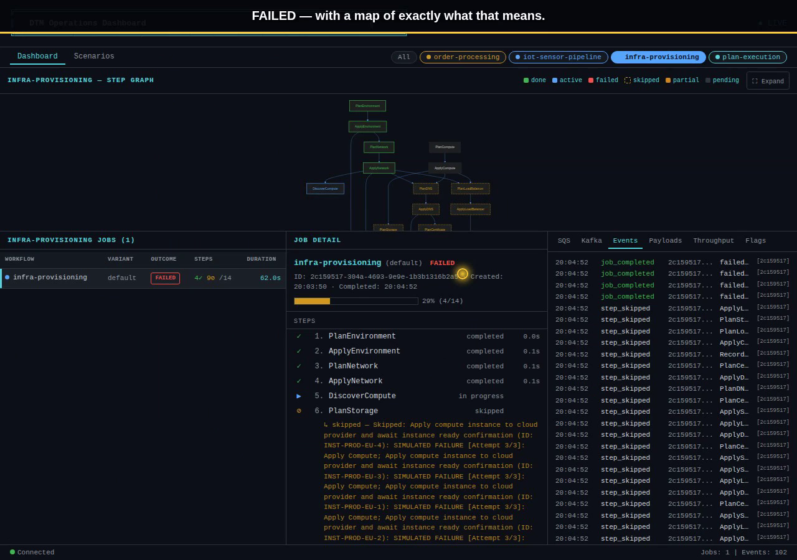
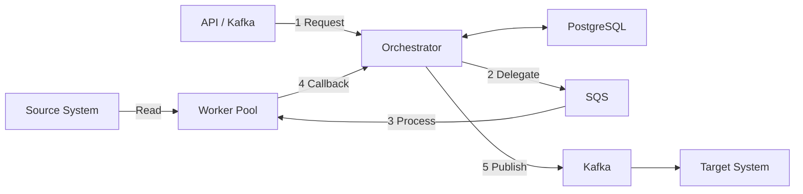

# Setpoint Evals — Watch a Workflow Engine Keep Its Promises

> Every scenario in this repo is a **plain-language contract** — a rule that business and
> engineering read on the same page. Press one button and the engine runs the real thing,
> live, then checks itself against the contract's own acceptance list. When a step is meant
> to fail, you watch it fail *exactly where it should* — and nowhere else.



The demo domain is **DTM — a Distributed Task Manager**: a workflow engine that fans work
out, retries what's flaky, and reports precisely what happened. Three example workflows —
**order processing**, an **IoT sensor pipeline**, and **infrastructure provisioning** —
each stress a different edge: a partial failure, an explosive fan-out, a cascading collapse.
Below, each one is filmed running its most revealing scenario end-to-end.

## See it run

Three short recordings, straight from the live dashboard. Click a poster to play the video.

### 1. A payment fails — but the order survives

Ada's Beans Cafe set one rule: *a failed payment must never sink the order.* Here the card
never clears (it's a deliberately unresolvable payment). Watch the engine honour the rule in
real time — the customer, the order, and the shipment all complete, while the payment step
retries on its own, gives up honestly, and is marked failed. Only the work that genuinely
depended on that payment is skipped. The job lands **PARTIAL_SUCCESS**: it broke where it was
supposed to, and left everything else standing.

<a href="docs/media/order-processing-partial-payment-failure.mp4">
  
</a>

> ▶ [Play the order-processing demo](docs/media/order-processing-partial-payment-failure.mp4) (~1 min)

### 2. One health check becomes eighteen

Nobody knows in advance how much work a single request will become. Greenhouse 3 has three
sensors — and checking them fans out into eighteen individual readings, each tracked on its
own row from discovery to completion. Run it and watch the map *grow* as the engine learns the
fleet, then close itself once every branch has finished. The job lands **COMPLETED**, with
dozens of tracked steps that began life as six.

<a href="docs/media/iot-double-fan-out.mp4">
  
</a>

> ▶ [Play the IoT double-fan-out demo](docs/media/iot-double-fan-out.mp4) (~50 sec)

### 3. One failure, a contained blast radius

Break something on purpose and *watch* the blast radius instead of guessing it. Here the
compute stage is rigged to fail. The engine retries every instance before condemning it, then
the failure travels the map: storage, DNS, and the load balancer are skipped because they sat
on top of compute; the certificate falls two hops further down; and network and environment —
which never needed compute — stand untouched and green. The job lands **FAILED**, with a
picture of exactly what that means.

<a href="docs/media/infra-cascade-failure.mp4">
  
</a>

> ▶ [Play the infra cascade-failure demo](docs/media/infra-cascade-failure.mp4) (~1.5 min)

---

Every scenario above is also an executable test. **Setpoint Evals (SEs)** are shell-based,
end-to-end acceptance criteria — they post real requests to the running engine, poll for
state changes, and assert the end-to-end behaviour on the live stack, not on mocks. The same
contract a stakeholder reads is the setpoint an AI coding agent is held to.

> Companion article: [Setpoint Evals: Giving AI Coding Agents a Long Horizon](https://inctasoft.com/blog/setpoint-evals).
> Theory: [The Setpoint Problem](https://inctasoft.com/blog/setpoint-problem).

The rest of this README is the practitioner's guide: clone it, run it, and copy the pattern.
The three workflows (`order-processing`, `iot-sensor-pipeline`, `infra-provisioning`) together
showcase fan-out processing, cascade FK injection, conditional steps, retries, dead-letter
queues, and end-to-end acknowledgement.

## Architecture



**Flow**: Steps Delegate → Process → Callback repeat for each step in the workflow configuration.
Steps that publish to Kafka enter `WAITING_FOR_ACK`, blocking until the target system acknowledges.

### Key Features
- Parallel execution of independent steps
- Configurable step dependencies with domain-specific verbs
- Fan-out processing (Discovery step creates N child steps)
- Cascade FK injection (parent ACK data flows to child steps)
- Kafka-triggered workflows; deduplication; idempotency
- Simulated delays and failures for testing
- Automatic retries with Dead-Letter Queues
- Configurable outcome rules per workflow
- Two-tier **Setpoint Eval** suite (core engine + per-workflow)

### Components

This is a **pnpm monorepo**:

- **Orchestrator** (`services/orchestrator/`) — NestJS workflow engine
- **Lambda Workers** (`workflows/*/workers/`) — per-workflow Lambda handlers
- **SQS Poller** (`tools/sqs-poller/`) — DEV ONLY: polls SQS for local development
- **Dev ACK Simulator** (`tools/dev-ack-simulator/`) — DEV ONLY: simulates target-system ACKs
- **Core Packages** (`packages/`) — shared entities, Kafka producer/consumer, worker SDK
- **Workflows** (`workflows/`) — pluggable workflow definitions with workers and tests

## Quick Start

### Prerequisites

- Docker + Docker Compose
- Node.js 22+ and pnpm 10+
- AWS CLI (for LocalStack interaction from host scripts)

### Run it

```bash
# 1. Install + build (postinstall creates a default .env from .env.example)
pnpm install
pnpm run build

# 2. Start infrastructure + orchestrator (Kafka, Postgres, LocalStack, dev-ack-simulator)
./scripts/local-env.sh start --standalone --orchestrator

# 3. Deploy Lambda workers (poller mode = default; ESM mode requires LocalStack Pro)
./scripts/local-env.sh deploy-workers

# 4. Run the full Setpoint Eval suite (28 evals: 13 core + 5 per workflow × 3 workflows)
./setpoint-evals/run-all.sh --all-workflows

# 5. Access services (host ports)
# Orchestrator API: http://localhost:3002/api/v1
# Health:           http://localhost:3002/api/v1/health
# Swagger UI:       http://localhost:3002/api-docs
# Kafka UI:         http://localhost:8090
# Monitor (Vite):   http://localhost:5173 (start with --monitor)
```

> Step 1 runs the full build (packages → workflows → orchestrator → handlers → tools → frontend).
> The dev-ack-simulator and orchestrator bind-mount `workflows/*/dist` and `tools/*/dist` from
> the host, so an unbuilt tree means a crashloop. `local-env.sh start` will rebuild on demand,
> but running `pnpm run build` first is faster and easier to debug.
>
> `postinstall` only ever CREATES `.env` — it never refreshes one that already exists, so an
> aged checkout (an old `.env` that predates newly-added keys in `.env.example`) can silently
> boot with missing config. `local-env.sh start` self-heals this on every run: it diffs `.env`
> against `.env.example`, warns loudly about any missing keys, and auto-appends them (dev
> defaults, verbatim from `.env.example`) before starting anything. If a service is already
> running when this fires, recreate it explicitly — a bare `docker restart` does NOT re-read
> `.env` (`docker compose --env-file .env -f docker-compose.yml --profile db --profile
> orchestrator up -d --force-recreate orchestrator`).

### Deployment Modes

**Poller Mode** (default):
```bash
./scripts/local-env.sh deploy-workers --poller   # 10 sqs-poller replicas
```
Reliable on free LocalStack. The poller invokes deployed Lambdas via the LocalStack Lambda API.

**ESM Mode** (parallel via Lambda Event Source Mappings — requires LocalStack Pro):
```bash
export ENABLE_LAMBDA_WITH_ESM_LOCALSTACK_DEPLOYMENT=true
./scripts/local-env.sh deploy-workers --esm
```
The free LocalStack version has known flakiness with ESM v2; without the env var above the
script silently falls back to poller mode.

**Debug-Server Mode** (full breakpoint support):
```bash
./scripts/local-env.sh start --standalone        # infra only, no orchestrator container
./scripts/local-env.sh deploy-workers --debug-server
# Press F5 in VS Code to launch orchestrator + handlers locally with breakpoints
```

Switch between modes anytime without restarting infrastructure:
```bash
./scripts/local-env.sh deploy-workers --poller
./scripts/local-env.sh deploy-workers --esm
```

### Access Databases

DTM Core DB:
```
Host: localhost:5448  Database: dtm  Username: dtm_user
```
Workflow Source DBs:
```
Order Processing:    localhost:5449  (order_processing_db / order_user)
IoT Sensor Pipeline: localhost:5450  (iot_sensor_pipeline_db / iot_user)
Infra Provisioning:  localhost:5451  (infra_provisioning_db / infra_user)
```

## Setpoint Evals

A two-tier shell-based test suite. **The SEs are the long-horizon acceptance criteria** — they
post real requests to the running orchestrator, poll for state changes, and assert the
end-to-end behaviour. They run on the live Docker stack, not on mocks.

```bash
# Core engine SEs (13 tests — retries, DLQ, deduplication, concurrency, maintenance)
./setpoint-evals/run-all.sh

# Per-workflow SEs (5 tests each)
./workflows/order-processing/setpoint-evals/run-all.sh
./workflows/iot-sensor-pipeline/setpoint-evals/run-all.sh
./workflows/infra-provisioning/setpoint-evals/run-all.sh

# Everything (28 evals total)
./setpoint-evals/run-all.sh --all-workflows
```

A single SE:
```bash
./setpoint-evals/SE-01-retry-transient-failure/test.sh
```

Parallel mode is the default; sequential mode is `--in-band`.

### Unit tests
```bash
pnpm test          # services/orchestrator unit tests
pnpm test:cov      # with coverage
```

## Monitoring

```bash
# Health
curl http://localhost:3002/api/v1/health

# Logs
./scripts/local-env.sh logs --follow

# SQS / DB / API observers
./scripts/monitor-sqs-messages.sh
./scripts/monitor-jobs-db.sh
./scripts/monitor-events-api.sh
```

**API Documentation**: http://localhost:3002/api-docs (Swagger UI)

## Project Structure

```
.
├── services/
│   └── orchestrator/               # NestJS workflow engine
│       ├── src/
│       │   ├── ingestion/          # Job creation API
│       │   ├── orchestration/      # Workflow state machine (the brain)
│       │   ├── delegation/         # SQS delegation
│       │   ├── callback/           # Worker callbacks and Kafka publishing
│       │   ├── jobs/               # Job queries
│       │   ├── kafka/              # Kafka event handlers and triggers
│       │   └── auth/               # SuperTokens guard (DISABLE_AUTH=true in dev)
│       └── test/
├── tools/
│   ├── dev-ack-simulator/          # DEV: simulates target-system ACKs
│   └── sqs-poller/                 # DEV: polls SQS, dispatches to Lambdas
├── packages/
│   ├── core/                       # Shared interfaces, enums, DTOs
│   ├── database/                   # TypeORM entities for the core DB
│   ├── errors/                     # Error classes and codes
│   ├── kafka-producer/
│   ├── kafka-consumer/
│   └── worker-sdk/
├── workflows/
│   ├── 00-template/                # New workflow starter template
│   ├── order-processing/           # Parallel root steps, fan-out, optional entities
│   ├── iot-sensor-pipeline/        # Nested fan-out, feature flags, conditional steps
│   ├── infra-provisioning/         # Deep cascade, long ACK timeouts, wide parallel branches
│   └── plan-execution/             # Plan-execution workflow (chunked execution)
├── setpoint-evals/                 # Core engine SEs (13)
│   ├── run-all.sh                  # Suite runner (parallel + destructive phases)
│   ├── analyze-results.sh          # Result compactor
│   └── SE-01-retry-transient-failure/ # ... 13 individual evals
├── setpoint-evals-playwright/      # Optional Playwright-based UI evals
├── docs/                           # Architecture & operations guides
├── scripts/                        # CLI tools
├── CLAUDE.md                       # AI agent project guide
├── docker-compose.yml              # Base infrastructure
├── docker-compose.kafka.yml        # Kafka services
└── docker-compose.workers.yml      # Lambda workers and SQS poller
```

## Development

```bash
# Start full stack
./scripts/local-env.sh start --standalone --orchestrator

# Stop / purge / reset
./scripts/local-env.sh stop
./scripts/local-env.sh purge       # Clear DB only
./scripts/local-env.sh purge --full # + SQS + Kafka
./scripts/local-env.sh reset        # Purge + redeploy

# pnpm workspace
pnpm install                                       # always from root
pnpm --filter "@dtm/orchestrator" run start:dev   # run a single package
pnpm run build                                     # build everything
```

### Docker container naming
All project containers use the `dtm-` prefix. Always filter when listing:
```bash
docker ps --filter "name=dtm-"
```
Never stop / restart containers without the `dtm-` prefix — they belong to other projects.

### LocalStack recovery
Restarting LocalStack wipes ALL state (queues, Lambdas). To recover:
```bash
./scripts/local-env.sh deploy-workers --poller --count=10
docker restart dtm-orchestrator
```

## Documentation

- [docs/MASTER-INDEX.md](docs/MASTER-INDEX.md) — use-case-based navigation
- [docs/guides/system-architecture.md](docs/guides/system-architecture.md) — engine architecture
- [docs/guides/race-condition-prevention.md](docs/guides/race-condition-prevention.md) — callback protocol & race-condition guards
- [docs/guides/database-schema.md](docs/guides/database-schema.md) — schema reference
- [setpoint-evals/README.md](setpoint-evals/README.md) — core engine SE catalog
- [CLAUDE.md](CLAUDE.md) — AI agent project guide

## License

MIT — see [LICENSE](LICENSE).
