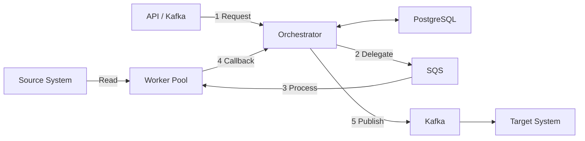

# DTM - Distributed Task Manager

A generic distributed task orchestration engine with pluggable workflows. Built with NestJS, Lambda workers, PostgreSQL, Kafka, and SQS.

Three pluggable workflows are included: `order-processing`, `iot-sensor-pipeline`, and `infra-provisioning`. Each demonstrates different engine capabilities including fan-out processing, cascade FK injection, conditional steps, and end-to-end testing.

## Architecture



**Flow**: Steps Delegate, Process, Callback repeat for each step defined in the workflow configuration.

**Publish and Acknowledgement**: Steps that publish to Kafka enter `WAITING_FOR_ACK` status, blocking until the target system acknowledges receipt.

### Key Features

- Parallel execution of independent steps
- Configurable step dependencies with domain-specific verbs
- Fan-out processing (Discovery step creates N child steps)
- Cascade FK injection (parent ACK data flows to child steps)
- Kafka-triggered workflows
- Deduplication and idempotency
- Simulated delays and failures for testing
- Automatic retries with Dead Letter Queues
- Configurable outcome rules per workflow
- Two-tier STE (State Transition Eval) testing system

### Components

This is a **pnpm monorepo** with:

- **Orchestrator** (`services/orchestrator/`) - NestJS workflow engine
- **Lambda Workers** (`workflows/*/workers/`) - Per-workflow Lambda handlers
- **SQS Poller** (`tools/sqs-poller/`) - DEV ONLY: Polls SQS for local development
- **Dev ACK Simulator** (`tools/dev-ack-simulator/`) - DEV ONLY: Simulates target system acknowledgements
- **Core Packages** (`packages/`) - Shared database entities, Kafka producer/consumer, worker SDK
- **Workflows** (`workflows/`) - Pluggable workflow definitions with workers and tests

## Quick Start

### Prerequisites

- Docker and Docker Compose
- Node.js 22+ and pnpm 10+
- AWS CLI (for LocalStack interaction)

### Start the Service

```bash
# 1. Install dependencies
pnpm install

# 2. Start infrastructure and services
./scripts/local-env.sh start --standalone --orchestrator

# 3. Deploy Lambda workers
./scripts/local-env.sh deploy-workers --poller --count=5

# 4. Access services
# Orchestrator API: http://localhost:3002
# API Docs: http://localhost:3002/api-docs
# Kafka UI: http://localhost:8090
```

### Deployment Modes

**ESM Mode** (parallel execution):
```bash
./scripts/local-env.sh deploy-workers --esm
```

- Up to 50 parallel Lambda invocations via LocalStack Event Source Mappings
- Recommended for E2E testing and production-like environments

**Poller Mode** (sequential execution):
```bash
./scripts/local-env.sh deploy-workers --poller
```

- One message processed at a time
- Easier to follow execution flow and debug

**Debug-Server Mode** (full breakpoint support):
```bash
# 1. Start infrastructure only (no --orchestrator flag)
./scripts/local-env.sh start --standalone

# 2. Deploy in debug mode
./scripts/local-env.sh deploy-workers --debug-server

# 3. Press F5 in VS Code to launch orchestrator + workers with breakpoints
```

- Full breakpoint debugging across orchestrator and all handlers
- No Lambda timeouts (15-minute effective timeout vs 15s LocalStack limit)
- Hot reload for both orchestrator and handler code changes

Switch between modes anytime without restarting infrastructure:
```bash
./scripts/local-env.sh deploy-workers --poller   # Switch to poller
./scripts/local-env.sh deploy-workers --esm      # Switch to ESM
```

### Access Databases

DTM Core DB:
```
Host: localhost:5448
Database: dtm
Username: dtm_user
```

Workflow Source DBs (each workflow has its own):
```
Order Processing DB:   localhost:5449  (database: order_processing_db, user: order_user)
IoT Sensor DB:         localhost:5450  (database: iot_sensor_pipeline_db, user: iot_user)
Infra Provisioning DB: localhost:5451  (database: infra_provisioning_db, user: infra_user)
```

## Testing

### Unit Tests
```bash
pnpm test              # All packages
pnpm test:cov          # With coverage
```

### State Transition Evals (STEs)

Two-tier testing system for validating workflow behavior end-to-end:

```bash
# Core engine tests (13 STEs)
./ste/run-all.sh

# Workflow-specific tests
./workflows/order-processing/ste/run-all.sh

# All tests combined
./ste/run-all.sh --all-workflows
```

Individual STE:
```bash
./ste/01-retry-transient-failure/test.sh
```

Parallel run:
```bash
./ste/run-all.sh --parallel
```

## Monitoring

```bash
# Service health
curl http://localhost:3002/health

# View logs
./scripts/local-env.sh logs --follow

# Monitor SQS queues
./scripts/monitor-sqs-messages.sh

# Monitor database jobs
./scripts/monitor-jobs-db.sh

# Monitor API requests
./scripts/monitor-events-api.sh
```

## Project Structure

```
dtm/
├── services/
│   └── orchestrator/               # NestJS workflow engine
│       ├── src/
│       │   ├── ingestion/          # Job creation API
│       │   ├── orchestration/      # Workflow state machine
│       │   ├── delegation/         # SQS delegation
│       │   ├── callback/           # Worker callbacks and Kafka publishing
│       │   ├── jobs/               # Job queries
│       │   ├── kafka/              # Kafka event handlers and triggers
│       │   └── config/             # Workflow definitions
│       └── test/                   # Unit tests
├── tools/
│   ├── dev-ack-simulator/          # DEV: ACK simulator
│   └── sqs-poller/                 # DEV: SQS poller
├── packages/
│   ├── core/                       # Shared interfaces, enums, DTOs
│   ├── database/                   # TypeORM entities and repositories
│   ├── errors/                     # Error classes and codes
│   ├── kafka-producer/             # Kafka producer
│   ├── kafka-consumer/             # Kafka consumer
│   └── worker-sdk/                 # Worker SDK
├── workflows/
│   ├── 00-template/                # New workflow starter template
│   ├── order-processing/           # Parallel root steps, fan-out, optional entities
│   ├── iot-sensor-pipeline/        # Nested fan-out, feature flags, conditional steps
│   └── infra-provisioning/         # Deep cascade, long ACK timeouts, wide parallel branches
├── ste/                             # Core engine STEs (13 tests)
├── docs/                           # Core engine documentation
├── scripts/                        # CLI tools
├── CLAUDE.md                       # AI agent project guide
├── docker-compose.yml              # Base infrastructure
├── docker-compose.kafka.yml        # Kafka services
└── docker-compose.workers.yml      # Lambda workers and SQS poller
```

## Documentation

- **[docs/MASTER-INDEX.md](docs/MASTER-INDEX.md)** - Use-case-based documentation navigation
- **[docs/guides/system-architecture.md](docs/guides/system-architecture.md)** - Engine architecture
- **[docs/guides/race-condition-prevention.md](docs/guides/race-condition-prevention.md)** - Callback protocol and race condition guards
- **[docs/guides/database-schema.md](docs/guides/database-schema.md)** - Database schema reference
- **[ste/README.md](ste/README.md)** - Core engine STE catalog

## Development

```bash
# Start full stack with hot reload
./scripts/local-env.sh start --standalone --orchestrator

# View logs
./scripts/local-env.sh logs

# Purge all data (queues, databases)
./scripts/local-env.sh purge

# Full reset (purge + redeploy)
./scripts/local-env.sh reset

# Stop all services
./scripts/local-env.sh stop
```

### pnpm Workspace Commands

```bash
# Install from root (always)
pnpm install

# Run scripts in specific packages
pnpm --filter "@dtm/orchestrator" run start:dev

# Build all
pnpm build
```

### Docker Container Naming

All project containers use the `dtm-` prefix. When listing containers, always filter:
```bash
docker ps --filter "name=dtm-"
```

Never stop or restart containers that do not have the `dtm-` prefix -- they belong to other projects.

### LocalStack Recovery

Restarting LocalStack wipes all state (queues, Lambdas). Recovery:
```bash
# Queues auto-recreate on startup
# Redeploy workers
./scripts/local-env.sh deploy-workers --poller --count=10

# Restart orchestrator if connection lost
docker restart dtm-orchestrator
```

**API Documentation**: http://localhost:3002/api-docs (Swagger UI)
