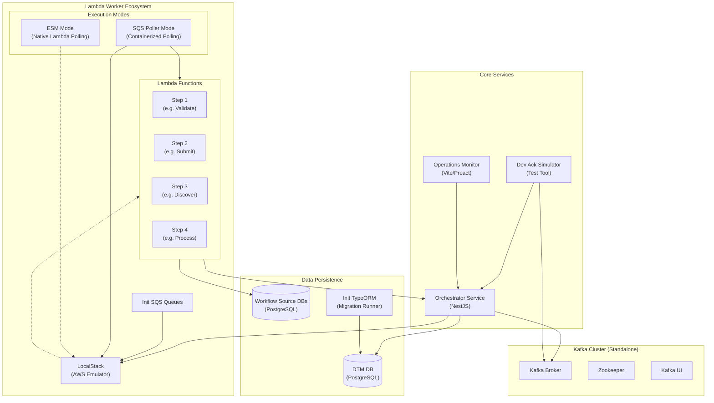

# Docker Ecosystem & Deployment Guide

This guide provides a comprehensive overview of the Docker Compose ecosystem used in DTM (Distributed Task Manager). It explains the various services, their dependencies, and what exactly runs in different deployment scenarios.

## 🏗️ System Architecture

The following Mermaid diagram illustrates the services and their dependencies in the Docker ecosystem.



---

## 🚀 Deployment Scenarios

This section details exactly which containers are running in specific scenarios requested.

### 1. Standalone Mode + ESM Workers (Default)

**Command:**
```bash
./scripts/local-env.sh start --standalone --orchestrator --front-end
./scripts/local-env.sh deploy-workers  # Defaults to --esm
```

**Running Containers:**

| Service | Container Name | Description |
| :--- | :--- | :--- |
| **Zookeeper** | `zookeeper` | Coordination for Kafka |
| **Kafka** | `kafka` | Message broker (Local) |
| **Kafka UI** | `kafka-ui` | Web UI for Kafka management |
| **DTM DB** | `dtm-db` | PostgreSQL for job state |
| **Workflow Source DBs** | `dtm-*-source-db` | PostgreSQL source system mocks (per-workflow) |
| **Orchestrator** | `dtm-orchestrator` | Main API service |
| **Monitor** | `dtm-monitor` | Operations dashboard (Vite/Preact) |
| **Init TypeORM** | `dtm-init-typeorm` | *Exited* (Runs migrations then stops) |
| **Dev Ack Sim** | `dtm-dev-ack-simulator` | Simulates external system acknowledgements |
| **LocalStack** | `dtm-localstack` | AWS SQS/Lambda emulator |
| **Init SQS** | `dtm-init-sqs` | *Exited* (Creates queues then stops) |
| **Lambda Workers** | *(On-Demand)* | Docker containers spawned by LocalStack when messages arrive |

**Key Behavior:**
- **ESM (Event Source Mapping)** is enabled in LocalStack.
- LocalStack internally polls SQS and spins up Lambda containers on demand.
- **Concurrency:** Parallel execution managed by LocalStack (limited by `LAMBDA_LIMITS_CONCURRENT_EXECUTIONS`).

---

### 2. Standalone Mode + Poller Workers

**Command:**
```bash
./scripts/local-env.sh start --standalone --orchestrator --front-end
./scripts/local-env.sh deploy-workers --poller --count 5
```

**Running Containers:**

| Service | Container Name | Description |
| :--- | :--- | :--- |
| **Zookeeper** | `zookeeper` | Coordination for Kafka |
| **Kafka** | `kafka` | Message broker (Local) |
| **Kafka UI** | `kafka-ui` | Web UI for Kafka management |
| **DTM DB** | `dtm-db` | PostgreSQL for job state |
| **Workflow Source DBs** | `dtm-*-source-db` | PostgreSQL source system mocks (per-workflow) |
| **Orchestrator** | `dtm-orchestrator` | Main API service |
| **Monitor** | `dtm-monitor` | Operations dashboard (Vite/Preact) |
| **Dev Ack Sim** | `dtm-dev-ack-simulator` | Simulates target system acknowledgements |
| **LocalStack** | `dtm-localstack` | AWS SQS/Lambda emulator |
| **SQS Poller** | `dtm-sqs-poller-1`..`5` | **5 Replicas** of the Node.js poller app |

**Key Behavior:**
- **ESM is DISABLED** in LocalStack.
- The `sqs-poller` containers (5 instances) explicitly poll SQS queues.
- When a message is received, the poller invokes the Lambda function via the AWS SDK (LocalStack).
- **Concurrency:** Limited by the number of poller replicas (5 in this case). Useful for sequential or throttled testing.

---

### 3. Integrated Mode + ESM Workers

**Command:**
```bash
./scripts/local-env.sh start --integrated --orchestrator --front-end
./scripts/local-env.sh deploy-workers
```

**Pre-requisites:**
- `backend-apps` repo must be running locally (provides Kafka).

**Running Containers:**

| Service | Container Name | Description |
| :--- | :--- | :--- |
| **DTM DB** | `dtm-db` | PostgreSQL for job state |
| **Workflow Source DBs** | `dtm-*-source-db` | PostgreSQL source system mocks (per-workflow) |
| **Orchestrator** | `dtm-orchestrator` | Main API service |
| **Monitor** | `dtm-monitor` | Operations dashboard (Vite/Preact) |
| **Dev Ack Sim** | `dtm-dev-ack-simulator` | Simulates target system acknowledgements |
| **LocalStack** | `dtm-localstack` | AWS SQS/Lambda emulator |
| **Kafka Init** | `kafka-init-integrated` | *Exited* (Creates topics in external Kafka) |
| **Lambda Workers** | *(On-Demand)* | Docker containers spawned by LocalStack |

**Key Differences:**
- **NO Local Kafka** containers (`zookeeper`, `kafka`, `kafka-ui`) are started.
- Services connect to the **External Kafka** provided by `backend-apps` via the `backend-apps_default` network.
- Ideal for full system integration testing.

---

## 📂 Docker Compose Files

| File | Purpose |
| :--- | :--- |
| `docker-compose.yml` | **Main Core Services**: DB, Orchestrator, Monitor, Dev-Tools |
| `docker-compose.workers.yml` | **Worker Ecosystem**: LocalStack, SQS Poller, Queue Init |
| `docker-compose.kafka.yml` | **Standalone Kafka**: Zookeeper, Kafka, Kafka UI |
| `workflows/*/docker-compose.*.yml` | **Source Systems**: Per-workflow source database containers |
| `docker-compose.orchestrator-integrated.yml`| **Override**: Configures Orchestrator for Integrated Mode |
| `docker-compose.kafka-init-integrated.yml`| **Utility**: Script to init topics in external Kafka |

## 🛠️ Common Profiles

The system uses Docker Compose profiles to selectively start services:

- `db`: Database services
- `orchestrator`: The main API application
- `web-ui`: The operations monitor dashboard
- `dev-tools`: Testing tools (Ack Simulator, etc.)
- `poller`: The manual SQS poller service

