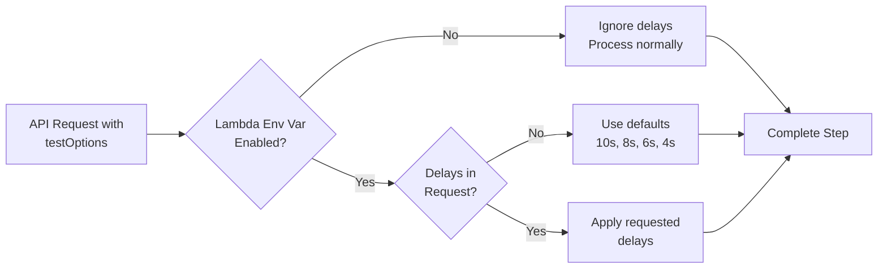
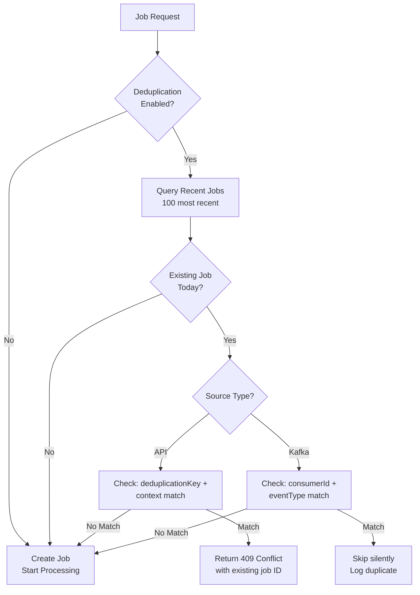

# DTM Features

This document describes key features of the DTM (Distributed Task Manager), including configuration options and production safety considerations.

## Table of Contents

- [Simulated Delays (Testing Feature)](#simulated-delays-testing-feature)
- [Deduplication Service (Idempotency)](#deduplication-service-idempotency)
- [Kafka Acknowledgement Workflow](#kafka-acknowledgement-workflow)
- [Environment Configuration](#environment-configuration)

---

## Simulated Delays (Testing Feature)

### Overview

Simulated delays allow you to inject configurable delays into workflow steps for **testing**, **demonstrations**, and **development** purposes. This feature is **production-safe** and requires explicit enablement.

### 🔒 Production Safety

**Key Safety Features:**

- ✅ **Disabled by default** - Requires explicit environment variable to activate
- ✅ **Two-layer protection** - Both Lambda environment AND request payload must enable delays
- ✅ **No accidental activation** - Cannot be enabled via API request alone
- ✅ **Clear intent** - Deployment configuration must explicitly opt-in

**Why it's safe for production:**

1. The `ENABLE_REQUESTS_FOR_SIMULATED_DELAYS` environment variable must be set to `"true"` in Lambda worker configuration
2. Without this environment variable, all delay requests are ignored (workers process normally)
3. API requests with simulated delays are rejected silently if the environment is not configured

### How It Works

**Request Flow:**



**Step Delays:**

| Step                  | Default Delay | Purpose                      |
| --------------------- | ------------- | ---------------------------- |
| `ValidateCustomer`    | 10 seconds    | Simulate database query time |
| `SubmitCustomer`      | 8 seconds     | Simulate data submission     |
| `ValidateOrder`       | 6 seconds     | Simulate database query time |
| `SubmitOrder`         | 4 seconds     | Simulate data submission     |

**Parallel Execution:**

- Validate steps run in **parallel** → Total time = `max(10s, 6s)` = **10 seconds**
- Submit steps run in **parallel** → Total time = `max(8s, 4s)` = **8 seconds**
- **Total job time** ≈ `10s + 8s` + overhead = **~18 seconds**

### Configuration

#### 1. Enable in Lambda Workers (Deployment)

**Deployment Script (`tools/scripts/deploy-to-localstack.js`):**

```javascript
const envVars = {
  ORCHESTRATOR_URL: "http://orchestrator:3000",
  NODE_ENV: "development",
  AWS_REGION: AWS_REGION,
  // Enable simulated delays feature (required for testing)
  ENABLE_REQUESTS_FOR_SIMULATED_DELAYS: process.env.ENABLE_REQUESTS_FOR_SIMULATED_DELAYS || "false",
};
```

**Docker Compose (`.env` files):**

```bash
# Development/Testing - Enable delays
ENABLE_REQUESTS_FOR_SIMULATED_DELAYS=true

# Production - Disable delays (default)
ENABLE_REQUESTS_FOR_SIMULATED_DELAYS=false  # or omit entirely
```

#### 2. Request Simulated Delays (API)

**Full Custom Delays:**

```bash
curl -X POST "http://localhost:3002/api/v1/workflows/order-processing/jobs" \
  -H "Content-Type: application/json" \
  -d '{
    "externalSystemId": "test-system",
    "webhookUrl": "https://example.com/webhook",
    "testOptions": {
      "ValidateCustomer": 15000,    # 15 seconds
      "SubmitCustomer": 12000,  # 12 seconds
      "ValidateOrder": 10000,  # 10 seconds
      "SubmitOrder": 5000  # 5 seconds
    }
  }'
```

**Partial Overrides (use defaults for others):**

```bash
curl -X POST "http://localhost:3002/api/v1/workflows/order-processing/jobs" \
  -H "Content-Type: application/json" \
  -d '{
    "externalSystemId": "test-system",
    "webhookUrl": "https://example.com/webhook",
    "testOptions": {
      "ValidateCustomer": 20000  # Only override this one
    }
  }'
```

**Result:**

- `ValidateCustomer`: 20000ms (custom)
- `SubmitCustomer`: 8000ms (default)
- `ValidateOrder`: 6000ms (default)
- `SubmitOrder`: 4000ms (default)

### Use Cases

**1. Testing Parallel Execution:**

```json
{
  "testOptions": {
    "ValidateCustomer": 5000,
    "ValidateOrder": 10000 // Verify longer step determines total time
  }
}
```

**2. Demonstrating Progress Tracking:**

```json
{
  "testOptions": {
    "ValidateCustomer": 30000,
    "SubmitCustomer": 25000,
    "ValidateOrder": 20000,
    "SubmitOrder": 15000
  }
}
```

**3. Load Testing with Realistic Timing:**

```json
{
  "testOptions": {
    "ValidateCustomer": 2000,
    "SubmitCustomer": 1500,
    "ValidateOrder": 1000,
    "SubmitOrder": 500
  }
}
```

**4. Test Transient Failures (Retry Succeeds):**

```json
{
  "testOptions": {
    "validateCustomerFailureAfter": 2000,
    "validateCustomerFailOnAttempts": [1]
  }
}
```

- Attempt 1: Fails after 2s → SQS retries
- Attempt 2: Succeeds (not in failOnAttempts)
- **Use Case:** Test that retry logic works and system recovers

**5. Test Multiple Retries Required:**

```json
{
  "testOptions": {
    "submitCustomerFailureAfter": 1000,
    "submitCustomerFailOnAttempts": [1, 2]
  }
}
```

- Attempts 1-2: Both fail → SQS retries twice
- Attempt 3: Succeeds
- **Use Case:** Test system handles multiple retries, orchestration waits correctly

**6. Test Permanent Failure (Exhausts Retries):**

```json
{
  "testOptions": {
    "validateOrderFailureAfter": 500,
    "validateOrderFailOnAttempts": [1, 2, 3, 4, 5]
  }
}
```

- All attempts fail → Goes to Dead Letter Queue
- Job marked as FAILED
- Dependent steps marked as SKIPPED
- **Use Case:** Test DLQ behavior, error handling, alerting

**7. Test Mixed Retry Scenarios (Complex Demo):**

```json
{
  "testOptions": {
    "ValidateCustomer": 5000,
    "validateCustomerFailureAfter": 3000,
    "validateCustomerFailOnAttempts": [1],

    "ValidateOrder": 3000,
    "validateOrderFailureAfter": 2000,
    "validateOrderFailOnAttempts": [1, 2],

    "SubmitCustomer": 4000,
    "SubmitOrder": 2000
  }
}
```

- ValidateCustomer: Fails once (at 3s mark), retries, succeeds with 5s delay
- ValidateOrder: Fails twice (at 2s mark each), succeeds on attempt 3 with 3s delay
- Submit steps: Run normally with delays
- **Use Case:** Demonstrate resilience in parallel execution with mixed retry scenarios

### Implementation Details

**Lambda Worker Code (`simulateWork` function):**

```typescript
async function simulateWork(stepName: string, delayMs?: number): Promise<void> {
  // Security check: Only allow delays if explicitly enabled
  if (process.env.ENABLE_REQUESTS_FOR_SIMULATED_DELAYS !== "true") {
    console.log(`⚠️  Simulated delays disabled (ENABLE_REQUESTS_FOR_SIMULATED_DELAYS != true)`);
    return; // No delay, proceed immediately
  }

  if (!delayMs || delayMs <= 0) {
    console.log(`⏭️  No delay requested for ${stepName}`);
    return;
  }

  console.log(`⏳ Simulating ${stepName} work: ${delayMs}ms delay...`);
  await new Promise((resolve) => setTimeout(resolve, delayMs));
  console.log(`✅ ${stepName} delay complete`);
}
```

**Worker Usage:**

```typescript
// Validate Customer Worker
const delayMs = input.testOptions?.ValidateCustomer?.simDelay;
await simulateWork('ValidateCustomer', delayMs);

// Then proceed with actual work
const consumers = await validateCustomerData(...);
```

### OpenAPI Documentation

The Swagger UI includes full documentation of the `testOptions` parameter:

**Endpoint:** `POST /api/v1/workflows/:workflowName/jobs`

**Parameter Documentation:**

- **Description**: Optional simulated delays for testing and demonstrations
- **Default Values**: Shown for each step
- **Parallel Execution**: Explained with total time calculation
- **Security Warning**: `⚠️ Requires ENABLE_REQUESTS_FOR_SIMULATED_DELAYS=true in environment`

### Retry-Aware Failure Simulation

The failure simulation feature now supports **retry-awareness**, allowing you to test specific retry scenarios by controlling which retry attempts should fail.

**How It Works:**

Each Lambda worker receives the SQS message's `ApproximateReceiveCount` (attempt number). You can configure exactly which attempts should fail:

```json
{
  "testOptions": {
    "validateCustomerFailureAfter": 2000,
    "validateCustomerFailOnAttempts": [1, 2]
  }
}
```

**Behavior:**

- **Attempt 1**: Worker processes for 2s, then throws error → SQS retries
- **Attempt 2**: Worker processes for 2s, then throws error → SQS retries again
- **Attempt 3**: Worker succeeds (3 not in `failOnAttempts` array) ✅
- **Attempt 4+**: Would also succeed if retry limit allows

**Key Features:**

1. **Selective Failures**: Specify exact attempt numbers that should fail
2. **Transient Testing**: Test scenarios where retries fix the problem
3. **DLQ Testing**: Exhaust all retries to test Dead Letter Queue behavior
4. **Parallel Retry Testing**: Test complex scenarios where different steps retry at different rates

**Special Behaviors:**

| Configuration                       | Behavior                                      |
| ----------------------------------- | --------------------------------------------- |
| `failOnAttempts: [1]`               | Fail once, succeed on retry (transient error) |
| `failOnAttempts: [1, 2]`            | Fail twice, succeed on 3rd attempt            |
| `failOnAttempts: [1, 2, 3, 4, 5]`   | Fail all attempts → DLQ (permanent error)     |
| `failOnAttempts: undefined` or `[]` | Fail ALL attempts (original behavior)         |

**Worker Logs:**

```bash
# Attempt 1 (configured to fail)
[Validate Customer] ⚠️ Attempt 1: Will simulate failure after 2000ms
[Validate Customer] ❌ SIMULATED FAILURE: Validate Customer failed after 2000ms (attempt 1/2+) [TESTING]

# Attempt 2 (configured to fail)
[Validate Customer] ⚠️ Attempt 2: Will simulate failure after 2000ms
[Validate Customer] ❌ SIMULATED FAILURE: Validate Customer failed after 2000ms (attempt 2/2+) [TESTING]

# Attempt 3 (NOT in failOnAttempts - succeeds)
[Validate Customer] ℹ️ Attempt 3: Skipping simulated failure (not in failOnAttempts: [1, 2])
[Validate Customer] ✓ Simulated work completed
[Validate Customer] ✅ Consumer found: consumer_no=1000
```

**Demo Scenario - Progressive Recovery:**

Perfect for presentations showing system resilience:

```json
{
  "testOptions": {
    "ValidateCustomer": 3000,
    "validateCustomerFailureAfter": 2000,
    "validateCustomerFailOnAttempts": [1],

    "ValidateOrder": 3000,

    "SubmitCustomer": 2000,
    "submitCustomerFailureAfter": 1000,
    "submitCustomerFailOnAttempts": [1, 2],

    "SubmitOrder": 2000
  }
}
```

**Timeline:**

1. **0-2s**: ValidateCustomer processes, fails at 2s
2. **0-3s**: ValidateOrder processes in parallel, succeeds
3. **~5-8s**: ValidateCustomer retry attempt #2, succeeds (8s total)
4. **8-9s**: SubmitCustomer attempt #1, fails at 9s
5. **~11-12s**: SubmitCustomer attempt #2, fails at 12s
6. **~14-16s**: SubmitCustomer attempt #3, succeeds (16s total)
7. **8-10s**: SubmitOrder runs in parallel, succeeds
8. **~16s**: All steps complete - Job COMPLETED ✅

**Key Presentation Points:**

- ✅ System automatically retries failed steps
- ✅ Parallel execution continues for independent steps
- ✅ No manual intervention required
- ✅ Complete observability via logs and dashboard

### Error Field Behavior (v2.1.3+)

**Important Change**: The `error` field in `dtm_steps` now truly reflects the **current error state** of a step.

**Behavior:**

- ✅ **On Failure**: The `error` field contains the error message from the failed attempt
- ✅ **On Success After Retry**: The `error` field is **cleared (set to NULL)** when a step eventually succeeds
- ✅ **Error History**: All errors from all attempts are preserved in `execution_history` (JSONB array)

**Example Scenario:**

```sql
-- After Attempt 1 fails:
SELECT step_value, status, retry_count, error FROM dtm_steps WHERE id = 'xyz';
-- status: in_progress_retrying
-- retry_count: 1
-- error: "SIMULATED FAILURE [Attempt 1/3]: Validate Customer failed after 2000ms"

-- After Attempt 2 fails:
-- status: in_progress_retrying
-- retry_count: 2
-- error: "SIMULATED FAILURE [Attempt 2/3]: Validate Customer failed after 2000ms"

-- After Attempt 3 succeeds:
-- status: completed
-- retry_count: 3
-- error: NULL  ✅ (cleared on success!)
-- execution_history: [
--   {"attemptNumber": 1, "status": "failure", "error": "SIMULATED FAILURE [Attempt 1/3]..."},
--   {"attemptNumber": 2, "status": "failure", "error": "SIMULATED FAILURE [Attempt 2/3]..."},
--   {"attemptNumber": 3, "status": "success", "output": {...}}
-- ]
```

**Why This Matters:**

- ✅ API responses don't show errors for successfully completed steps
- ✅ Monitoring dashboards correctly show "no error" for completed steps
- ✅ Full error history still available in `execution_history` for debugging
- ✅ Clear separation between "current state" (error field) and "full history" (execution_history)

**Related Documentation:**

- See [CRITICAL-BUG-FIX-RETRY-HANDLING.md](../CRITICAL-BUG-FIX-RETRY-HANDLING.md) § Bug #3 for technical details

### Monitoring Delays

**Orchestrator Logs:**

```
[Orchestrator] Delegating step ValidateCustomer with delay: 10000ms
```

**Worker Logs (CloudWatch):**

```
[ValidateCustomer] ⏳ Simulating ValidateCustomer work: 10000ms delay...
[ValidateCustomer] ... (10 seconds later)
[ValidateCustomer] ✅ ValidateCustomer delay complete
```

**Database Tracking:**

```sql
SELECT
  id,
  step_value,
  status,
  created_at,
  completed_at,
  EXTRACT(EPOCH FROM (completed_at - created_at)) as duration_seconds
FROM dtm_steps
WHERE job_id = 'your-job-id'
ORDER BY created_at;
```

---

## Deduplication Service (Idempotency)

### Overview

The Deduplication Service prevents duplicate job requests from being processed, ensuring **idempotent** operations. This unified service handles deduplication for both **Kafka-triggered** and **API-triggered** jobs.

### 🎯 Key Features

- ✅ **Unified Logic** - Same deduplication algorithm for all job sources
- ✅ **Configurable** - Can be enabled or disabled via environment variable
- ✅ **Time-based** - Checks for duplicates within the same day (00:00:00 to 23:59:59)
- ✅ **Context-aware** - Matches based on identifier, source, and additional context
- ✅ **Production-ready** - Designed for high-throughput scenarios

### How It Works

**Deduplication Flow:**



**Matching Rules:**

| Source                       | Primary Key                    | Context              | Match Criteria                   |
| ---------------------------- | ------------------------------ | -------------------- | -------------------------------- |
| **API**                      | `deduplicationKey`             | additional context   | Same identifier + context + today |
| **Kafka (consumer.created)** | `consumerId`                   | `eventType: created` | Same consumerId + topic + today  |
| **Kafka (consumer.updated)** | `consumerId`                   | `eventType: updated` | Same consumerId + topic + today  |

### Configuration

#### Environment Variable

**Enable/Disable Deduplication:**

```bash
# Enable deduplication (recommended for production)
ENABLE_DEDUPLICATION=true

# Disable deduplication (development/testing)
ENABLE_DEDUPLICATION=false
```

**Environment Files:**

```bash
# .env.development - Disabled by default for development
ENABLE_DEDUPLICATION=false

# .env.production - Enabled for production
ENABLE_DEDUPLICATION=true

# .env.local - Disabled for local debugging
ENABLE_DEDUPLICATION=false

# .env.test - Disabled for automated tests
ENABLE_DEDUPLICATION=false
```

### API Behavior

#### When Deduplication is Enabled

**Request:**

```bash
curl -X POST "http://localhost:3002/api/v1/workflows/order-processing/jobs" \
  -H "Content-Type: application/json" \
  -d '{
    "externalSystemId": "test-system",
    "webhookUrl": "https://example.com/webhook"
  }'
```

**First Request (Success):**

```json
{
  "success": true,
  "jobId": "550e8400-e29b-41d4-a716-446655440000",
  "message": "Job created and started successfully"
}
```

**Second Request (Same Day - Duplicate):**

```json
HTTP/1.1 409 Conflict
Content-Type: application/json

{
  "statusCode": 409,
  "message": "Job request already exists for this entity today",
  "error": "Conflict",
  "existingJobId": "550e8400-e29b-41d4-a716-446655440000",
  "status": "processing",
  "submittedAt": "2025-11-20T10:15:30Z"
}
```

**Third Request (Next Day - Allowed):**

```json
{
  "success": true,
  "jobId": "660e8400-e29b-41d4-a716-446655440001",
  "message": "Job created and started successfully"
}
```

#### When Deduplication is Disabled

**All Requests Succeed:**

```bash
# First request
curl -X POST ... # → New job created

# Second request (immediate duplicate)
curl -X POST ... # → Another new job created

# Third request
curl -X POST ... # → Yet another new job created
```

### Kafka Behavior

#### When Deduplication is Enabled

**Kafka Event:**

```json
{
  "topic": "target.consumer.created",
  "value": {
    "consumerId": "consumer-123",
    "entityNumber": 1000,
    "eventType": "created"
  }
}
```

**First Event (Success):**

```log
[JobTriggerService] Triggering job for consumer consumer-123 (consumer_no: 1000) from created event
[JobTriggerService] Created job abc-123-def for consumer consumer-123
[JobTriggerService] ✅ Job started for consumer consumer-123: 4 steps created
```

**Second Event (Same Day - Duplicate):**

```log
[JobTriggerService] Job already exists for consumer consumer-123 (created) - Job ID: abc-123-def, Status: processing
[ConsumerCreatedHandler] ⏭️  Job skipped for consumer consumer-123 (duplicate)
```

#### When Deduplication is Disabled

**All Events Trigger Jobs:**

```log
# First event
[JobTriggerService] Created job abc-123-def for consumer consumer-123

# Second event (immediate duplicate)
[JobTriggerService] Created job ghi-456-jkl for consumer consumer-123

# Third event
[JobTriggerService] Created job mno-789-pqr for consumer consumer-123
```

### Implementation Details

**Service Architecture:**

```typescript
@Injectable()
export class DeduplicationService {
  private readonly DEDUPLICATION_ENABLED: boolean;

  constructor(
    private readonly jobRepository: JobRepository,
    private readonly configService: ConfigService,
  ) {
    this.DEDUPLICATION_ENABLED = this.configService.get<string>("ENABLE_DEDUPLICATION") === "true";
  }

  /**
   * Check if deduplication is enabled
   */
  isEnabled(): boolean {
    return this.DEDUPLICATION_ENABLED;
  }

  /**
   * Find existing job within the current day
   * @returns Existing job or null
   */
  async findExistingJob(identifier: string, source: string, context?: Record<string, unknown>): Promise<Job | null> {
    if (!this.isEnabled()) {
      return null; // Deduplication disabled
    }

    // Query recent jobs (100 most recent)
    const recentJobs = await this.jobRepository.findRecentJobs(100);

    // Filter for today's jobs
    const today = new Date();
    today.setHours(0, 0, 0, 0);

    const existingJob = recentJobs.find((job) => {
      if (job.submittedAt < today) return false;
      if (!job.submittedBy?.includes(source)) return false;

      // Kafka-triggered jobs
      if (source.startsWith("kafka-consumer-")) {
        const trigger = job.payload?._trigger;
        return trigger?.consumerId === identifier && trigger?.topic?.includes(context?.eventType as string);
      }

      // API-triggered jobs
      if (source === "api") {
        const payload = job.payload;
        const workflowMatch = context?.workflowName ? job.workflowName === context.workflowName : true;

        return workflowMatch && payload?.deduplicationKey?.toString() === identifier;
      }

      return false;
    });

    return existingJob || null;
  }
}
```

**Usage in Controllers:**

```typescript
// API Controller
@Post('workflows/:workflowName/jobs')
async initiateWorkflowJob(
  @Param('workflowName') workflowName: string,
  @Body() dto: InitiateJobDto,
): Promise<InitiateJobResponseDto> {
  // Check for duplicate
  const existingJob = await this.deduplicationService.findExistingJob(
    dto.deduplicationKey,
    'api',
    { workflowName },
  );

  if (existingJob) {
    throw new ConflictException({
      message: 'Job request already exists for this entity today',
      existingJobId: existingJob.id,
      status: existingJob.status,
      submittedAt: existingJob.submittedAt,
    });
  }

  // Create new job...
}
```

**Usage in Kafka Handlers:**

```typescript
// Kafka Consumer Handler
async triggerWorkflowJob(config: AutoJobConfig): Promise<boolean> {
  // Check for duplicate
  const existingJob = await this.deduplicationService.findExistingJob(
    config.consumerId,
    `kafka-consumer-${config.eventType}`,
    { eventType: config.eventType },
  );

  if (existingJob) {
    this.logger.log(
      `Job already exists for consumer ${config.consumerId} - Job ID: ${existingJob.id}`
    );
    return false; // Skip duplicate
  }

  // Create new job...
}
```

### Performance Considerations

**Query Optimization:**

- Fetches only 100 most recent jobs (configurable)
- In-memory filtering (fast for small datasets)
- Database query runs once per request

**Future Enhancements:**

- Add database index on `(submittedBy, submittedAt, payload)` for faster queries
- Implement Redis cache for recent job IDs
- Add bloom filter for ultra-fast duplicate detection

### Use Cases

**1. Production API (Enabled):**

- Prevent accidental double-clicks from users
- Handle retry mechanisms gracefully
- Protect against client-side bugs

**2. Development (Disabled):**

- Test the same job multiple times
- Rapid iteration without cleanup
- Debug edge cases

**3. Automated Testing (Disabled):**

- Run tests in parallel without conflicts
- Reset state between test runs
- Predictable test behavior

**4. Load Testing (Configurable):**

- Enable to test realistic duplicate handling
- Disable to test maximum throughput

### Monitoring

**Deduplication Logs:**

```log
# Request received
[DeduplicationService] Checking for existing job: identifier=1410001000, source=api, context={"workflowName":"order-processing"}

# Duplicate found
[DeduplicationService] Found existing job for 1410001000 (source: api) - Job ID: abc-123, Status: processing
[IngestionController] Duplicate job request detected for entity 1410001000

# No duplicate (new job)
[DeduplicationService] No existing job found for 1410001000 (source: api)
[IngestionController] Creating new job for entity 1410001000
```

**Database Queries:**

```sql
-- Find all duplicate attempts today
SELECT
  job_id,
  submitted_by,
  submitted_at,
  payload->>'deduplicationKey' as dedup_key,
  payload->>'dealId' as deal_id,
  status
FROM dtm_jobs
WHERE submitted_at >= CURRENT_DATE
  AND submitted_by = 'api'
ORDER BY submitted_at DESC;

-- Count duplicates per hour
SELECT
  DATE_TRUNC('hour', submitted_at) as hour,
  COUNT(*) as requests,
  COUNT(DISTINCT payload->>'deduplicationKey') as unique_keys
FROM dtm_jobs
WHERE submitted_at >= CURRENT_DATE
GROUP BY DATE_TRUNC('hour', submitted_at)
ORDER BY hour;
```

---

## Kafka Acknowledgement Workflow

### Overview

The Kafka Acknowledgement Workflow enables **asynchronous workflow control** by publishing processed workflow data to Kafka after each output step completes and waiting for external system acknowledgements before proceeding to the next step. This ensures that downstream systems have successfully received and processed the data before the job continues.

### 🎯 Key Features

- ✅ **Publish After Output Step** - Kafka messages sent immediately after output steps complete
- ✅ **Wait for Acknowledgement** - Job pauses until external acknowledgement received
- ✅ **Optional Per Step** - Configure which steps require acknowledgements
- ✅ **Dev Simulator** - Automatic acknowledgements in development environments
- ✅ **Failure Simulation** - Test failure scenarios with configurable delays
- ✅ **Production Safe** - Dev features disabled by default in production

### Architecture Flow

**Traditional Flow (Before):**

```
Input → Output → (all complete) → Publish to Kafka → Complete Job
```

**New Acknowledgement Flow:**

```
Input → Output → Publish to Kafka → Wait for Ack → (ack received) → Next Step/Complete
                                      ↓
                               (if timeout) → Mark as WAITING_FOR_ACK
```

### How It Works

**Step-by-Step Flow:**

1. **Output Step Completes** - Worker finishes processing and reports back to orchestrator
2. **Publish to Kafka** - Orchestrator immediately publishes output data to `dtm.{cascade}.completed` topic
3. **Wait for Acknowledgement** - Step status updated to `WAITING_FOR_ACK` - orchestration pauses
4. **External System Processes** - external system (or dev simulator) receives data, processes it, and sends acknowledgement
5. **Acknowledgement Received** - Orchestrator consumes ack from `dtm.{cascade}.ack` topic
6. **Continue Orchestration** - Step status updated to `COMPLETED`, orchestration resumes with next steps

**Kafka Topics:**

| Topic                            | Producer            | Consumer            | Purpose                                       |
| -------------------------------- | ------------------- | ------------------- | --------------------------------------------- |
| `dtm.jobs.completed`   | Orchestrator        | External System / Dev Simulator | Processed customer data ready for target       |
| `dtm.jobs.completed` | Orchestrator        | External System / Dev Simulator | Processed order data ready for target          |
| `dtm.customer.ack`         | External System / Dev Simulator | Orchestrator        | Acknowledgement that consumer data received   |
| `dtm.order.ack`       | External System / Dev Simulator | Orchestrator        | Acknowledgement that order data received      |

### Configuration

#### Step Configuration

**Enable Acknowledgements for Specific Steps:**

```typescript
// services/orchestrator/src/config/workflow.config.ts
{
  step: StepDefinition.SubmitCustomer,
  description: 'Submit customer data',
  requiresAcknowledgement: true,  // ← Enable acknowledgement
  processingConfig: { ... },
},
{
  step: StepDefinition.SubmitOrder,
  description: 'Submit order data',
  requiresAcknowledgement: true,  // ← Enable acknowledgement
  processingConfig: { ... },
},
```

**Currently Configured Steps:**

- ✅ `SubmitCustomer` - Requires acknowledgement
- ✅ `SubmitOrder` - Requires acknowledgement
- ❌ `ValidateCustomer` - No acknowledgement (internal step)
- ❌ `ValidateOrder` - No acknowledgement (internal step)

#### Development Simulator

**Enable Dev Acknowledgement Simulator:**

**How Dev Simulator Works:**

1. Listens to `dtm.{cascade}.completed` topics
2. Waits for configured `{step}AckDelay` (from `testOptions` payload)
3. Automatically publishes acknowledgement to `dtm.{cascade}.ack` topic
4. Runs when the Docker `dev-tools` profile is active (auto-enabled in local development)

> **Note on `ENABLE_DEV_ACK_SIMULATOR`**: This env var is a **preflight convention** used in documentation and validation scripts. The actual control mechanism is the Docker Compose `dev-tools` profile—if the profile is active, the `dev-ack-simulator` container runs.

### Simulated Acknowledgement Delays

**New testOptions Fields:**

```typescript
{
  "testOptions": {
    // Existing worker delays
    "ValidateCustomer": 10000,
    "SubmitCustomer": 8000,
    "ValidateOrder": 6000,
    "SubmitOrder": 4000,

    // NEW: Acknowledgement delays (dev simulator only)
    "submitCustomerAckDelay": 5000,      // Wait 5s before sending customer step ack
    "submitOrderAckDelay": 3000,    // Wait 3s before sending order step ack

    // NEW: Failure simulation (dev/testing only)
    "validateCustomerFailureAfter": 8000,    // Fail after 8s
    "submitCustomerFailureAfter": 5000,  // Fail after 5s
    "validateOrderFailureAfter": 8000,  // Fail after 8s
    "submitOrderFailureAfter": 5000 // Fail after 5s
  }
}
```

### 📦 Custom Acknowledgement Payloads (Dev Testing)

The Dev Acknowledgement Simulator supports **custom acknowledgement payloads** to simulate different responses from the external system.

#### Behavior

**Default (No Custom Payload):**

- Dev simulator echoes the original message payload back
- Simulates external system confirming receipt of data without modification

**With Custom Payload:**

- Dev simulator merges original message + custom payload
- Custom fields override original fields (except critical fields)
- Simulates external system enriching/modifying data during processing

**Critical Fields (Always Preserved):**

- `jobId` - Cannot be overridden
- `stepId` - Cannot be overridden
- `acknowledgedAt` - Always set by simulator

#### Configuration

**New testOptions Fields:**

```typescript
{
  "testOptions": {
    // Custom acknowledgement payloads (dev simulator only)
    "submitCustomerAckPayload": {
      "ext_consumer_id": "12345",            // external system-assigned ID
      "processing_status": "verified",       // Validation result
      "enriched_field": "additional_data",   // external system enrichment
      "warnings": []                         // Validation warnings
    },

    "submitOrderAckPayload": {
      "ext_membership_id": "67890",          // external system-assigned ID
      "validation_errors": [],               // Validation errors
      "processed_at": "2025-01-01T12:00:00Z" // external system processing timestamp
    }
  }
}
```

#### Use Cases

**Test External System Enrichment:**

```json
{
  "submitCustomerAckPayload": {
    "ext_consumer_id": "PROD-12345",
    "credit_score": 750,
    "risk_level": "low"
  }
}
```

**Test Validation Errors:**

```json
{
  "submitOrderAckPayload": {
    "validation_errors": [{ "field": "email", "error": "invalid_format" }],
    "status": "validation_failed"
  }
}
```

**Test Partial Success:**

```json
{
  "submitCustomerAckPayload": {
    "ext_consumer_id": "PROD-67890",
    "warnings": ["address_needs_verification", "phone_number_missing"],
    "status": "accepted_with_warnings"
  }
}
```

#### Example

**Request with Custom Ack Payloads:**

```bash
curl -X POST "http://localhost:3002/api/v1/workflows/order-processing/jobs" \
  -H "Content-Type: application/json" \
  -d '{
    "externalSystemId": "test-system",
    "webhookUrl": "https://example.com/webhook",
    "testOptions": {
      "SubmitCustomer": 3000,
      "SubmitOrder": 2000,
      "submitCustomerAckDelay": 5000,
      "submitOrderAckDelay": 3000,
      "submitCustomerAckPayload": {
        "ext_consumer_id": "EXT-CONSUMER-12345",
        "processing_status": "verified",
        "credit_score": 750
      },
      "submitOrderAckPayload": {
        "ext_order_id": "EXT-ORDER-67890",
        "validation_status": "approved"
      }
    }
  }'
```

**Resulting Acknowledgement Message (Consumer):**

```json
{
  "jobId": "abc-def-123",
  "stepId": "step-456",
  "acknowledgedAt": "2025-01-15T10:30:45.123Z",
  "simulator": "dev-ack-simulator",

  // Original message fields (echoed)
  "dealId": "DEAL-123",
  "transformedData": { ... },
  "requiresAcknowledgement": true,

  // Custom payload fields (merged)
  "ext_consumer_id": "EXT-CONSUMER-12345",
  "processing_status": "verified",
  "credit_score": 750,

  "metadata": {
    "simulatedAckDelay": 5000,
    "acknowledgedBy": "dev-simulator",
    "customPayloadProvided": true
  }
}
```

#### 🔒 Production Safety

- Custom payloads **ONLY** processed by `DevAckSimulatorService`
- Production uses real external system acknowledgements (no custom payloads)
- Feature disabled in production: Docker `dev-tools` profile is not active
- No overhead in production environments

### API Usage

**Test Acknowledgement Flow with Delays:**

```bash
curl -X POST "http://localhost:3002/api/v1/workflows/order-processing/jobs" \
  -H "Content-Type: application/json" \
  -d '{
    "externalSystemId": "test-system",
    "webhookUrl": "https://example.com/webhook",
    "testOptions": {
      "ValidateCustomer": 5000,
      "SubmitCustomer": 3000,
      "ValidateOrder": 4000,
      "SubmitOrder": 2000,
      "submitCustomerAckDelay": 10000,     // Dev simulator waits 10s
      "submitOrderAckDelay": 8000     // Dev simulator waits 8s
    }
  }'
```

**Expected Timeline (Development with Simulator):**

1. **0-5s**: ValidateCustomer runs (5s delay)
2. **0-4s**: ValidateOrder runs in parallel (4s delay)
3. **5-8s**: SubmitCustomer runs (3s delay)
4. **4-6s**: SubmitOrder runs in parallel (2s delay)
5. **8s**: Customer data published to Kafka, step enters `WAITING_FOR_ACK`
6. **6s**: Order data published to Kafka, step enters `WAITING_FOR_ACK`
7. **8-18s**: Dev simulator waits 10s (`SubmitCustomer.ackDelay`)
8. **6-14s**: Dev simulator waits 8s (`SubmitOrder.ackDelay`)
9. **18s**: Customer step ACK received, step marked `COMPLETED`
10. **14s**: Order step ACK received, step marked `COMPLETED`
11. **18s**: All steps complete, job finishes

### Failure Simulation

**Test Worker Failures:**

```bash
curl -X POST "http://localhost:3002/api/v1/workflows/order-processing/jobs" \
  -H "Content-Type: application/json" \
  -d '{
    "testOptions": {
      "ValidateCustomer": 3000,
      "validateCustomerFailureAfter": 5000  // Worker fails after 5s
    }
  }'
```

**Result:**

- Worker runs for 3s (simulated work)
- After 2 more seconds (total 5s), worker throws error
- Step marked as `FAILED`
- Job marked as `FAILED`
- Dependent steps marked as `SKIPPED`

**Safety:**

- Only works if `ENABLE_REQUESTS_FOR_SIMULATED_DELAYS=true`
- Disabled automatically in production
- Useful for testing error handling and retry logic

### Step Status Flow

**New Status: `WAITING_FOR_ACK`**

```typescript
export enum StepStatus {
  PENDING = "pending", // Step not yet started
  DELEGATED = "delegated", // Sent to Lambda via SQS
  IN_PROGRESS = "in_progress", // Lambda actively processing
  COMPLETED = "completed", // Finished successfully
  WAITING_FOR_ACK = "waiting_for_ack", // ← NEW: Waiting for Kafka ack
  FAILED = "failed", // Step failed
  SKIPPED = "skipped", // Skipped due to dependencies
}
```

**Status Transitions:**

```
PENDING → DELEGATED → IN_PROGRESS → COMPLETED (if no ack required)
                                  ↓
                        WAITING_FOR_ACK → COMPLETED (after ack received)
```

### Database Schema

**New Fields in `dtm_steps` Table:**

```sql
-- Timestamp when data published to Kafka
kafka_published_at TIMESTAMP NULL,

-- Timestamp when acknowledgement received
ack_received_at TIMESTAMP NULL,

-- Metadata from acknowledgement message
ack_metadata JSONB NULL
```

**Example Query:**

```sql
SELECT
  id,
  step_value,
  status,
  kafka_published_at,
  ack_received_at,
  EXTRACT(EPOCH FROM (ack_received_at - kafka_published_at)) as ack_wait_seconds
FROM dtm_steps
WHERE job_id = 'your-job-id'
  AND status IN ('WAITING_FOR_ACK', 'COMPLETED')
ORDER BY kafka_published_at;
```

### Monitoring

**Orchestrator Logs:**

```log
# Output step completes
[CallbackService] Step abc-123 (SubmitCustomer) requires acknowledgement - publishing to Kafka
[CallbackService] Step abc-123 published to Kafka - waiting for acknowledgement

# Dev simulator (if enabled)
[DevAckSimulatorService] 🤖 [DEV] Auto-acknowledging customer data for step abc-123
[DevAckSimulatorService] ⏳ [DEV] Simulating ack delay: 5000ms
[DevAckSimulatorService] ✅ [DEV] Consumer acknowledgement sent for step abc-123

# Acknowledgement received
[AcknowledgementHandler] 📥 Received consumer acknowledgement for step abc-123 (job def-456)
[AcknowledgementHandler] ✅ Step abc-123 acknowledgement processed - status updated to COMPLETED
[AcknowledgementHandler] 🔄 Continuing orchestration for job def-456
[AcknowledgementHandler] ✅ Next step delegated for job def-456
```

**Job Status Tracking:**

```bash
# Get job details including acknowledgement status
curl "http://localhost:3002/api/v1/jobs/{jobId}"
```

**Response:**

```json
{
  "jobId": "abc-123-def",
  "status": "processing",
  "steps": [
    {
      "stepValue": "SubmitCustomer",
      "status": "WAITING_FOR_ACK",
      "kafkaPublishedAt": "2025-11-20T10:15:30Z",
      "ackReceivedAt": null
    },
    {
      "stepValue": "SubmitOrder",
      "status": "COMPLETED",
      "kafkaPublishedAt": "2025-11-20T10:15:32Z",
      "ackReceivedAt": "2025-11-20T10:15:40Z"
    }
  ]
}
```

### Production Deployment

**Environment Configuration:**

```bash
# Production (rely on external system for real acknowledgements)
NODE_ENV=production
# Don't start with dev-tools profile (no dev-ack-simulator container)
ENABLE_REQUESTS_FOR_SIMULATED_DELAYS=false  # Disable failure simulation

# Development (use automatic acknowledgements)
NODE_ENV=development
# Start with dev-tools profile: ./scripts/local-env.sh start --standalone --orchestrator
ENABLE_REQUESTS_FOR_SIMULATED_DELAYS=true  # Enable testing features
```

> **Note**: The `ENABLE_DEV_ACK_SIMULATOR` env var is a preflight convention. The actual control is whether the Docker `dev-tools` profile is active.

**External System Integration:**

External system must:

1. Subscribe to `dtm.jobs.completed` and `dtm.jobs.completed` topics
2. Process received data
3. Publish acknowledgement to `dtm.customer.ack` and `dtm.order.ack` topics

**Acknowledgement Message Format:**

```json
{
  "jobId": "abc-123-def-456",
  "stepId": "step-uuid",
  "acknowledgedAt": "2025-11-20T10:15:40Z",
  "metadata": {
    "processedBy": "target-system",
    "recordsIngested": 2,
    "processingTimeMs": 1250
  }
}
```

### Future Enhancements

**Stuck Jobs CRON Job:**

- Scan for jobs in `WAITING_FOR_ACK` status for > X minutes
- Retry publishing to Kafka
- Send alerts for stuck acknowledgements
- Option to auto-proceed without acknowledgement after timeout

**Configurable Timeouts:**

- Add `acknowledgementTimeoutMs` to step configuration
- Auto-fail or auto-complete after timeout
- Retry logic with exponential backoff

**Dead Letter Queue:**

- Move unacknowledged messages to DLQ after max retries
- Manual intervention for stuck jobs

---

## Environment Configuration

### Complete Environment Variables Reference

**Core Settings:**

```bash
# Database
DTM_DB_HOST=dtm-db
DTM_DB_PORT=5432
DTM_DB_USER=dtm_user
DTM_DB_PASSWORD=your_password
DTM_DB_NAME=dtm

# Kafka
KAFKA_BROKER=kafka:29092

# AWS/LocalStack
AWS_SQS_ENDPOINT=http://localstack:4566
ORCHESTRATOR_CALLBACK_URL=http://orchestrator:3000
```

**Feature Flags:**

```bash
# Deduplication (recommended: true for production, false for dev/test)
ENABLE_DEDUPLICATION=false

# Simulated Delays (recommended: false for production, true for testing)
ENABLE_REQUESTS_FOR_SIMULATED_DELAYS=false
```

**Auto-Job Triggers (Kafka Events):**

```bash
# Enable/disable auto-job creation for different Kafka events
AUTO_MIGRATE_ON_CONSUMER_CREATED=true
AUTO_MIGRATE_ON_CONSUMER_UPDATED=false

# Default webhook for auto-triggered jobs
AUTO_JOB_WEBHOOK_URL=http://target-system/webhooks/job-complete
AUTO_JOB_EXTERNAL_SYSTEM_ID=target-kafka-consumer
```

### Environment File Matrix

| Feature          | `.env.local` | `.env.development` | `.env.test` | `.env.production` |
| ---------------- | ------------ | ------------------ | ----------- | ----------------- |
| Deduplication    | `false`      | `false`            | `false`     | `true`            |
| Simulated Delays | `false`      | `false`            | `false`     | `false`           |
| Auto-Job Trigger | `true`       | `true`             | `false`     | `true`            |
| Kafka            | External     | Docker             | Docker      | AWS MSK           |
| Database         | Docker       | Docker             | Docker      | RDS               |

---

## Testing Features

### Test Simulated Delays

```bash
# 1. Enable in environment
export ENABLE_REQUESTS_FOR_SIMULATED_DELAYS=true

# 2. Redeploy workers
./scripts/local-env.sh deploy-workers

# 3. Test with delays
curl -X POST "http://localhost:3002/api/v1/workflows/order-processing/jobs" \
  -H "Content-Type: application/json" \
  -d '{
    "testOptions": {
      "ValidateCustomer": 5000,
      "SubmitCustomer": 3000
    }
  }'

# 4. Monitor execution time
curl "http://localhost:3002/api/v1/jobs/{jobId}"
```

### Test Deduplication

```bash
# 1. Enable in environment
export ENABLE_DEDUPLICATION=true

# 2. Restart orchestrator
docker compose restart orchestrator

# 3. Send first request
curl -X POST "http://localhost:3002/api/v1/workflows/order-processing/jobs" \
  -H "Content-Type: application/json" \
  -d '{"externalSystemId": "test"}'

# Expected: 200 OK with new job ID

# 4. Send duplicate request (same day)
curl -X POST "http://localhost:3002/api/v1/workflows/order-processing/jobs" \
  -H "Content-Type: application/json" \
  -d '{"externalSystemId": "test"}'

# Expected: 409 Conflict with existing job ID

# 5. Test with different context (allowed)
curl -X POST "http://localhost:3002/api/v1/workflows/order-processing/jobs" \
  -H "Content-Type: application/json" \
  -d '{"externalSystemId": "test"}'

# Expected: 200 OK with new job ID
```

---

## Production Deployment Checklist

**Feature Configuration:**

- [ ] Set `ENABLE_DEDUPLICATION=true`
- [ ] Set `ENABLE_REQUESTS_FOR_SIMULATED_DELAYS=false` (or omit)
- [ ] Configure `AUTO_MIGRATE_ON_CONSUMER_CREATED` and `AUTO_MIGRATE_ON_CONSUMER_UPDATED` (auto-job triggers) as needed
- [ ] Set production webhook URLs
- [ ] Configure production external system IDs

**Monitoring:**

- [ ] Set up alerts for 409 Conflict responses (high duplicate rate)
- [ ] Monitor deduplication effectiveness (duplicates prevented vs. unique jobs)
- [ ] Track job completion times (ensure no unexpected delays)

**Testing:**

- [ ] Verify deduplication works with production-like load
- [ ] Confirm simulated delays are fully disabled
- [ ] Test Kafka event deduplication
- [ ] Validate API duplicate prevention

---

## Support

For questions or issues:

1. Check the [Troubleshooting Guide](../docs/troubleshooting.md)
2. Review [API Documentation](http://localhost:3000/api-docs)
3. Check CloudWatch logs for Lambda workers
4. Query `dtm_jobs` table for job history
