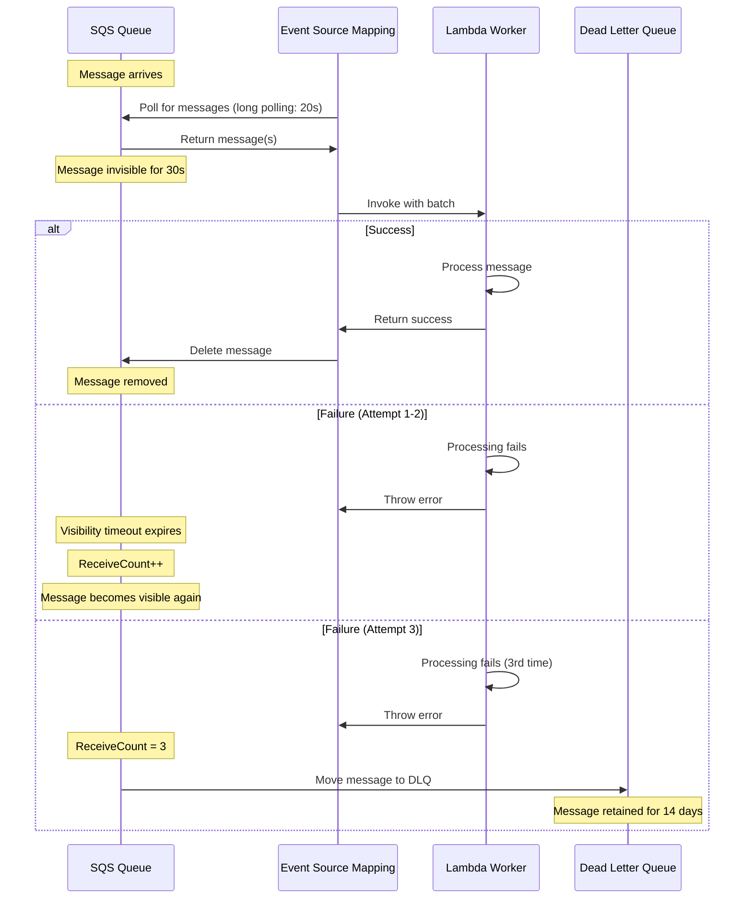

# LocalStack Configuration Reference

**Last Updated**: December 10, 2025  
**Purpose**: Complete reference for LocalStack Lambda and SQS configuration, including troubleshooting

---

## 📊 Overview

This guide documents all LocalStack configuration parameters used for AWS service emulation in DTM, including Lambda workers, SQS queues, and their operational characteristics.

---

## 🚀 Lambda Configuration

### Lambda Worker Timeout

**Parameter**: `LAMBDA_RUNTIME_ENVIRONMENT_TIMEOUT`  
**Value**: `600` seconds (10 minutes)  
**Location**: [`docker-compose.workers.yml`](../../docker-compose.workers.yml) line 93

```yaml
environment:
  - LAMBDA_RUNTIME_ENVIRONMENT_TIMEOUT=600
```

**Purpose**: Maximum execution time for Lambda functions before LocalStack forcefully terminates them.

**Why 10 minutes?**
- Our workers typically complete in 1-30 seconds
- Provides ample buffer for debugging with breakpoints
- Prevents runaway processes from consuming resources indefinitely
- Matches AWS Lambda default maximum timeout

**Production Equivalent**: In AWS, this would be the Lambda function `Timeout` configuration (maximum: 15 minutes).

---

### Lambda Container Keepalive

**Parameter**: `LAMBDA_KEEPALIVE_MS`  
**Value**: `600000` milliseconds (10 minutes)  
**Location**: [`docker-compose.workers.yml`](../../docker-compose.workers.yml) lines 98, 105

```yaml
environment:
  - LAMBDA_KEEPALIVE_MS=600000
```

**Purpose**: How long Lambda containers remain "warm" (running) after processing a message, ready to accept new invocations without cold start overhead.

**Why 10 minutes?**
- **E2E Testing**: Lambda pre-warming during test setup remains effective throughout the entire test suite run (~5-10 min)
- **Development**: Active coding sessions benefit from persistent warm containers
- **Resource Balance**: Long enough to be useful, short enough to not waste resources when idle
- **Rerun Benefits**: Re-running failed evals within 10 minutes skips the warm-up phase entirely (instant start!)

**Cold Start vs Warm Invocation**:
- **Cold Start**: ~2-5 seconds (container creation + code initialization)
- **Warm Invocation**: ~50-200ms (container already running)

**Key Insight**: This is why Lambda warm-up failures during E2E evals are **low priority**—simply re-running the test suite benefits from warm containers created by the previous run!


*Example of Lambda warm-up failures during preflight. Re-running the evals immediately will succeed because containers are already warm.*

---

### Lambda Concurrency Limit

**Parameter**: `LAMBDA_LIMITS_CONCURRENT_EXECUTIONS`  
**Value**: `25` concurrent Lambda containers  
**Location**: [`docker-compose.workers.yml`](../../docker-compose.workers.yml) line 103

```yaml
environment:
  - LAMBDA_LIMITS_CONCURRENT_EXECUTIONS=25
```

**Purpose**: Maximum number of Lambda function containers that can run simultaneously across **all** Lambda functions.

**Why 25?**
- **Parallel Test Safety**: Our E2E suite runs up to 12 evals concurrently in Phase 1 (safe tests)
- **Worker Distribution**: 4 worker types × 3-5 instances per type = 12-20 concurrent workers
- **Overhead Buffer**: Leaves room for sequential Phase 2 tests and other Lambda invocations
- **Resource Constraint**: Prevents LocalStack from overwhelming the host system

**Impact on Testing**:
- ✅ **Within Limit**: Tests execute in parallel at full speed
- ⚠️ **At Limit**: Additional invocations queue and wait (slight slowdown)
- ❌ **Exceeds Limit**: LocalStack may throttle or fail invocations

**Production Equivalent**: In AWS, this is the account-level or per-function [reserved concurrent executions](https://docs.aws.amazon.com/lambda/latest/dg/configuration-concurrency.html) setting.

**Tuning Recommendations**:
- **Low-resource machines**: Reduce to 15-20
- **High-resource machines**: Can increase to 40-50
- **CI/CD pipelines**: Keep at 25 (balanced for reliability)

---

### Lambda Event Source Mapping (ESM)

**Parameter**: `LAMBDA_EVENT_SOURCE_MAPPING`  
**Value**: `v2` (LocalStack ESM v2)  
**Location**: [`docker-compose.workers.yml`](../../docker-compose.workers.yml) line 95

```yaml
environment:
  - LAMBDA_EVENT_SOURCE_MAPPING=v2
```

**Purpose**: Enables LocalStack's improved Event Source Mapping system for connecting SQS queues to Lambda functions.

**ESM v2 Features**:
- ✅ Better stability for concurrent processing
- ✅ Proper batch processing support
- ✅ `batchItemFailures` handling (partial batch failure reporting)
- ✅ More AWS-compliant behavior

**Alternative: Poller Mode**

For development and E2E testing, we also support a **custom SQS poller** that bypasses ESM entirely:

```bash
# Deploy with ESM (default)
./scripts/local-env.sh deploy-workers --esm

# Deploy with custom poller (10 sequential pollers)
./scripts/local-env.sh deploy-workers --poller --count=10
```

**When to Use Each Mode**:

| Mode | Use Case | Execution | Reliability | Debugging |
|------|----------|-----------|-------------|-----------|
| **ESM** | Production-like testing | Parallel | High | Harder (distributed) |
| **Poller** | E2E tests, Development | Sequential per poller | Very High | Easy (centralized logs) |

See [`DEPLOYMENT-MODES.md`](./DEPLOYMENT-MODES.md) for detailed comparison.

---

## 📨 SQS Queue Configuration

### Queue Creation

All SQS queues are created by the `init-sqs-queues` service defined in [`docker-compose.workers.yml`](../../docker-compose.workers.yml). This uses a simple bash-based approach (similar to Kafka topic creation) - just add a line when adding new queues.

**Automatic Features**:
- ✅ Creates main queues + corresponding Dead Letter Queues (DLQs)
- ✅ Configures retry policies (3 attempts before DLQ)
- ✅ Sets message retention periods
- ✅ Configures visibility timeouts
- ✅ Enables long polling

---

### Message Retention Period

**Main Queues**: `345600` seconds (4 days)  
**DLQs**: `1209600` seconds (14 days)  
**Location**: [`docker-compose.workers.yml`](../../docker-compose.workers.yml) (init-sqs-queues service)

```bash
# DLQ retention: 14 days
MessageRetentionPeriod=1209600

# Main queue retention: 4 days
MessageRetentionPeriod=345600
```

**Purpose**: How long messages remain in the queue before being automatically deleted by SQS.

**Rationale**:
- **4 days (main)**: Longer than typical processing needs, provides safety margin for system downtime
- **14 days (DLQ)**: Longer retention for failed messages to allow investigation and manual reprocessing

**AWS Maximum**: 14 days (both LocalStack and AWS enforce this limit)

**When Messages Are Deleted**:
- ✅ Successfully processed by Lambda worker (deleted immediately)
- ⚠️ Moved to DLQ after 3 failed attempts (remains in DLQ for 14 days)
- ⏱️ Expire after retention period if unprocessed (automatic deletion)

---

### Visibility Timeout

**Development/Test**: `30` seconds  
**Production**: `360` seconds (6 minutes)  
**Location**: [`docker-compose.workers.yml`](../../docker-compose.workers.yml) (init-sqs-queues service)

```bash
# Dev/Test: 30s (2x Lambda timeout of 15s)
# For production, update to 360s
VisibilityTimeout=30
```

**Purpose**: When a Lambda worker receives a message from SQS, it becomes "invisible" to other workers for this duration. This prevents duplicate processing.

**Critical Rule**: Visibility timeout **MUST** be greater than the Lambda function timeout to prevent the message from becoming visible again while the Lambda is still processing it.

**Our Setup**:
- **Dev/Test Lambda Timeout**: ~15 seconds (typical worker execution)
- **Dev/Test Visibility**: 30 seconds (2× safety margin)
- **Prod Lambda Timeout**: Up to 300 seconds (5 minutes)
- **Prod Visibility**: 360 seconds (6 minutes, 1.2× safety margin)

**What Happens**:
1. Lambda receives message → Message becomes invisible for 30s (dev) or 360s (prod)
2. Lambda processes successfully → Deletes message (visibility ends early)
3. Lambda fails/crashes → Message becomes visible again after timeout
4. SQS re-delivers message to another worker (retry #2)
5. After 3 failures → Message moves to DLQ

**E2E Testing Quirk**: Some tests use `--visibility-timeout 1` when querying SQS to immediately see messages without waiting for the standard timeout. This is useful for assertions and debugging.

```bash
# Query DLQ with short visibility timeout (for testing)
aws sqs receive-message \
  --queue-url "$DLQ_URL" \
  --visibility-timeout 1 \
  --max-number-of-messages 10
```

**Visibility Timeout vs Message Expiry**:
- **Visibility Timeout**: Temporary invisibility during processing (30s-360s)
- **Message Retention**: Permanent deletion after this time (4-14 days)

---

### Dead Letter Queue (DLQ) Retry Policy

**Parameter**: `maxReceiveCount`  
**Value**: `3` attempts  
**Location**: [`docker-compose.workers.yml`](../../docker-compose.workers.yml) (init-sqs-queues service)

```bash
# After 3 failed attempts, move to DLQ
RedrivePolicy: {"deadLetterTargetArn":"...","maxReceiveCount":"3"}
```

**Purpose**: After a message is received (but not successfully deleted) 3 times, SQS automatically moves it to the Dead Letter Queue.

**Retry Flow**:
1. **Attempt 1**: Lambda receives message, processes, crashes → message returns to queue
2. **Attempt 2**: Another Lambda receives same message, processes, fails → message returns to queue
3. **Attempt 3**: Final attempt, Lambda fails again → **message moves to DLQ**

**Why 3 Attempts?**
- Aligns with our database `max_retry_count` column (both use 3)
- Handles transient failures (network blips, temporary service unavailability)
- Prevents permanent failures from blocking the queue
- Standard industry practice (AWS default is 5, we use 3 for faster failure detection)

**DLQ Message Structure**: When a message lands in the DLQ, it includes:
- Original message body
- `ApproximateReceiveCount` attribute (should be 3)
- Timestamp of when it was moved

**Monitoring DLQs**: Use the [`monitor-sqs-messages.sh`](../../scripts/monitor-sqs-messages.sh) script:

```bash
./scripts/monitor-sqs-messages.sh
```

**Example Output**:
```
📊 Queue: order-validate-customer
   Available: 0  |  In-Flight: 0  |  DLQ: 2 ⚠️  WARNING: Messages in DLQ!
```

---

### Long Polling

**Parameter**: `ReceiveMessageWaitTimeSeconds`  
**Value**: `20` seconds  
**Location**: [`docker-compose.workers.yml`](../../docker-compose.workers.yml) (init-sqs-queues service)

```bash
# Set receive wait time for long polling
ReceiveMessageWaitTimeSeconds=20
```

**Purpose**: When polling an empty queue, wait up to 20 seconds for new messages to arrive before returning an empty response.

**Benefits**:
- ✅ Reduces number of empty `ReceiveMessage` API calls (cost savings in AWS)
- ✅ Improves latency (messages delivered faster when they arrive)
- ✅ More efficient than short polling (1-second intervals)

**How It Works**:
```
# Without long polling (short polling):
Poll → Empty → Wait 1s → Poll → Empty → Wait 1s → Poll → Got message!
(3 API calls, 2s latency)

# With long polling:
Poll → (waits up to 20s) → Got message!
(1 API call, <20s latency)
```

**AWS Best Practice**: Always use long polling for SQS (10-20 seconds is optimal).

---

## 🔄 Lambda-SQS Integration

### Processing Flow



### Batch Processing

**Default Batch Size**: 1-10 messages per invocation (configured per Event Source Mapping)

**LocalStack ESM v2 Behavior**:
- Polls SQS queue continuously
- Groups messages into batches (up to batch size)
- Invokes Lambda with batch
- Handles partial batch failures via `batchItemFailures`

**Batch Item Failures**: Our workers implement proper `batchItemFailures` reporting:

```typescript
// In Lambda handler
return {
  batchItemFailures: failedMessages.map(msg => ({
    itemIdentifier: msg.messageId
  }))
};
```

This tells SQS:
- ✅ "These messages succeeded → delete them"
- ⚠️ "These messages failed → retry them"

**Without `batchItemFailures`**: If one message in a batch fails, the entire batch is retried (inefficient).

---

## 🎯 E2E Testing Implications

### Pre-Warming Lambda Workers

The E2E test suite automatically pre-warms Lambda workers before running tests:

**How It Works**:
1. Preflight check invokes each worker type with a test payload
2. LocalStack spins up containers (cold start: ~2-5s per worker)
3. Containers remain warm for 10 minutes (`LAMBDA_KEEPALIVE_MS`)
4. Subsequent test invocations skip cold start (~50-200ms)

**Dynamic Scaling**:
```bash
# 1 eval → 3 instances per worker × 4 workers = 12 total
./ste/run-all.sh --eval 01

# 15 evals → 15 instances per worker × 4 workers = 60 total (max)
./ste/run-all.sh
```

See [`DYNAMIC-WARMUP.md`](../../ste/DYNAMIC-WARMUP.md) for detailed scaling logic.

### Warm-Up Failures Are Low Priority


**Why Some Warm-ups Fail**: When pre-warming many instances simultaneously (e.g., 60 workers), LocalStack may report failures due to:
- Container creation race conditions
- Concurrent execution limit (`LAMBDA_LIMITS_CONCURRENT_EXECUTIONS=25`)
- LocalStack internal throttling

**Why It's Not a Problem**:
1. ✅ **Partial Success**: Usually 50-70% of warm-ups succeed, which is sufficient
2. ✅ **Cold Start Fallback**: Failed instances will cold-start when first invoked (minor delay)
3. ✅ **Rerun Benefits**: Re-running evals within 10 minutes uses warm containers from the previous run
4. ✅ **Self-Healing**: Containers that cold-start successfully become warm for subsequent invocations

**Best Practice**: If many warm-ups fail:
- ✅ Proceed with tests anyway (minor slowdown expected)
- ✅ Re-run failed tests immediately (they'll use warm containers)
- ⚠️ Only investigate if tests consistently fail (actual processing errors)

**Skip Warm-up Flags**:
```bash
# Skip warm-up if containers are already warm (<10 min since last run)
./ste/run-all.sh --skip-checks --skip-warmup

# Fastest iteration (trust existing state)
./ste/run-all.sh --skip-checks --skip-warmup --skip-purge
```

---

## 🛠️ Configuration Tuning

### For Low-Resource Machines

```yaml
# docker-compose.workers.yml adjustments
environment:
  - LAMBDA_LIMITS_CONCURRENT_EXECUTIONS=15  # Reduce from 25
  - LAMBDA_KEEPALIVE_MS=300000              # 5 minutes instead of 10
```

```bash
# Use fewer worker instances
./ste/run-all.sh --worker-instances=1
```

### For High-Resource Machines

```yaml
# docker-compose.workers.yml adjustments
environment:
  - LAMBDA_LIMITS_CONCURRENT_EXECUTIONS=50  # Increase from 25
  - LAMBDA_KEEPALIVE_MS=900000              # 15 minutes instead of 10
```

```bash
# Use more worker instances
./ste/run-all.sh --worker-instances=5
```

### For CI/CD Pipelines

```yaml
# Keep defaults for reliability
environment:
  - LAMBDA_LIMITS_CONCURRENT_EXECUTIONS=25
  - LAMBDA_KEEPALIVE_MS=600000
```

```bash
# Use CI mode with faster iterations
./ste/run-all.sh --ci-mode --skip-checks
```

---

## 🐛 Troubleshooting

### Issue 1: Lambda Execution Timeout

**Error Message**:
```
WARN --- Execution environment [...] for function 
arn:aws:lambda:us-east-1:000000000000:function:order-validate-customer:$LATEST
timed out during startup.
```

**Symptoms**:
- Jobs stuck in "processing" state
- Steps remain in "delegated" status
- E2E evals timeout
- Preflight check fails Lambda execution test

**Root Causes**:
1. **Docker Executor Missing**: LocalStack configured with `LAMBDA_RUNTIME_EXECUTOR=docker` but Docker CLI not installed in container
2. **Insufficient Resources**: CPU/memory constraints preventing Lambda containers from starting
3. **Network Issues**: Docker networking problems preventing container creation
4. **Docker Socket Issues**: Docker socket not properly mounted or accessible

**Diagnosis**:
```bash
# 1. Check LocalStack logs for timeout errors
docker logs ${COMPOSE_PROJECT_NAME:-dtm}-localstack | grep -i "timeout\|execution environment"

# 2. Check if Docker CLI is available in LocalStack container
docker exec ${COMPOSE_PROJECT_NAME:-dtm}-localstack sh -c "docker ps" 2>&1
# If you see "docker: not found", Docker CLI is missing

# 3. Check Docker socket mount
docker exec ${COMPOSE_PROJECT_NAME:-dtm}-localstack ls -la /var/run/docker.sock

# 4. Test Lambda execution directly
aws --endpoint-url=http://localhost:4566 lambda invoke \
  --function-name order-validate-customer \
  --payload '{}' /tmp/test-output.json
```

**Solutions**:

1. **Remove Docker Executor** (Recommended):
   ```yaml
   # In docker-compose.workers.yml
   environment:
     - LAMBDA_RUNTIME_ENVIRONMENT_TIMEOUT=600
     - LAMBDA_EVENT_SOURCE_MAPPING=v2
     # Remove or comment out: LAMBDA_RUNTIME_EXECUTOR=docker
     - LAMBDA_KEEPALIVE_MS=600000
   ```
   Then restart: `docker restart ${COMPOSE_PROJECT_NAME:-dtm}-localstack`

2. **Increase Timeout**:
   ```yaml
   environment:
     - LAMBDA_RUNTIME_ENVIRONMENT_TIMEOUT=600  # Increase from 60 to 600
   ```

3. **Check Resources**:
   ```bash
   # Check Docker resources
   docker stats ${COMPOSE_PROJECT_NAME:-dtm}-localstack
   
   # If memory/CPU is constrained, increase limits in docker-compose.yml
   ```

4. **Restart LocalStack**:
   ```bash
   docker restart ${COMPOSE_PROJECT_NAME:-dtm}-localstack
   # Wait 30 seconds for startup
   sleep 30
   ```

---

### Issue 2: Lambda Functions Not Deployed

**Error Message**:
```
No Lambda functions deployed
Lambda function NOT found: order-validate-customer
```

**Symptoms**:
- Preflight check fails
- `./scripts/local-env.sh list workers` shows no functions
- E2E evals fail immediately

**Diagnosis**:
```bash
# 1. Check if LocalStack is running
docker ps | grep localstack

# 2. List Lambda functions
aws --endpoint-url=http://localhost:4566 lambda list-functions

# 3. Check deployment script logs
./scripts/local-env.sh deploy-workers --poller 2>&1 | tail -50
```

**Solutions**:

1. **Deploy Workers**:
   ```bash
   # Poller mode (recommended for reliability)
   ./scripts/local-env.sh deploy-workers --poller
   
   # Or ESM mode (parallel execution)
   ./scripts/local-env.sh deploy-workers --esm
   ```

2. **Verify Deployment**:
   ```bash
   ./scripts/local-env.sh list workers
   ```

3. **Check Deployment Logs**:
   ```bash
   # Check LocalStack logs during deployment
   docker logs -f ${COMPOSE_PROJECT_NAME:-dtm}-localstack
   # In another terminal, run deployment
   ```

---

### Issue 3: Mixed Mode Conflicts

**Error Message**:
```
Lambda execution test TIMEOUT
Execution environment timed out
```

**Symptoms**:
- Lambdas timeout when both ESM and pollers are running
- Inconsistent behavior (works sometimes, fails other times)
- High CPU usage on LocalStack container

**Root Cause**: Both Event Source Mappings (ESM) and custom SQS pollers trying to invoke the same Lambda functions simultaneously, causing resource contention.

**Diagnosis**:
```bash
# 1. Check for poller containers
docker ps | grep sqs-poller

# 2. Check for ESMs
aws --endpoint-url=http://localhost:4566 lambda list-event-source-mappings

# 3. If both exist, you have mixed mode conflict
```

**Solutions**:

**Use ONE mode only**:

1. **Poller Mode** (Recommended for reliability):
   ```bash
   # Stop ESMs (if any)
   aws --endpoint-url=http://localhost:4566 lambda list-event-source-mappings | \
     jq -r '.EventSourceMappings[].UUID' | \
     xargs -I {} aws --endpoint-url=http://localhost:4566 lambda delete-event-source-mapping --UUID {}
   
   # Deploy with poller mode
   ./scripts/local-env.sh deploy-workers --poller
   
   # Start poller containers
   docker compose -f docker-compose.workers.yml --profile poller up -d sqs-poller
   ```

2. **ESM Mode** (For parallel execution):
   ```bash
   # Stop poller containers
   docker compose -f docker-compose.workers.yml --profile poller stop sqs-poller
   
   # Deploy with ESM mode
   ./scripts/local-env.sh deploy-workers --esm
   
   # ESMs are created automatically during deployment
   ```

3. **Verify Mode**:
   ```bash
   # Check which mode is active
   if docker ps | grep -q sqs-poller; then
     echo "Poller mode active"
   else
     echo "ESM mode active (or no workers deployed)"
   fi
   ```

---

### Issue 4: LocalStack Health Check Fails

**Error Message**:
```
LocalStack health endpoint not responding
LocalStack Lambda service status: unavailable
```

**Symptoms**:
- Preflight check fails
- Cannot connect to LocalStack
- Lambda operations fail immediately

**Diagnosis**:
```bash
# 1. Check if LocalStack container is running
docker ps | grep localstack

# 2. Check container status
docker ps -a | grep localstack

# 3. Check LocalStack logs
docker logs ${COMPOSE_PROJECT_NAME:-dtm}-localstack | tail -50

# 4. Test health endpoint
curl -v http://localhost:4566/_localstack/health
```

**Solutions**:

1. **Restart LocalStack**:
   ```bash
   docker restart ${COMPOSE_PROJECT_NAME:-dtm}-localstack
   # Wait for startup (30-60 seconds)
   sleep 30
   ```

2. **Check Port Conflicts**:
   ```bash
   # Check if port 4566 is already in use
   lsof -i :4566
   # Or on Windows/WSL:
   netstat -ano | findstr :4566
   ```

3. **Recreate LocalStack Container**:
   ```bash
   docker stop ${COMPOSE_PROJECT_NAME:-dtm}-localstack
   docker rm ${COMPOSE_PROJECT_NAME:-dtm}-localstack
   docker compose -f docker-compose.workers.yml up -d localstack
   ```

4. **Check Docker Network**:
   ```bash
   # Verify network exists
   docker network ls | grep dtm

   # If missing, create it
   docker network create dtm
   ```

---

### Testing Lambda Execution

**Quick Test**:

```bash
# 1. List deployed functions
aws --endpoint-url=http://localhost:4566 lambda list-functions

# 2. Invoke a function
aws --endpoint-url=http://localhost:4566 lambda invoke \
  --function-name order-validate-customer \
  --payload '{"test": true}' \
  /tmp/lambda-test-output.json

# 3. Check result
cat /tmp/lambda-test-output.json
```

**Expected Behavior**:

**Success**:
- Function invokes within 1-2 seconds
- Response file contains function output or error (but function executed)
- No timeout errors in LocalStack logs

**Failure**:
- Timeout after 10+ seconds
- Error: "Execution environment timed out"
- Function never executes

---

### Troubleshooting Checklist

When Lambdas fail to start, check these in order:

- [ ] **LocalStack is running**: `docker ps | grep localstack`
- [ ] **LocalStack health**: `curl http://localhost:4566/_localstack/health`
- [ ] **Lambda functions deployed**: `aws --endpoint-url=http://localhost:4566 lambda list-functions`
- [ ] **Workers deployed**: `./scripts/local-env.sh list workers`
- [ ] **No mixed mode**: Either pollers OR ESMs, not both
- [ ] **Docker socket accessible**: `docker exec ${COMPOSE_PROJECT_NAME:-dtm}-localstack ls /var/run/docker.sock`
- [ ] **Sufficient resources**: `docker stats ${COMPOSE_PROJECT_NAME:-dtm}-localstack`
- [ ] **No port conflicts**: `lsof -i :4566` (should show LocalStack)
- [ ] **Network exists**: `docker network ls | grep dtm`

---

### Quick Fixes

**Fix 1: Restart Everything**
```bash
# Stop all workers and LocalStack
docker compose -f docker-compose.workers.yml down

# Start LocalStack
docker compose -f docker-compose.workers.yml up -d localstack

# Wait for startup
sleep 30

# Deploy workers
./scripts/local-env.sh deploy-workers --poller

# Start pollers (if using poller mode)
docker compose -f docker-compose.workers.yml --profile poller up -d sqs-poller
```

**Fix 2: Redeploy Workers Only**
```bash
# Redeploy Lambda functions
./scripts/local-env.sh deploy-workers --poller

# Verify deployment
./scripts/local-env.sh list workers
```

**Fix 3: Reset LocalStack State**
```bash
# Stop LocalStack
docker stop ${COMPOSE_PROJECT_NAME:-dtm}-localstack

# Remove container (this clears all state)
docker rm ${COMPOSE_PROJECT_NAME:-dtm}-localstack

# Recreate
docker compose -f docker-compose.workers.yml up -d localstack

# Wait and redeploy
sleep 30
./scripts/local-env.sh deploy-workers --poller
```

---

## 📚 Related Documentation

- **[DYNAMIC-WARMUP.md](../../ste/DYNAMIC-WARMUP.md)** - Lambda pre-warming scaling logic
- **[DEPLOYMENT-MODES.md](./DEPLOYMENT-MODES.md)** - ESM vs Poller mode comparison
- **[system-architecture.md](./system-architecture.md)** - Complete system overview
- **[E2E Evals README](../../ste/README.md)** - Main E2E testing documentation
- **[Preflight Check](../../ste/preflight-check.sh)** - Automated validation

---

## 📊 Quick Reference Table

| Parameter | Value | Purpose | Location |
|-----------|-------|---------|----------|
| `LAMBDA_RUNTIME_ENVIRONMENT_TIMEOUT` | 600s (10 min) | Max Lambda execution time | `docker-compose.workers.yml:93` |
| `LAMBDA_KEEPALIVE_MS` | 600000ms (10 min) | Warm container duration | `docker-compose.workers.yml:98,105` |
| `LAMBDA_LIMITS_CONCURRENT_EXECUTIONS` | 25 | Max concurrent Lambdas | `docker-compose.workers.yml:103` |
| `LAMBDA_EVENT_SOURCE_MAPPING` | v2 | ESM version | `docker-compose.workers.yml:95` |
| `MessageRetentionPeriod` (main) | 345600s (4 days) | Message expiry | `docker-compose.workers.yml` (init-sqs-queues) |
| `MessageRetentionPeriod` (DLQ) | 1209600s (14 days) | DLQ message expiry | `docker-compose.workers.yml` (init-sqs-queues) |
| `VisibilityTimeout` | 30s (dev) / 360s (prod) | Processing invisibility | `docker-compose.workers.yml` (init-sqs-queues) |
| `ReceiveMessageWaitTimeSeconds` | 20s | Long polling duration | `docker-compose.workers.yml` (init-sqs-queues) |
| `maxReceiveCount` | 3 | Retries before DLQ | `docker-compose.workers.yml` (init-sqs-queues) |

---

**Last Updated**: December 10, 2025  
**Maintainer**: DTM Team  
**Feedback**: Update this doc when configuration changes!

