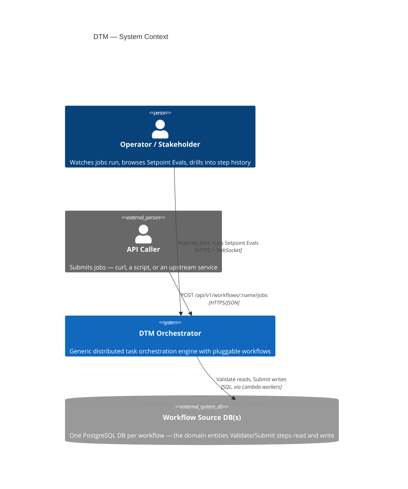
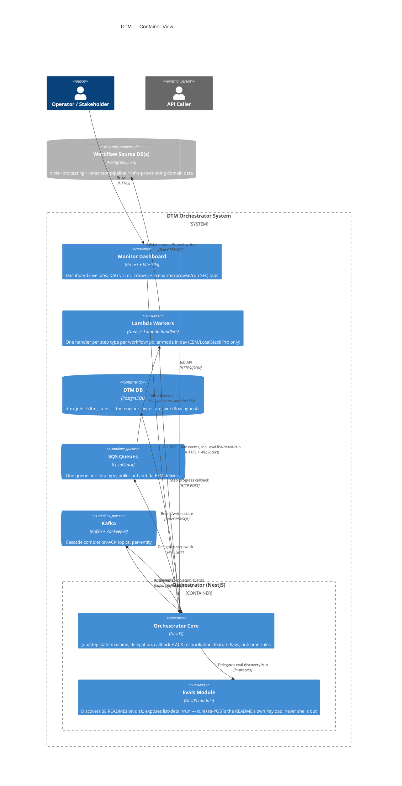

# Architecture — C4 Context & Container Views

Two orientation diagrams for a reader arriving fresh: **who/what talks to the system** (C1)
and **what the system is made of** (C2). For the full mechanics — the callback protocol,
retry/ACK state machine, fan-out cascades — see [system-architecture.md](system-architecture.md)
and the rest of this directory; this page stays deliberately shallow.

## C1 — System Context

DTM is a single system with three kinds of external actors: a caller that submits work
(REST API — a person via `curl`/Postman, or another service), an operator watching it run
(the Monitor Dashboard, in a browser), and the workflow's own domain data (each workflow
owns a source database of the entities it validates/submits against — order-processing's
customers/orders, iot-sensor-pipeline's devices/sensors, infra-provisioning's
environments/networks/compute).

## C2 — Container View

Inside the system boundary: the **Orchestrator** (NestJS) is the state-machine brain — it
owns job/step lifecycle, delegates work over SQS, and reconciles worker callbacks and Kafka
ACKs. **Lambda workers** are stateless per-step handlers, one per `Validate*`/`Submit*`/
`Discover*`/`Plan*`/`Apply*` step type, running in LocalStack in dev. The **Monitor** is a
separate Preact SPA that talks to the Orchestrator's REST + WebSocket surface — it renders
job state and, via the Orchestrator's own **Evals module**, browses and re-runs the
Setpoint Eval estate without ever shelling out itself (the Evals module re-issues a README's
own Payload through the same generic job API a caller would use).

## Notes for readers coming from the mechanics docs

- The Evals module is **read-only over the filesystem, write-only over the same job API a
  human caller uses** — it has no special execution privilege. See
  `services/orchestrator/src/evals/` and `MAINTENANCE-TASKS.md`'s sibling security-gate
  pattern (`ENABLE_EVAL_RUN_API`) for the guard.
- "Workflow Source DB(s)" is plural by design — each of the 3 example workflows owns an
  independent PostgreSQL database with its own schema; the Orchestrator itself never queries
  them directly (see `CLAUDE.md` → "Data Access Boundary").
- This page intentionally omits the callback/ACK/retry state machine, fan-out cascade
  mechanics, and feature-flag layering — those are [system-architecture.md](system-architecture.md)'s
  job, not this one's.
