# Race Condition Prevention in Callback Flow

**Last Updated**: 2026-02-09
**Status**: Critical Fixes Applied

## Overview

The DTM engine handles asynchronous callbacks from Lambda workers. When multiple steps complete simultaneously (especially in fan-out scenarios), when SQS re-delivers messages, or when concurrent orchestration calls race to delegate the same steps, race conditions can cause premature job completion, output corruption, or double-delegation.

This document explains the four race conditions discovered and the fixes applied, with diagrams illustrating each one.

---

## Step State Machine

All guards are based on the step state machine. Understanding valid transitions is key to understanding where guards are needed.

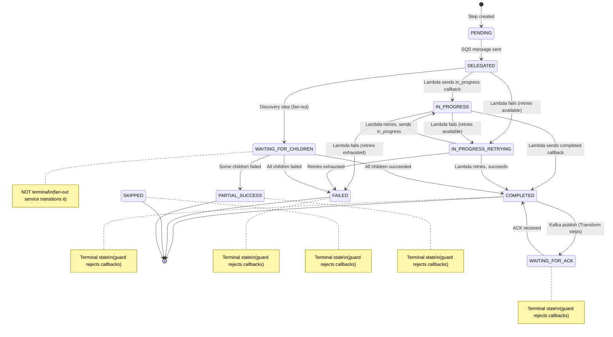

**Guard rule**: Once a step enters a **terminal state** (`COMPLETED`, `WAITING_FOR_ACK`, `FAILED`, `SKIPPED`, `PARTIAL_SUCCESS`), all further Lambda callbacks are rejected. Only specific internal transitions are allowed (e.g., `COMPLETED` -> `WAITING_FOR_ACK` by the callback service itself, or `WAITING_FOR_ACK` -> `COMPLETED` by the ACK handler).

**Note**: `WAITING_FOR_CHILDREN` is NOT a terminal state. It is used by discovery steps waiting for fan-out children to complete. The fan-out service transitions it to `COMPLETED`, `PARTIAL_SUCCESS`, or `FAILED` when all children are done.

---

## Race Condition #1: Discovery Step Completion

### Problem

**Location**: `callback.service.ts` - Discovery step handling

**Scenario**:
1. DiscoverLineItems Lambda completes with 3 item IDs
2. Callback marks step as `COMPLETED`
3. `continueJob()` sees all upfront steps as "completed"
4. Job is marked complete
5. THEN child steps (ValidateLineItem, SubmitLineItem) are created
6. Children never execute because job already "completed"

### Diagram: Without Fix (Bug)

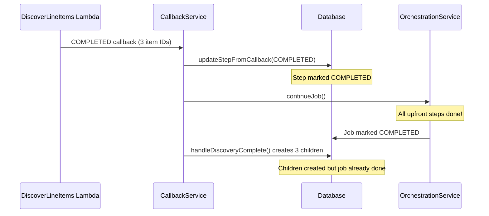

### Diagram: With Fix (Safe)

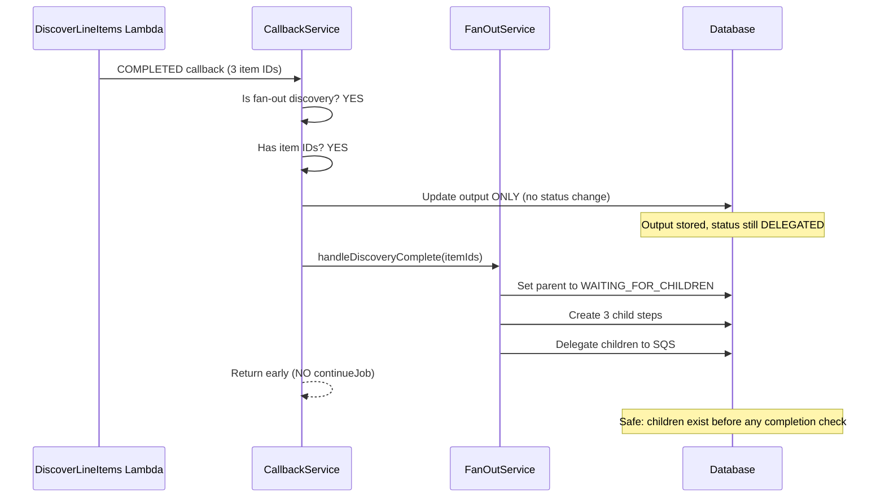

### Fix Applied

```typescript
// Check for fan-out BEFORE updating status
if (itemIds && itemIds.length > 0) {
  // Do NOT mark as COMPLETED yet!
  await this.stepRepository.update(dto.stepId, { output: { ...dto.output } });
  await this.fanOutService.handleDiscoveryComplete(...);
  return;  // Don't call continueJob() here
}
```

---

## Race Condition #2: Child Transform Step Completion

### Problem

**Location**: `callback.service.ts` - Child step completion handling

**Scenario**:
1. 3 SubmitLineItem Lambdas complete nearly simultaneously
2. Each callback updates step to `COMPLETED`
3. `handleChildStepComplete()` returns `parentComplete: true`
4. `continueJob()` called IMMEDIATELY
5. `continueJob()` sees steps as "completed" -> marks job complete
6. THEN the code changes step to `WAITING_FOR_ACK` (too late!)
7. ACKs arrive but job already "completed"

### Diagram: Without Fix (Bug)

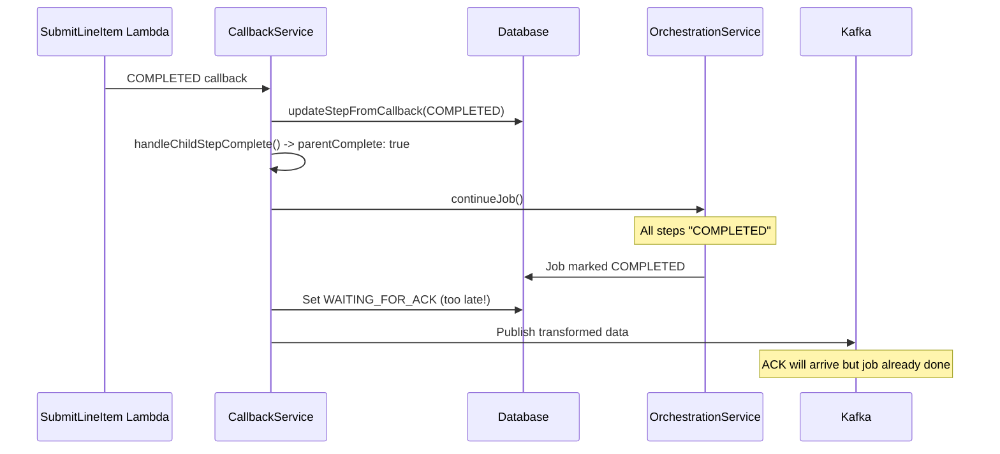

### Diagram: With Fix (Safe)

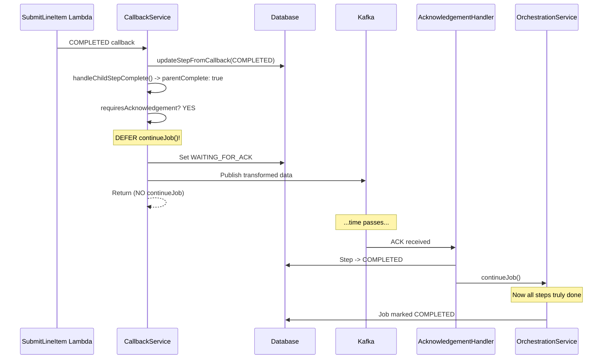

### Fix Applied

```typescript
if (childStepResult.parentComplete) {
  if (!stepConfig?.requiresAcknowledgement) {
    await this.orchestrationService.continueJob(dto.jobId);  // Safe
  } else {
    this.logger.log(`Deferring continueJob() - step requires ACK`);
  }
}
```

---

## Correct Flow After Fixes (Races #1 and #2)

### Discovery Steps (Fan-Out Parent)

```
Lambda Completes (DiscoverLineItems)
        |
Check: Is Fan-Out Discovery?
        |
    [YES with item IDs]
        |
Update output (NOT status)
        |
handleDiscoveryComplete()
  - Creates child steps
  - Sets parent to WAITING_FOR_CHILDREN
  - Delegates children
        |
Return (NO continueJob)
        |
... Children Execute ...
        |
All children ACK received
        |
Parent marked COMPLETED
        |
continueJob() -> Job complete
```

### Child Transform Steps

```
Lambda Completes (SubmitLineItem)
        |
updateStepFromCallback() -> status=COMPLETED
        |
handleChildStepComplete()
        |
Check: parentComplete?
        |
    [YES]
        |
Check: requiresAcknowledgement?
        |
    [YES] -> Log "Deferring" -> Continue
    [NO]  -> continueJob() (safe)
        |
Check: requiresAcknowledgement?
        |
    [YES]
        |
Set WAITING_FOR_ACK
        |
Publish to Kafka
        |
Return (NO continueJob)
        |
... ACK Received ...
        |
AcknowledgementHandler
        |
continueJob() -> Job complete
```

---

## Race Condition #3: SQS Re-delivery Overwrites Step Output

### Problem

**Location**: `callback.service.ts` - `handleStepProgress()` entry point

**Scenario**:
1. ValidateCustomer Lambda processes first SQS delivery, sends `COMPLETED` callback with output X
2. Orchestrator stores output X, marks step COMPLETED, delegates SubmitCustomer with output X baked into SQS message
3. SQS re-delivers the same message (visibility timeout expired during processing)
4. ValidateCustomer Lambda processes again, sends `COMPLETED` callback with output Y
5. Orchestrator overwrites output X with output Y -- but SubmitCustomer already has output X

**Affects ALL step types**: Extract, Transform, Discover -- any step that sends callbacks.

### Diagram: Without Fix (Bug)

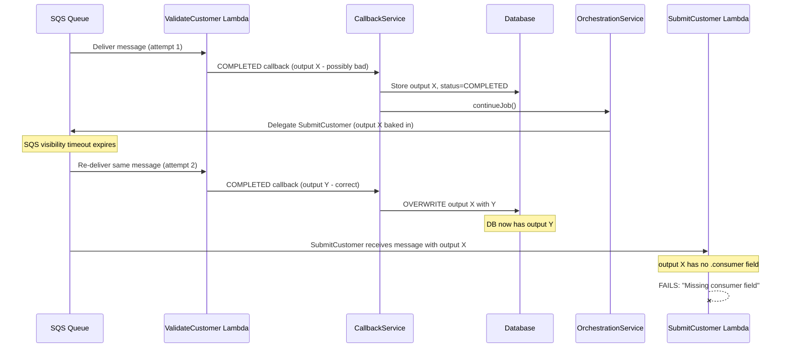

### Diagram: With Fix (Safe)

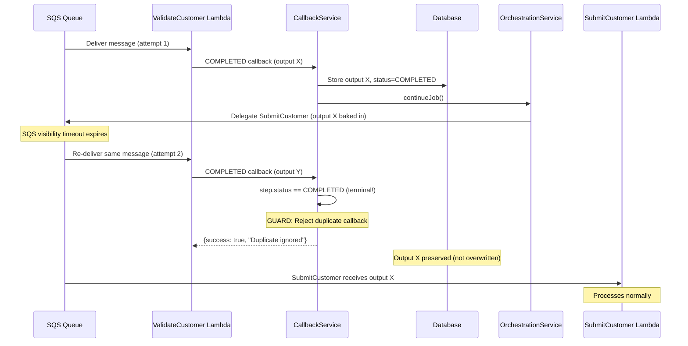

### Fix Applied

```typescript
const TERMINAL_STATUSES: ReadonlySet<StepStatus> = new Set([
  StepStatus.COMPLETED,
  StepStatus.WAITING_FOR_ACK,
  StepStatus.FAILED,
  StepStatus.SKIPPED,
  StepStatus.PARTIAL_SUCCESS,
]);

if (TERMINAL_STATUSES.has(step.status as StepStatus)) {
  this.logger.warn(`Ignoring duplicate callback for step: already in '${step.status}'`);
  return { success: true, message: `Duplicate callback ignored...` };
}
```

**Defense-in-depth**: Matching guard added in `migration-step.repository.ts` `updateFromCallback()`.

**Accepting states**: `PENDING`, `DELEGATED`, `IN_PROGRESS`, `IN_PROGRESS_RETRYING`, `WAITING_FOR_CHILDREN`

---

## ACK Handler Idempotency Guard

The acknowledgement handler (`acknowledgement.handler.ts`) has its own guard against duplicate Kafka ACK messages. This is the pattern that Race #3's fix was modeled after.

### Diagram: ACK Duplicate Prevention

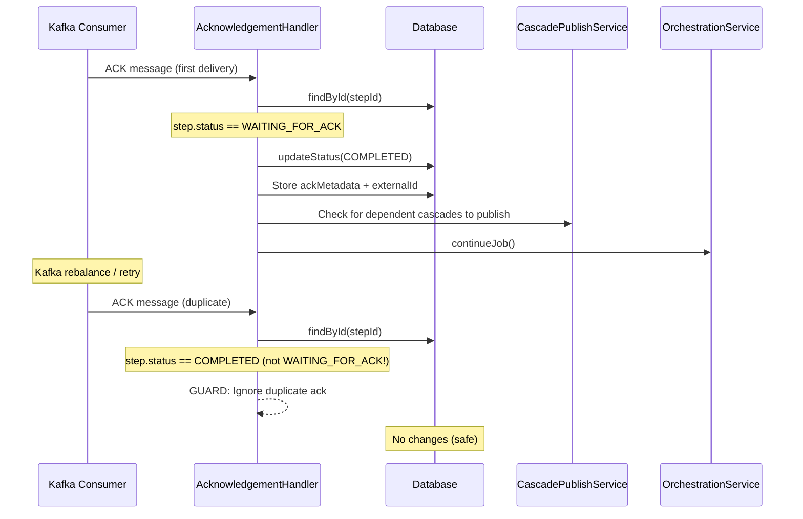

---

## Complete Callback Flow with All Guards

This diagram shows the full `handleStepProgress()` flow with all race condition prevention points marked.

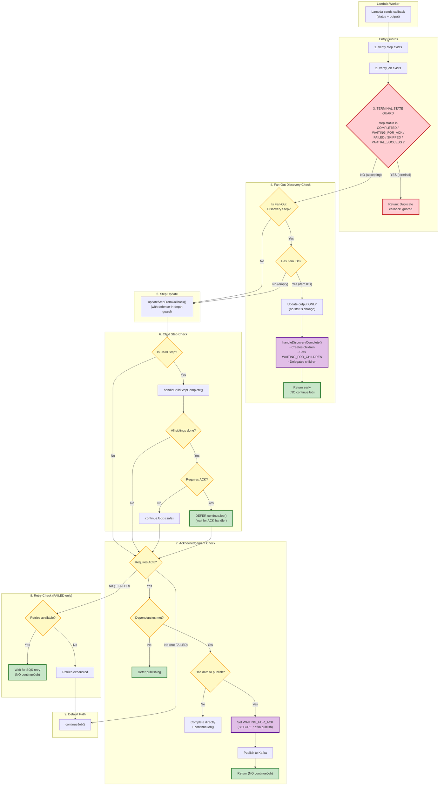

---

## Race Condition #4: Double-Delegation from Concurrent continueJob()

### Problem

**Location**: `orchestration.service.ts` → `continueJob()` → `delegation.service.ts`

**Scenario**:
1. ValidateCustomer and ValidateProduct both complete at the same millisecond
2. Both callbacks trigger `continueJob(jobId)` concurrently
3. Both calls read the same DB state: `{ValidateOrder: PENDING, SubmitCustomer: PENDING}`
4. Both identify the same ready steps and call `delegateSteps()`
5. Both send the same steps to SQS → workers process twice → duplicate callbacks
6. Second callback hits a terminal state → SubmitLineItems fails

### Diagram: Without Fix (Bug)

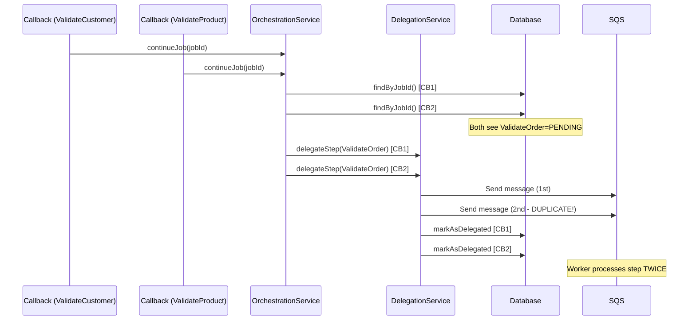

### Diagram: With Fix (Safe)

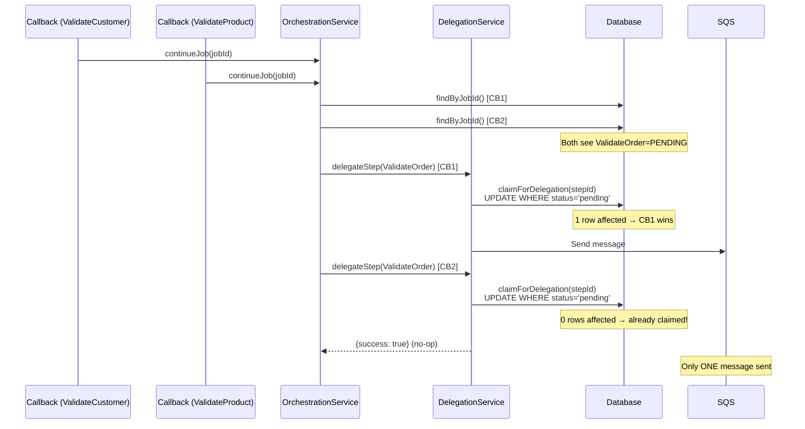

### Fix Applied

**Step 1**: Atomic claim method in `packages/database/src/repositories/step.repository.ts`:

```typescript
async claimForDelegation(id: string): Promise<boolean> {
  const result = await this.repo.update(
    { id, status: StepStatus.PENDING },
    { status: StepStatus.DELEGATED },
  );
  return (result.affected ?? 0) > 0;
}
```

**Step 2**: Claim-before-delegate in `services/orchestrator/src/delegation/delegation.service.ts`:

```typescript
const claimed = await this.stepRepository.claimForDelegation(dto.stepId);
if (!claimed) {
  this.logger.log(`Step ${dto.stepId} already claimed. Skipping.`);
  return { stepId: dto.stepId, success: true };  // No-op, not an error
}
// Only proceed to SQS send if we won the claim
```

---

## All Race Condition Guards Summary

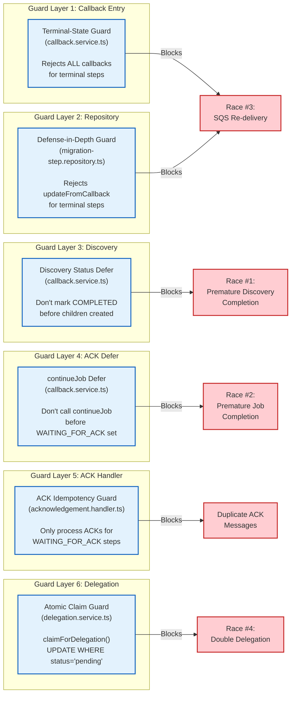

---

## Key Principles

### 1. Status Before Action
Always ensure the correct status is set BEFORE any action that checks status:
- Set `WAITING_FOR_ACK` BEFORE calling `continueJob()`
- Create children BEFORE checking completion counts

### 2. Defer When Uncertain
If a step requires acknowledgement, NEVER call `continueJob()` immediately:
- Let the ACK handler trigger orchestration
- This ensures proper status transitions

### 3. Check Conditions First
Before updating status, check if it will be changed later:
- Fan-out discovery with children -> don't set COMPLETED
- Transform requiring ACK -> will become WAITING_FOR_ACK

### 4. Reject Duplicates at Terminal States
Once a step reaches a terminal state, reject all further callbacks:
- Prevents SQS re-delivery from overwriting step output
- Prevents downstream steps from receiving stale/wrong data
- Follow the acknowledgement handler pattern: check status first, return early if terminal

---

## Verification

### Database Check
```sql
-- Find jobs completed before their last ACK (should return 0 rows)
SELECT j.id, j.completed_at as job_completed, MAX(s.ack_received_at) as last_ack
FROM dtm_jobs j
JOIN dtm_steps s ON s.job_id = j.id
WHERE j.completed_at IS NOT NULL
GROUP BY j.id, j.completed_at
HAVING j.completed_at < MAX(s.ack_received_at);
```

### SE Verification
```bash
# Run full suite in parallel to verify no race conditions
./setpoint-evals/run-all.sh --all-workflows

# Run parallel sweep to test under different concurrency levels
./setpoint-evals/run-parallel-sweep.sh --values "4 6 8" --runs-per-value 3
```

---

## Related Files

- **RC1-3 Fix Location**: `services/orchestrator/src/callback/callback.service.ts`
- **RC3 Defense-in-depth**: `packages/database/src/repositories/step.repository.ts`
- **RC4 Atomic Claim**: `packages/database/src/repositories/step.repository.ts` (`claimForDelegation()`)
- **RC4 Delegation Guard**: `services/orchestrator/src/delegation/delegation.service.ts`
- **ACK Handler Guard**: `services/orchestrator/src/kafka/handlers/acknowledgement.handler.ts`
- **Fan-Out Service**: `services/orchestrator/src/orchestration/fan-out.service.ts`
- **Diagram**: `docs/diagrams/callback-flow-race-prevention.mermaid`
- **Changelog (Race #1-2)**: `CHANGELOG/bug-fixes/2026-02-04-race-condition-job-completion.md`
- **Changelog (Race #3)**: `CHANGELOG/bug-fixes/2026-02-05-terminal-state-callback-guard.md`
