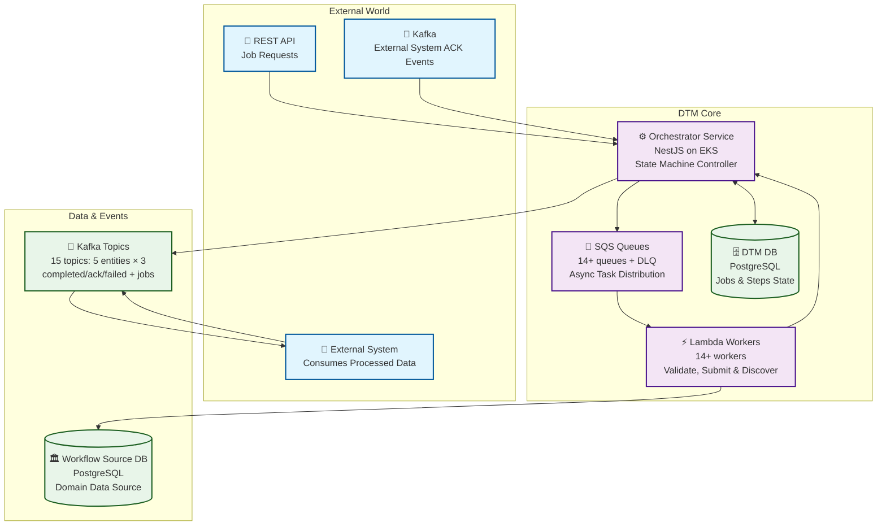
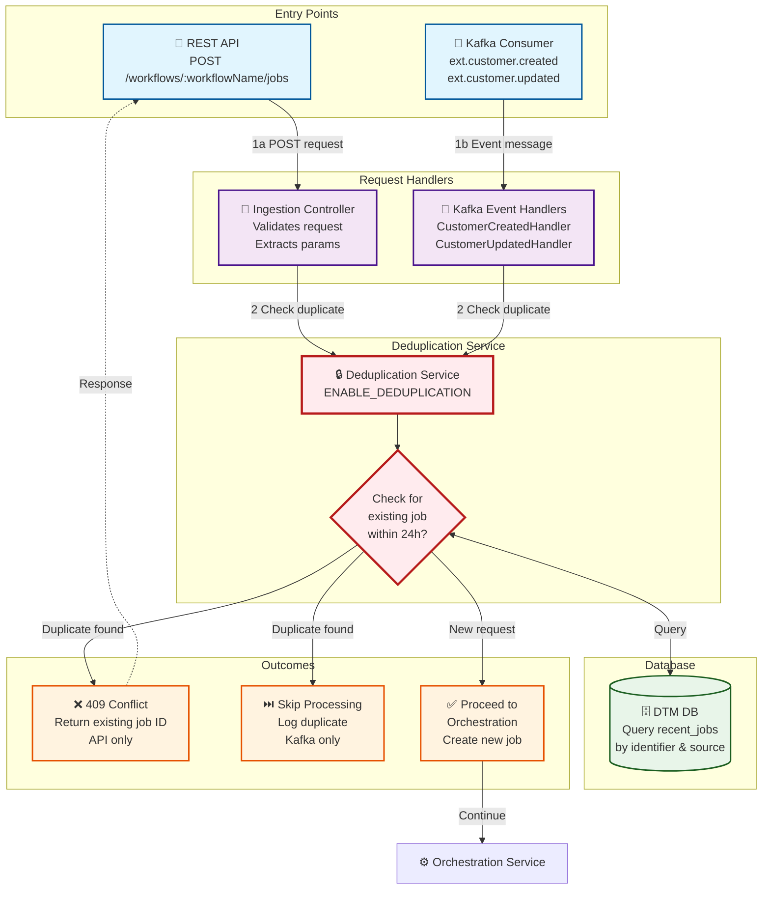
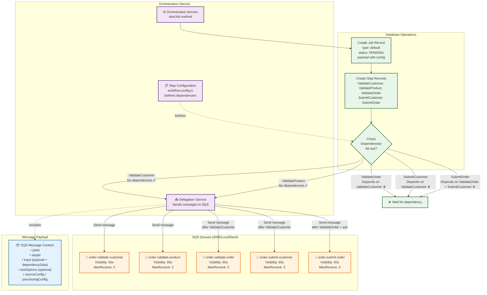
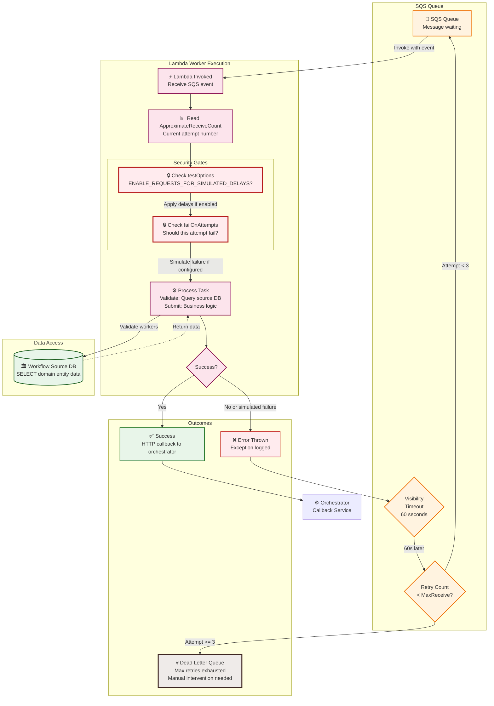
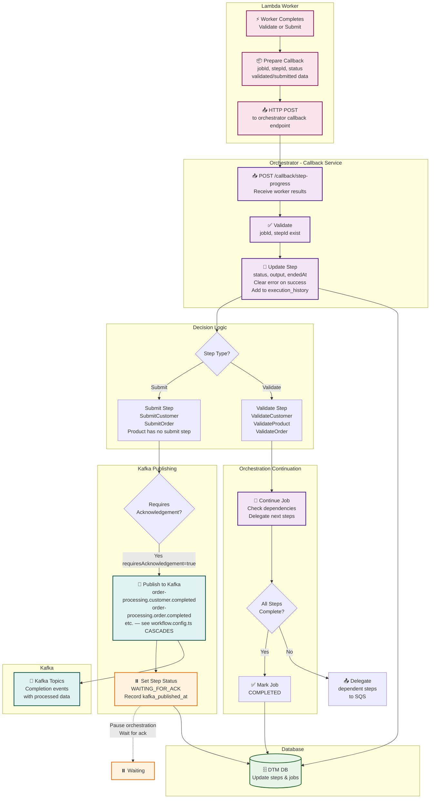
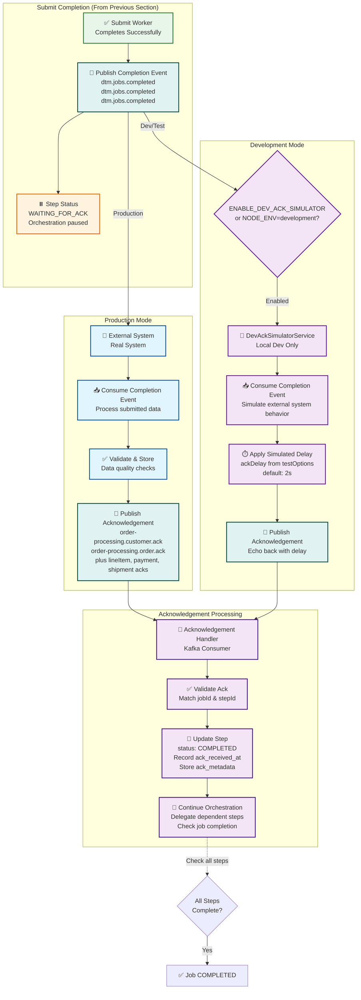
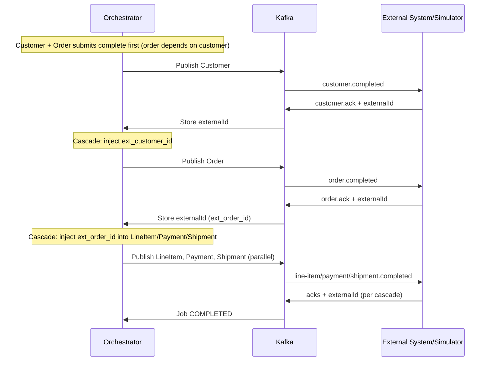
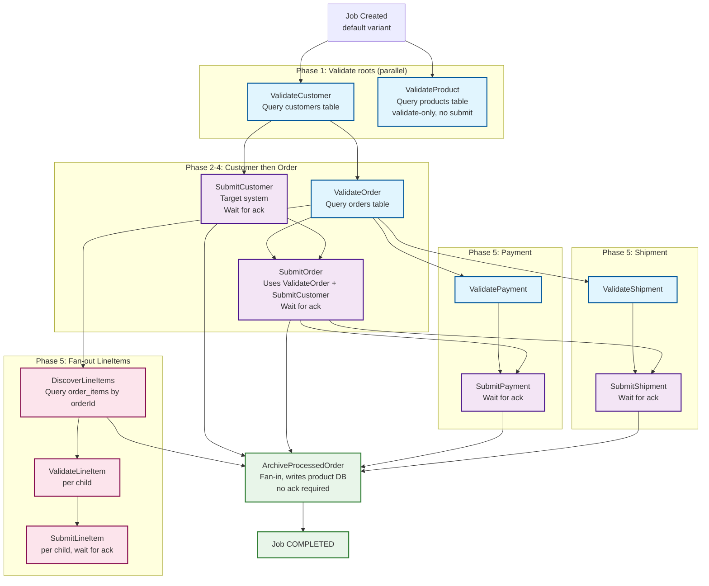

# Complete System Architecture

A comprehensive breakdown of the DTM (Distributed Task Manager) architecture, showing all components, message flows, and integration points.

## Table of Contents

1. [High-Level Overview](#1-high-level-overview)
2. [Request Entry & Deduplication](#2-request-entry--deduplication)
3. [Job Orchestration & Step Delegation](#3-job-orchestration--step-delegation)
4. [Worker Processing & Retry Flow](#4-worker-processing--retry-flow)
5. [Callback & Event Publishing](#5-callback--event-publishing)
6. [Acknowledgement Workflow](#6-acknowledgement-workflow)
   - 6.1. [Cascade Publishing & FK Injection](#61-cascade-publishing--fk-injection) ⭐
7. [Complete End-to-End Flow](#7-complete-end-to-end-flow)
   - 7.1. [Extended Multi-Cascade Example](#71-extended-multi-cascade-example)
8. [Production vs Development Modes](#8-production-vs-development-modes)
9. [Architecture Constraints & Design Decisions](#9-architecture-constraints--design-decisions) 🏗️

---

## 1. High-Level Overview

**Purpose**: 30,000 foot view of the system showing the major components and their relationships.

**Key Components**:

- **External Triggers**: REST API and Kafka ACK events
- **Orchestrator Service**: NestJS application managing the workflow
- **Message Queues**: SQS queues for asynchronous processing
- **Lambda Workers**: Serverless functions performing Validate/Submit operations
- **Data Sources**: DTM DB (state) and workflow source DBs (legacy/domain data)
- **Event Bus**: Kafka topics for completion events and acknowledgements



**Key Flows**:

1. **Inbound**: API/Kafka → Orchestrator
2. **Processing**: Orchestrator → SQS → Workers → Data Sources
3. **Callback**: Workers → Orchestrator (HTTP)
4. **Events**: Orchestrator → Kafka → external system
5. **Acknowledgement**: external system → Kafka → Orchestrator

**Next**: [Request Entry & Deduplication →](#2-request-entry--deduplication)

---

## 2. Request Entry & Deduplication

**Purpose**: Shows how job requests enter the system and how duplicate requests are prevented.

**Key Features**:

- **Dual Entry Points**: REST API and Kafka events
- **Unified Deduplication**: Single service handles both entry points
- **24-Hour Window**: Prevents duplicates within the same day
- **Configurable**: Can be disabled via `ENABLE_DEDUPLICATION=false`

**Flow Description**:

1. Request arrives via API or Kafka
2. Deduplication service checks for recent jobs (last 24 hours)
3. If duplicate found: Return 409 Conflict (API) or skip (Kafka)
4. If new request: Proceed to orchestration



**Deduplication Logic**:

For **API requests**, checks:

- `customerId` matches
- `orderId` matches (if provided)
- `submittedAt` is today (midnight to midnight)
- `submittedBy` = "api"

For **Kafka events**, checks:

- `customerId` matches in `_trigger` metadata
- Event type matches (created/updated)
- `submittedAt` is today
- `submittedBy` = "kafka-customer-{eventType}"

**Configuration**:

```bash
# Enable (default for production - prevents duplicate work)
ENABLE_DEDUPLICATION=true

# Disable (useful for testing)
ENABLE_DEDUPLICATION=false
```

**Example API Response (Duplicate)**:

```json
{
  "statusCode": 409,
  "message": "Job request already exists for this entity today",
  "existingJobId": "abc-123-def-456",
  "status": "in_progress",
  "submittedAt": "2025-11-20T09:00:00.000Z"
}
```

**Previous**: [← High-Level Overview](#1-high-level-overview) | **Next**: [Job Orchestration & Step Delegation →](#3-job-orchestration--step-delegation)

---

## 3. Job Orchestration & Step Delegation

**Purpose**: Shows how the orchestrator manages job lifecycle and delegates work to Lambda workers via SQS.

**Key Concepts**:

- **State Machine**: Job progresses through states (pending → in_progress → completed/failed)
- **Step Dependencies**: Steps have prerequisites (e.g., Submit depends on Validate)
- **Parallel Execution**: Independent steps run simultaneously
- **Delegation**: Work is pushed to SQS queues for asynchronous processing

**Process Flow**:

1. Create job record in database
2. Create step records based on job type (`default` variant = 13 steps — see [Section 7.1](#71-extended-multi-cascade-example) for the full DAG; this section walks a 5-step slice of it)
3. Evaluate step dependencies
4. Delegate ready steps to SQS queues
5. Include configuration (delays, retry settings) in message payload



**Step Configuration Example** (real fields — `queueName`/`functionName`, not `sqsQueueName`/`lambdaFunctionName`; a slice of `DEFAULT_STEPS` from `workflow.config.ts`, see [Section 7.1](#71-extended-multi-cascade-example) for all 13):

```typescript
// workflow.config.ts
export const DEFAULT_STEPS: StepDefinition[] = [
  // === Phase 1: Validate roots (parallel) ===
  {
    step: Step.ValidateCustomer,
    dependencies: [], // No dependencies - runs immediately
    queueName: "order-validate-customer",
    functionName: "order-validate-customer",
  },
  {
    step: Step.ValidateProduct,
    dependencies: [], // No dependencies - runs in parallel
    queueName: "order-validate-product",
    functionName: "order-validate-product",
  },

  // === Phase 2/3: Order needs Customer validated first ===
  {
    step: Step.ValidateOrder,
    dependencies: [Step.ValidateCustomer],
    queueName: "order-validate-order",
    functionName: "order-validate-order",
  },

  // === Submit phase (depends on corresponding Validate) ===
  {
    step: Step.SubmitCustomer,
    dependencies: [Step.ValidateCustomer],
    queueName: "order-submit-customer",
    functionName: "order-submit-customer",
    requiresAcknowledgement: true, // Waits for external system ACK
  },
  {
    step: Step.SubmitOrder,
    dependencies: [Step.ValidateOrder, Step.SubmitCustomer],
    queueName: "order-submit-order",
    functionName: "order-submit-order",
    requiresAcknowledgement: true, // Waits for external system ACK
  },
];
```

**Delegation Timing**:

- **Initial**: ValidateCustomer, ValidateOrder, ValidateOrder (all parallel)
- **After ValidateCustomer completes**: SubmitCustomer
- **After ValidateOrder completes**: SubmitOrder
- **After ValidateOrder completes**: SubmitOrder

> **Note**: While submits can complete in any order, **Kafka publishing** follows cascade order: Customer → Order → Payment. See [Cascade Publishing](#61-cascade-publishing--fk-injection) for details.

**Previous**: [← Request Entry & Deduplication](#2-request-entry--deduplication) | **Next**: [Worker Processing & Retry Flow →](#4-worker-processing--retry-flow)

---

## 4. Worker Processing & Retry Flow

**Purpose**: Shows how Lambda workers process tasks, handle failures, and leverage SQS retry mechanisms.

**Key Features**:

- **Automatic Retries**: SQS handles retry logic via visibility timeout
- **Retry Awareness**: Workers receive `ApproximateReceiveCount` (attempt number)
- **Dead Letter Queue**: Failed messages after max retries
- **Simulated Failures**: Optional testing feature (production-safe)
- **Data Access**: Workers query the workflow source database for domain data

**Normal Flow** (Success):

1. SQS invokes Lambda worker
2. Worker queries workflow source DB (Validate) or submits data (Submit)
3. Worker sends HTTP callback to orchestrator with results
4. Step marked as COMPLETED

**Retry Flow** (Failure):

1. SQS invokes Lambda worker (Attempt 1)
2. Worker throws error (real error or simulated)
3. SQS makes message invisible for visibility timeout (60s)
4. SQS retries after timeout (Attempt 2, 3, etc.)
5. If max retries exceeded → Dead Letter Queue



**Retry Behavior Example**:

| Attempt | Time      | SQS ReceiveCount | Worker Behavior                  | Outcome          |
| ------- | --------- | ---------------- | -------------------------------- | ---------------- |
| 1       | T=0s      | 1                | Process, fails (transient error) | ❌ Error → Retry |
| -       | T=0-60s   | -                | Message invisible                | ⏸️ Waiting       |
| 2       | T=60s     | 2                | Process, fails again             | ❌ Error → Retry |
| -       | T=60-120s | -                | Message invisible                | ⏸️ Waiting       |
| 3       | T=120s    | 3                | Process, succeeds!               | ✅ Success       |

**Simulated Failure Example**:

```json
{
  "testOptions": {
    "ValidateCustomer": {
      "failureAfter": 2000,
      "failOnAttempts": [1, 2]
    }
  }
}
```

**Worker Logic**:

```typescript
// Attempt 1: Will fail (1 in failOnAttempts)
if (failOnAttempts.includes(sqsReceiveCount)) {
  await sleep(2000);
  throw new Error("SIMULATED FAILURE");
}

// Attempt 3: Will succeed (3 not in failOnAttempts)
// Normal processing continues
```

**CloudWatch Logs**:

```
[ValidateCustomer] ⚠️ Attempt 1: Will simulate failure after 2000ms
[ValidateCustomer] ❌ SIMULATED FAILURE (attempt 1/2+)
... (60s later)
[ValidateCustomer] ⚠️ Attempt 2: Will simulate failure after 2000ms
[ValidateCustomer] ❌ SIMULATED FAILURE (attempt 2/2+)
... (60s later)
[ValidateCustomer] ℹ️ Attempt 3: Skipping simulated failure
[ValidateCustomer] ✅ Customer found: customer_id=1000
```

**Previous**: [← Job Orchestration & Step Delegation](#3-job-orchestration--step-delegation) | **Next**: [Callback & Event Publishing →](#5-callback--event-publishing)

---

## 5. Callback & Event Publishing

**Purpose**: Shows how workers report results back to the orchestrator and how completion events are published to Kafka.

**Key Features**:

- **HTTP Callbacks**: Workers POST results back to orchestrator
- **Step Status Updates**: Database updated with results and execution history
- **Kafka Publishing**: Output steps publish completion events
- **Acknowledgement Required**: Output steps wait for external system confirmation
- **Orchestration Continuation**: Orchestrator delegates next dependent steps

**Process Flow**:

1. Worker completes processing
2. Worker sends HTTP POST to orchestrator callback endpoint
3. Orchestrator updates step status in database
4. If output step (requiresAcknowledgement): Publish to Kafka completion topic
5. If output step: Set status to `WAITING_FOR_ACK`
6. If input step or after ack: Continue orchestration (delegate dependent steps)



**Callback Payload Example**:

```json
{
  "jobId": "abc-123-def-456",
  "stepId": "step-uuid-123",
  "status": "completed",
  "output": {
    "customer": {
      "customerId": 1000,
      "firstName": "John",
      "lastName": "Doe"
    }
  },
  "recordsProcessed": 1
}
```

**Kafka Completion Event Example** (`TransformedEvent`, published by `CascadePublishService`):

```json
{
  "jobId": "abc-123-def-456",
  "stepId": "step-uuid-456",
  "tableName": "customer",
  "recordCount": 1,
  "transformedAt": "2026-07-15T10:30:00Z",
  "eventTimestamp": "2026-07-15T10:30:00Z",
  "requiresAcknowledgement": true,
  "testOptions": {
    "SubmitCustomer": { "ackDelay": 5000 }
  },
  "submittedCustomers": [
    {
      "sourceCustomerId": 1000,
      "fullName": "John Doe",
      "emailAddress": "john.doe@example.com"
    }
  ]
}
```

`submittedCustomers` is the cascade's `outputDataKey` (from `CascadeConfig` in `workflow.config.ts`) — the key name is dynamic per cascade (`submittedOrders`, `submittedLineItems`, `submittedPayments`, `submittedShipments` for the others).

**Database Updates**:

```sql
-- Step status update on success (after potential failures)
UPDATE dtm_steps
SET
  status = 'waiting_for_ack',
  output = '{"customer": {...}}',
  error = NULL,  -- Clear error on success (history preserved in execution_history)
  ended_at = NOW(),
  kafka_published_at = NOW(),
  execution_history = execution_history || jsonb_build_object(
    'attempt', 1,
    'status', 'completed',
    'duration', 123
  )
WHERE id = 'step-uuid-456';
```

**Previous**: [← Worker Processing & Retry Flow](#4-worker-processing--retry-flow) | **Next**: [Acknowledgement Workflow →](#6-acknowledgement-workflow)

---

## 6. Acknowledgement Workflow

**Purpose**: Shows how the system waits for external acknowledgements before marking output steps as complete and continuing the job.

**Key Features**:

- **Asynchronous Callback Pattern**: Submit completes but job waits for confirmation
- **Kafka-Based Acknowledgements**: external system publishes ack messages to specific topics
- **WAITING_FOR_ACK Status**: Steps explicitly wait for external confirmation
- **Dev Simulator**: Standalone service simulating external system acknowledgements
- **Production Mode (Future)**: Real external system will acknowledge before proceeding

**⚠️ Current State (Temporary):**
The `dev-ack-simulator` service currently runs in **BOTH standalone and integrated modes** as a temporary solution until external system implements the acknowledgement service. Once implemented in external system:

- **Standalone Mode**: Will continue to use dev-ack-simulator for local development
- **Integrated Mode**: Will receive real acknowledgements from external system
- **Production**: Will use real external system acknowledgements

**Dual Mode Operation**:

- **Production (Future)**: Real external system will consume events and publish acknowledgements
- **Integrated (Current - Temporary)**: dev-ack-simulator handles acknowledgements until external system is ready
- **Standalone/Development**: dev-ack-simulator simulates external system behavior with configurable delays



**Acknowledgement Topics** (order-processing cascades — see `workflows/order-processing/workflow.config.ts` `CASCADES`):

- `order-processing.customer.ack` - external system acknowledges customer submission → provides `externalId`
- `order-processing.order.ack` - external system acknowledges order submission → provides `externalId`
- `order-processing.line-item.ack` - external system acknowledges a line item submission → provides `externalId`
- `order-processing.payment.ack` - external system acknowledges payment submission → provides `externalId`
- `order-processing.shipment.ack` - external system acknowledges shipment submission → provides `externalId`

**Completion Topics** (published by Orchestrator):

- `order-processing.customer.completed` - Customer submission ready for external system
- `order-processing.order.completed` - Order submission ready for external system (includes `ext_customer_id`)
- `order-processing.line-item.completed` - LineItem submission ready for external system (includes `ext_order_id`, per child)
- `order-processing.payment.completed` - Payment submission ready for external system (includes `ext_order_id`)
- `order-processing.shipment.completed` - Shipment submission ready for external system (includes `ext_order_id`)

Note: `Product` is validate-only for this workflow — it has no submit step and does not cascade or publish to Kafka.

**Dev Simulator Configuration**:

```json
{
  "testOptions": {
    "SubmitCustomer": { "ackDelay": 10000 },
    "SubmitOrder": { "ackDelay": 5000 }
  }
}
```

**Environment Configuration**:

**Production** (`.env.production`):

```bash
NODE_ENV=production
ENABLE_DEV_ACK_SIMULATOR=false  # or omit entirely
# Real external system will handle acknowledgements
```

**Development** (`.env.development`):

```bash
NODE_ENV=development
ENABLE_DEV_ACK_SIMULATOR=true
# DevAckSimulatorService will simulate external system
```

**Database Tracking**:

```sql
-- Check acknowledgement timing
SELECT
  step_value,
  status,
  kafka_published_at,
  ack_received_at,
  EXTRACT(EPOCH FROM (ack_received_at - kafka_published_at)) as ack_wait_seconds,
  ack_metadata
FROM dtm_steps
WHERE job_id = 'your-job-id'
  AND requires_acknowledgement = true;
```

**Expected Output**:

```
step_value       | status    | ack_wait_seconds | ack_metadata
-----------------+-----------+------------------+--------------
SubmitCustomer   | completed | 10.234           | {"source": "dev-simulator", "simulatedDelay": 10000}
SubmitOrder      | completed | 5.023            | {"source": "dev-simulator", "simulatedDelay": 5000}
```

**Previous**: [← Callback & Event Publishing](#5-callback--event-publishing) | **Next**: [Cascade Publishing & FK Injection →](#61-cascade-publishing--fk-injection)

---

## 6.1. Cascade Publishing & FK Injection

**Purpose**: Shows how the orchestrator publishes processed data to Kafka in cascade order, injecting foreign keys from parent cascade acknowledgements.

**Key Concepts**:

- **Sequential Publishing**: Even though submits complete in parallel, Kafka publishing follows cascade dependency order
- **FK Injection**: When a parent cascade is acknowledged, its `externalId` is injected into dependent cascades
- **Cascade Trigger**: Each acknowledgement triggers a check for dependent cascades ready to publish

**The Cascade Chain** (5 Cascades — `default` variant, see `workflows/order-processing/workflow.config.ts`):

```
Customer (root)
   |  ext_customer_id
   v
Order
   |  ext_order_id        |  ext_order_id       |  ext_order_id
   v                        v                      v
LineItem (fan-out)       Payment               Shipment

Product (root, validate-only — no submit/cascade)
```

**How It Works**:

1. **Customer Ack Received** → Orchestrator stores `externalId`
   → Triggers cascade check
   → Publishes Order with `ext_customer_id` injected (Customer's externalId)

2. **Order Ack Received** → Orchestrator stores `externalId` (as `ext_order_id`)
   → Triggers cascade check
   → Publishes each LineItem (fan-out children), Payment, and Shipment with `ext_order_id` injected

3. **LineItem Ack Received** (per child)
   → Stores `externalId` per fan-out child

4. **Payment Ack Received**
   → Stores `externalId`

5. **Shipment Ack Received**
   → Stores `externalId`
   → Once all attempted cascades are terminal → `evaluateOutcome()` runs → Job marked COMPLETED / PARTIAL_SUCCESS / FAILED



**FK Injection Example** (real `fkExtractor` functions from `workflow.config.ts`):

When publishing Order after Customer ack — `order` cascade's `fkExtractor: ({ customer }) => ({ ext_customer_id: customer?.externalId })`:

```json
{
  "jobId": "abc-123",
  "stepId": "order-step-456",
  "tableName": "order",
  "requiresAcknowledgement": true,
  "submittedOrders": [{
    "sourceOrderId": 100001,
    "ext_customer_id": "target-customer-789"
  }]
}
```

When publishing Payment (or Shipment/LineItem) after Order ack — `payment` cascade's `fkExtractor: ({ order }) => ({ ext_order_id: order?.externalId })`:

```json
{
  "jobId": "abc-123",
  "stepId": "payment-step-789",
  "tableName": "payment",
  "requiresAcknowledgement": true,
  "submittedPayments": [{
    "sourcePaymentId": 5001,
    "ext_order_id": "target-order-456"
  }]
}
```

**Implementation Reference**: `CascadePublishService` in orchestrator handles the cascade logic.

**Related E2E Evals**:

**Previous**: [← Acknowledgement Workflow](#6-acknowledgement-workflow) | **Next**: [Complete End-to-End Flow →](#7-complete-end-to-end-flow)

---

## 7. Complete End-to-End Flow

**Purpose**: Simplified view showing the entire journey of a job request from entry to completion — this section walks only the Customer/Product/Order slice (5 steps: `ValidateCustomer`, `ValidateProduct`, `ValidateOrder`, `SubmitCustomer`, `SubmitOrder`) of the real `default` variant. See [Section 7.1](#71-extended-multi-cascade-example) for the full 13-step DAG including LineItem fan-out, Payment, Shipment, and Archive.

**Phases**:

1. **Request Entry** (0.1s) - API/Kafka → Deduplication → Orchestration
2. **Phase 1: Validate** (parallel) - Query workflow source DB for domain entity data
3. **Phase 2: Submit** (parallel after validates) - Apply business logic submissions
4. **Phase 3: Cascade Publish** (sequential) - Publish to Kafka in dependency order with FK injection
5. **Completion** - Job marked as complete after all acks received

```mermaid
graph LR
    START[📡 Job Request<br/>API or Kafka]

    DEDUP[🔒 Deduplication<br/>Check 24h window]

    CREATE[💾 Create Job<br/>5 steps created<br/>status: PENDING]

    PHASE1[⚡ Phase 1 PARALLEL<br/>ValidateCustomer<br/>ValidateProduct<br/>ValidateOrder depends on ValidateCustomer]

    PHASE2[⚡ Phase 2<br/>SubmitCustomer<br/>then SubmitOrder once SubmitCustomer acked]

    CASCADE[📢 Phase 3 CASCADE<br/>Publish Customer → ack<br/>Publish Order → ack<br/>Product never cascades]

    COMPLETE[✅ Job COMPLETED<br/>All 5 steps done<br/>FKs injected]

    START --> DEDUP
    DEDUP -->|New request ✅| CREATE
    DEDUP -.->|Duplicate ❌| REJECT[❌ 409 Conflict]
    CREATE --> PHASE1
    PHASE1 -->|All validates done| PHASE2
    PHASE2 -->|All submits done| CASCADE
    CASCADE -->|All acks received| COMPLETE

    classDef entry fill:#e1f5fe,stroke:#01579b,stroke-width:2px
    classDef security fill:#ffebee,stroke:#b71c1c,stroke-width:2px
    classDef orchestrator fill:#f3e5f5,stroke:#4a148c,stroke-width:2px
    classDef processing fill:#fff3e0,stroke:#ef6c00,stroke-width:2px
    classDef kafka fill:#e0f2f1,stroke:#004d40,stroke-width:2px
    classDef complete fill:#e8f5e9,stroke:#2e7d32,stroke-width:2px

    class START entry
    class DEDUP security
    class CREATE orchestrator
    class PHASE1,PHASE2 processing
    class CASCADE kafka
    class COMPLETE complete
```



**Timing Breakdown (No Simulated Delays)**:

| Phase     | Steps                        | Duration   | Notes                        |
| --------- | ---------------------------- | ---------- | ---------------------------- |
| Entry     | Deduplication + Job Creation | ~100ms     | Database operations          |
| Phase 1   | Validate (parallel)           | ~2-3s      | Actual source DB query time  |
| Phase 2   | Submit (parallel)         | ~1-2s      | Actual submission time   |
| Phase 3   | Cascade Publish + Acks       | ~3-6s      | Sequential: C→M→O with acks  |
| **Total** | -                            | **~6-12s** | Production average           |

**Timing Breakdown (With Simulated Delays)**:

Example configuration:

```json
{
  "testOptions": {
    "ValidateCustomer": { "simDelay": 10000 },
    "ValidateProduct": { "simDelay": 6000 },
    "ValidateOrder": { "simDelay": 5000 },
    "SubmitCustomer": { "simDelay": 8000, "ackDelay": 5000 },
    "SubmitOrder": { "simDelay": 3000, "ackDelay": 2000 }
  }
}
```

| Phase     | Steps                             | Duration | Notes                                                       |
| --------- | ---------------------------------- | -------- | ------------------------------------------------------------ |
| Entry     | Deduplication + Job Creation       | ~100ms   | Not affected by delays                                       |
| Phase 1   | Validate (parallel)                | **10s**  | max(10s, 6s) — ValidateOrder waits on ValidateCustomer        |
| Phase 2   | SubmitCustomer + ack                | **13s**  | 8s + 5s ack                                                   |
| Phase 3   | ValidateOrder + SubmitOrder + ack  | **10s**  | 5s + 3s + 2s ack (ValidateOrder can overlap Phase 2)          |
| **Total** | -                                   | **~28s** | Demo/testing mode                                             |

**Key Characteristics**:

- ✅ **Parallel Execution**: Independent steps run simultaneously
- ✅ **Cascade Publishing**: Sequential Kafka publishing with FK injection (see [Section 6.1](#61-cascade-publishing--fk-injection))
- ✅ **Automatic Retries**: SQS handles transient failures (up to 3 attempts)
- ✅ **Idempotency**: Deduplication prevents duplicate work
- ✅ **Observability**: Every step tracked in database with timestamps
- ✅ **Asynchronous**: Workers operate independently via message queues
- ✅ **Resilient**: Failed steps don't block independent work

**Previous**: [← Acknowledgement Workflow](#6-acknowledgement-workflow) | **Next**: [Extended Multi-Cascade Example →](#71-extended-multi-cascade-example)

---

## 7.1. Extended Multi-Cascade Example

**Status**: Fully implemented. This section mirrors `workflows/order-processing/workflow.config.ts` (`DEFAULT_STEPS`, the `default` variant) exactly — every step, dependency, and field name below exists in that file today. It is the real DAG behind [Section 7's](#7-complete-end-to-end-flow) simplified 3-entity view once LineItem, Payment, and Shipment are added.

**Purpose**: Demonstrates the full orchestration capabilities with a multi-cascade job — cross-step data dependencies, a fan-out cascade, three cascades running in parallel off the same parent, and a fan-in aggregation step.

**Scenario**: A `default`-variant order-processing job: one customer, one product (validate-only), one order, N line items (fan-out), one payment, one shipment.

**Key Advanced Features**:

- **Validate-Only Root**: `Product` has a `ValidateProduct` step but no submit step — it never cascades or publishes to Kafka (see the comment at the top of `workflow.config.ts`)
- **Cross-Step Data Dependencies**: `SubmitOrder` depends on both `ValidateOrder` (raw order row) and `SubmitCustomer` (target-system customer name) — see [Data Flow Between Steps](#data-flow-between-steps) below
- **Fan-Out**: `DiscoverLineItems` spawns one `ValidateLineItem` → `SubmitLineItem` child chain per discovered line item ID
- **Parallel Cascades Off One Parent**: LineItem, Payment, and Shipment all cascade from `Order`'s acknowledgement (`ext_order_id`) and process independently — one branch failing doesn't block the others
- **Fan-In**: `ArchiveProcessedOrder` depends on all five terminal cascades (`SubmitCustomer`, `SubmitOrder`, `DiscoverLineItems`, `SubmitPayment`, `SubmitShipment`) and requires no acknowledgement of its own

### Step Configuration

```typescript
// workflows/order-processing/workflow.config.ts — DEFAULT_STEPS (field values abridged; see source for full metadata)
const DEFAULT_STEPS: StepDefinition[] = [
  // ── Phase 1: Validate root entities (parallel) ──────────────────────────
  {
    step: Step.ValidateCustomer,
    dependencies: [],
    functionName: 'order-validate-customer',
    queueName: 'order-validate-customer',
  },
  {
    step: Step.ValidateProduct,
    dependencies: [],
    functionName: 'order-validate-product',
    queueName: 'order-validate-product',
  },

  // ── Phase 2: Submit customer ─────────────────────────────────────────────
  {
    step: Step.SubmitCustomer,
    dependencies: [Step.ValidateCustomer],
    functionName: 'order-submit-customer',
    queueName: 'order-submit-customer',
    requiresAcknowledgement: true,
    collectDependencyOutputs: true,
  },

  // ── Phase 3: Validate order (depends on customer validation) ────────────
  {
    step: Step.ValidateOrder,
    dependencies: [Step.ValidateCustomer],
    functionName: 'order-validate-order',
    queueName: 'order-validate-order',
  },

  // ── Phase 4: Submit order (depends on validate + customer submit) ───────
  {
    step: Step.SubmitOrder,
    dependencies: [Step.ValidateOrder, Step.SubmitCustomer],
    functionName: 'order-submit-order',
    queueName: 'order-submit-order',
    requiresAcknowledgement: true,
    collectDependencyOutputs: true,
  },

  // ── Phase 5: Fan-Out — LineItems ─────────────────────────────────────────
  {
    step: Step.DiscoverLineItems,
    dependencies: [Step.ValidateOrder],
    functionName: 'order-discover-line-items',
    queueName: 'order-discover-line-items',
    fanOut: {
      enabled: true,
      childStepType: Step.ValidateLineItem,
      itemIdField: 'orderItemIds',
      childStepChain: [Step.ValidateLineItem, Step.SubmitLineItem],
    },
  },
  {
    step: Step.ValidateLineItem,
    dependencies: [],
    isChildStep: true,
    functionName: 'order-validate-line-item',
    queueName: 'order-validate-line-item',
  },
  {
    step: Step.SubmitLineItem,
    dependencies: [Step.ValidateLineItem],
    isChildStep: true,
    functionName: 'order-submit-line-item',
    queueName: 'order-submit-line-item',
    requiresAcknowledgement: true,
    collectDependencyOutputs: true,
  },

  // ── Phase 5: Validate + submit payment (parallel with LineItem/Shipment) ─
  {
    step: Step.ValidatePayment,
    dependencies: [Step.ValidateOrder],
    functionName: 'order-validate-payment',
    queueName: 'order-validate-payment',
  },
  {
    step: Step.SubmitPayment,
    dependencies: [Step.ValidatePayment, Step.SubmitOrder],
    functionName: 'order-submit-payment',
    queueName: 'order-submit-payment',
    requiresAcknowledgement: true,
    collectDependencyOutputs: true,
  },

  // ── Phase 5: Validate + submit shipment (parallel with LineItem/Payment) ─
  {
    step: Step.ValidateShipment,
    dependencies: [Step.ValidateOrder],
    functionName: 'order-validate-shipment',
    queueName: 'order-validate-shipment',
  },
  {
    step: Step.SubmitShipment,
    dependencies: [Step.ValidateShipment, Step.SubmitOrder],
    functionName: 'order-submit-shipment',
    queueName: 'order-submit-shipment',
    requiresAcknowledgement: true,
    collectDependencyOutputs: true,
  },

  // ── Final: Archive all processed data to product DB (fan-in, no ack) ────
  {
    step: Step.ArchiveProcessedOrder,
    dependencies: [Step.SubmitCustomer, Step.SubmitOrder, Step.DiscoverLineItems, Step.SubmitPayment, Step.SubmitShipment],
    functionName: 'order-archive-processed-order',
    queueName: 'order-archive-processed-order',
    requiresAcknowledgement: false,
    collectDependencyOutputs: true,
  },
];
```

### Execution Flow Diagram



Note `VP` (`ValidateProduct`) has no outgoing edge past Phase 1 — Product is validate-only and never joins the cascade or the archive fan-in. This is intentional; it's the workflow's showcase of a root entity with no submit step.

### Data Flow Between Steps

**Real example: `SubmitOrder` receives data from two dependencies** (`workflows/order-processing/workers/src/handlers/submit-order.ts`)

```typescript
// Source order shape (from ValidateOrder's output)
interface SourceOrder {
  orderId: number;
  customerId: number;
  orderDate: string;
  status: string;
  totalAmount: number;
  shippingAddress: string | null;
}

// Target order shape (what SubmitOrder produces)
interface TargetOrder {
  sourceOrderId: number;
  sourceCustomerId: number;
  customerName: string | null;
  orderPlacedAt: string;
  orderStatus: string;
  totalValue: number;
  currency: string;
  deliveryAddress: string | null;
  transformedAt: string;
}

async function processProcessingWork(message: ProcessingWorkMessage, /* ... */) {
  const { jobId, stepId, input, callbackUrl } = message;

  // input.dependencyData is populated because SubmitOrder sets collectDependencyOutputs: true
  const dependencyData = input.dependencyData as Record<string, Record<string, unknown>>;

  // Get order data from ValidateOrder's output ({ order: SourceOrder })
  const validateOrderData = dependencyData['ValidateOrder'];
  const orderData = validateOrderData.order as SourceOrder;

  // Get customer name from SubmitCustomer's output ({ submittedCustomers: TargetCustomer[] })
  const submitCustomerData = dependencyData['SubmitCustomer'];
  const customerName = (submitCustomerData?.submittedCustomers as any)?.[0]?.fullName ?? null;

  const transformedOrder: TargetOrder = transformOrderData(orderData, customerName);

  await sendSuccessCallback(callbackUrl, jobId, stepId, { submittedOrders: [transformedOrder] }, 1, /* ... */);
}
```

`ValidateOrder` outputs `{ order: SourceOrder }`; `SubmitCustomer` outputs `{ submittedCustomers: TargetCustomer[] }` (`submittedCustomers` is the cascade's `outputDataKey` from `CascadeConfig`). `SubmitOrder` needs a field from each — the raw order row from the first, the already-submitted customer's target-system name from the second — and the orchestrator hands it both under `input.dependencyData`, keyed by step name.

### Implementation: How Dependency Outputs Are Injected

**The Big Question**: When `SubmitOrder` depends on `ValidateOrder` and `SubmitCustomer`, how does the orchestrator know to wait for both, fetch their outputs, and include them in the SQS message?

#### Step 1: Database Tracks All Step Outputs

When any worker completes, it sends an HTTP callback with its output:

```typescript
// Worker callback to orchestrator — POST /api/v1/callback/step-progress (StepProgressDto)
{
  "jobId": "abc-123",
  "stepId": "step-customer-456",
  "status": "completed",
  "output": {
    "submittedCustomers": [{
      "sourceCustomerId": 1000,
      "fullName": "John Doe",
      "emailAddress": "john.doe@example.com"
    }]
  },
  "recordsProcessed": 1
}
```

The orchestrator stores this in the database:

```sql
-- dtm_steps table
UPDATE dtm_steps
SET
  status = 'waiting_for_ack',   -- requiresAcknowledgement: true, so not 'completed' yet
  output = '{"submittedCustomers": [{"sourceCustomerId": 1000, "fullName": "John Doe", ...}]}'::jsonb,
  kafka_published_at = NOW()
WHERE id = 'step-customer-456';
```

#### Step 2: Orchestrator Evaluates Dependencies (`continueJob`)

Every callback triggers `continueJob()` in `services/orchestrator/src/orchestration/orchestration.service.ts`. It fetches all steps for the job, classifies them (completed, pending, failed, in-progress), and calls `findReadySteps()` — a pending step is ready once every entry in its `dependencies` array is in a completed (or partial-success) state, and any acknowledgement-requiring dependency has `ackReceivedAt` set.

#### Step 3: Orchestrator Collects Dependency Outputs

For a ready step whose definition sets `collectDependencyOutputs: true`, the private `collectDependencyOutputs()` helper builds the payload:

```typescript
// orchestration.service.ts (abridged)
private collectDependencyOutputs(
  stepDef: StepDefinition,
  completedSteps: DbStep[],
): Record<string, Record<string, unknown>> {
  const dependencyData: Record<string, Record<string, unknown>> = {};

  for (const depStepValue of stepDef.dependencies) {
    const completedDepStep = completedSteps.find((s) => s.stepValue === depStepValue);
    if (completedDepStep?.output) {
      dependencyData[depStepValue] = completedDepStep.output; // keyed by step name
    }
  }

  return dependencyData;
}
```

For `SubmitOrder`, `stepDef.dependencies = [Step.ValidateOrder, Step.SubmitCustomer]`, so `dependencyData` ends up with exactly those two keys.

#### Step 4: Complete SQS Message Structure (`LambdaStepPayload`)

```json
{
  "jobId": "abc-123-def-456",
  "stepId": "step-order-789",
  "stepValue": "SubmitOrder",
  "jobType": "default",
  "callbackUrl": "http://orchestrator:3000/api/v1/callback/step-progress",
  "correlationId": "corr-xyz-789",
  "input": {
    "dependencyData": {
      "ValidateOrder": {
        "order": {
          "orderId": 1,
          "customerId": 1000,
          "orderDate": "2026-07-10",
          "status": "pending",
          "totalAmount": 149.99,
          "shippingAddress": "12 Main St"
        }
      },
      "SubmitCustomer": {
        "submittedCustomers": [{
          "sourceCustomerId": 1000,
          "fullName": "John Doe",
          "emailAddress": "john.doe@example.com"
        }]
      }
    }
  }
}
```

Note `dependencyData` lives under `input` (`LambdaStepPayload.input`) — the top-level payload also carries `sourceConfig`/`processingConfig` when the step definition sets them (see `services/orchestrator/src/delegation/dto/step-delegation.dto.ts`).

#### Step 5: Lambda Worker Receives and Uses Data

Already shown above — `submit-order.ts` reads `input.dependencyData['ValidateOrder'].order` and `input.dependencyData['SubmitCustomer'].submittedCustomers[0].fullName`, transforms them, and calls `sendSuccessCallback(..., { submittedOrders: [transformedOrder] }, ...)`.

#### Step 6: Database Query to See the Flow

```sql
SELECT step_value, status, jsonb_pretty(output) AS step_output, started_at, ended_at
FROM dtm_steps
WHERE job_id = 'abc-123-def-456'
ORDER BY started_at;
```

**Output**:

```
step_value          | status         | step_output                                   | started_at
---------------------|----------------|------------------------------------------------|------------
ValidateCustomer     | completed      | {"customer": {...}}                             | 10:00:00
ValidateProduct      | completed      | {"product": {...}}                              | 10:00:00
SubmitCustomer       | waiting_for_ack| {"submittedCustomers": [{...}]}                 | 10:00:03
ValidateOrder        | completed      | {"order": {...}}                                | 10:00:03
SubmitOrder          | waiting_for_ack| {"submittedOrders": [{...}]}                    | 10:00:07
                     |                | ↑ Used ValidateOrder + SubmitCustomer outputs   |
```

### Key Implementation Details

**1. Output Storage**:

- Every step stores its output in `dtm_steps.output` (JSONB column)
- Outputs persist even after job completion (audit trail)

**2. Dependency Resolution**:

- `continueJob()` re-evaluates dependencies on every callback
- Reads `stepDef.dependencies` from the workflow's `workflow.config.ts`
- Only delegates once every dependency step is completed (and, if it required an ack, the ack has arrived)

**3. Payload Construction**:

- `collectDependencyOutputs()` reads each dependency's stored `output` from the database
- Builds `dependencyData` keyed by step name
- `DelegationService.delegateStep()` wraps it into `LambdaStepPayload.input.dependencyData` and sends it to SQS

**4. Worker Implementation**:

- Workers that need dependency data set `collectDependencyOutputs: true` in their step definition
- Workers read exactly the keys they need from `input.dependencyData`
- Workers don't need to know where the data came from — just which step produced it

**5. Type Safety**:

```typescript
// Workers can define interfaces for expected dependency outputs
interface SubmitOrderDependencyData {
  ValidateOrder: { order: SourceOrder };
  SubmitCustomer: { submittedCustomers: TargetCustomer[] };
}
```

### Error Handling

**What if a dependency has no output?**

```typescript
// Orchestrator validation (conceptual — see collectDependencyOutputs)
if (!depStep.output || Object.keys(depStep.output).length === 0) {
  this.logger.error(`Cannot delegate ${step.step}: dependency ${depStepName} has no output`);

  await this.stepRepository.update(step.id, {
    status: 'failed',
    error: `Dependency ${depStepName} produced no output`,
  });

  return; // Don't delegate
}
```

**What if a dependency is still waiting for acknowledgement?**

```typescript
// Dependency check includes acknowledgement status
const isDependencyReady = (depStep: Step): boolean => {
  if (depStep.status !== 'completed') return false;

  if (depStep.requiresAcknowledgement && !depStep.ackReceivedAt) {
    return false; // Still WAITING_FOR_ACK
  }

  return true; // Ready!
};
```

### Performance Considerations

**1. Fetching Dependency Outputs**:

```typescript
// Single query fetches all steps for a job
const allSteps = await this.stepRepository.findByJobId(jobId);

// Then filter in memory (efficient for 10-20 steps per job)
const depOutputs = stepDef.dependencies.map((depName) => allSteps.find((s) => s.stepValue === depName)?.output);
```

**2. SQS Message Size**:

- Maximum SQS message size: 256 KB
- Dependency outputs are typically small (IDs, references, a handful of fields)
- Line-item fan-out keeps each child's `dependencyData` scoped to just that child's chain — not the whole order's item list

**3. Caching**:

- Within a single `continueJob()` invocation, `completedSteps` is fetched once and reused across every ready step's `collectDependencyOutputs()` call — no per-step re-query

### Execution Timeline Example

**Configuration** (`testOptions` — one entry per step, matching the [TestOptions Architecture](../../CLAUDE.md#testoptions-architecture)):

```json
{
  "customerId": 1,
  "productId": 1001,
  "orderId": 1,
  "testOptions": {
    "ValidateCustomer": { "simDelay": 3000 },
    "ValidateProduct": { "simDelay": 2000 },
    "SubmitCustomer": { "simDelay": 2000, "ackDelay": 2000 },
    "ValidateOrder": { "simDelay": 2000 },
    "SubmitOrder": { "simDelay": 2000, "ackDelay": 2000 },
    "DiscoverLineItems": { "simDelay": 1000 },
    "ValidateLineItem": { "simDelay": 1000 },
    "SubmitLineItem": { "simDelay": 1000, "ackDelay": 1500 },
    "ValidatePayment": { "simDelay": 1500 },
    "SubmitPayment": { "simDelay": 1500, "ackDelay": 2000 },
    "ValidateShipment": { "simDelay": 1500 },
    "SubmitShipment": { "simDelay": 1500, "ackDelay": 2000 },
    "ArchiveProcessedOrder": { "simDelay": 500 }
  }
}
```

**Timeline**:

| Time       | Phase     | Active Steps                                                          | Notes                                          |
| ---------- | --------- | ---------------------------------------------------------------------- | ----------------------------------------------- |
| **0-3s**   | Phase 1   | `ValidateCustomer` (3s) + `ValidateProduct` (2s)                       | Parallel, no dependencies                       |
| **3-5s**   | Phase 2   | `SubmitCustomer` (2s)                                                  | Depends on `ValidateCustomer`                   |
| **5-7s**   | Ack Wait  | Wait for `SubmitCustomer` ack                                          | 2s                                               |
| **7-9s**   | Phase 3   | `ValidateOrder` (2s)                                                   | Depends on `ValidateCustomer` (already done)     |
| **9-11s**  | Phase 4   | `SubmitOrder` (2s)                                                     | Depends on `ValidateOrder` + `SubmitCustomer`    |
| **11-13s** | Ack Wait  | Wait for `SubmitOrder` ack                                             | 2s                                               |
| **13-15s** | Phase 5   | `DiscoverLineItems` (1s), `ValidatePayment` (1.5s), `ValidateShipment` (1.5s) | All three depend only on `ValidateOrder` — parallel |
| **15-16s** | Phase 5   | `ValidateLineItem` → `SubmitLineItem` per child (1s + 1s)               | Fan-out chain, parallel to Payment/Shipment      |
| **16-19s** | Phase 5   | `SubmitPayment` (1.5s), `SubmitShipment` (1.5s)                        | Each also needs `SubmitOrder` (already done)     |
| **19-21s** | Ack Wait  | Wait for LineItem, Payment, Shipment acks                              | ~1.5-2s each, in parallel                        |
| **21-22s** | Final     | `ArchiveProcessedOrder` (0.5s)                                         | Fan-in — needs all five submits, no ack of its own |
| **22s**    | Complete  | Job COMPLETED                                                          | All 13 steps done                                |

**Total Time**: ~22 seconds (with simulated delays; real-world production timing is dominated by external-system ack latency, not simulated delay)

### Key Orchestration Capabilities Demonstrated

**1. Parallel Execution Within Phases**:

- Phase 1: `ValidateCustomer` + `ValidateProduct` run simultaneously
- Phase 5: `DiscoverLineItems`, `ValidatePayment`, `ValidateShipment` all fire the moment `ValidateOrder` completes

**2. Cross-Step Data Dependencies**:

```typescript
// SubmitOrder needs data from TWO previous steps
dependencies: [
  Step.ValidateOrder,   // Raw order row
  Step.SubmitCustomer,  // Target-system customer name
];

// Orchestrator provides both dependency outputs to the worker via input.dependencyData
```

**3. Sequential Chain Dependencies**:

```typescript
// Payment/Shipment cannot submit until Order is submitted and acknowledged
ValidateOrder
  → SubmitOrder
  → [Wait for external system ACK, ext_order_id stored]
  → ValidatePayment / ValidateShipment (parallel, only need ValidateOrder)
  → SubmitPayment / SubmitShipment (need SubmitOrder's ack too)
```

**4. Fan-In Pattern**:

```typescript
// ArchiveProcessedOrder waits for ALL five terminal cascades
ArchiveProcessedOrder depends on: [
  SubmitCustomer,
  SubmitOrder,
  DiscoverLineItems,
  SubmitPayment,
  SubmitShipment,
]
// Orchestrator waits for all five before delegating the archive step
```

**5. Acknowledgement Gating**:

- Every Submit step (except `ArchiveProcessedOrder`) publishes to Kafka
- Step enters `WAITING_FOR_ACK` status
- Orchestration pauses for that branch
- Dependent steps cannot start until the ack arrives
- Ensures the external system has actually processed the data before dependents proceed

### Database View During Execution

```sql
SELECT
  step_value,
  status,
  started_at,
  ended_at,
  kafka_published_at,
  ack_received_at,
  EXTRACT(EPOCH FROM (ended_at - started_at)) AS execution_seconds,
  EXTRACT(EPOCH FROM (ack_received_at - kafka_published_at)) AS ack_wait_seconds
FROM dtm_steps
WHERE job_id = 'your-job-id'
ORDER BY started_at;
```

**Expected Output** (abridged — fan-out `ValidateLineItem`/`SubmitLineItem` rows repeat once per child):

```
step_value            | status    | execution_s | ack_wait_s | notes
-----------------------|-----------|-------------|------------|-------
ValidateCustomer       | completed | 3.01        | null       | Phase 1
ValidateProduct        | completed | 2.02        | null       | Phase 1
SubmitCustomer         | completed | 2.01        | 2.02       | Phase 2
ValidateOrder          | completed | 2.02        | null       | Phase 3
SubmitOrder             | completed | 2.01        | 2.03       | Phase 4
DiscoverLineItems      | completed | 1.01        | null       | Phase 5 (fan-out)
ValidatePayment        | completed | 1.51        | null       | Phase 5
SubmitPayment          | completed | 1.50        | 2.01       | Phase 5
ValidateShipment       | completed | 1.52        | null       | Phase 5
SubmitShipment         | completed | 1.51        | 2.02       | Phase 5
ArchiveProcessedOrder  | completed | 0.50        | null       | Final (no ack)
```

### Real-World Considerations

**Production Implementation**:

1. **Step Configuration**: Stored in `workflow.config.ts` per workflow, per variant
2. **Dynamic Dependencies**: Orchestrator evaluates dependencies at runtime via `continueJob()`
3. **Dependency Data Injection**: Orchestrator fetches outputs from dependent steps and includes them in the SQS payload's `input.dependencyData`
4. **Idempotency Per Step**: Each step can be retried independently without affecting others
5. **Failure Isolation**: If `SubmitPayment` fails, `SubmitShipment` can still succeed — independent branches (see [Cascade Criticality & Outcome Rules](../../CLAUDE.md#cascade-criticality--outcome-rules); `payment` and `shipment` are `optional` cascades)

**Benefits of This Approach**:

- ✅ **Maximum Parallelism**: Independent work runs simultaneously
- ✅ **Explicit Dependencies**: Clear contracts between steps
- ✅ **Data Integrity**: Acknowledgements ensure the external system has processed data before dependent steps proceed
- ✅ **Observability**: Every step tracked individually
- ✅ **Resilience**: Failed steps can retry without affecting successful ones
- ✅ **Flexibility**: Easy to add/remove/reorder steps by changing configuration

**Previous**: [← Complete End-to-End Flow](#7-complete-end-to-end-flow) | **Next**: [Production vs Development Modes →](#8-production-vs-development-modes)

---

## 8. Production vs Development Modes

**Purpose**: Highlights the key differences between production and development configurations, emphasizing production safety.

### Production Configuration

**Characteristics**:

- ✅ Real processing times (no simulated delays)
- ✅ Real external system acknowledgements required
- ✅ Real SQS retry behavior (automatic and production-grade)
- ✅ Zero overhead from testing features
- ✅ Deduplication typically enabled (prevent duplicate work)

**Environment Variables** (`.env.production`):

```bash
NODE_ENV=production

# Testing/Demo Features - ALL DISABLED
ENABLE_REQUESTS_FOR_SIMULATED_DELAYS=false
ENABLE_DEV_ACK_SIMULATOR=false  # or omit entirely

# Business Features - Typically ENABLED
ENABLE_DEDUPLICATION=true

# Real Services
KAFKA_BROKER=prod-kafka-cluster:9092
ORCHESTRATOR_URL=https://dtm.prod.company.com
```

**Behavior**:

- Workers process at actual speed
- No artificial delays or failures
- External system consumes Kafka events and sends real acknowledgements
- SQS retries work automatically (production-tested AWS behavior)
- All simulation code paths are skipped (zero performance impact)

---

### Development Configuration

**Characteristics**:

- ✅ Configurable delays for testing and demos
- ✅ Simulated failures for retry testing
- ✅ Dev acknowledgement simulator (no external system needed)
- ✅ Can disable deduplication for testing
- ✅ Observability features fully enabled

**Environment Variables** (`.env.development`):

```bash
NODE_ENV=development

# Testing/Demo Features - ENABLED
ENABLE_REQUESTS_FOR_SIMULATED_DELAYS=true
ENABLE_DEV_ACK_SIMULATOR=true

# Business Features - Configurable
ENABLE_DEDUPLICATION=false  # Easier testing

# Local Services
KAFKA_BROKER=localhost:9092
ORCHESTRATOR_URL=http://localhost:3000
```

**Behavior**:

- Workers apply `testOptions` from request payload
- Workers can simulate failures based on `failOnAttempts` configuration
- DevAckSimulatorService echoes acknowledgements with configurable delays
- Deduplication can be disabled to test duplicate scenarios
- All features available for training and testing

---

### Comparison Table

| Feature                | Production         | Development                           |
| ---------------------- | ------------------ | ------------------------------------- |
| **Simulated Delays**   | ❌ Disabled        | ✅ Enabled (configurable per request) |
| **Simulated Failures** | ❌ Disabled        | ✅ Enabled (retry-aware testing)      |
| **Acknowledgements**   | 🎯 Real external system | 🤖 Dev Simulator                 |
| **Deduplication**      | ✅ Usually enabled | ⚙️ Configurable (on/off)              |
| **Performance**        | ⚡ Native speed    | 🐢 Configurable delays                |
| **Testing**            | ❌ No simulation   | ✅ Full simulation suite              |
| **Overhead**           | 🚀 Zero            | 💡 Minimal (dev only)                 |

---

### Safety Guarantees

**Production Code Paths**:

```typescript
// Simulated delays are completely skipped
if (process.env.ENABLE_REQUESTS_FOR_SIMULATED_DELAYS !== "true") {
  // Skip all delay logic - ZERO overhead
  return;
}

// Simulated failures are completely skipped
if (process.env.ENABLE_REQUESTS_FOR_SIMULATED_DELAYS !== "true") {
  // Skip all failure simulation - ZERO overhead
  return;
}
```

**Dev Ack Simulator**:

```typescript
// In kafka-handlers.module.ts
const devSimEnabled = this.configService.get<string>("ENABLE_DEV_ACK_SIMULATOR") === "true" || this.configService.get<string>("NODE_ENV") === "development";

if (devSimEnabled) {
  // Register simulator
} else {
  // Simulator not even loaded - ZERO memory footprint
}
```

**Real SQS Retry Behavior** (Always Active):

- SQS visibility timeout: 60 seconds
- Max receive count: 3 attempts
- Automatic retry on worker errors
- Dead Letter Queue after max retries
- **This is production-grade AWS behavior, always active!**

---

### Feature Flag Summary

| Environment Variable                      | Production | Development | Purpose                    |
| ----------------------------------------- | ---------- | ----------- | -------------------------- |
| `ENABLE_REQUESTS_FOR_SIMULATED_DELAYS`    | `false`    | `true`      | Worker delays and failures |
| `ENABLE_DEV_ACK_SIMULATOR`                | `false`    | `true`      | Acknowledgement simulation |
| `ENABLE_DEDUPLICATION` | `true`     | `false`     | Idempotency enforcement    |

---

### Monitoring Production

**Health Checks**:

```bash
# Orchestrator health
curl http://orchestrator:3000/health

# Check job status
curl http://orchestrator:3000/api/v1/jobs/{jobId}
```

**CloudWatch Metrics** (Production):

- Lambda invocations
- Lambda duration (real processing time)
- Lambda errors (real errors only)
- SQS queue depth
- SQS message age

**CloudWatch Metrics** (Development):

- Same metrics
- Plus: Simulated delay durations in logs
- Plus: Simulated failure messages

---

**Previous**: [← Complete End-to-End Flow](#7-complete-end-to-end-flow) | **Next**: [Architecture Constraints & Design Decisions →](#9-architecture-constraints--design-decisions)

---

## 9. Architecture Constraints & Design Decisions

**Purpose**: Documents key architectural constraints, design decisions, and their rationale. Essential reading for anyone extending the system.

### 9.1 Step Type Separation: Fan-Out vs External ACK

**Constraint**: A step cannot simultaneously be a fan-out parent AND require external acknowledgement.

| Step Type | Status While Waiting | Resolved By |
|-----------|---------------------|-------------|
| **Discovery (Fan-out parent)** | `WAITING_FOR_CHILDREN` | `handleChildStepComplete()` marks parent COMPLETED/PARTIAL_SUCCESS/FAILED |
| **Submit (output)** | `WAITING_FOR_ACK` | `AcknowledgementHandler` marks step COMPLETED |

**Current Implementation**:
- **Discovery steps** (DiscoverLineItems, DiscoverSensors, etc.): Set to `WAITING_FOR_CHILDREN`, wait for children only
- **Submit steps** (SubmitCustomer, SubmitOrder, etc.): Set to `WAITING_FOR_ACK`, wait for external ACK only
- **No step does both**

**Key Distinction**: `WAITING_FOR_ACK` is a terminal state (the terminal-state guard rejects Lambda callbacks). `WAITING_FOR_CHILDREN` is NOT terminal — the fan-out service manages its transitions internally.

**Why This Matters**:
```
If a step BOTH created children AND required external ACK:
1. handleChildStepComplete() would mark parent COMPLETED when children finish
2. But we'd still be waiting for external ACK
3. Job might complete before external ACK arrives
```

**Future Extension**: If this capability is needed, modify `handleChildStepComplete()` to check if the parent step has `requiresAcknowledgement` before changing its status, and add a `WAITING_FOR_CHILDREN_AND_ACK` state.

---

### 9.2 Race Condition Prevention in Callback Flow

**Design Decision**: Never call `continueJob()` before a step's final status is determined.

**Problem Solved** (Fixed 2026-02-04):
```
t=0ms: Child Submit step completes → status=COMPLETED
t=1ms: handleChildStepComplete() → parentComplete: true
t=2ms: continueJob() called → sees all steps COMPLETED → job marked complete ❌
t=3ms: Status changed to WAITING_FOR_ACK (too late!)
t=500ms: ACK received but job already "completed"
```

**Solution**:
```typescript
if (childStepResult.parentComplete) {
  if (!stepConfig?.requiresAcknowledgement) {
    // Safe: Step stays COMPLETED
    await this.orchestrationService.continueJob(dto.jobId);
  } else {
    // Defer: ACK handler will call continueJob() later
    this.logger.log(`Deferring continueJob() - step requires ACK`);
  }
}
```

**Rule**: For any step requiring acknowledgement, orchestration continues ONLY after ACK is received.

**Related Documentation**: [Race Condition Prevention Guide](race-condition-prevention.md)

---

### 9.3 Step Status State Machine

**Constraint**: Step status transitions must follow defined paths.

```
                      ┌─────────────┐
                      │   PENDING   │
                      └──────┬──────┘
                             │ delegate()
                             ▼
                      ┌─────────────┐
                      │  DELEGATED  │
                      └──────┬──────┘
                             │ Lambda starts
                             ▼
                      ┌─────────────┐
           ┌──────────│ IN_PROGRESS │──────────┐
           │          └──────┬──────┘          │
           │                 │                 │
           │ failure         │ success         │ failure + retry
           │ (exhausted)     │                 │
           ▼                 ▼                 ▼
    ┌──────────┐    ┌───────────────┐   ┌─────────────────────┐
    │  FAILED  │    │   COMPLETED   │   │ IN_PROGRESS_RETRYING│
    └──────────┘    └───────┬───────┘   └──────────┬──────────┘
                            │                      │
                            │ requiresAck?         │ retry
                            ▼                      │
                    ┌───────────────┐              │
                    │WAITING_FOR_ACK│◄─────────────┘
                    └───────┬───────┘
                            │ ACK received
                            ▼
                    ┌───────────────┐
                    │   COMPLETED   │
                    └───────────────┘
```

**Key Transitions**:
- `PENDING` → `DELEGATED`: Only via `delegationService.delegateStep()`
- `COMPLETED` → `WAITING_FOR_ACK`: Only for Submit steps with `requiresAcknowledgement: true`
- `WAITING_FOR_ACK` → `COMPLETED`: Only via `acknowledgementHandler.handleAck()`
- `DELEGATED` → `WAITING_FOR_CHILDREN`: Discovery steps after creating fan-out children
- `WAITING_FOR_CHILDREN` → `COMPLETED`/`PARTIAL_SUCCESS`/`FAILED`: Via `handleChildStepComplete()` when all children finish

---

### 9.4 Job Completion Criteria

**Constraint**: A job is marked `COMPLETED` only when ALL of these are true:

1. **All upfront steps** are `COMPLETED` or `PARTIAL_SUCCESS`
2. **All dynamically created child steps** are `COMPLETED` or `FAILED`
3. **No steps** are in `WAITING_FOR_ACK`, `WAITING_FOR_CHILDREN`, `IN_PROGRESS`, `DELEGATED`, or `PENDING`
4. **Fan-out parent steps** have been updated by `handleChildStepComplete()`

**Implementation** (`orchestrationService.continueJob()`):
```typescript
const completedSteps = steps.filter(
  (s) => s.status === StepStatus.COMPLETED || s.status === StepStatus.PARTIAL_SUCCESS
);

if (steps.length === completedSteps.length) {
  await this.completeJob(jobId);  // All steps truly done
}
```

---

### 9.5 Cascade Dependency Order

**Constraint**: Cascades must be processed in dependency order for FK injection.

```
Customer (root)
    ↓ ext_customer_id
Order
    ↓ ext_order_id
    ├── LineItem (fan-out)
    ├── Payment
    └── Shipment
```

**Why This Matters**:
- Output steps receive FK values from parent cascade ACKs
- If the Customer ACK hasn't arrived, Order's Submit cannot inject `ext_customer_id`
- `CascadePublishService` enforces this by checking `areCascadeDependenciesMet()`

---

### 9.6 Parallel Execution Boundaries

**What CAN Run in Parallel**:
- `ValidateCustomer` + `ValidateProduct` (same level, no dependency)
- `DiscoverLineItems` + `ValidatePayment` + `ValidateShipment` (same level, all depend only on `ValidateOrder`)
- Multiple `ValidateLineItem[N]` child steps (fan-out, same cascade)
- Multiple `SubmitLineItem[N]` child steps (fan-out, after their own validate completes)

**What CANNOT Run in Parallel**:
- `Validate` → `Submit` for same cascade (sequential dependency)
- `Submit` → ACK received (must wait)
- Dependent cascade Submit → Parent cascade ACK (FK dependency)

---

### 9.7 Database Transaction Boundaries

**Constraint**: Each callback is processed in its own transaction scope.

**Implications**:
- Concurrent callbacks for sibling steps may see different database states
- `handleChildStepComplete()` must handle concurrent sibling completion
- `continueJob()` re-fetches all steps to get current state

**Why Not Use Distributed Locks**:
- Would create bottleneck for parallel step execution
- Instead, we design for idempotent status transitions
- Worst case: `continueJob()` called multiple times → same outcome

---

**Previous**: [← Production vs Development Modes](#8-production-vs-development-modes) | **Back to Top**: [↑](#table-of-contents)

---

## Related Documentation

- [Job Scenarios Guide](job-scenarios.md) - 9 detailed execution scenarios with configs and timelines
- [Race Condition Prevention](race-condition-prevention.md) - Detailed callback flow analysis and fixes
- [FEATURES.md](FEATURES.md) - Complete feature documentation
- [RETRY-TESTING-EXAMPLES.md](../../RETRY-TESTING-EXAMPLES.md) - Copy-paste curl commands for testing
- [README.md](../README.md) - Project overview

**E2E Evaluations** (Living Documentation):

- [SE 01: Retry Transient Failure](../../setpoint-evals/SE-01-retry-transient-failure/README.md) - Basic retry flow

---

## Quick Navigation

- **New Team Member?** Start with [High-Level Overview](#1-high-level-overview)
- **Debugging?** See [Worker Processing & Retry Flow](#4-worker-processing--retry-flow)
- **Presenting to Stakeholders?** Use [Complete End-to-End Flow](#7-complete-end-to-end-flow)
- **Understanding Cascade Publishing?** See [Cascade Publishing & FK Injection](#61-cascade-publishing--fk-injection) ⭐
- **Understanding Complex Dependencies?** See [Extended Multi-Cascade Example](#71-extended-multi-cascade-example)
- **Setting up Environment?** See [Production vs Development Modes](#8-production-vs-development-modes)
- **Understanding Idempotency?** See [Request Entry & Deduplication](#2-request-entry--deduplication)
- **Troubleshooting Acknowledgements?** See [Acknowledgement Workflow](#6-acknowledgement-workflow)
- **Extending the System?** See [Architecture Constraints & Design Decisions](#9-architecture-constraints--design-decisions) 🏗️

---

**Last Updated**: 2026-07-15
**Version**: 2.1
**Contributors**: DTM Team
