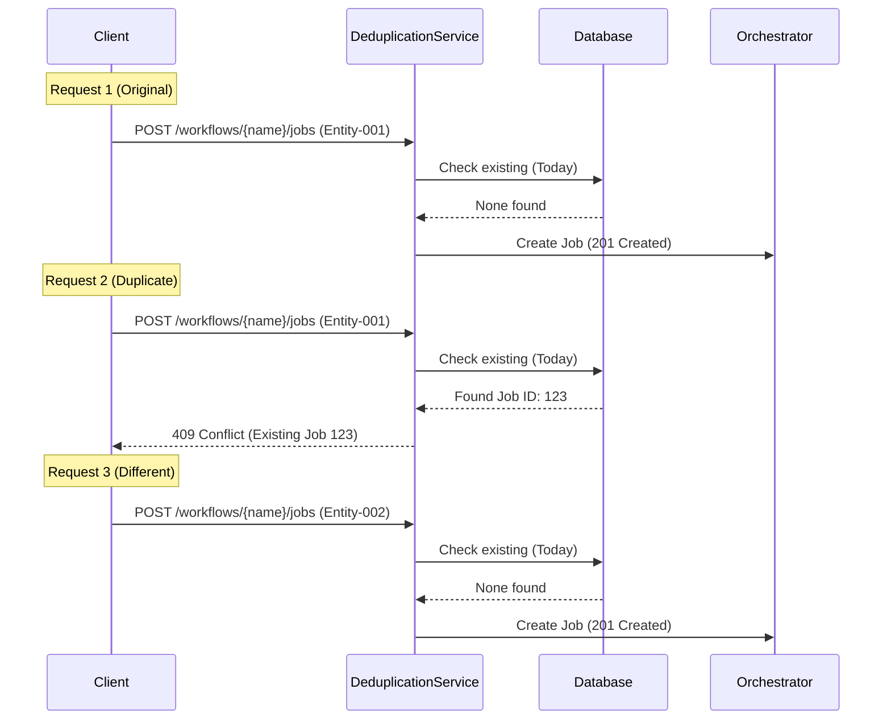

# E2E Eval: Deduplication Testing

## 🎯 **Objective**

Validate that the DTM orchestrator correctly implements **idempotent request handling** through deduplication logic, preventing duplicate job submissions for the same entity.

---

## 📋 **What This Tests**

### 🌊 Flow Diagram



### **Core Functionality**

- ✅ Duplicate request detection based on `deduplicationKey` + payload matching
- ✅ Alternative deduplication via `externalSystemId`
- ✅ Proper HTTP 409 (Conflict) response for duplicates
- ✅ Deduplication persistence across job lifecycle
- ✅ Independent processing of different requests

### **Business Requirements**

- ✅ **Idempotency**: Same request submitted multiple times yields same result
- ✅ **No Data Duplication**: Prevents duplicate records in target system
- ✅ **Client Retry Safety**: Clients can safely retry failed requests
- ✅ **Race Condition Protection**: Concurrent duplicate requests handled correctly

---

## 🧪 **Test Scenario**

### **Setup**

- `ENABLE_DEDUPLICATION=true` in environment
- Valid test data for the configured workflow
- Two unique `externalSystemId` values

### **Pre-Test Cleanup**

This eval performs a **targeted cleanup** before running, deleting only jobs for the test entity. This ensures:
- First request always returns 201 (not 409 from previous runs)
- Test can run repeatedly without full database purge
- Other test data is preserved for parallel evals

### **Test Flow**

```
1. Submit Request A (deduplicationKey=ENTITY-001, externalSystemId=UUID-1)
   → ✅ Expect: 201 Created

2. Submit Request A again (identical payload)
   → ✅ Expect: 409 Conflict

3. Submit Request B (deduplicationKey=ENTITY-002, externalSystemId=UUID-2)
   → ✅ Expect: 201 Created (different request)

4. Wait for both jobs to complete
   → ✅ Expect: Both complete successfully

5. Submit Request A again (after completion)
   → ✅ Expect: 409 Conflict (still deduplicated)
```

---

## 📊 **Expected Results**

### **Success Criteria**

| Test | Action               | Expected HTTP | Expected Behavior                         |
| ---- | -------------------- | ------------- | ----------------------------------------- |
| 1    | First request        | `201`         | Job created and started                   |
| 2    | Duplicate request    | `409`         | Rejected with conflict message            |
| 3    | Different request    | `201`         | New job created                           |
| 4    | Wait for completion  | N/A           | Both jobs complete                        |
| 5    | Retry after complete | `409`         | Still rejected (persistent deduplication) |

### **Response Format (409 Conflict)**

```json
{
  "statusCode": 409,
  "message": "Job request already exists",
  "error": "Conflict"
}
```

---

## 🔍 **What Gets Validated**

### **1. Deduplication Keys**

The service checks for existing jobs using:

**Primary Key**: `deduplicationKey` (unique external identifier)

```typescript
{
  variant: 'full-order',
  payload: {
    customerId: 1,
    orderId: 1
  }
}
```

**Alternative Key**: `externalSystemId`

```typescript
{
  payload: {
    externalSystemId: "uuid-1234";
  }
}
```

### **2. Database State**

After Test 1:

```sql
SELECT id, type, status, payload->>'deduplicationKey', payload->>'externalSystemId'
FROM dtm_jobs
WHERE payload->>'deduplicationKey' = 'ENTITY-001';

-- Expect: 1 row with ENTITY-001 and UUID-1
```

After Test 3:

```sql
-- Expect: 2 rows (ENTITY-001 with UUID-1, ENTITY-002 with UUID-2)
```

### **3. Service Logs**

Look for:

```
[DeduplicationService] Checking for existing job...
[DeduplicationService] Found existing job: {jobId}
[IngestionController] Job request rejected - duplicate detected
```

---

## ⚙️ **Configuration Requirements**

### **Environment Variables** `.env`

```bash
# REQUIRED: Must be set to 'true'
ENABLE_DEDUPLICATION=true

# For testing
ENABLE_REQUESTS_FOR_SIMULATED_DELAYS=true
ENABLE_DEV_ACK_SIMULATOR=true
```

### **If Deduplication is Disabled**

```bash
ENABLE_DEDUPLICATION=false
```

- Test will **fail with fatal error**
- Both requests would be accepted (201)
- Duplicate jobs would be created

---

## 🚀 **Running the Test**

### **Prerequisites**

1. ✅ Services running: `./scripts/local-env.sh start`
2. ✅ Deduplication enabled in `.env`
3. ✅ Test data loaded (consumer 1000 exists)

### **Execute**

```bash
cd setpoint-evals/03-deduplication
chmod +x test.sh
./test.sh
```

### **Expected Output**

```
━━━━━━━━━━━━━━━━━━━━━━━━━━━━━━━━━━━━━━━━━━━━━━━━━━━━━━━━━━━━━━━━━━
🧪 E2E Eval: Deduplication Testing
━━━━━━━━━━━━━━━━━━━━━━━━━━━━━━━━━━━━━━━━━━━━━━━━━━━━━━━━━━━━━━━━━━

✅ Deduplication is enabled

━━━━━━━━━━━━━━━━━━━━━━━━━━━━━━━━━━━━━━━━━━━━━━━━━━━━━━━━━━━━━━━━━━
🧪 Test 1: First Request (Should Succeed)
━━━━━━━━━━━━━━━━━━━━━━━━━━━━━━━━━━━━━━━━━━━━━━━━━━━━━━━━━━━━━━━━━━

✅ First request accepted
   Job ID: abc-123
   HTTP Status: 201

━━━━━━━━━━━━━━━━━━━━━━━━━━━━━━━━━━━━━━━━━━━━━━━━━━━━━━━━━━━━━━━━━━
🧪 Test 2: Duplicate Request (Should Reject with 409)
━━━━━━━━━━━━━━━━━━━━━━━━━━━━━━━━━━━━━━━━━━━━━━━━━━━━━━━━━━━━━━━━━━

✅ Duplicate request correctly rejected
   HTTP Status: 409

━━━━━━━━━━━━━━━━━━━━━━━━━━━━━━━━━━━━━━━━━━━━━━━━━━━━━━━━━━━━━━━━━━
✅ ALL TESTS PASSED
━━━━━━━━━━━━━━━━━━━━━━━━━━━━━━━━━━━━━━━━━━━━━━━━━━━━━━━━━━━━━━━━━━

🎯 Deduplication Logic: WORKING CORRECTLY
```

---

## 🐛 **Troubleshooting**

### **Test Fails on Step 2** (Duplicate not rejected)

```
❌ FAILED: Expected HTTP 409, got 201
```

**Possible Causes**:

1. ✅ Check `.env`: `ENABLE_DEDUPLICATION=true`
2. ✅ Restart orchestrator after changing `.env`
3. ✅ Verify `DeduplicationService` is imported in controllers

**Verify**:

```bash
# Check environment in running container
docker exec dtm-orchestrator printenv | grep DEDUP

# Check orchestrator logs
docker logs dtm-orchestrator | grep Deduplication
```

### **Test Fails on Step 4** (Job doesn't complete)

```
❌ FAILED: First job did not complete successfully
```

**Check**:

- SQS queues not stuck
- Workers processing messages
- No errors in orchestrator logs

```bash
./scripts/local-env.sh monitor sqs
./scripts/local-env.sh monitor api
```

---

## 📊 **Monitoring**

### **During Test Execution**

**Terminal 1**: Run test

```bash
./test.sh
```

**Terminal 2**: Monitor jobs

```bash
./scripts/local-env.sh monitor api
```

**Terminal 3**: Monitor SQS

```bash
./scripts/local-env.sh monitor sqs
```

### **After Test Completion**

**Check Database**:

```bash
docker exec -it dtm-db psql -U dtm_user -d dtm -c "
  SELECT
    id,
    type,
    status,
    payload->>'deduplicationKey' as dedup_key,
    payload->>'externalSystemId' as external_id,
    submitted_at
  FROM dtm_jobs
  WHERE payload->>'deduplicationKey' = 'ENTITY-001'
  ORDER BY submitted_at DESC
  LIMIT 5;
"
```

**Expected**: 2 completed jobs with different `external_id` values

---

## 🎓 **Learning Objectives**

After this eval, you understand:

1. ✅ **How deduplication prevents duplicate job submissions**
2. ✅ **When to return 409 vs 201 status codes**
3. ✅ **How `DeduplicationService` checks for existing requests**
4. ✅ **Why deduplication persists even after completion**
5. ✅ **How `externalSystemId` provides alternative deduplication key**

---

## 🔗 **Related Documentation**

- [`docs/FEATURES.md`](../../docs/FEATURES.md) - Deduplication Service details
- [`services/orchestrator/src/common/deduplication.service.ts`](../../services/orchestrator/src/common/deduplication.service.ts) - Implementation
- [`CRITICAL-BUG-FIX-RETRY-HANDLING.md`](../../CRITICAL-BUG-FIX-RETRY-HANDLING.md) - Retry vs deduplication

---

## 📈 **Success Metrics**

| Metric                          | Target | Actual |
| ------------------------------- | ------ | ------ |
| First request accepted          | ✅ 201 | ✅     |
| Duplicate rejected              | ✅ 409 | ✅     |
| Different request accepted      | ✅ 201 | ✅     |
| Both jobs complete              | ✅ Yes | ✅     |
| Retry after completion rejected | ✅ 409 | ✅     |

**Result**: ✅ **Deduplication logic working correctly**
