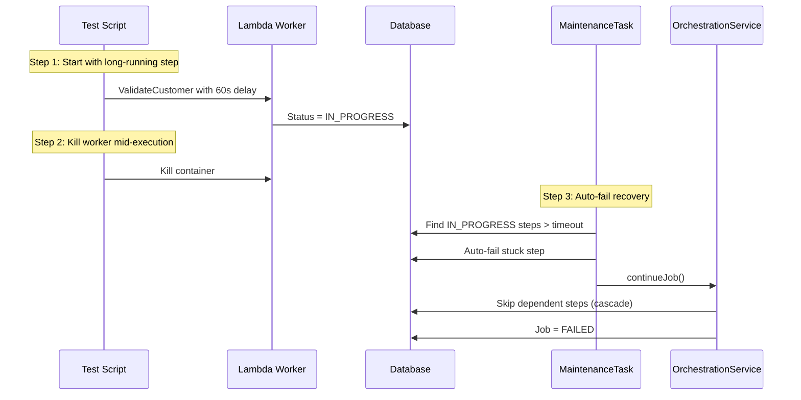

# SE 13: In-Progress Auto-Timeout

## Purpose

Tests the **StuckInProgressTask** maintenance task with **auto-fail enabled**, which automatically fails steps stuck in `IN_PROGRESS` beyond their timeout threshold.

## Scenario

1. start job with ValidateCustomer configured for 60s delay (simulates long processing)
2. Wait for ValidateCustomer to enter `in_progress`
3. Kill the Lambda container mid-execution
4. Wait for stuck timeout threshold (15s)
5. Trigger maintenance task with `autoFailEnabled: true`
6. Verify auto-fail: ValidateCustomer -> `failed`
7. Verify cascade skip: SubmitCustomer, SubmitOrder -> `skipped`
8. Verify job -> `failed`

## What This Tests

- Detection of steps stuck in `IN_PROGRESS` or `IN_PROGRESS_RETRYING`
- Auto-fail mechanism (upgraded from alert-only)
- Cascade skip logic: dependent steps marked `SKIPPED` when upstream fails
- Per-step `timeoutMs` configuration respected
- Job failure after critical step auto-fail

## Test Data

- **Consumer**: 1012
- **ValidateCustomer delay**: 60s (ensures step is in-progress when killed)
- **Other steps**: 2s delay (fast)

## Parallel Safety

**MUST RUN SEQUENTIALLY** -- kills Lambda containers, which affects shared infrastructure used by other tests.

## Simulates

- Lambda crash mid-execution (OOM, process kill)
- Container failure / restart
- Worker unable to send callback (network partition)
- Stuck worker consuming resources indefinitely

## Related

- **Task**: `services/orchestrator/src/maintenance/tasks/stuck-in-progress.task.ts`
- **API**: `POST /maintenance/tasks/stuck-in-progress/execute`
- **Cascade logic**: `services/orchestrator/src/orchestration/orchestration.service.ts` (`markDependentStepsAsSkipped`)
