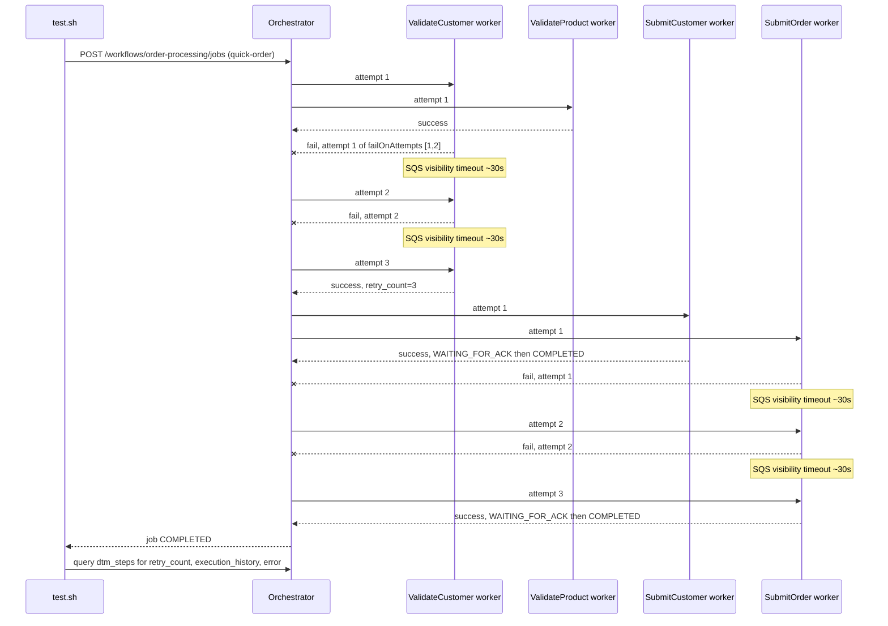

# SE-01: retry transient failure

## Setpoint Eval Metadata

**Category**: stability · **Duration**: ~134s (per test.sh's own timeline: 2 validate-retry cycles + 2 submit-retry cycles at 30s SQS visibility timeout each) · **Timeout**: 185s · **Isolation**: parallel-safe

## Scenario
```gherkin
Feature: Ada's Beans Cafe order processing survives transient worker failures
  Scenario: ValidateCustomer and SubmitOrder fail twice, then succeed on retry
    Given order-processing is running with customer_id=1 (Ada Lovelace) and order_id=1
    When a quick-order job is submitted with ValidateCustomer and SubmitOrder configured
      to fail on attempts 1 and 2 (SQS redelivers on its ~30s visibility timeout)
    Then both steps succeed on attempt 3, retry_count reflects the failed attempts,
      execution_history carries one entry per attempt, and the error field is
      cleared once the step finally completes
    And the job reaches COMPLETED with all 4 quick-order steps done
```

## Architecture


## Test Data
Reads (does not own) order-processing's seeded rows — `customer_id=1` (Ada Lovelace)
and `order_id=1`, owned by workflow suite `SE-01-happy-path`
(`workflows/order-processing/source-db/SEED-REGISTRY.md`). `entityId` is a fresh
`uuidgen` per run so repeated runs never collide.

## Payload
```json
{
  "variant": "quick-order",
  "payload": {
    "customerId": 1,
    "orderId": 1,
    "entityId": "<uuidgen per run>"
  },
  "enableDeduplication": false,
  "testOptions": {
    "ValidateCustomer": { "simDelay": 500, "failOnAttempts": [1, 2], "failureAfter": 100 },
    "ValidateProduct": { "simDelay": 500 },
    "SubmitCustomer": { "simDelay": 500, "ackDelay": 1000 },
    "SubmitOrder": { "simDelay": 500, "failOnAttempts": [1, 2], "failureAfter": 100, "ackDelay": 1000 }
  }
}
```
POSTed to `${ORCHESTRATOR_URL}/workflows/order-processing/jobs` via `initiate_job()`.

## Artifacts

### Expected output (retry counts, excerpt from test.sh's own query)
```
 step_value          | retry_count | status
 ValidateCustomer    | 3           | completed
 SubmitCustomer      | 1           | completed
 SubmitOrder         | 3           | completed
```

## Assertions
<!-- one checkbox per exit-1 gate in test.sh, in the order they run -->
- [ ] ValidateCustomer `retry_count = 3` (attempt 3, after 2 simulated failures)
- [ ] SubmitCustomer `retry_count = 1` (succeeded on first attempt)
- [ ] SubmitOrder `retry_count = 3` (attempt 3, after 2 simulated failures)
- [ ] `error` field is cleared (NULL) on every step that has `retry_count > 0`
- [ ] ValidateCustomer's `execution_history` has exactly 3 attempt entries
- [ ] SubmitOrder's `execution_history` has exactly 3 attempt entries
- [ ] job-level `result.totalRecords = 2` (quick-order variant)
- [ ] job-level `result.stepsCompleted = 4` (quick-order variant)

## Run
```bash
bash setpoint-evals/run-all.sh --se 01
```

## Troubleshooting

**Stuck at `in_progress_retrying`** — expected: SQS visibility timeout (30s) makes each
retry cycle slow; the full ~134s is normal, not a hang.

**`retry_count = 0` for a step configured to fail** — check
`ENABLE_REQUESTS_FOR_SIMULATED_DELAYS` is set in the Lambda environment; redeploy
workers if not: `./scripts/local-env.sh deploy-workers`.

Related: [`docs/guides/FEATURES.md`](../../docs/guides/FEATURES.md#retry-aware-failure-simulation)
(retry-aware failure simulation), [`docs/guides/race-condition-prevention.md`](../../docs/guides/race-condition-prevention.md)
(callback race-condition guards).
