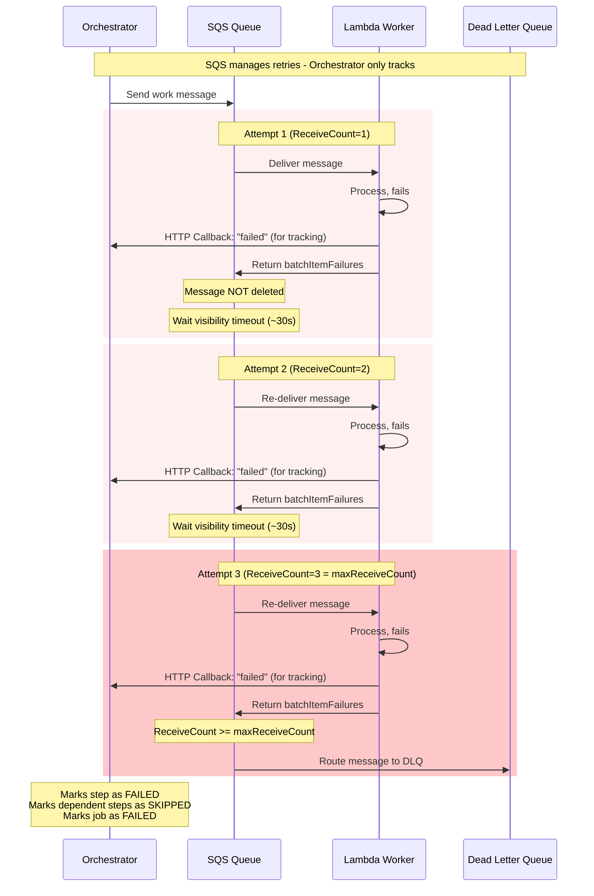

# 🧪 Eval 02: DLQ Permanent Failure

## Setpoint Eval Metadata

**Timeout**: 335s
**Isolation**: parallel-safe
**Category**: stability

## 📋 Overview

**Category**: Stability & Reliability  
**Duration**: ~120 seconds (SQS visibility timeouts: 3 × ~30s + processing)  
**Complexity**: Advanced

## 🎯 What Is Being Tested

This evaluation tests the **Dead Letter Queue (DLQ)** mechanism when a Lambda worker exhausts all retry attempts. The key insight is that **SQS manages all retry logic** - the orchestrator only passively tracks failure callbacks.

### 🏗️ Architecture: SQS-Managed Retries



### ⚠️ Critical Architecture Point

**The orchestrator does NOT re-delegate!**

| Component | Responsibility |
|-----------|---------------|
| **Lambda** | Process work, return `batchItemFailures` on failure, send callback to orchestrator |
| **SQS** | Manage retries via visibility timeout, track `ReceiveCount`, route to DLQ |
| **Orchestrator** | Passively track failure callbacks, update step status, handle cascade failures |

### Key Behaviors Tested

1. **SQS Retry Management**: Messages automatically re-delivered after visibility timeout
2. **DLQ Routing**: After `maxReceiveCount`, message moves to DLQ
3. **Failure Tracking**: Orchestrator receives callbacks but doesn't control retries
4. **Cascade Effects**: Dependent steps (DiscoverLineItems) are SKIPPED

## 📊 Test Configuration

```json
{
  "variant": "quick-order",
  "payload": {
    "customerId": 1,
    "orderId": 1,
    "entityId": "<generated externalSystemId>"
  },
  "enableDeduplication": false,
  "testOptions": {
    "ValidateCustomer": { "simDelay": 500, "failOnAttempts": [1, 2] },
    "ValidateProduct": { "simDelay": 500, "failOnAttempts": [1] },
    "SubmitCustomer": { "simDelay": 500, "ackDelay": 100, "failOnAttempts": [1, 2] },
    "SubmitOrder": { "simDelay": 500, "ackDelay": 100, "failOnAttempts": [1, 2, 3, 4, 5, 6, 7] }
  }
}
```

**Failure Configuration:**
- `ValidateCustomer.failOnAttempts: [1, 2]` - Fails twice, succeeds on attempt 3
- `ValidateProduct.failOnAttempts: [1]` - Fails once, succeeds on attempt 2
- `SubmitCustomer.failOnAttempts: [1, 2]` - Fails twice, succeeds on attempt 3
- `SubmitOrder.failOnAttempts: [1, 2, 3, 4, 5, 6, 7]` - **PERMANENT FAILURE** (exceeds maxReceiveCount=3)

## 🔄 Expected Behavior

### Per-Step Analysis

| Step | SQS Attempts | Result | Reason |
|------|--------------|--------|--------|
| **ValidateCustomer** | 1️⃣❌ 2️⃣❌ 3️⃣✅ | SUCCESS | Succeeds on attempt 3 (within maxReceiveCount) |
| **ValidateOrder** | 1️⃣❌ 2️⃣✅ | SUCCESS | Succeeds on attempt 2 |
| **SubmitCustomer** | 1️⃣❌ 2️⃣❌ 3️⃣✅ | SUCCESS | Succeeds on attempt 3 + ACK |
| **SubmitOrder** | 1️⃣❌ 2️⃣❌ 3️⃣❌ → DLQ | **FAILED** | Exceeds maxReceiveCount, routes to DLQ |
| **DiscoverLineItems** | ⏭️ | **SKIPPED** | Dependency (SubmitOrder) failed |

### Overall Job Status

**FAILED** (due to SubmitOrder exceeding maxReceiveCount)

## ⏱️ Timeline (~120 seconds)

```
SQS Visibility Timeout: ~30 seconds per attempt
maxReceiveCount: 3

┌─────────────────────────────────────────────────────────────────┐
│ t=0s      SQS delivers messages (ReceiveCount=1)                │
│ t=~1s     Lambda processes, some fail, return batchItemFailures │
│           → SQS waits visibility timeout                        │
├─────────────────────────────────────────────────────────────────┤
│ t=~30s    SQS re-delivers failed messages (ReceiveCount=2)      │
│ t=~31s    Lambda processes, some succeed, some fail             │
│           → ValidateOrder succeeds ✅                        │
│           → SQS waits visibility timeout                        │
├─────────────────────────────────────────────────────────────────┤
│ t=~60s    SQS re-delivers failed messages (ReceiveCount=3)      │
│ t=~61s    Lambda processes                                      │
│           → ValidateCustomer succeeds ✅                          │
│           → SubmitCustomer succeeds ✅ → ACK                  │
│           → SubmitOrder fails ❌ (attempt 3/3)           │
│           → SQS waits visibility timeout                        │
├─────────────────────────────────────────────────────────────────┤
│ t=~90s    SQS checks: ReceiveCount (3) >= maxReceiveCount (3)   │
│           → SubmitOrder message → DLQ 💀                 │
│           → Orchestrator marks step as FAILED                   │
│           → DiscoverLineItems marked as SKIPPED                    │
│           → Job marked as FAILED                                │
└─────────────────────────────────────────────────────────────────┘
```

## ✅ Success Criteria

### Expected Results

- [x] Job status: `FAILED`
- [x] ValidateCustomer: `COMPLETED`
- [x] ValidateOrder: `COMPLETED`
- [x] SubmitCustomer: `COMPLETED`
- [x] SubmitOrder: `FAILED`
- [x] DiscoverLineItems: `SKIPPED` (cascade effect)
- [x] DLQ count for `order-submit-order-dlq`: >=1

### Verification Commands

**Check Job Status:**
```bash
curl http://localhost:3002/api/v1/jobs/${JOB_ID} | jq
# Expected: status = "failed"
```

**Check SQS DLQ:**
```bash
./scripts/local-env.sh monitor sqs
# Expected: 1+ message in submit-order DLQ
```

**Check Lambda Logs (3 failure attempts):**
```bash
./scripts/local-env.sh logs submit-order-worker | grep -i 'attempt\|failed'
```

**Check Step Retry Counts:**
```bash
docker exec dtm-db psql -U postgres -d dtm -c \
  "SELECT step_name, status, retry_count FROM dtm_steps WHERE job_id='${JOB_ID}'"
```

## 🔍 What You'll See

### SQS Monitor

```
QUEUE NAME                           AVAILABLE  IN-FLIGHT        DLQ
────────────────────────────────────────────────────────────────────────
order-submit-order                   0          0          1  <- RED!
────────────────────────────────────────────────────────────────────────

⚠️  WARNING: 1 message(s) in Dead Letter Queues!
```

### API Status Response

```json
{
  "jobId": "...",
  "status": "failed",
  "steps": [
    { "step": "ValidateCustomer", "status": "completed" },
    { "step": "ValidateOrder", "status": "completed" },
    { "step": "SubmitCustomer", "status": "completed" },
    { "step": "SubmitOrder", "status": "failed" },
    { "step": "DiscoverLineItems", "status": "skipped" }
  ]
}
```

### Lambda Logs (SubmitOrder)

```
[SubmitOrder] Processing message (attempt 1)
[ERROR] SIMULATED FAILURE [Attempt 1/3]
Failure callback sent

[SubmitOrder] Processing message (attempt 2)
[ERROR] SIMULATED FAILURE [Attempt 2/3]
Failure callback sent

[SubmitOrder] Processing message (attempt 3)
[ERROR] SIMULATED FAILURE [Attempt 3/3]
Failure callback sent
-> Message routed to DLQ (maxReceiveCount exceeded)
```

## 🎓 Key Learning Points

### 1. **SQS Manages Retries, Not Orchestrator**

```
❌ WRONG: Orchestrator re-delegates on failure
✅ CORRECT: SQS re-delivers after visibility timeout
```

The orchestrator:
- Receives failure callbacks (for logging/tracking)
- Updates step status in database
- Does **NOT** send new SQS messages for retries

SQS handles:
- Visibility timeout (delay between retries)
- ReceiveCount tracking (attempt number)
- DLQ routing (after maxReceiveCount)

### 2. **Lambda Returns batchItemFailures**

```typescript
// Lambda handler returns failures to SQS
return {
  batchItemFailures: [
    { itemIdentifier: record.messageId }
  ]
};
```

This tells SQS: "Don't delete this message, retry it later."

### 3. **Visibility Timeout = Retry Delay**

```
Attempt 1 → fail → wait ~30s → Attempt 2 → fail → wait ~30s → Attempt 3 → DLQ
```

The ~30s visibility timeout is the delay between retry attempts.

### 4. **Cascade Failure**

When SubmitOrder fails permanently:
1. Orchestrator receives final failure callback
2. Marks SubmitOrder as FAILED
3. Finds dependent steps (DiscoverLineItems)
4. Marks dependent steps as SKIPPED
5. Marks job as FAILED

## 🐛 Troubleshooting

### Job Completes Instead of Failing

**Possible Causes:**
- `failOnAttempts` not parsed correctly
- `ENABLE_REQUESTS_FOR_SIMULATED_DELAYS` not set

**Solution:**
```bash
# Check environment variable
docker compose exec orchestrator env | grep ENABLE_REQUESTS_FOR_SIMULATED_DELAYS
```

### SubmitOrder Succeeds on Attempt 3

**Possible Cause:**
- `failOnAttempts` doesn't include attempt 3

**Solution:**
- Ensure `SubmitOrder.failOnAttempts: [1, 2, 3, ...]`

### Timing Issues

**Possible Cause:**
- SQS visibility timeout variance

**Solution:**
- Allow ~120s for full test (3 × 30s + processing)
- Use `--add-timeout=60` for extra buffer

## 🔗 Related Documentation

- [SQS DLQ Configuration](../../docker-compose.workers.yml)
- [Worker SDK Simulation Helpers](../../packages/worker-sdk/src/simulation.ts)
- [System Architecture](../../docs/guides/system-architecture.md)

## 📊 Metrics to Observe

- **Total Duration**: ~120 seconds
- **SQS Attempts**: 3 per failed step
- **Visibility Timeout**: ~30s between attempts
- **Successful Steps**: 3 out of 5
- **Failed Steps**: 1 out of 5
- **Skipped Steps**: 1 out of 5

---

**Test Status**: ✅ Active  
**Last Updated**: 2025-12-13  
**Architecture**: SQS-Managed Retries (Orchestrator tracks, doesn't re-delegate)  
**Maintainer**: DTM Team
