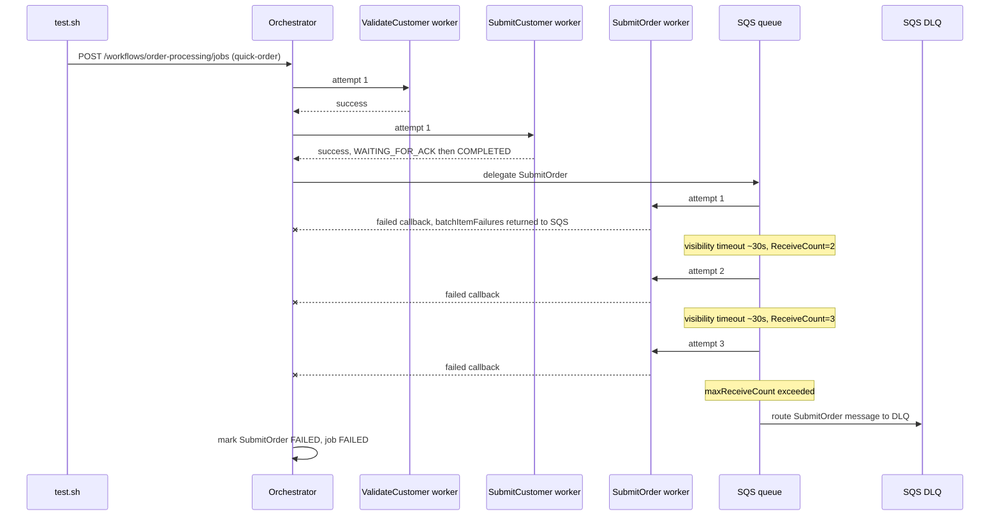

# SE-02: dlq permanent failure

## Setpoint Eval Metadata

**Category**: stability · **Duration**: ~120s (SQS-managed retries: 3 x ~30s visibility timeout + processing) · **Timeout**: 335s · **Isolation**: parallel-safe

## Scenario
```gherkin
Feature: Ada's Beans Cafe order processing routes permanent failures to the DLQ
  Scenario: SubmitOrder fails every attempt and exhausts SQS maxReceiveCount
    Given order-processing is running with customer_id=1 (Ada Lovelace) and order_id=1
    When a quick-order job is submitted with SubmitOrder configured to fail on
      attempts 1 through 7 (more than SQS's maxReceiveCount of 3)
    Then SQS re-delivers SubmitOrder up to maxReceiveCount, the orchestrator does NOT
      re-delegate it itself, and after the final attempt SQS routes the message to
      its dead-letter queue
    And ValidateCustomer and SubmitCustomer still complete normally (independent
      branches are not blocked by SubmitOrder's failure)
    And the job reaches FAILED status
```

## Architecture


## Test Data
Reads (does not own) order-processing's seeded rows — `customer_id=1` (Ada Lovelace)
and `order_id=1`, owned by workflow suite `SE-01-happy-path`
(`workflows/order-processing/source-db/SEED-REGISTRY.md`). `entityId` is a fresh
`uuidgen` per run.

## Payload
```json
{
  "variant": "quick-order",
  "payload": {
    "customerId": 1,
    "orderId": 1,
    "entityId": "<uuidgen per run>"
  },
  "enableDeduplication": false,
  "testOptions": {
    "ValidateCustomer": { "simDelay": 500, "failOnAttempts": [1, 2] },
    "ValidateProduct": { "simDelay": 500, "failOnAttempts": [1] },
    "SubmitCustomer": { "simDelay": 500, "ackDelay": 100, "failOnAttempts": [1, 2] },
    "SubmitOrder": { "simDelay": 500, "ackDelay": 100, "failOnAttempts": [1, 2, 3, 4, 5, 6, 7] }
  }
}
```
POSTed to `${ORCHESTRATOR_URL}/workflows/order-processing/jobs` via `initiate_job()`.
`SubmitOrder.failOnAttempts` deliberately exceeds SQS's `maxReceiveCount` of 3 so
every redelivery still fails and the message is guaranteed to reach the DLQ.

## Artifacts

### Expected output (final job status excerpt)
```
job.status = FAILED
ValidateCustomer  = COMPLETED
SubmitCustomer    = COMPLETED
SubmitOrder       = FAILED
DiscoverLineItems = SKIPPED (or not present in quick-order)
```

## Assertions
<!-- one checkbox per exit-1 Test-N gate in test.sh, numbered as test.sh itself numbers them -->
- [ ] Test 1: job status is `FAILED`
- [ ] Test 2: `ValidateCustomer` is `COMPLETED`
- [ ] Test 3: `SubmitCustomer` is `COMPLETED`
- [ ] Test 5: `SubmitOrder` is `FAILED` (SQS exhausted `maxReceiveCount`)
- [ ] Test 6: `DiscoverLineItems` is `SKIPPED` (or absent — quick-order has no discovery step)
- [ ] Test 7: `result.stepsCompleted` is between 3 and 4

## Run
```bash
bash setpoint-evals/run-all.sh --se 02
```

## Troubleshooting

**Job completes instead of failing** — check `failOnAttempts` parsing and that
`ENABLE_REQUESTS_FOR_SIMULATED_DELAYS` is set on the orchestrator:
`docker compose exec orchestrator env | grep ENABLE_REQUESTS_FOR_SIMULATED_DELAYS`.

**SubmitOrder succeeds on a later attempt** — `failOnAttempts` must list every
attempt up to and past `maxReceiveCount` (3); this SE lists 1-7 for margin.

**Timing variance** — SQS visibility timeout has some jitter; allow the full
~120s, or add buffer with `--add-timeout=60`.

Related: [`docker-compose.workers.yml`](../../docker-compose.workers.yml) (SQS DLQ
configuration), [`packages/worker-sdk/src/simulation.ts`](../../packages/worker-sdk/src/simulation.ts)
(worker failure-simulation SDK), [`docs/guides/system-architecture.md`](../../docs/guides/system-architecture.md).
