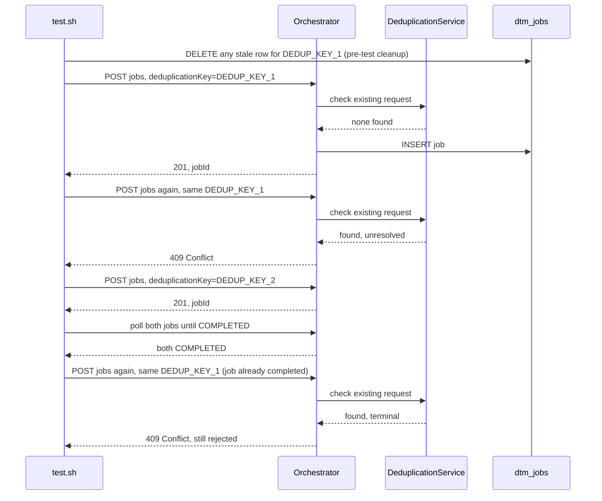

# SE-03: deduplication

## Setpoint Eval Metadata

**Category**: feature · **Duration**: ~20s (sum of the two payloads' simDelay/ackDelay chains plus two explicit 1s pauses in test.sh) · **Timeout**: 95s · **Isolation**: parallel-safe

## Scenario
```gherkin
Feature: Ada's Beans Cafe order processing rejects duplicate job requests
  Scenario: a request with a reused deduplicationKey is rejected, a different one is not
    Given order-processing is running with customer_id=1 (Ada Lovelace) and order_id=1
    When a job is submitted with enableDeduplication=true and a fresh deduplicationKey
    Then it is accepted with HTTP 201
    And when the identical request is submitted again immediately
    Then it is rejected with HTTP 409
    And when a request with a DIFFERENT deduplicationKey is submitted
    Then it is accepted with HTTP 201 and both jobs complete independently
    And when the original deduplicationKey is submitted again AFTER its job completes
    Then it is still rejected with HTTP 409 — deduplication persists past completion
```

## Architecture


## Test Data
Reads (does not own) order-processing's seeded rows — `customer_id=1` (Ada Lovelace)
and `order_id=1`, owned by workflow suite `SE-01-happy-path`
(`workflows/order-processing/source-db/SEED-REGISTRY.md`). `deduplicationKey` values
(`DEDUP_KEY_1`, `DEDUP_KEY_2`) are fresh `uuidgen` per run; `entityId` reuses the same
key so the request body itself stays identical across the duplicate submission.

## Payload
```json
{
  "deduplicationKey": "<uuidgen, DEDUP_KEY_1>",
  "variant": "quick-order",
  "payload": {
    "customerId": 1,
    "orderId": 1,
    "entityId": "<same as deduplicationKey>"
  },
  "enableDeduplication": true,
  "testOptions": {
    "ValidateCustomer": { "simDelay": 2000 },
    "ValidateProduct": { "simDelay": 2000 },
    "SubmitCustomer": { "simDelay": 2000, "ackDelay": 1000 },
    "SubmitOrder": { "simDelay": 2000, "ackDelay": 1000 }
  }
}
```
POSTed directly via `curl` to `${ORCHESTRATOR_HOST}/api/${API_VERSION}/workflows/order-processing/jobs`
(this SE inlines its own curl calls rather than using `initiate_job()`, so it can read
the raw HTTP status code). The second (different) request uses a fresh
`deduplicationKey`/`entityId` (`DEDUP_KEY_2`) with 1000ms delays instead of 2000ms.

## Artifacts

### Expected output (HTTP status per request, in order)
```
1st request (DEDUP_KEY_1):        201
2nd request (same DEDUP_KEY_1):   409
3rd request (DEDUP_KEY_2):        201
4th request (DEDUP_KEY_1, after both jobs completed): 409
```

## Assertions
<!-- one checkbox per exit-1 gate in test.sh, in execution order -->
- [ ] Test 1: first request with `DEDUP_KEY_1` returns HTTP 201
- [ ] Test 2: identical repeat request returns HTTP 409
- [ ] Test 3: request with a different `deduplicationKey` (`DEDUP_KEY_2`) returns HTTP 201
- [ ] Test 4: both jobs reach `completed` status
- [ ] job 1 and job 2 stats: `result.totalRecords = 2` and `result.stepsCompleted = 4`
- [ ] Test 5: `DEDUP_KEY_1` resubmitted after job completion still returns HTTP 409

## Run
```bash
bash setpoint-evals/run-all.sh --se 03
```

## Troubleshooting

**Duplicate not rejected (expected 409, got 201)** — check `.env`:
`ENABLE_DEDUPLICATION=true` may be irrelevant here since this SE uses the
**per-request** override (`testOptions.enableDeduplication`); verify
`DeduplicationService` is wired into the workflow controller and restart the
orchestrator after any `.env` change:
```bash
docker exec dtm-orchestrator printenv | grep DEDUP
docker logs dtm-orchestrator | grep Deduplication
```

**Job doesn't complete (Test 4 fails)** — check SQS queues aren't stuck and workers
are processing: `./scripts/local-env.sh monitor sqs` / `./scripts/local-env.sh monitor api`.

Related: [`docs/guides/PER-REQUEST-DEDUPLICATION.md`](../../docs/guides/PER-REQUEST-DEDUPLICATION.md)
(the per-request `testOptions.enableDeduplication` override this SE exercises),
[`services/orchestrator/src/common/deduplication.service.ts`](../../services/orchestrator/src/common/deduplication.service.ts)
(implementation).
