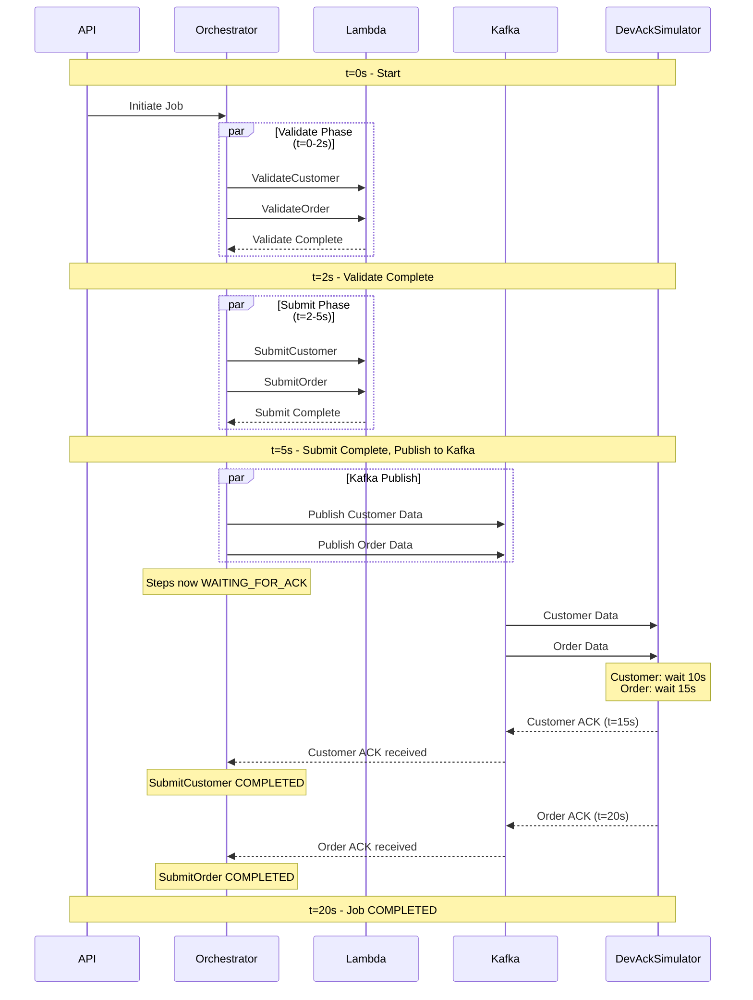

# E2E Eval 09: Acknowledgement Delays

## Setpoint Eval Metadata

**Timeout**: 95s
**Isolation**: parallel-safe
**Category**: stability

## 📋 Overview

**Category**: Asynchronous Behavior  
**Priority**: High  
**Duration**: ~40 seconds  
**Complexity**: Medium

Tests the system's ability to handle variable acknowledgement delays from external systems (simulated by DevAckSimulator). This validates the `WAITING_FOR_ACK` status behavior and ensures the orchestrator correctly waits for acknowledgements before continuing.

---

## 🎯 Test Objectives

### 🌊 Flow Diagram



### Primary Goals

1. Verify `WAITING_FOR_ACK` status is set after Submit steps complete
2. Validate orchestrator waits for acknowledgements (doesn't proceed prematurely)
3. Test different acknowledgement delay durations
4. Ensure steps transition from `WAITING_FOR_ACK` → `COMPLETED` after ack received
5. Confirm job doesn't complete until all acknowledgements received

### What This Tests

- Kafka publish after Submit completion
- ✅ `WAITING_FOR_ACK` status handling
- ✅ DevAckSimulator delay configuration (`xyzAckDelay`)
- ✅ Orchestrator's ack-aware orchestration
- ✅ Database `kafka_published_at` and `ack_received_at` timestamps
- ✅ Different delay durations (short, medium, long)

---

## 📊 Test Scenario

### Configuration

```json
{
  "variant": "quick-order",
  "payload": {
    "customerId": 1,
    "orderId": 1,
    "entityId": "<generated externalSystemId>"
  },
  "enableDeduplication": false,
  "testOptions": {
    "ValidateCustomer": { "simDelay": 2000 },
    "ValidateProduct": { "simDelay": 2000 },
    "SubmitCustomer": { "simDelay": 3000, "ackDelay": 2000 },
    "SubmitOrder": { "simDelay": 3000, "ackDelay": 3000 }
  }
}
```

### Expected Flow

```
┌─────────────────────────────────────────────────────────────┐
│ Phase 1: Validate Steps (Fast, No Acks)                    │
└─────────────────────────────────────────────────────────────┘

t=0s     ValidateCustomer + ValidateOrder start
t=2s     Both complete → status: COMPLETED
         (No acks required for Validate steps)

┌─────────────────────────────────────────────────────────────┐
│ Phase 2: Submit Steps (Require Acknowledgements)           │
└─────────────────────────────────────────────────────────────┘

t=2s     SubmitCustomer + SubmitOrder start
t=5s     Both complete processing
         ✅ SubmitCustomer publishes to Kafka → status: WAITING_FOR_ACK
         ✅ SubmitOrder publishes to Kafka → status: WAITING_FOR_ACK

┌─────────────────────────────────────────────────────────────┐
│ Phase 3: Waiting for Acknowledgements (Blocking)           │
└─────────────────────────────────────────────────────────────┘

t=5s     Job status: PROCESSING (2 steps waiting for ack)
         DevAckSimulator receives both messages

         SubmitCustomer: Will wait 10s before acking
         SubmitOrder: Will wait 15s before acking

t=15s    SubmitCustomer ack received (after 10s delay)
         SubmitCustomer → status: COMPLETED
         Job status: Still PROCESSING (1 step still waiting)

t=20s    SubmitOrder ack received (after 15s delay)
         SubmitOrder → status: COMPLETED

t=20s    All steps complete → Job status: COMPLETED

┌─────────────────────────────────────────────────────────────┐
│ Final Status: COMPLETED (all acks received)                │
└─────────────────────────────────────────────────────────────┘

Total Duration: ~20 seconds (longest ack delay)
```

---

## ✅ Success Criteria

### 1. Step Status Progression

```sql
-- Submit steps should go through WAITING_FOR_ACK
SubmitCustomer:   DELEGATED → WAITING_FOR_ACK → COMPLETED
SubmitOrder: DELEGATED → WAITING_FOR_ACK → COMPLETED

-- Validate steps should NOT go through WAITING_FOR_ACK
ValidateCustomer:     DELEGATED → COMPLETED
ValidateOrder:   DELEGATED → COMPLETED
```

### 2. Timing Validation

- SubmitCustomer: ~10s in `WAITING_FOR_ACK` status
- SubmitOrder: ~15s in `WAITING_FOR_ACK` status
- Job remains `PROCESSING` for ~20s (until all acks received)

### 3. Database Timestamps

```sql
SELECT
  step_value,
  completed_at,
  kafka_published_at,
  ack_received_at,
  (ack_received_at - kafka_published_at) as ack_duration
FROM dtm_steps
WHERE job_id = '{JOB_ID}'
  AND step_value LIKE 'Submit%';
```

**Expected:**

- `kafka_published_at` should be set immediately after step completes
- `ack_received_at` should be ~10s later (SubmitCustomer)
- `ack_received_at` should be ~15s later (SubmitOrder)
- `ack_duration` should match configured delays

### 4. Job Status Timeline

```sql
-- Job should NOT complete until all acks received
SELECT
  status,
  updated_at
FROM dtm_jobs
WHERE id = '{JOB_ID}';

-- Status should be PROCESSING until t=~20s, then COMPLETED
```

### 5. Acknowledgement Metadata

```sql
SELECT
  step_value,
  ack_metadata
FROM dtm_steps
WHERE job_id = '{JOB_ID}'
  AND step_value LIKE 'Submit%';
```

**Expected:**

- `ack_metadata` should contain acknowledgement details
- Should include topic, partition, offset information

---

## 🔍 Verification Queries

### Check Waiting For Ack Status

```sql
-- During execution, should see steps in WAITING_FOR_ACK
SELECT
  step_value,
  status,
  kafka_published_at IS NOT NULL as kafka_published,
  ack_received_at IS NULL as waiting_for_ack
FROM dtm_steps
WHERE job_id = '{JOB_ID}'
  AND step_value LIKE 'Submit%';
```

### Verify Ack Delays

```sql
SELECT
  step_value,
  EXTRACT(EPOCH FROM (ack_received_at - kafka_published_at)) as delay_seconds
FROM dtm_steps
WHERE job_id = '{JOB_ID}'
  AND step_value LIKE 'Submit%'
ORDER BY order_index;
```

**Expected:**

```
 step_value          | delay_seconds
---------------------+--------------
 SubmitCustomer   | ~10.0
 SubmitOrder | ~15.0
```

### Check Job Completion Time

```sql
-- Job completion should be ~20s after initiation
SELECT
  status,
  EXTRACT(EPOCH FROM (completed_at - submitted_at)) as total_duration
FROM dtm_jobs
WHERE id = '{JOB_ID}';

-- Expected: total_duration ~20-22 seconds
```

---

## 🎬 Orchestrator Logs

### Step Completion & Kafka Publish

```
[CallbackService] Step {stepId} (SubmitCustomer) completed successfully
[CallbackService] Step {stepId} (SubmitCustomer) requires acknowledgement - publishing to Kafka
[CallbackService] Publishing submitted customer data to: dtm.jobs.completed (1 records)
[CallbackService] Submitted customer data published
[CallbackService] Step {stepId} updated to WAITING_FOR_ACK
```

### DevAckSimulator Processing

```
[DevAckSimulatorService] 🔄 Processing dtm.jobs.completed event
[DevAckSimulatorService] ⏳ Simulating processing delay: 10000ms
[DevAckSimulatorService] ✅ Publishing acknowledgement to order.consumer.ack
```

### Acknowledgement Received

```
[AcknowledgementHandler] 📨 Received acknowledgement for step {stepId}
[AcknowledgementHandler] ✅ Step {stepId} marked as COMPLETED
[OrchestrationService] 🔄 Continuing job {jobId}
[OrchestrationService] ✅ Job {jobId} completed successfully
```

---

## 🐛 Common Issues & Troubleshooting

### Issue: Steps never enter `WAITING_FOR_ACK` status

**Cause 1**: `PUBLISH_EVENTS_TO_KAFKA=false` in orchestrator  
**Solution**: Set `PUBLISH_EVENTS_TO_KAFKA=true` in `.env` and restart orchestrator

**Cause 2**: Submit workers returning wrong output format
**Solution**: Verify output keys match expected format for the entity type

### Issue: Job completes immediately (doesn't wait for acks)

**Cause**: Bug in orchestrator (should block on `WAITING_FOR_ACK`)  
**Solution**: Verify v2.1.0+ (acknowledgement workflow implemented)

### Issue: `ENABLE_DEV_ACK_SIMULATOR` disabled

**Cause**: DevAckSimulator not running (no one to send acks)  
**Solution**: Set `ENABLE_DEV_ACK_SIMULATOR=true` in `.env` and restart orchestrator

### Issue: Ack delays not respected

**Cause**: `testOptions` not passed through Kafka events  
**Solution**: Verify `testOptions` in Kafka message payload

---

## 📊 Visual Timeline

```
Time (s)  | Status
----------|--------------------------------------------------------
0         | ▓▓▓▓ Validate (both steps)
2         | ✓✓ Validate complete
          |
2         | ▓▓▓ Submit (both steps)
5         | ⏸⏸ Submit complete -> WAITING_FOR_ACK
          |
5-15      | ⏳⏳ Waiting (SubmitCustomer ack delay: 10s)
          |    ⏳ Waiting (SubmitOrder ack delay: 15s)
15        | ✓⏳ SubmitCustomer ack received
          |    ⏳ Still waiting (SubmitOrder)
20        | ✓✓ SubmitOrder ack received
          |
20        | ✅ Job COMPLETED

Legend:
▓ = Processing
⏸ = Completed (waiting for ack)
⏳ = Waiting for ack
✓ = Ack received (truly complete)
✅ = Job complete
```

---

## 📚 Related Documentation

- [`docs/FEATURES.md`](../../docs/FEATURES.md#kafka-acknowledgement-workflow) - Acknowledgement workflow
- [`docs/system-architecture.md`](../../docs/system-architecture.md#section-6) - Acknowledgement flow
- [`docs/guides/system-architecture.md`](../../docs/guides/system-architecture.md) - System architecture
- [`.cursor/architecture.mdc`](../../.cursor/architecture.mdc) - System architecture

---

## 🔗 Monitoring During Test

### Monitor jobs Progress

```bash
./scripts/local-env.sh monitor api
# Look for purple hourglass icons (⏳) = WAITING_FOR_ACK
```

### Monitor Orchestrator Logs

```bash
docker logs -f dtm-orchestrator | grep -E "WAITING_FOR_ACK|DevAckSimulator|Publishing acknowledgement"
```

### Monitor Kafka Messages (Kafka UI)

```
http://localhost:8082
Topics: dtm.jobs.completed
        order.customer.ack, order.order.ack
```

---

## 🏁 Running This Eval

```bash
cd setpoint-evals/SE-04-ack-delays
./test.sh
```

**Expected Output:**

```
✅ Job initiated
⏳ Monitoring progress (max 30 seconds)...
[3/30] Job: processing | SC=waiting_for_ack SO=waiting_for_ack
[7/30] Job: processing | SC=completed SO=waiting_for_ack
[10/30] Job: completed | SC=completed SO=completed
✅ Job completed successfully
✅ Ack delays verified (~10s and ~15s)
✅ Timestamps validated
🎉 Eval 09: Acknowledgement Delays PASSED
```
