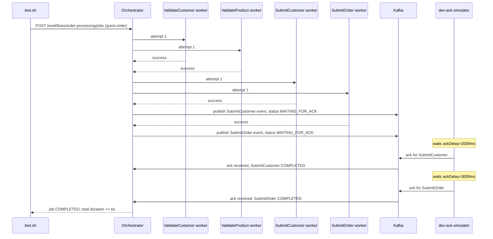

# SE-04: ack delays

## Setpoint Eval Metadata

**Category**: stability · **Duration**: ~8s (per test.sh's own banner) · **Timeout**: 95s · **Isolation**: parallel-safe

## Scenario
```gherkin
Feature: Ada's Beans Cafe order processing honors WAITING_FOR_ACK durations
  Scenario: Submit steps wait their configured ackDelay before completing
    Given order-processing is running with customer_id=1 (Ada Lovelace) and order_id=1
    When a quick-order job is submitted with SubmitCustomer configured for a 2s
      ackDelay and SubmitOrder for a 3s ackDelay
    Then both Submit steps publish to Kafka and enter WAITING_FOR_ACK
    And SubmitCustomer's acknowledgement arrives after ~2s, SubmitOrder's after ~3s
    And the job does not reach COMPLETED until both acknowledgements are received
```

## Architecture


## Test Data
Reads (does not own) order-processing's seeded rows — `customer_id=1` (Ada Lovelace)
and `order_id=1`, owned by workflow suite `SE-01-happy-path`
(`workflows/order-processing/source-db/SEED-REGISTRY.md`). `entityId` is a fresh
`uuidgen` per run.

## Payload
```json
{
  "variant": "quick-order",
  "payload": {
    "customerId": 1,
    "orderId": 1,
    "entityId": "<uuidgen per run>"
  },
  "enableDeduplication": false,
  "testOptions": {
    "ValidateCustomer": { "simDelay": 2000 },
    "ValidateProduct": { "simDelay": 2000 },
    "SubmitCustomer": { "simDelay": 3000, "ackDelay": 2000 },
    "SubmitOrder": { "simDelay": 3000, "ackDelay": 3000 }
  }
}
```
POSTed to `${ORCHESTRATOR_URL}/workflows/order-processing/jobs` via `initiate_job()`.
The `ackDelay` values are the thing under test — do not zero them under `--quick`.

## Artifacts

### Expected output (dtm_steps excerpt)
```
step_value      | kafka_published | ack_received
SubmitCustomer  | t               | t
SubmitOrder     | t               | t

step_value      | delay_seconds (ack_received_at - kafka_published_at)
SubmitCustomer  | ~2.0
SubmitOrder     | ~3.0
```

## Assertions
<!-- one checkbox per exit-1 gate in test.sh, in execution order -->
- [ ] both `SubmitCustomer` and `SubmitOrder` have a non-null `kafka_published_at`
      (entered `WAITING_FOR_ACK`)
- [ ] both `SubmitCustomer` and `SubmitOrder` have a non-null `ack_received_at`
- [ ] job-level `result.totalRecords = 2` and `result.stepsCompleted = 4`

Two additional checks are `log_warning`-only (no `exit 1`) and are informational,
not gating: the measured ack-delay durations (~2s / ~3s, ±tolerance) and the total
job duration (expected >=6s, i.e. the job actually waited for both acks rather than
completing early).

## Run
```bash
bash setpoint-evals/run-all.sh --se 04
```

## Troubleshooting

**Steps never enter `WAITING_FOR_ACK`** — `PUBLISH_EVENTS_TO_KAFKA=false` in the
orchestrator, or `ENABLE_DEV_ACK_SIMULATOR` is disabled (no one to send the ack).
Set both `true` in `.env` and restart the orchestrator.

**Ack delays not respected** — verify `testOptions.ackDelay` reaches the Kafka
message payload the dev-ack-simulator reads.

Monitor: `docker logs -f dtm-orchestrator | grep -E "WAITING_FOR_ACK|DevAckSimulator|Publishing acknowledgement"`.
Kafka UI: `http://localhost:8090` (topics `dtm.jobs.completed`, `order.customer.ack`, `order.order.ack`).

Related: [`docs/guides/FEATURES.md`](../../docs/guides/FEATURES.md#kafka-acknowledgement-workflow)
(acknowledgement workflow), [`docs/guides/system-architecture.md`](../../docs/guides/system-architecture.md)
(acknowledgement flow).
