# E2E Eval 10: Concurrent Jobs

## Setpoint Eval Metadata

**Timeout**: 125s
**Isolation**: destructive
**Category**: scalability

## 📋 Overview

**Category**: Scalability & Performance  
**Priority**: High  
**Duration**: ~25 seconds  
**Complexity**: Medium

Tests the system's ability to handle multiple jobs running concurrently. This validates that the orchestrator, Lambda workers, SQS queues, and Kafka consumers can process parallel workloads without interference or resource contention.

---

## 🎯 Test Objectives

### 🌊 Flow Diagram

```mermaid
gantt
    dateFormat s
    axisFormat %S
    title Concurrent Jobs Execution

    section Job 1 (Fast)
    Validate (2s)     :active, j1e, 0, 2s
    Submit (2s)       :active, j1t, 2, 4s
    Ack Wait (2s)     :crit, j1a, 4, 6s
    Job 1 Done        :done, j1d, 6, 6s

    section Job 2 (Medium)
    Validate (3s)     :active, j2e, 0, 3s
    Submit (3s)       :active, j2t, 3, 6s
    Ack Wait (3s)     :crit, j2a, 6, 9s
    Job 2 Done        :done, j2d, 9, 9s

    section Job 3 (Slow)
    Validate (4s)     :active, j3e, 0, 4s
    Submit (4s)       :active, j3t, 4, 8s
    Ack Wait (4s)     :crit, j3a, 8, 12s
    Job 3 Done        :done, j3d, 12, 12s
```



### Primary Goals

1. Verify multiple jobs can be initiated simultaneously
2. Ensure each job maintains its own independent state
3. Validate no cross-contamination of data between jobs
4. Confirm all concurrent jobs complete successfully
5. Test system throughput and parallel processing capabilities

### What This Tests

- ✅ Orchestrator handles multiple jobs concurrently
- ✅ Lambda workers process messages from different jobs
- ✅ SQS queues handle parallel message processing
- ✅ Database transactions isolate job data correctly
- ✅ Kafka events routed correctly per job
- ✅ DevAckSimulator handles multiple acks in parallel
- ✅ System remains stable under concurrent load

---

## 📊 Test Scenario

### Configuration

We'll launch **3 concurrent jobs** with different configurations:

#### Job 1: entityId `customer-101` (Fast)

```json
{
  "variant": "quick-order",
  "payload": { "customerId": 1, "orderId": 1, "entityId": "customer-101" },
  "enableDeduplication": false,
  "testOptions": {
    "ValidateCustomer": { "simDelay": 500 },
    "ValidateProduct": { "simDelay": 500 },
    "SubmitCustomer": { "simDelay": 500, "ackDelay": 200 },
    "SubmitOrder": { "simDelay": 500, "ackDelay": 200 }
  }
}
```

#### Job 2: entityId `customer-102` (Medium Speed, Different Job ID)

```json
{
  "variant": "quick-order",
  "payload": { "customerId": 1, "orderId": 1, "entityId": "customer-102" },
  "enableDeduplication": false,
  "testOptions": {
    "ValidateCustomer": { "simDelay": 1000 },
    "ValidateProduct": { "simDelay": 1000 },
    "SubmitCustomer": { "simDelay": 1000, "ackDelay": 200 },
    "SubmitOrder": { "simDelay": 1000, "ackDelay": 200 }
  }
}
```

#### Job 3: entityId `customer-103` (Slow)

```json
{
  "variant": "quick-order",
  "payload": { "customerId": 1, "orderId": 1, "entityId": "customer-103" },
  "enableDeduplication": false,
  "testOptions": {
    "ValidateCustomer": { "simDelay": 1500 },
    "ValidateProduct": { "simDelay": 1500 },
    "SubmitCustomer": { "simDelay": 1500, "ackDelay": 200 },
    "SubmitOrder": { "simDelay": 1500, "ackDelay": 200 }
  }
}
```

### Expected Flow

```
Time (s)  | Job 1        | Job 2        | Job 3
----------|--------------------|--------------------|--------------------
0         | INITIATED ✓        | INITIATED ✓        | INITIATED ✓
          |                    |                    |
0-2       | Validate (2s)      | Validate (3s)      | Validate (4s)
2         | Validate ✓         |                    |
3         |                    | Validate ✓         |
4         |                    |                    | Validate ✓
          |                    |                    |
2-4       | Submit (2s)        |                    |
3-6       |                    | Submit (3s)        |
4-8       |                    |                    | Submit (4s)
          |                    |                    |
4-6       | Ack wait (2s)      |                    |
6         | COMPLETED ✓        |                    |
          |                    |                    |
6-9       |                    | Ack wait (3s)      |
9         |                    | COMPLETED ✓        |
          |                    |                    |
8-12      |                    |                    | Ack wait (4s)
12        |                    |                    | COMPLETED ✓

┌─────────────────────────────────────────────────────────────┐
│ All 3 jobs complete successfully                      │
│ Total Duration: ~12 seconds (longest job)             │
│ Concurrent Execution: All running in parallel               │
└─────────────────────────────────────────────────────────────┘
```

---

## ✅ Success Criteria

### 1. All Jobs Complete

```sql
-- All 3 jobs should reach COMPLETED status
SELECT id, status
FROM dtm_jobs
WHERE id IN ('{JOB_ID_1}', '{JOB_ID_2}', '{JOB_ID_3}')
ORDER BY submitted_at;

-- Expected: All status = 'completed'
```

### 2. Data Isolation

```sql
-- Each job should have its own independent step data
SELECT
  job_id,
  COUNT(*) as step_count,
  COUNT(CASE WHEN status = 'completed' THEN 1 END) as completed_steps
FROM dtm_steps
WHERE job_id IN ('{JOB_ID_1}', '{JOB_ID_2}', '{JOB_ID_3}')
GROUP BY job_id;

-- Expected: Each job has 4 steps, all completed
```

### 3. Correct Customer Data (No Cross-Contamination Despite Shared customerId)

```sql
-- All 3 jobs use the same customerId (1) but different entityId markers
-- (customer-101/102/103). Each job's output must carry its OWN entityId,
-- never one leaked from a concurrently-running job.
SELECT
  ms.job_id,
  ms.step_value,
  ms.output->'customer'->>'customerId' as customer_id
FROM dtm_steps ms
WHERE ms.job_id IN ('{JOB_ID_1}', '{JOB_ID_2}', '{JOB_ID_3}')
  AND ms.step_value = 'SubmitCustomer'
ORDER BY ms.job_id;

-- Expected: customer_id = 1 for all three (same source customer),
-- while each job's own payload.entityId stays 'customer-101' / '-102' / '-103'
```

### 4. No Cross-Contamination

- Each job's steps should only reference its own `job_id`
- Output data should not mix between jobs
- Acknowledgements should be routed to correct steps

### 5. Performance Metrics

```sql
-- Verify concurrent execution (not sequential)
SELECT
  id,
  submitted_at,
  completed_at,
  EXTRACT(EPOCH FROM (completed_at - submitted_at)) as duration_seconds
FROM dtm_jobs
WHERE id IN ('{JOB_ID_1}', '{JOB_ID_2}', '{JOB_ID_3}')
ORDER BY submitted_at;

-- Expected:
--   Job 1: ~6 seconds
--   Job 2: ~9 seconds
--   Job 3: ~12 seconds
--   Total wall time: ~12 seconds (not 27 seconds if sequential)
```

---

## 🔍 Verification Queries

### Check Concurrent Processing

```sql
-- Verify overlapping execution times
WITH job_times AS (
  SELECT
    id,
    submitted_at,
    completed_at
  FROM dtm_jobs
  WHERE id IN ('{JOB_ID_1}', '{JOB_ID_2}', '{JOB_ID_3}')
)
SELECT
  j1.id as job1,
  j2.id as job2,
  CASE
    WHEN j1.submitted_at < j2.completed_at
     AND j1.completed_at > j2.submitted_at
    THEN 'OVERLAPPED'
    ELSE 'SEQUENTIAL'
  END as execution_pattern
FROM job_times j1
CROSS JOIN job_times j2
WHERE j1.id < j2.id;

-- Expected: All pairs show 'OVERLAPPED'
```

### Verify Step Counts

```sql
SELECT
  job_id,
  string_agg(step_value, ' → ' ORDER BY order_index) as step_flow,
  COUNT(*) as total_steps
FROM dtm_steps
WHERE job_id IN ('{JOB_ID_1}', '{JOB_ID_2}', '{JOB_ID_3}')
GROUP BY job_id;

-- Expected: Each job has 4 steps in correct order
```

### Check for Errors

```sql
-- Ensure no steps failed
SELECT
  job_id,
  step_value,
  status,
  error
FROM dtm_steps
WHERE job_id IN ('{JOB_ID_1}', '{JOB_ID_2}', '{JOB_ID_3}')
  AND (status != 'completed' OR error IS NOT NULL)
ORDER BY job_id, order_index;

-- Expected: No rows returned (all steps completed successfully)
```

---

## 🎬 Expected Orchestrator Logs

### Concurrent Job Creation

```
[OrchestrationService] 🚀 Starting job {JOB_ID_1}
[OrchestrationService] 🚀 Starting job {JOB_ID_2}
[OrchestrationService] 🚀 Starting job {JOB_ID_3}
```

### Parallel Step Delegation

```
[OrchestrationService] ✅ Delegated ValidateCustomer for job {JOB_ID_1}
[OrchestrationService] ✅ Delegated ValidateOrder for job {JOB_ID_1}
[OrchestrationService] ✅ Delegated ValidateCustomer for job {JOB_ID_2}
[OrchestrationService] ✅ Delegated ValidateOrder for job {JOB_ID_2}
[OrchestrationService] ✅ Delegated ValidateCustomer for job {JOB_ID_3}
[OrchestrationService] ✅ Delegated ValidateOrder for job {JOB_ID_3}
```

### Concurrent Completions

```
[CallbackService] ✅ Job {JOB_ID_1} completed successfully (duration: ~6s)
[CallbackService] ✅ Job {JOB_ID_2} completed successfully (duration: ~9s)
[CallbackService] ✅ Job {JOB_ID_3} completed successfully (duration: ~12s)
```

---

## 🐛 Common Issues & Troubleshooting

### Issue: Jobs complete sequentially (not in parallel)

**Cause**: Lambda concurrency limit or SQS poller bottleneck  
**Solution**: Check Lambda concurrency settings, verify SQS poller is running

### Issue: Data from one job appears in another

**Cause**: Bug in step creation or output handling  
**Solution**: This is a critical bug - check `job_id` isolation in code

### Issue: Some jobs timeout or fail

**Cause**: Resource exhaustion (CPU, memory, connections)  
**Solution**: Check Docker resource limits, database connection pool

### Issue: Acknowledgements go to wrong steps

**Cause**: Kafka message routing issue  
**Solution**: Verify `stepId` is correctly embedded in Kafka events

---

## 📊 Performance Analysis

### Expected Throughput

- **Sequential**: 6s + 9s + 12s = 27 seconds
- **Parallel**: max(6s, 9s, 12s) = 12 seconds
- **Speedup**: 2.25x

### Resource Utilization

```bash
# Monitor CPU/Memory during test
docker stats dtm-orchestrator \
               dtm-localstack \
               dtm-db \
               --no-stream
```

### SQS Queue Depth

```bash
./scripts/local-env.sh monitor sqs
# All queues should process messages quickly (not build up)
```

---

## 📚 Related Documentation

- [`docs/system-architecture.md`](../../docs/system-architecture.md) - System architecture
- [`.cursor/architecture.mdc`](../../.cursor/architecture.mdc) - Scalability considerations
- [`docs/FEATURES.md`](../../docs/FEATURES.md) - Feature capabilities

---

## 🔗 Monitoring During Test

### Monitor All Jobs

```bash
# In separate terminal
./scripts/local-env.sh monitor api
# Should see 3 jobs progressing in parallel
```

### Monitor SQS Queues

```bash
./scripts/local-env.sh monitor sqs
# Should see messages from all 3 jobs being processed
```

### Monitor System Resources

```bash
docker stats --format "table {{.Name}}\t{{.CPUPerc}}\t{{.MemUsage}}"
```

---

## 🏁 Running This Eval

```bash
cd setpoint-evals/SE-05-concurrent-jobs
./test.sh
```

**Expected Output:**

```
✅ Job 1 initiated (JOB_ID_1)
✅ Job 2 initiated (JOB_ID_2)
✅ Job 3 initiated (JOB_ID_3)
⏳ Monitoring all jobs (max 20 seconds)...
[5/20] J1: completed | J2: processing | J3: processing
[8/20] J1: completed | J2: completed | J3: processing
[11/20] J1: completed | J2: completed | J3: completed
✅ All 3 jobs completed successfully
✅ Data isolation verified (no cross-contamination)
✅ Performance: 2.25x speedup from parallel execution
🎉 Eval 10: Concurrent Jobs PASSED
```
