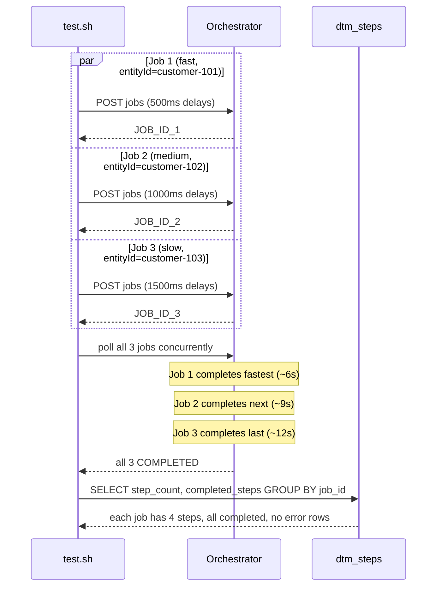

# SE-05: concurrent jobs

## Setpoint Eval Metadata

**Category**: scalability · **Duration**: ~12s (per test.sh's own banner — 3 jobs finishing at ~6s/~9s/~12s in parallel) · **Timeout**: 125s · **Isolation**: destructive

## Scenario
```gherkin
Feature: Ada's Beans Cafe order processing runs multiple jobs concurrently
  Scenario: 3 jobs at different speeds complete in parallel without cross-contamination
    Given order-processing is running with customer_id=1 (Ada Lovelace) and order_id=1
    When 3 quick-order jobs are submitted back-to-back with distinct entityIds
      customer-101 (fast, 500ms delays), customer-102 (medium, 1000ms), and
      customer-103 (slow, 1500ms)
    Then all 3 jobs complete independently, each with its own 4 completed steps
    And no step from one job's data leaks into another job's step records
    And wall-clock time is close to the slowest job's duration, not the sum of all 3
      (parallel execution, not serialized)
```

## Architecture


## Test Data
Reads (does not own) order-processing's seeded rows — `customer_id=1` (Ada Lovelace)
and `order_id=1`, owned by workflow suite `SE-01-happy-path`
(`workflows/order-processing/source-db/SEED-REGISTRY.md`) — reused by all 3 jobs;
isolation is proven by distinct `job_id`s and `entityId`s, not distinct customer rows.

## Payload
Three jobs, same shape, different delay tiers and `entityId`:
```json
{
  "variant": "quick-order",
  "payload": {
    "customerId": 1,
    "orderId": 1,
    "entityId": "customer-101"
  },
  "enableDeduplication": false,
  "testOptions": {
    "ValidateCustomer": { "simDelay": 500 },
    "ValidateProduct": { "simDelay": 500 },
    "SubmitCustomer": { "simDelay": 500, "ackDelay": 200 },
    "SubmitOrder": { "simDelay": 500, "ackDelay": 200 }
  }
}
```
Job 2 uses `entityId: "customer-102"` with all delays at `1000`/`200`; Job 3 uses
`entityId: "customer-103"` with all delays at `1500`/`200`. All 3 POST to
`${ORCHESTRATOR_URL}/workflows/order-processing/jobs` via `initiate_job()`.

## Artifacts

### Expected output (per-job step counts, excerpt from test.sh's own query)
```
job_id       | step_count | completed_steps
<JOB_ID_1>   | 4          | 4
<JOB_ID_2>   | 4          | 4
<JOB_ID_3>   | 4          | 4
```

## Assertions
<!-- one checkbox per exit-1 gate in test.sh, in execution order -->
- [ ] all 3 jobs reach `completed` status (none `failed`) within the polling window
- [ ] every job has `step_count >= 4` and `step_count == completed_steps`
      (no partially-finished job)
- [ ] each job's `result.totalRecords`/`result.stepsCompleted` fall within the
      expected quick-order range (2-4 records, 4-6 steps)
- [ ] zero `dtm_steps` rows across all 3 jobs have `status != completed` or a
      non-null `error` (no cross-contamination)

The measured parallel speedup (wall time vs sum of individual durations) is
printed but only `log_warning`s if below 1.5x — not a gating assertion.

## Run
```bash
bash setpoint-evals/run-all.sh --se 05
```

## Troubleshooting

**Jobs complete sequentially, not in parallel** — check Lambda concurrency limits
or an SQS poller bottleneck.

**Data from one job appears in another** — a critical bug; check `job_id`
isolation in step-creation/output-handling code paths.

**Acknowledgements go to the wrong step** — verify `stepId` is correctly embedded
in the Kafka event payload.

Resource check during a run: `docker stats dtm-orchestrator dtm-localstack dtm-db --no-stream`.
Queue depth: `./scripts/local-env.sh monitor sqs`.

Related: [`docs/guides/system-architecture.md`](../../docs/guides/system-architecture.md),
[`docs/guides/FEATURES.md`](../../docs/guides/FEATURES.md).
