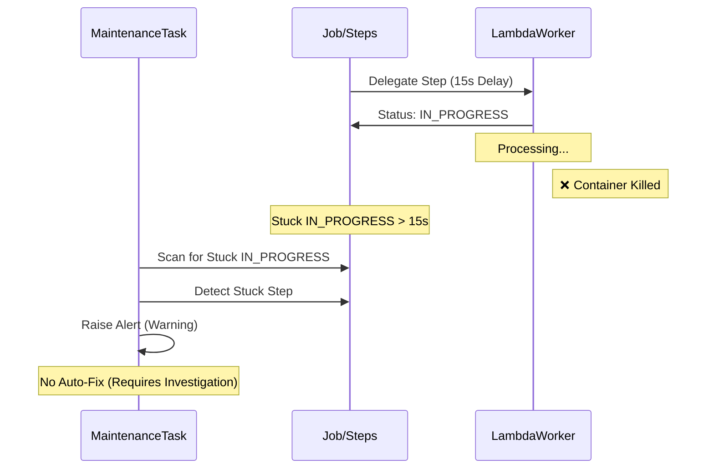

# Eval 13: Stuck In-Progress Detection

## Setpoint Eval Metadata

**Timeout**: 120s
**Isolation**: destructive
**Category**: maintenance

## 🎯 Purpose

### 🌊 Flow Diagram



Tests the **StuckInProgressTask** maintenance task, which detects job steps stuck in `IN_PROGRESS` state due to Lambda crashes or timeouts.

## 📋 Scenario

1. **start job with long delay (12s) on ValidateCustomer
2. **Lambda Starts**: ValidateCustomer enters `IN_PROGRESS` or `IN_PROGRESS_RETRYING` state
3. **Kill Lambda**: Find and kill the Lambda Docker container mid-execution
4. **Stuck Detection**: Step remains stuck in `IN_PROGRESS`
5. **Alert Generation**: Maintenance task detects stuck step and raises alerts
6. **Verification**: Confirm alerts were generated (NO auto-fix)

## 🔍 What This Tests

### Primary Focus

- **StuckInProgressTask** execution and detection logic
- Alert generation for stuck Lambda workers
- Ability to detect crashed/timed-out Lambda functions

### Edge Cases

- Lambda container killed mid-execution (simulates crash)
- Long-running Lambdas (12s delay allows reliable container killing within safe limit)
- Alert-only behavior (no auto-fix, unlike StuckAcknowledgementTask)

### Infrastructure Self-Healing

This test kills Lambda **container instances** (not function definitions) to simulate crashes:

**What Gets Killed**:
- One running Docker container for `validate-customer` Lambda
- **NOT** the Lambda function definition in LocalStack
- **NOT** the Event Source Mappings (ESM mode) or SQS Pollers (Poller mode)

**Automatic Recovery**:
1. Lambda function definition remains in LocalStack
2. ESM/Poller continues to monitor the queue
3. On next message, LocalStack automatically spins up a new container
4. **No manual restoration needed** - infrastructure self-heals

**Why No Restoration**:
- Killing a container ≠ deleting the function
- LocalStack handles container lifecycle automatically
- Restoration would require full Lambda redeployment (~3-5 minutes)
- Self-healing happens instantly on next invocation

**Analogy**: Like killing a process on your laptop - the program is still installed, you just start a new process when needed.

## 📊 Test Data

- **Variant**: `quick-order`
- **customerId / orderId**: `1` / `1`
- **Source**: `workflows/order-processing/source-db/init-scripts/01-schema-and-seed.sql`

## ⏱️ Expected Duration

- **Normal**: ~60-90 seconds
  - Job start: ~2s
  - Lambda enters IN_PROGRESS: ~5s
  - Find and kill container: ~2s
  - Stuck timeout: 15s
  - Maintenance task: ~5s
  - Worker redeployment: ~30s

## ✅ Success Criteria

1. ✅ Job starts successfully
2. ✅ ValidateCustomer reaches `IN_PROGRESS`
3. ✅ Lambda container found and killed
4. ✅ Maintenance task executes successfully
5. ✅ If stuck step detected: alerts raised
6. ⚠️ **Lenient**: If no stuck step (Lambda completed too fast), test still passes

## 🔧 Configuration

### Environment Variables

```bash
MAINTENANCE_STUCK_IN_PROGRESS_TIMEOUT_MINUTES=30  # Default: 30 minutes
```

### Test Overrides

- **Delay**: 15 seconds (gives enough time to kill Lambda)
- **Timeout**: 15 seconds (instead of 30 minutes for faster testing)
- **Manual Trigger**: Task is manually triggered via API

## 🚀 Running

```bash
# Standalone
./setpoint-evals/SE-06-stuck-in-progress-detection/test.sh

# Via runner
./setpoint-evals/run-all.sh --in-band
```

## 🏗️ Architecture

```
┌─────────────────────────────────────────────────────────────┐
│ STEP 1: Normal Job Flow                                      │
├─────────────────────────────────────────────────────────────┤
│                                                              │
│  [Orchestrator] ──> Delegates ValidateCustomer to Lambda    │
│                                                              │
│  [Lambda Container]                                          │
│       │                                                      │
│       ├─> Starts processing                                 │
│       ├─> Updates step status: IN_PROGRESS                  │
│       └─> Sleeps for 15 seconds...                          │
│                                                              │
└─────────────────────────────────────────────────────────────┘

┌─────────────────────────────────────────────────────────────┐
│ STEP 2: Kill Lambda Container                               │
├─────────────────────────────────────────────────────────────┤
│                                                              │
│  Test script:                                                │
│    1. Wait for step to be IN_PROGRESS (3s)                  │
│    2. Find Lambda container (docker ps | grep validate...)  │
│    3. docker kill <container_id>                            │
│                                                              │
│  Result:                                                     │
│    • Lambda killed mid-execution                            │
│    • Step remains: IN_PROGRESS (no completion callback)     │
│    • No error reported (Lambda died unexpectedly)           │
│                                                              │
└─────────────────────────────────────────────────────────────┘

┌─────────────────────────────────────────────────────────────┐
│ STEP 3: Maintenance Task Detects & Alerts                   │
├─────────────────────────────────────────────────────────────┤
│                                                              │
│  [StuckInProgressTask]                                       │
│       │                                                      │
│       ├─> Detect: ValidateCustomer stuck >15s               │
│       ├─> Severity: WARNING (could be long-running)         │
│       └─> Raise Alert: "Step stuck in IN_PROGRESS"          │
│                                                              │
│  Result:                                                     │
│    • Alert generated                                         │
│    • NO AUTO-FIX (ops team investigates)                    │
│    • Step remains: IN_PROGRESS                              │
│                                                              │
└─────────────────────────────────────────────────────────────┘
```

## 📝 Notes

### Why No Auto-Fix?

Unlike `StuckAcknowledgementTask`, this task does **NOT** auto-fix stuck steps because:

1. **Legitimate Long-Running jobs might genuinely take 20+ minutes
2. **Risk of False Positives**: Auto-failing could kill valid work
3. **Investigation Needed**: Ops team should determine if it's stuck or just slow

### Why 12s Delay?

**Lambda Timeout Constraint**: The Lambda workers have a 15s timeout with a 2s processing buffer, making the maximum safe simulated delay **13000ms (13s)**. We use 12s to stay safely within this limit.

Without a long delay:

- ❌ Lambda completes in 50-100ms
- ❌ Container kill takes ~500ms
- ❌ Lambda already finished by the time we kill
- ❌ Test becomes fragile and timing-dependent
- ❌ May miss IN_PROGRESS state with 2s polling interval

With 12s delay:

- ✅ Lambda runs for 12 seconds (within 13s safe limit)
- ✅ Enough time to find and kill container
- ✅ Reliable, repeatable test
- ✅ Validates worker delay safety checks work correctly

### Why Accept IN_PROGRESS_RETRYING?

The test accepts both `IN_PROGRESS` and `IN_PROGRESS_RETRYING` because:

- SQS may retry the message if the Lambda crashes
- The step transitions to `IN_PROGRESS_RETRYING` on retry
- Both states indicate the Lambda is actively processing
- Both are valid targets for the stuck detection task

### Lenient Validation

The test has lenient validation because:

1. **Lambda Speed**: Even with 12s delay, Lambda might complete before kill
2. **SQS Retry**: LocalStack might immediately retry after crash
3. **Race Conditions**: Container kill vs. Lambda completion

**What's Important**:

- ✅ Can find and kill Lambda containers
- ✅ Maintenance task executes without errors
- ✅ Alert mechanism works when detection occurs

## 🐛 Troubleshooting

### Test Fails: "Could not find Lambda container"

- **Cause**: Workers deployed in ESM mode, or Lambda already finished
- **Solutions**:
  1. Check if using ESM mode: `docker ps | grep lambda`
  2. Delay is already at max safe limit (12s); ensure Lambda isn't completing too fast
  3. Check LocalStack logs: `docker logs dtm-localstack`

### Test Fails: "ValidateCustomer did not enter IN_PROGRESS"

- **Cause**: Lambda failed to start, or delegation failed
- **Solutions**:
  1. Check workers deployed: `./scripts/local-env.sh deploy-workers --poller`
  2. Check orchestrator logs for delegation errors
  3. Verify SQS queues exist: `./scripts/local-env.sh monitor sqs`

### Warning: "No stuck steps detected"

- **Not a failure**: This is acceptable (Lambda completed before kill)
- **Validation**: Test still passes (mechanism works, even if race lost)

## 🔗 Related

- **Maintenance Task**: `services/orchestrator/src/maintenance/tasks/stuck-in-progress.task.ts`
- **API Endpoint**: `POST /maintenance/tasks/stuck-in-progress/execute`
- **Cron Schedule**: Every 10 minutes
- **Similar Evals**:
  - Eval 11 (stuck-ack-recovery) - Tests stuck acks (with auto-fix)
  - Eval 02 (transient-failure-recovery) - Uses similar delay technique
  - Eval 08 (partial-step-failure) - Tests graceful Lambda failures
