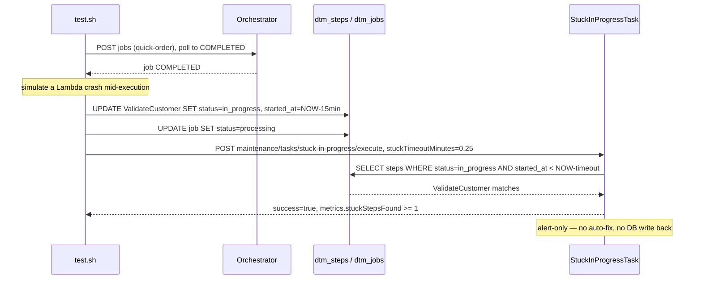

# SE-06: stuck in-progress detection

## Setpoint Eval Metadata

**Category**: maintenance · **Duration**: ~30s (per test.sh's own banner) · **Timeout**: 120s · **Isolation**: destructive

## Scenario
```gherkin
Feature: the stuck-in-progress maintenance task alerts on hung steps (alert-only)
  Scenario: a step manually stuck in IN_PROGRESS is detected but not auto-fixed
    Given order-processing is running with customer_id=1 (Ada Lovelace) and order_id=1
    And a quick-order job has already completed successfully
    When ValidateCustomer is manually set back to in_progress with started_at
      15 minutes in the past (simulating a Lambda crash mid-execution)
    And the stuck-in-progress maintenance task is triggered with stuckTimeoutMinutes=0.25
    Then the task finds at least 1 stuck step
    But it does NOT auto-fix it — this task is alert-only by design
```

## Architecture


## Test Data
Reads (does not own) order-processing's seeded rows — `customer_id=1` (Ada Lovelace)
and `order_id=1`, owned by workflow suite `SE-01-happy-path`
(`workflows/order-processing/source-db/SEED-REGISTRY.md`). `entityId` is a fresh
`uuidgen` per run.

## Payload

### Job payload
```json
{
  "variant": "quick-order",
  "payload": {
    "customerId": 1,
    "orderId": 1,
    "entityId": "<uuidgen per run>"
  },
  "enableDeduplication": false,
  "testOptions": {
    "ValidateCustomer": { "simDelay": 500 },
    "ValidateProduct": { "simDelay": 500 },
    "SubmitCustomer": { "simDelay": 500, "ackDelay": 500 },
    "SubmitOrder": { "simDelay": 500, "ackDelay": 500 }
  }
}
```

### Maintenance task invocation
```bash
curl -X POST -H "Content-Type: application/json" \
  -d '{"stuckTimeoutMinutes": 0.25}' \
  "${ORCHESTRATOR_HOST}/api/${API_VERSION}/maintenance/tasks/stuck-in-progress/execute"
```

## Artifacts

### Expected output (task response, excerpt)
```json
{ "success": true, "metrics": { "stuckStepsFound": 1 } }
```

## Assertions
<!-- one checkbox per exit-1 gate in test.sh, in execution order -->
- [ ] the job completes successfully before manipulation (sanity — not a stuck-detection assertion)
- [ ] the DB manipulation actually lands: `ValidateCustomer.status = in_progress`
- [ ] `POST .../stuck-in-progress/execute` returns `success = true`
- [ ] `metrics.stuckStepsFound >= 1` (the manually-stuck step was detected)

## Run
```bash
bash setpoint-evals/run-all.sh --se 06
```

## Troubleshooting

**"No stuck steps detected"** — verify the DB manipulation step actually
committed: `SELECT status, started_at FROM dtm_steps WHERE id = '<TARGET_STEP_ID>'`.
If `started_at` isn't 15 minutes in the past, the maintenance task's threshold
filter won't match it.

**Task returns `success: false`** — check `docker logs dtm-orchestrator` for the
maintenance-task execution error.

This task is **alert-only, no auto-fix** — pairs with SE-13 (same underlying
detection, but with `autoFailEnabled: true`) and SE-01 (uses the same DB-age
technique for a different purpose — simulating retry-eligible transient failure).

Related: `services/orchestrator/src/maintenance/tasks/stuck-in-progress.task.ts`
(task implementation), `POST /maintenance/tasks/stuck-in-progress/execute` (API),
cron schedule: every 10 minutes in production.
