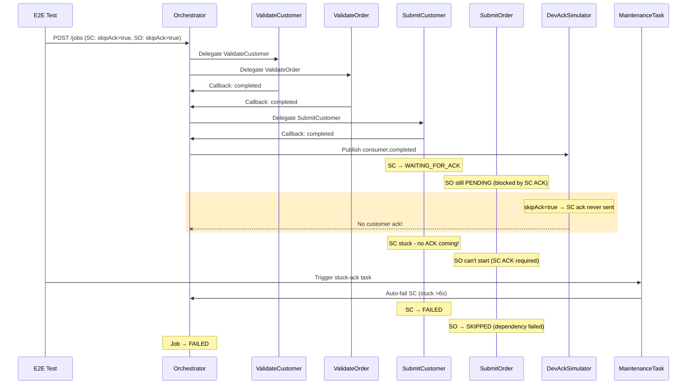

# Eval 12: Stuck Acknowledgement Recovery

## Setpoint Eval Metadata

**Timeout**: 95s
**Isolation**: destructive
**Category**: maintenance

> ✅ **NON-DESTRUCTIVE TEST**: This eval uses `testOptions.SubmitCustomer.skipAck` to simulate stuck acknowledgements without killing any services.

## Purpose

Tests the **StuckAcknowledgementTask** maintenance task, which automatically fails workflow steps that are stuck waiting for external acknowledgements.

## ⚠️ Architecture Note: Why Single Step Only

Due to the **cascade dependency architecture**, SubmitOrder cannot reach `WAITING_FOR_ACK` until SubmitCustomer has received its ACK:

```
SubmitCustomer → publishes to Kafka → WAITING_FOR_ACK → receives ACK → COMPLETED
                                                                              │
                                                                              ▼
                              SubmitOrder is NOW delegated ──────────────►
```

**This means:**

- SubmitCustomer must receive its ACK before SubmitOrder even starts
- It's **impossible** for both steps to be in `WAITING_FOR_ACK` simultaneously
- We can only test a **single step** (SubmitCustomer) getting stuck

This is correct cascade architecture behavior, not a test limitation.

## Flow Diagram



## Scenario

1. **start job with `SubmitCustomer.skipAck: true`
2. **Submit Phase**: Validates complete, SubmitCustomer runs
3. **SC Waits for ACK**: SubmitCustomer publishes to Kafka → `WAITING_FOR_ACK`
4. **ACK Never Arrives**: `skipAck=true` tells simulator to skip the acknowledgement
5. **SC Stuck**: SubmitCustomer remains in `WAITING_FOR_ACK` indefinitely
6. **SO Blocked**: SubmitOrder still `PENDING` (waiting for SC ACK)
7. **Auto-Fail**: Maintenance task detects stuck SC, auto-fails it
8. **Cascade Skip**: SubmitOrder marked as `SKIPPED` (dependency failed)
9. **Job Failed**: Overall job marked as `FAILED`

## What This Tests

- **StuckAcknowledgementTask** execution and detection logic
- Auto-fail mechanism for stuck acknowledgements
- Cascade dependency handling (SO skipped when SC fails)
- Correct job state transition after auto-fail
- Single stuck step recovery

## Test Data

| Field         | Value        | Notes                                               |
| ------------- | ------------ | ---------------------------------------------------- |
| Variant       | `quick-order`| customerId 1 / orderId 1                            |
| SC skipAck    | true         | **ACK will never be sent**                          |
| SO skipAck    | true         | Also skipped (but SO never reaches waiting_for_ack) |

## Expected Duration

~20-30 seconds

## Success Criteria

1. ✅ Job starts successfully
2. ✅ SubmitCustomer reaches `WAITING_FOR_ACK`
3. ✅ ACK never arrives (skipAck=true)
4. ✅ Maintenance task finds ≥1 stuck step
5. ✅ SubmitCustomer is marked as `failed`
6. ✅ SubmitOrder is `skipped` (or `pending`)
7. ✅ Job is marked as `failed`

## Configuration

```json
{
  "testOptions": {
    "enableDeduplication": false,
    "ValidateCustomer": { "simDelay": 500 },
    "ValidateOrder": { "simDelay": 500 },
    "SubmitCustomer": { "simDelay": 500, "skipAck": true },
    "SubmitOrder": { "simDelay": 500, "skipAck": true }
  }
}
```

## Running

```bash
# Standalone
./setpoint-evals/SE-07-stuck-ack-recovery/test.sh

# Via runner
./setpoint-evals/run-all.sh
```

## How skipAck Works

The `SubmitCustomer.skipAck: true` option tells the `dev-ack-simulator` to **never send** the acknowledgement:

```
Dev-Ack-Simulator logs:
🚫 [DEV] Skipping consumer acknowledgement for step xxx (SubmitCustomer.skipAck=true)
   Step will remain in WAITING_FOR_ACK state for testing stuck ack recovery
```

**Benefits over killing the simulator:**

- No Kafka consumer group corruption
- No complex cleanup required
- No risk of affecting subsequent tests
- Faster test execution (~20s vs ~60s)

## Architecture

```
┌─────────────────────────────────────────────────────────────┐
│ STEP 1: Normal Job Flow                                      │
├─────────────────────────────────────────────────────────────┤
│                                                              │
│  [Orchestrator]                                              │
│       │                                                      │
│       ├─> ValidateCustomer ──────────> completed              │
│       ├─> ValidateOrder ────────> completed              │
│       └─> SubmitCustomer ────────> WAITING_FOR_ACK        │
│                                                              │
│  SubmitOrder is PENDING (waiting for SC ACK)         │
│                                                              │
└─────────────────────────────────────────────────────────────┘

┌─────────────────────────────────────────────────────────────┐
│ STEP 2: skipAck=true (ACK never sent)                       │
├─────────────────────────────────────────────────────────────┤
│                                                              │
│  [dev-ack-simulator]                                         │
│       │                                                      │
│       └─> 🚫 Skipping ACK (SubmitCustomer.skipAck=true)   │
│                                                              │
│  SC is stuck:                                                │
│    • SubmitCustomer: WAITING_FOR_ACK ❌ (no ack coming)  │
│                                                              │
│  SO is blocked:                                              │
│    • SubmitOrder: PENDING (cascade blocked)         │
│                                                              │
└─────────────────────────────────────────────────────────────┘

┌─────────────────────────────────────────────────────────────┐
│ STEP 3: Maintenance Task Auto-Fails TC                      │
├─────────────────────────────────────────────────────────────┤
│                                                              │
│  [StuckAcknowledgementTask]                                  │
│       │                                                      │
│       ├─> Detect: SubmitCustomer stuck >6s               │
│       ├─> Auto-fail: SubmitCustomer → failed             │
│       │                                                      │
│       └─> Trigger: Orchestration continues                  │
│                                                              │
│  [Orchestrator]                                              │
│       │                                                      │
│       └─> Skip: SubmitOrder → skipped               │
│           (dependency SC failed)                             │
│                                                              │
│  Result:                                                     │
│    • SubmitCustomer: failed ❌                            │
│    • SubmitOrder: skipped ⏭️                         │
│    • Job: failed ❌                                          │
│                                                              │
└─────────────────────────────────────────────────────────────┘
```

## Why Single Step Only?

**Previous Test Design (with killing simulator):**

```
Wait for BOTH SubmitCustomer AND SubmitOrder → WAITING_FOR_ACK
```

**Why It's Impossible:**

```
SubmitOrder depends on SubmitCustomer ACK!

Timeline:
├─ SC completes → publishes → WAITING_FOR_ACK
├─ [SC waits for ACK...]
├─ SC receives ACK → COMPLETED
├─ NOW SO can be delegated
├─ SO completes → publishes → WAITING_FOR_ACK
└─ [SO waits for ACK...]

They can NEVER be in WAITING_FOR_ACK at the same time!
```

**Current Test Design (CORRECT):**

```
SC: skipAck=true → stays in WAITING_FOR_ACK forever
SO: never gets delegated → stays PENDING
Maintenance task: auto-fails SC
Cascade: SO is skipped
```

## Why This Matters

In production, if the external system is down or Kafka has issues, jobs can hang indefinitely waiting for acknowledgements. This maintenance task provides automatic recovery by:

1. Detecting steps stuck in `WAITING_FOR_ACK` state longer than the timeout
2. Auto-failing those steps with an appropriate error message
3. Triggering orchestration to skip dependent steps and fail the job

---

## Related

- **Eval 11 (partial-ack-failure)**: Tests partial ack stuck (SC acked, SO stuck)
- **Eval 09 (acknowledgement-delays)**: Tests normal ack delays
- **Eval 13 (stuck-in-progress-detection)**: Tests stuck workers (not acks)
- **Maintenance Task**: `services/orchestrator/src/maintenance/tasks/stuck-acknowledgement.task.ts`

## Troubleshooting

### Test Fails: "SubmitCustomer did not reach WAITING_FOR_ACK"

- **Cause**: Submit steps failed or never started
- **Solution**: Check orchestrator logs, verify workers are deployed

### Test Fails: "SubmitCustomer already completed"

- **Cause**: skipAck not working, or stale messages being processed
- **Solution**:
  - Check dev-ack-simulator logs for "🚫 Skipping" message
  - Run full purge: `./scripts/local-env.sh purge --full`

### Test Fails: "Expected at least 1 stuck step, found: 0"

- **Cause**: Step not in `waiting_for_ack` long enough
- **Solution**: Test waits 15s before triggering maintenance task with 6s threshold, should be sufficient

---

## Notes

- This eval is **non-destructive** (no services killed)
- Runs sequentially in Phase 2 because maintenance tasks scan ALL steps globally
- The `skipAck` feature eliminates Kafka consumer group corruption issues
