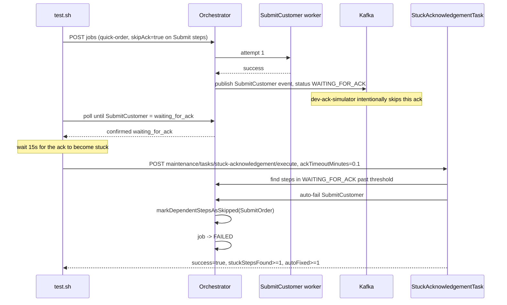

# SE-07: stuck ack recovery

## Setpoint Eval Metadata

**Category**: maintenance · **Duration**: ~30-45s (per test.sh's own banner) · **Timeout**: 95s · **Isolation**: destructive

## Scenario
```gherkin
Feature: the stuck-acknowledgement maintenance task auto-fails hung acks
  Scenario: SubmitCustomer's ack never arrives (skipAck) and is auto-failed
    Given order-processing is running with customer_id=1 (Ada Lovelace) and order_id=1
    When a quick-order job is submitted with SubmitCustomer and SubmitOrder both
      configured with skipAck=true (the dev-ack-simulator will never send an ack)
    Then SubmitCustomer reaches WAITING_FOR_ACK and stays there
    And SubmitOrder can never reach WAITING_FOR_ACK itself — it depends on
      SubmitCustomer's ack (cascade architecture), so only SubmitCustomer is
      testable as "stuck"
    When the stuck-acknowledgement maintenance task is triggered with a 6s threshold
    Then SubmitCustomer is auto-failed, SubmitOrder is skipped (cascade), and the
      job reaches FAILED
```

## Architecture


## Test Data
Reads (does not own) order-processing's seeded rows — `customer_id=1` (Ada Lovelace)
and `order_id=1`, owned by workflow suite `SE-01-happy-path`
(`workflows/order-processing/source-db/SEED-REGISTRY.md`). `entityId` is a fresh
`uuidgen` per run.

## Payload

### Job payload
```json
{
  "variant": "quick-order",
  "payload": {
    "customerId": 1,
    "orderId": 1,
    "entityId": "<uuidgen per run>"
  },
  "enableDeduplication": false,
  "testOptions": {
    "ValidateCustomer": { "simDelay": 500 },
    "ValidateProduct": { "simDelay": 500 },
    "SubmitCustomer": { "simDelay": 500, "skipAck": true },
    "SubmitOrder": { "simDelay": 500, "skipAck": true }
  }
}
```

### Maintenance task invocation
```bash
curl -X POST -H "Content-Type: application/json" \
  -d '{"ackTimeoutMinutes": 0.1}' \
  "${ORCHESTRATOR_HOST}/api/${API_VERSION}/maintenance/tasks/stuck-acknowledgement/execute"
```

## Artifacts

### Expected output (task response + final step statuses)
```json
{ "success": true, "metrics": { "stuckStepsFound": 1, "autoFixed": 1 } }
```
```
SubmitCustomer = failed    (auto-failed by maintenance task)
SubmitOrder    = skipped   (cascade dependency)
job.status     = failed
```

## Assertions
<!-- one checkbox per exit-1 gate in test.sh, in execution order -->
- [ ] `SubmitCustomer` reaches `waiting_for_ack` (not `completed` — skipAck worked)
- [ ] maintenance task HTTP response is `200`
- [ ] `success = true` in the task response
- [ ] `metrics.stuckStepsFound >= 1`
- [ ] `metrics.autoFixed >= 1`
- [ ] `SubmitCustomer` final status is `failed`
- [ ] `SubmitOrder` final status is `skipped` or `pending`
- [ ] job overall status is `failed`

## Run
```bash
bash setpoint-evals/run-all.sh --se 07
```

## Troubleshooting

**"SubmitCustomer did not reach WAITING_FOR_ACK"** — check orchestrator logs and
that workers are deployed.

**"SubmitCustomer already completed"** — `skipAck` isn't working, or stale
messages are being processed; check dev-ack-simulator logs for a "skipping" line,
or run a full purge: `./scripts/local-env.sh purge --full`.

**"Expected at least 1 stuck step, found: 0"** — the step wasn't in
`waiting_for_ack` long enough before the maintenance task ran; the test already
waits 15s against a 6s threshold, which should be sufficient margin.

This eval is **non-destructive** (no services killed) despite its `destructive`
isolation tag — it runs sequentially because the maintenance task scans ALL
steps globally, which would race with unrelated concurrently-running SEs.
`skipAck` avoids the older approach of killing the dev-ack-simulator, which used
to corrupt Kafka consumer groups for the rest of the suite.
