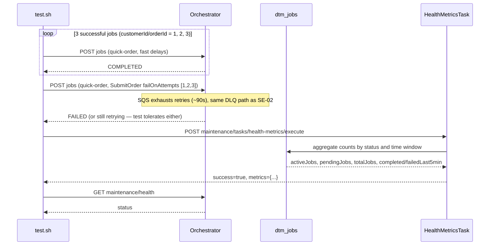

# SE-08: health metrics

## Setpoint Eval Metadata

**Category**: maintenance · **Duration**: ~60-120s (includes SQS retry delays, per test.sh's own banner) · **Timeout**: 150s · **Isolation**: destructive

## Scenario
```gherkin
Feature: the health-metrics maintenance task reports operational counters
  Scenario: 3 successful jobs and 1 permanently-failed job are reflected in metrics
    Given order-processing is running with customers 1, 2, 3 (Ada Lovelace,
      Grace Hopper, Alan Turing) and orders 1, 2, 3
    When 3 quick-order jobs complete successfully
    And 1 quick-order job is submitted with SubmitOrder failing on every attempt
      (exhausting retries, same DLQ mechanism as SE-02)
    And the health-metrics maintenance task is triggered
    Then the metrics response reports totalJobs >= 4 and carries every expected
      field (activeJobs, pendingJobs, totalJobs, jobsCompletedLast5min,
      jobsFailedLast5min)
```

## Architecture


## Test Data
Reads (does not own) order-processing's seeded rows — `customer_id`/`order_id`
1, 2, 3 (Ada Lovelace, Grace Hopper, Alan Turing), per
`workflows/order-processing/source-db/SEED-REGISTRY.md` general demo-fill rows
(customer/order 1 also owned by `SE-01-happy-path`; 2 and 3 are unowned fill
rows, free to read). This SE intentionally does NOT purge the database first —
its metrics assertions use `>=` comparisons so accumulated history from other
runs doesn't break it.

## Payload

### Successful job payload (repeated for i = 1, 2, 3)
```json
{
  "variant": "quick-order",
  "payload": {
    "customerId": "<from helpers, loop index i>",
    "orderId": "<from helpers, loop index i>",
    "entityId": "<uuidgen per run>"
  },
  "enableDeduplication": false,
  "testOptions": {
    "ValidateCustomer": { "simDelay": 500 },
    "ValidateProduct": { "simDelay": 500 },
    "SubmitCustomer": { "simDelay": 500, "ackDelay": 500 },
    "SubmitOrder": { "simDelay": 500, "ackDelay": 500 }
  }
}
```

### Failed job payload
```json
{
  "variant": "quick-order",
  "payload": {
    "customerId": 1,
    "orderId": 1,
    "entityId": "<uuidgen per run>"
  },
  "enableDeduplication": false,
  "testOptions": {
    "ValidateCustomer": { "simDelay": 500 },
    "ValidateProduct": { "simDelay": 500 },
    "SubmitCustomer": { "simDelay": 500 },
    "SubmitOrder": { "simDelay": 500, "failOnAttempts": [1, 2, 3] }
  }
}
```

### Maintenance task invocation
```bash
curl -X POST "${ORCHESTRATOR_HOST}/api/${API_VERSION}/maintenance/tasks/health-metrics/execute"
```

## Artifacts

### Expected output (task response, excerpt)
```json
{
  "success": true,
  "metrics": {
    "activeJobs": 0, "pendingJobs": 0, "totalJobs": 4,
    "jobsCompletedLast5min": 3, "jobsFailedLast5min": 1
  }
}
```

## Assertions
<!-- one checkbox per exit-1 gate in test.sh, in execution order -->
- [ ] `POST .../health-metrics/execute` returns `success = true`
- [ ] `metrics.totalJobs >= 4` (3 completed + 1 failed job created this run)
- [ ] every expected field is present in `metrics`: `activeJobs`, `pendingJobs`,
      `totalJobs`, `jobsCompletedLast5min`, `jobsFailedLast5min`

Two checks are `log_warning`-only (no `exit 1`): the failed job's terminal status
being exactly `failed` (DLQ routing is async, may not have landed yet), and
`jobsCompletedLast5min >= 1` (non-critical if jobs took longer than 5 minutes).
`GET maintenance/health` is also checked but only warns if not `healthy`.

## Run
```bash
bash setpoint-evals/run-all.sh --se 08
```

## Troubleshooting

**"Expected at least 4 total jobs"** — check orchestrator logs and
`docker exec dtm-db psql -U dtm_user -d dtm -c "SELECT COUNT(*) FROM dtm_jobs;"`;
ensure workers are deployed (`./scripts/local-env.sh deploy-workers`).

**"Missing expected metric fields"** — `HealthMetricsTask`'s output shape
changed; check `services/orchestrator/src/maintenance/tasks/health-metrics.task.ts`
against the `EXPECTED_FIELDS` list in `test.sh`.

Related: `services/orchestrator/src/maintenance/tasks/health-metrics.task.ts`,
`GET /api/v1/maintenance/health`. These metrics feed monitoring dashboards,
alerting, SLO/SLA tracking, and capacity planning.
