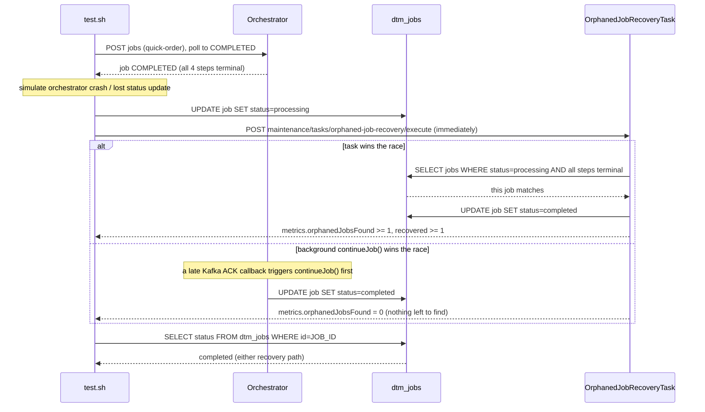

# SE-09: orphaned job recovery

## Setpoint Eval Metadata

**Category**: maintenance · **Duration**: ~15s (per test.sh's own banner) · **Timeout**: 95s · **Isolation**: destructive

## Scenario
```gherkin
Feature: the orphaned-job-recovery maintenance task fixes zombie PROCESSING jobs
  Scenario: a job manually reset to PROCESSING despite all steps being terminal
    Given order-processing is running with customer_id=1 (Ada Lovelace) and order_id=1
    And a quick-order job has already completed successfully (all 4 steps terminal)
    When the job's status is manually reset to PROCESSING (simulating an
      orchestrator crash or a lost status-update transaction)
    And the orphaned-job-recovery maintenance task is triggered immediately
    Then either the task finds and recovers the orphan directly, OR the
      background continueJob() callback path already self-healed it first
      (both are valid recovery mechanisms)
    And the job's final status is COMPLETED either way
```

## Architecture


## Test Data
Reads (does not own) order-processing's seeded rows — `customer_id=1` (Ada Lovelace)
and `order_id=1`, owned by workflow suite `SE-01-happy-path`
(`workflows/order-processing/source-db/SEED-REGISTRY.md`). `entityId` is a fresh
`uuidgen` per run.

## Payload

### Job payload
```json
{
  "variant": "quick-order",
  "payload": {
    "customerId": 1,
    "orderId": 1,
    "entityId": "<uuidgen per run>"
  },
  "enableDeduplication": false,
  "testOptions": {
    "ValidateCustomer": { "simDelay": 300 },
    "ValidateProduct": { "simDelay": 300 },
    "SubmitCustomer": { "simDelay": 300, "ackDelay": 300 },
    "SubmitOrder": { "simDelay": 300, "ackDelay": 300 }
  }
}
```

### Maintenance task invocation
```bash
curl -X POST "${ORCHESTRATOR_HOST}/api/${API_VERSION}/maintenance/tasks/orphaned-job-recovery/execute"
```

## Artifacts

### Expected output (task response, either race outcome)
```json
{ "success": true, "metrics": { "orphanedJobsFound": 1, "recovered": 1 } }
```
or, if background orchestration won the race:
```json
{ "success": true, "metrics": { "orphanedJobsFound": 0, "recovered": 0 } }
```

## Assertions
<!-- one checkbox per exit-1 gate in test.sh, in execution order -->
- [ ] `POST .../orphaned-job-recovery/execute` returns `success = true`
- [ ] either `metrics.orphanedJobsFound >= 1` (task recovered it directly), OR
      `metrics.orphanedJobsFound == 0` AND the job's DB status is already
      `completed` (background `continueJob()` self-healed it first)
- [ ] final job status is `completed` (recovered via either path)

## Run
```bash
bash setpoint-evals/run-all.sh --se 09
```

## Troubleshooting

**"Failed to create orphaned job"** — the DB UPDATE didn't apply; check
`docker ps | grep dtm-db`.

**"Expected all steps to be terminal, found N non-terminal"** — the job didn't
fully complete before orphaning; increase `MAX_ATTEMPTS` or check for step failures.

**"Expected at least 1 orphaned job, found: 0" AND the job is still `processing`**
(neither recovery path fired) — check `docker logs dtm-orchestrator` for
maintenance-task or orchestration errors; verify DB connectivity.

This eval deliberately races the maintenance task against the system's own
implicit self-healing (a late Kafka ACK triggering `continueJob()`) — both
outcomes are correct; only "neither recovered it" is a real failure.

Related: `services/orchestrator/src/maintenance/tasks/orphaned-job-recovery.task.ts`,
`POST /maintenance/tasks/orphaned-job-recovery/execute`.
