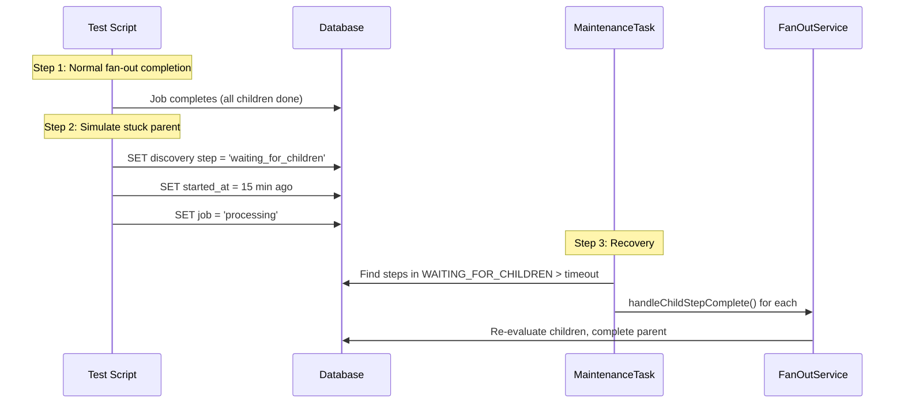

# SE 10: Stuck Waiting-For-Children Recovery

## Setpoint Eval Metadata

**Timeout**: 120s
**Isolation**: parallel-safe
**Category**: maintenance

## Purpose

Tests the **StuckWaitingForChildrenTask** maintenance task, which recovers discovery steps stuck in `WAITING_FOR_CHILDREN` after their fan-out children have already completed.

## Scenario

1. Start a fan-out job (`default` variant, customerId=1, orderId=1)
2. Wait for successful completion
3. Find a discovery step with `child_count > 0` (DiscoverLineItems)
4. Manually set it back to `waiting_for_children` with `started_at` = 15 min ago
5. Set job back to `processing`
6. Trigger maintenance task
7. Verify step recovered to terminal state (completed/partial_success/failed)

## What This Tests

- Detection of stuck discovery parents
- Recovery via `FanOutService.handleChildStepComplete()`
- Correct re-evaluation of child step statuses
- Job completion after parent recovery

## Test Data

- **customerId / orderId**: `1` / `1` (has line items for fan-out)
- **Query filter**: `child_count > 0` ensures we pick a discovery step that actually created children

## Parallel Safety

**Safe** -- uses unique `externalSystemId`, no shared resources.

## Simulates

- Orchestrator crash during fan-out child completion
- Lost signal between child completion and parent update
- Race condition in fan-out aggregation

## Related

- **Task**: `services/orchestrator/src/maintenance/tasks/stuck-waiting-for-children.task.ts`
- **API**: `POST /maintenance/tasks/stuck-waiting-for-children/execute`
- **Fan-Out**: `services/orchestrator/src/orchestration/fan-out.service.ts`
