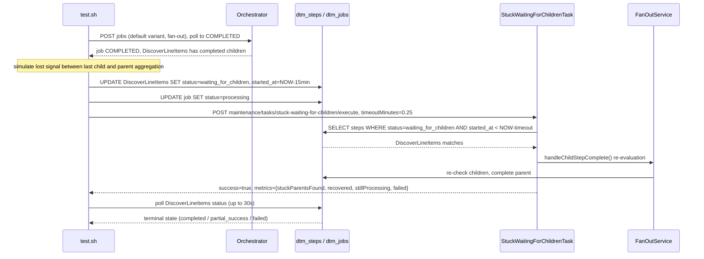

# SE-10: stuck waiting for children recovery

## Setpoint Eval Metadata

**Category**: maintenance · **Duration**: ~30s (per test.sh's own banner) · **Timeout**: 120s · **Isolation**: parallel-safe

## Scenario
```gherkin
Feature: the stuck-waiting-for-children maintenance task recovers hung fan-out parents
  Scenario: a discovery step manually stuck in WAITING_FOR_CHILDREN is recovered
    Given order-processing is running with customer_id=1 (Ada Lovelace) and order_id=1
    And a default-variant (fan-out) job has already completed, creating a
      DiscoverLineItems step with completed children
    When that discovery step is manually set back to waiting_for_children with
      started_at 15 minutes in the past (simulating a lost signal between the
      last child completing and the parent's aggregation)
    And the stuck-waiting-for-children maintenance task is triggered with
      timeoutMinutes=0.25
    Then the discovery step is recovered to a terminal state (completed,
      partial_success, or failed) within 30s of the task running
```

## Architecture


## Test Data
Reads (does not own) order-processing's seeded rows — `customer_id=1` (Ada Lovelace)
and `order_id=1`, owned by workflow suite `SE-01-happy-path`
(`workflows/order-processing/source-db/SEED-REGISTRY.md`); order 1's line items
are what give `DiscoverLineItems` a non-zero `child_count` to fan out over.
`entityId` is a fresh `uuidgen` per run.

## Payload

### Job payload (default variant — fan-out)
```json
{
  "variant": "default",
  "payload": {
    "customerId": 1,
    "orderId": 1,
    "entityId": "<uuidgen per run>"
  },
  "enableDeduplication": false,
  "testOptions": {
    "ValidateCustomer": { "simDelay": 500 },
    "ValidateProduct": { "simDelay": 500 },
    "SubmitCustomer": { "simDelay": 500, "ackDelay": 500 },
    "SubmitOrder": { "simDelay": 500, "ackDelay": 500 },
    "DiscoverLineItems": { "simDelay": 500 },
    "ValidateLineItem": { "simDelay": 500 },
    "SubmitLineItem": { "simDelay": 500, "ackDelay": 500 }
  }
}
```

### Maintenance task invocation
```bash
curl -X POST -H "Content-Type: application/json" \
  -d '{"timeoutMinutes": 0.25}' \
  "${ORCHESTRATOR_HOST}/api/${API_VERSION}/maintenance/tasks/stuck-waiting-for-children/execute"
```

## Artifacts

### Expected output (task response, excerpt)
```json
{ "success": true, "metrics": { "stuckParentsFound": 1, "recovered": 1, "stillProcessing": 0, "failed": 0 } }
```

## Assertions
<!-- one checkbox per exit-1 gate in test.sh, in execution order -->
- [ ] a completed discovery step with `child_count > 0` exists to manipulate
      (if none exists, the SE exits 0 as a vacuous pass — see note below)
- [ ] the DB manipulation lands: `DiscoverLineItems.status = waiting_for_children`
- [ ] `POST .../stuck-waiting-for-children/execute` returns `success = true`
- [ ] within 30s of polling, the discovery step leaves `waiting_for_children`
      (real gate: still `waiting_for_children` after 30s is a hard failure)
- [ ] the recovered state is one of `completed` / `partial_success` / `failed`
      (any other value only warns, does not fail)

## Run
```bash
bash setpoint-evals/run-all.sh --se 10
```

## Note on vacuous pass
If STEP 3 finds no completed discovery step with `child_count > 0` for this job
(e.g. the fan-out produced zero line items), `test.sh` exits 0 and logs
"TEST PASSED (VACUOUS)" without exercising the maintenance task at all. This is
a real gap — a seed change that starved the fan-out would make this SE green
without ever running its actual scenario. Reported, not fixed, per this PR's
scope (`se-must-reproduce-the-failure` concern).

Related: `services/orchestrator/src/maintenance/tasks/stuck-waiting-for-children.task.ts`,
`services/orchestrator/src/orchestration/fan-out.service.ts`,
`POST /maintenance/tasks/stuck-waiting-for-children/execute`.
