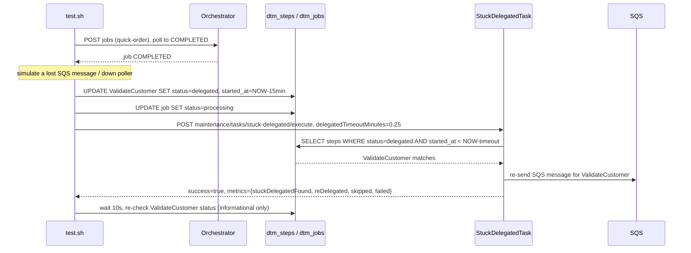

# SE-11: stuck delegated recovery

## Setpoint Eval Metadata

**Category**: maintenance · **Duration**: ~30s (per test.sh's own banner) · **Timeout**: 120s · **Isolation**: parallel-safe

## Scenario
```gherkin
Feature: the stuck-delegated maintenance task re-sends lost SQS messages
  Scenario: a step manually stuck in DELEGATED is re-delegated to SQS
    Given order-processing is running with customer_id=1 (Ada Lovelace) and order_id=1
    And a quick-order job has already completed successfully
    When ValidateCustomer is manually set back to delegated with started_at
      15 minutes in the past (simulating a lost SQS message or a down poller)
    And the stuck-delegated maintenance task is triggered with
      delegatedTimeoutMinutes=0.25
    Then the task reports the step as found and, when it re-delegates, resends
      the SQS message
```

## Architecture


## Test Data
Reads (does not own) order-processing's seeded rows — `customer_id=1` (Ada Lovelace)
and `order_id=1`, owned by workflow suite `SE-01-happy-path`
(`workflows/order-processing/source-db/SEED-REGISTRY.md`). `entityId` is a fresh
`uuidgen` per run.

## Payload

### Job payload
```json
{
  "variant": "quick-order",
  "payload": {
    "customerId": 1,
    "orderId": 1,
    "entityId": "<uuidgen per run>"
  },
  "enableDeduplication": false,
  "testOptions": {
    "ValidateCustomer": { "simDelay": 500 },
    "ValidateProduct": { "simDelay": 500 },
    "SubmitCustomer": { "simDelay": 500, "ackDelay": 500 },
    "SubmitOrder": { "simDelay": 500, "ackDelay": 500 }
  }
}
```

### Maintenance task invocation
```bash
curl -X POST -H "Content-Type: application/json" \
  -d '{"delegatedTimeoutMinutes": 0.25}' \
  "${ORCHESTRATOR_HOST}/api/${API_VERSION}/maintenance/tasks/stuck-delegated/execute"
```

## Artifacts

### Expected output (task response, excerpt)
```json
{ "success": true, "metrics": { "stuckDelegatedFound": 1, "reDelegated": 1, "skipped": 0, "failed": 0 } }
```

## Assertions
<!-- one checkbox per exit-1 gate in test.sh, in execution order -->
- [ ] the DB manipulation lands: `ValidateCustomer.status = delegated`
- [ ] `POST .../stuck-delegated/execute` returns `success = true`

## Note on weak recovery verification
Unlike SE-06 through SE-10, `test.sh`'s "STEP 5: VERIFY RECOVERY" section (the
10s wait + re-check of `ValidateCustomer`'s post-task status) contains **no
`exit 1` anywhere** — every branch (still `delegated` with a refreshed
`started_at`, progressed to `in_progress`/`completed`/`waiting_for_ack`, or even
`failed`) only logs success or a warning. The SE currently passes on
`success = true` from the maintenance-task response alone; it does not actually
verify the step was re-delegated. Reported per this PR's scope
(`se-must-reproduce-the-failure` concern) — not fixed here.

## Run
```bash
bash setpoint-evals/run-all.sh --se 11
```

## Troubleshooting

**"Could not find ValidateCustomer step"** — the prior job didn't complete or
was purged; re-run without `--skip-purge`.

**Step stays `delegated` with an unrefreshed `started_at`** — re-delegation may
not have fired; check `docker logs dtm-orchestrator` for
`stuck-delegated` task execution errors.

Related: `services/orchestrator/src/maintenance/tasks/stuck-delegated.task.ts`,
`POST /maintenance/tasks/stuck-delegated/execute`.
