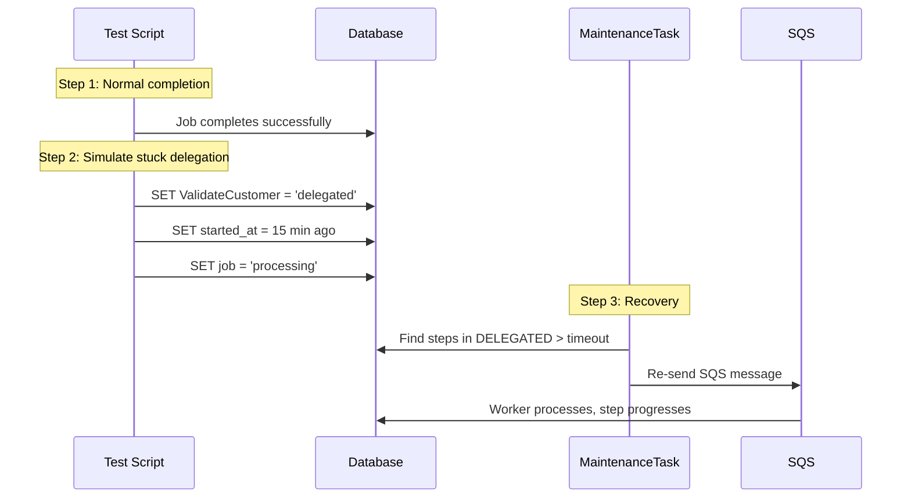

# SE 11: Stuck Delegated Recovery

## Setpoint Eval Metadata

**Timeout**: 120s
**Isolation**: parallel-safe
**Category**: maintenance

## Purpose

Tests the **StuckDelegatedTask** maintenance task, which re-delegates steps stuck in `DELEGATED` status (sent to SQS but never picked up by a worker).

## Scenario

1. Start a batch job (consumer 1001)
2. Wait for successful completion
3. Set ValidateCustomer back to `delegated` with `started_at` = 15 min ago
4. Set job back to `processing`
5. Trigger maintenance task
6. Verify step progressed past `delegated` (re-delegation succeeded)

## What This Tests

- Detection of stuck delegated steps
- Re-delegation to SQS
- Worker successfully processes the re-delegated message
- Step progresses to completion after re-delegation

## Test Data

- **Consumer**: 1001

## Parallel Safety

**Safe** -- uses unique `externalSystemId`, no shared resources.

## Simulates

- Lost SQS messages
- SQS poller downtime during initial delegation
- Lambda deployment failures
- Queue URL misconfigurations

## Related

- **Task**: `services/orchestrator/src/maintenance/tasks/stuck-delegated.task.ts`
- **API**: `POST /maintenance/tasks/stuck-delegated/execute`
