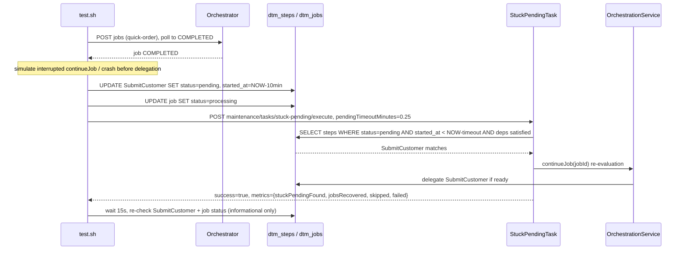

# SE-12: stuck pending recovery

## Setpoint Eval Metadata

**Category**: maintenance · **Duration**: ~30s (per test.sh's own banner) · **Timeout**: 120s · **Isolation**: parallel-safe

## Scenario
```gherkin
Feature: the stuck-pending maintenance task re-evaluates hung PENDING steps
  Scenario: a step manually stuck in PENDING is re-driven through continueJob
    Given order-processing is running with customer_id=1 (Ada Lovelace) and order_id=1
    And a quick-order job has already completed successfully
    When SubmitCustomer is manually set back to pending with started_at
      10 minutes in the past (simulating an orchestrator crash between step
      creation and delegateStep(), or an interrupted continueJob())
    And the stuck-pending maintenance task is triggered with
      pendingTimeoutMinutes=0.25
    Then the task reports the step as found and, when it recovers, re-invokes
      continueJob() to re-evaluate and delegate it
```

## Architecture


## Test Data
Reads (does not own) order-processing's seeded rows — `customer_id=1` (Ada Lovelace)
and `order_id=1`, owned by workflow suite `SE-01-happy-path`
(`workflows/order-processing/source-db/SEED-REGISTRY.md`). `entityId` is a fresh
`uuidgen` per run.

## Payload

### Job payload
```json
{
  "variant": "quick-order",
  "payload": {
    "customerId": 1,
    "orderId": 1,
    "entityId": "<uuidgen per run>"
  },
  "enableDeduplication": false,
  "testOptions": {
    "ValidateCustomer": { "simDelay": 500 },
    "ValidateProduct": { "simDelay": 500 },
    "SubmitCustomer": { "simDelay": 500, "ackDelay": 500 },
    "SubmitOrder": { "simDelay": 500, "ackDelay": 500 }
  }
}
```

### Maintenance task invocation
```bash
curl -X POST -H "Content-Type: application/json" \
  -d '{"pendingTimeoutMinutes": 0.25}' \
  "${ORCHESTRATOR_HOST}/api/${API_VERSION}/maintenance/tasks/stuck-pending/execute"
```

## Artifacts

### Expected output (task response, excerpt)
```json
{ "success": true, "metrics": { "stuckPendingFound": 1, "jobsRecovered": 1, "skipped": 0, "failed": 0 } }
```

## Assertions
<!-- one checkbox per exit-1 gate in test.sh, in execution order -->
- [ ] the DB manipulation lands: `SubmitCustomer.status = pending`
- [ ] `POST .../stuck-pending/execute` returns `success = true`

## Note on weak recovery verification
Like SE-11, `test.sh`'s "STEP 5: VERIFY RECOVERY" section (the 15s wait +
re-check of `SubmitCustomer` and job status, with an extra 15s wait if the job
is still `processing`) contains **no `exit 1` anywhere** — every branch
(step still `pending`, progressed to `delegated`/`in_progress`/`completed`/
`waiting_for_ack`, or even `failed`) only logs success or a warning. The SE
currently passes on `success = true` from the maintenance-task response alone;
it does not verify the job actually recompletes. Reported per this PR's scope
(`se-must-reproduce-the-failure` concern) — not fixed here.

## Run
```bash
bash setpoint-evals/run-all.sh --se 12
```

## Troubleshooting

**"Could not find SubmitCustomer step"** — the prior job didn't complete or
was purged; re-run without `--skip-purge`.

**Step stays `pending`** — dependencies may not read as satisfied from the
manipulated state; check `SELECT step_value, status FROM dtm_steps WHERE
job_id = '<JOB_ID>'` to see if `ValidateCustomer` is genuinely `completed`.

Related: `services/orchestrator/src/maintenance/tasks/stuck-pending.task.ts`,
`POST /maintenance/tasks/stuck-pending/execute`,
`services/orchestrator/src/orchestration/orchestration.service.ts` (`continueJob`).
