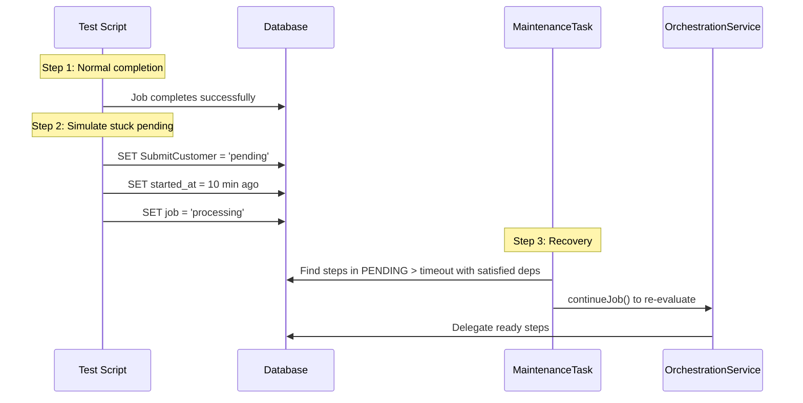

# SE 12: Stuck Pending Recovery

## Setpoint Eval Metadata

**Timeout**: 120s
**Isolation**: parallel-safe
**Category**: maintenance

## Purpose

Tests the **StuckPendingTask** maintenance task, which recovers steps stuck in `PENDING` status despite their dependencies being satisfied.

## Scenario

1. Start a batch job (consumer 1002)
2. Wait for successful completion
3. Set SubmitCustomer back to `pending` with `started_at` = 10 min ago
4. Set job back to `processing`
5. Trigger maintenance task
6. Verify step progressed past `pending` (re-delegation via continueJob)
7. Verify job completes

## What This Tests

- Detection of stuck pending steps with satisfied dependencies
- Recovery via `continueJob()` re-evaluation
- Step correctly delegated after recovery
- Job completion after stuck step recovery

## Test Data

- **Consumer**: 1002

## Parallel Safety

**Safe** -- uses unique `externalSystemId`, no shared resources.

## Simulates

- Orchestrator crash between step creation and delegation
- Interrupted `continueJob()` execution
- Network partition during delegation phase

## Related

- **Task**: `services/orchestrator/src/maintenance/tasks/stuck-pending.task.ts`
- **API**: `POST /maintenance/tasks/stuck-pending/execute`
