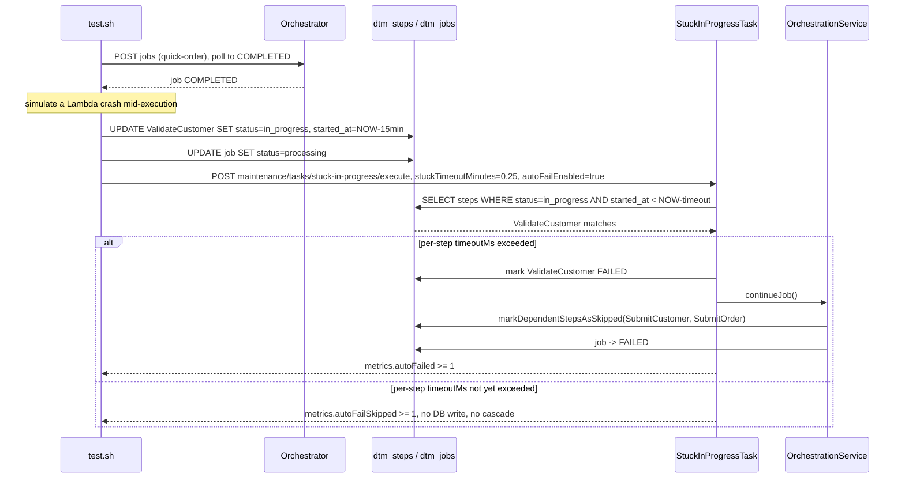

# SE-13: in-progress auto-timeout

## Setpoint Eval Metadata

**Category**: maintenance · **Duration**: ~30s (per test.sh's own banner) · **Timeout**: 120s · **Isolation**: parallel-safe

## Scenario
```gherkin
Feature: the stuck-in-progress maintenance task can auto-fail hung steps
  Scenario: a step manually stuck in IN_PROGRESS is auto-failed with cascade skip
    Given order-processing is running with customer_id=1 (Ada Lovelace) and order_id=1
    And a quick-order job has already completed successfully
    When ValidateCustomer is manually set back to in_progress with started_at
      15 minutes in the past (simulating a Lambda crash mid-execution)
    And the stuck-in-progress maintenance task is triggered with
      stuckTimeoutMinutes=0.25 AND autoFailEnabled=true
    Then it is auto-failed once its per-step timeout is exceeded, its
      dependents (SubmitCustomer, SubmitOrder) cascade to SKIPPED, and the job
      reaches FAILED
    And if the per-step timeout was not yet exceeded, the task still reports the
      step as found with autoFailSkipped — detection and cascade infrastructure
      are exercised either way
```

## Architecture


## Test Data
Reads (does not own) order-processing's seeded rows — `customer_id=1` (Ada Lovelace)
and `order_id=1`, owned by workflow suite `SE-01-happy-path`
(`workflows/order-processing/source-db/SEED-REGISTRY.md`). `entityId` is a fresh
`uuidgen` per run.

## Payload

### Job payload
```json
{
  "variant": "quick-order",
  "payload": {
    "customerId": 1,
    "orderId": 1,
    "entityId": "<uuidgen per run>"
  },
  "enableDeduplication": false,
  "testOptions": {
    "ValidateCustomer": { "simDelay": 500 },
    "ValidateProduct": { "simDelay": 500 },
    "SubmitCustomer": { "simDelay": 500, "ackDelay": 500 },
    "SubmitOrder": { "simDelay": 500, "ackDelay": 500 }
  }
}
```

### Maintenance task invocation
```bash
curl -X POST -H "Content-Type: application/json" \
  -d '{"stuckTimeoutMinutes": 0.25, "autoFailEnabled": true}' \
  "${ORCHESTRATOR_HOST}/api/${API_VERSION}/maintenance/tasks/stuck-in-progress/execute"
```

## Artifacts

### Expected output (task response, auto-fail branch)
```json
{ "success": true, "metrics": { "stuckStepsFound": 1, "autoFailed": 1, "autoFailSkipped": 0 } }
```
```
ValidateCustomer = failed    (auto-failed by maintenance task)
SubmitCustomer   = skipped   (cascade)
SubmitOrder      = skipped   (cascade)
job.status       = failed
```

## Assertions
<!-- one checkbox per exit-1 gate in test.sh, in execution order -->
- [ ] the DB manipulation lands: `ValidateCustomer.status = in_progress`
- [ ] `POST .../stuck-in-progress/execute` returns `success = true`
- [ ] `metrics.stuckStepsFound >= 1`
- [ ] either `metrics.autoFailed >= 1` OR `metrics.autoFailSkipped >= 1`
      (one of the two branches must fire — neither means the flag was ignored)
- [ ] **only when `autoFailed >= 1`**: `ValidateCustomer` final status is `failed`

Cascade-skip on `SubmitCustomer`/`SubmitOrder` and the job reaching `failed` are
checked but only `log_warning` (no `exit 1`) if the cascade hasn't propagated
yet — this SE's hard gate is the auto-fail itself, not the full cascade.

## Run
```bash
bash setpoint-evals/run-all.sh --se 13
```

## Troubleshooting

**Neither `autoFailed` nor `autoFailSkipped` increments** — the `autoFailEnabled`
flag isn't reaching `StuckInProgressTask`; check
`services/orchestrator/src/maintenance/tasks/stuck-in-progress.task.ts`.

**`autoFailSkipped` fires instead of `autoFailed`** — the step's per-step
`StepDefinition.timeoutMs` (default 30 min) hasn't been exceeded even though the
detection threshold (`stuckTimeoutMinutes`) has; this is expected and still a
pass — detection + auto-fail infrastructure are both verified.

Pairs with SE-06 (same underlying `StuckInProgressTask`, but alert-only —
`autoFailEnabled` omitted).

Related: `services/orchestrator/src/maintenance/tasks/stuck-in-progress.task.ts`,
`POST /maintenance/tasks/stuck-in-progress/execute`,
`services/orchestrator/src/orchestration/orchestration.service.ts`
(`markDependentStepsAsSkipped`).
