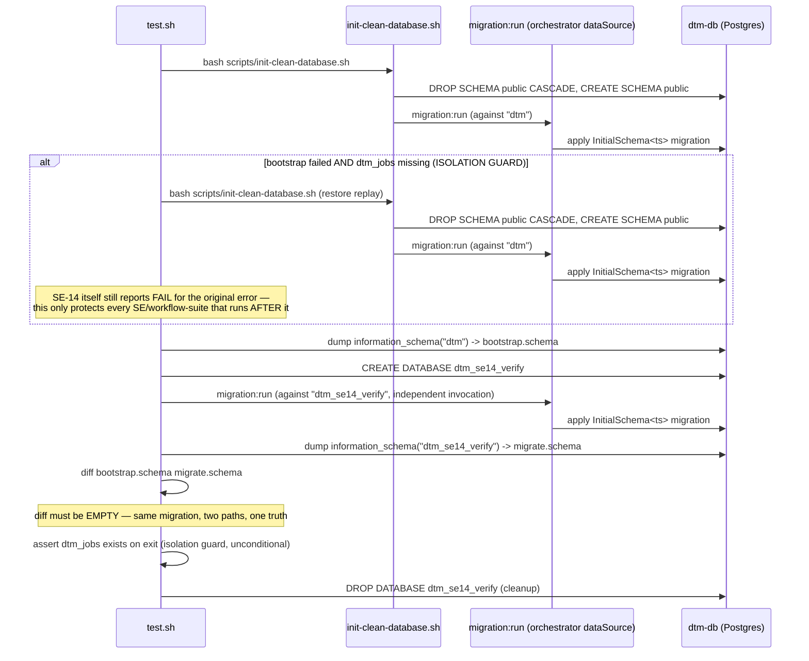

# SE-14: schema single source

**Category**: schema · **Isolation**: destructive · **Duration**: ~10s · **Timeout**: 120s

**MUST RUN SEQUENTIALLY** — this SE drops and rebuilds the ENTIRE `dtm` schema
(`scripts/init-clean-database.sh`), destroying any in-flight job/step rows every
other SE or a running orchestrator depends on. It must never run concurrently
with any other SE.

## Scenario
```gherkin
Feature: Migrations are the single schema source of truth (Phase 2a, D1)
  Scenario: bootstrap path and fresh migrate produce identical schemas
    Given a running dtm-db Postgres instance
    When "dtm" is rebuilt via the real bootstrap path (scripts/init-clean-database.sh)
    And an independent empty database is built via a bare `migration:run`
    Then their information_schema (tables, columns, indexes, non-CHECK constraints, enums) are byte-identical
    And no hand-written CREATE TABLE SQL exists anywhere in the bootstrap path
```

## Architecture


### Isolation guard (added Fix 4c, 2026-07-17)
This SE is destructive by design (drops and rebuilds the entire schema), so a
mid-bootstrap failure used to leave `dtm_jobs` missing for the rest of the run —
observed cascading into SE-15/17/19 and all three workflow suites reporting
unrelated "relation dtm_jobs does not exist" / "no jobId returned" failures on
a single SE-14 hiccup. `test.sh` now checks `dtm_jobs` immediately after Path A;
if it's missing, it replays `init-clean-database.sh` ONCE more (now idempotent —
see SE-24) to restore a known-good schema before doing anything else, and
asserts `dtm_jobs` exists on exit UNCONDITIONALLY (not just on the restore
path). SE-14's own verdict is unaffected — the original failure still fails it.

## Artifacts

### Input / payload
The SE runs the literal production entry points, no synthetic payload:
```bash
bash "$ROOT/scripts/init-clean-database.sh"                 # Path A: real bootstrap
# ...
npx typeorm-ts-node-commonjs migration:run -d dataSource.ts # Path B: fresh migrate (against dtm_se14_verify)
```

The comparison query (run against both databases via `psql -tA`):
```sql
SELECT 'TABLE|' || table_name FROM information_schema.tables
WHERE table_schema='public' AND table_name <> 'migrations'
UNION ALL
SELECT 'COLUMN|' || table_name || '|' || column_name || '|' || data_type || '|' || is_nullable
  || '|' || COALESCE(column_default,'') || '|' || COALESCE(character_maximum_length::text,'')
FROM information_schema.columns
WHERE table_schema='public' AND table_name <> 'migrations'
UNION ALL
SELECT 'INDEX|' || indexname || '|' || tablename || '|' || indexdef
FROM pg_indexes WHERE schemaname='public' AND tablename <> 'migrations'
UNION ALL
SELECT 'CONSTRAINT|' || tc.table_name || '|' || tc.constraint_name || '|' || tc.constraint_type
FROM information_schema.table_constraints tc
WHERE tc.table_schema='public' AND tc.table_name <> 'migrations' AND tc.constraint_type <> 'CHECK'
UNION ALL
SELECT 'ENUM|' || t.typname || '|' || e.enumlabel
FROM pg_type t JOIN pg_enum e ON t.oid = e.enumtypid JOIN pg_namespace n ON n.oid = t.typnamespace
WHERE n.nspname = 'public'
ORDER BY 1;
```
(`CHECK` constraints are excluded — Postgres auto-names unnamed NOT NULL checks from
internal `(schema_oid, table_oid, attnum)` numbers, which differ across any two
independently-created databases even from the byte-identical migration. NOT NULL-ness
is already covered deterministically via `information_schema.columns.is_nullable`.)

### Expected output (GREEN)
```
✓ bootstrap path (init-clean-database.sh) ran cleanly
✓ fresh migration:run against empty DB ran cleanly
✓ bootstrap-path schema dump is non-empty (sanity)
✓ fresh-migrate schema dump is non-empty (sanity)
✓ information_schema diff (bootstrap vs fresh migrate) is EMPTY
✓ dtm_jobs exists on exit (isolation — a bootstrap failure never cascades downstream)
── assertions: 6 pass, 0 fail
```

### Isolation-guard proof (RED→restore→PASS-with-1-FAIL) — the restore path actually fires
Temporarily added a one-shot fault injector to `scripts/init-clean-database.sh`
(env-gated `SE14_INJECT_FAILURE=1`, exits right after the real `DROP SCHEMA`
but before rebuild — a marker file makes it fire only on the FIRST invocation
in a run, so the guard's own restore replay is unaffected) and ran this SE
unmodified:
```
✗ bootstrap path exited 1 — see /tmp/tmp.HqrRduZOps/bootstrap.log
🗑️  Dropping schema 'dtm' on dtm-db and recreating empty...
✅ Schema reset complete
💥 SE14_INJECT_FAILURE=1 (one-shot RED-proof marker) — exiting after schema drop, before rebuild
⚠ dtm_jobs missing after a failed bootstrap — restoring schema so downstream SEs aren't cascade-failed by this one
⚠ restore succeeded — dtm_jobs exists again; downstream SEs can proceed
✗ bootstrap path (init-clean-database.sh) ran cleanly  (cmd: test 1 -eq 0)
✓ fresh migration:run against empty DB ran cleanly
✓ bootstrap-path schema dump is non-empty (sanity)
✓ fresh-migrate schema dump is non-empty (sanity)
✓ information_schema diff (bootstrap vs fresh migrate) is EMPTY
✓ dtm_jobs exists on exit (isolation — a bootstrap failure never cascades downstream)
── assertions: 5 pass, 1 fail
```
Verified directly against Postgres after this run: `SELECT to_regclass('public.dtm_jobs')`
→ `dtm_jobs` (present). Exit code: `1` — **SE-14 itself correctly still fails**
(the original bootstrap error is real and must be visible), but `dtm_jobs`
exists again, so a downstream SE run in the same pass sees a working schema
instead of cascading. The injector was removed immediately after capturing
this transcript and the SE re-run to confirm GREEN again (6 pass, 0 fail,
`git diff` on `scripts/init-clean-database.sh` clean) before committing.

### Negative-control proof (RED) — this SE can fail
Manually planted drift: added one extra line to `scripts/init-clean-database.sh`
right after `migration:run` — `ALTER TABLE dtm_jobs ADD COLUMN se14_drift_test
varchar(10);` — simulating the exact regression this SE exists to prevent
(hand-written SQL creeping back into the bootstrap path). Ran this SE unmodified
against that planted drift:
```
✓ bootstrap path (init-clean-database.sh) ran cleanly
✓ fresh migration:run against empty DB ran cleanly
✓ bootstrap-path schema dump is non-empty (sanity)
✓ fresh-migrate schema dump is non-empty (sanity)
✗ information_schema diff (bootstrap vs fresh migrate) is EMPTY  (cmd: test ! -s /tmp/tmp.NTaGDo4dME/schema.diff)
── schema drift detected ──────────────────────────────────────
--- /tmp/tmp.NTaGDo4dME/bootstrap.schema
+++ /tmp/tmp.NTaGDo4dME/migrate.schema
@@ -5,7 +5,6 @@
 COLUMN|dtm_jobs|payload|jsonb|NO||
 COLUMN|dtm_jobs|results|jsonb|YES||
 COLUMN|dtm_jobs|retry_count|integer|NO|0|
-COLUMN|dtm_jobs|se14_drift_test|character varying|YES||10
 COLUMN|dtm_jobs|started_at|timestamp without time zone|YES||
 COLUMN|dtm_jobs|status|USER-DEFINED|NO|'pending'::job_status_enum|
 COLUMN|dtm_jobs|submitted_at|timestamp without time zone|NO|CURRENT_TIMESTAMP|
────────────────────────────────────────────────────────────────
── assertions: 4 pass, 1 fail
```
Exit code: `1`. The drift line was removed immediately after capturing this
transcript and the SE was re-run to confirm GREEN again (5 pass, 0 fail) before
committing — `scripts/init-clean-database.sh` in this PR carries no such line.

## Assertions
<!-- one checkbox per ck call in test.sh — keep 1:1 -->
- [ ] bootstrap path (`scripts/init-clean-database.sh`) exits 0
- [ ] fresh `migration:run` against an independent empty database exits 0
- [ ] bootstrap-path information_schema dump is non-empty (sanity — didn't silently no-op)
- [ ] fresh-migrate information_schema dump is non-empty (sanity — didn't silently no-op)
- [ ] information_schema diff between the two paths is EMPTY (tables/columns/indexes/enums/FKs identical)
- [ ] `dtm_jobs` exists on exit — unconditionally, including after a bootstrap failure that triggered the restore-replay (isolation guard)

## Run
```bash
bash setpoint-evals/run-all.sh --se 14
```

Guards Phase 2a / decision D1 ("TypeORM migrations are the single schema
source of truth"): the moment anyone re-adds a parallel hand-written
`CREATE TABLE`/`ALTER TABLE` shortcut to the bootstrap path — the exact
mistake this repo used to make in `scripts/init-clean-database.sh` before
this PR — the two paths diverge and this SE goes red in CI, instead of the
drift being discovered later as a confusing runtime column-mismatch.
