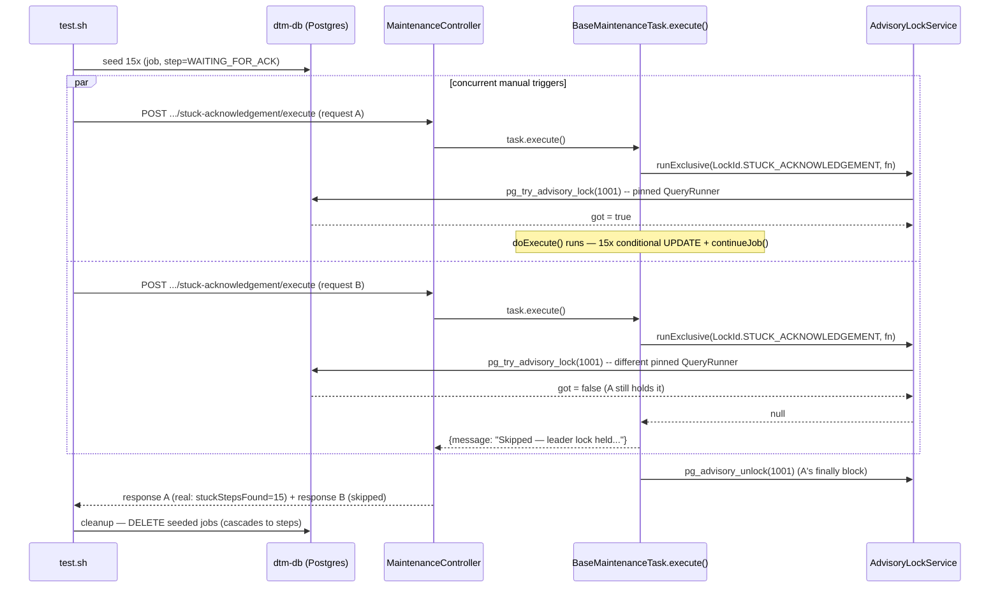

# SE-15: leader-election concurrency (LEADER-1)

**Category**: maintenance · **Isolation**: parallel-safe (own synthetic jobs, tagged `payload.se='SE-15'`) · **Duration**: ~10s · **Timeout**: 60s

## Scenario
```gherkin
Feature: A maintenance task's leader lock guards every execution path, not just the cron path
  Scenario: two concurrent manual triggers of the same task never both run its body
    Given 15 synthetic steps stuck WAITING_FOR_ACK, each on its own synthetic job
    When two POST /maintenance/tasks/stuck-acknowledgement/execute requests are fired
      concurrently (near-simultaneous, both in flight together)
    Then exactly one request's response reports "leader lock held" (skipped)
    And the OTHER request's response shows it actually processed all 15 seeded steps
    And neither request duplicates the other's work (no double auto-fail / double continueJob)
```

## Why this exists
`BaseMaintenanceTask.execute()` is the single entry point for BOTH the
`@Cron`-scheduled path and the manual-trigger REST API
(`MaintenanceSchedulerService.executeTaskManually` → `task.execute()` directly).
Before LEADER-1, `AdvisoryLockService` was only consulted inside each task's own
`scheduledRun()` handler — a hand-rolled `tryAcquire`/`release` pair wrapped
around `this.execute()`. That guarded replica-vs-replica CRON races, but the
manual-trigger path called `execute()` straight through, completely unguarded.
Two operators (or one flaky client retry) firing the manual endpoint at the same
moment would run the task's body twice, concurrently — double auto-fail attempts,
double `continueJob()` triggers, double everything.

The fix moves the lock into `BaseMaintenanceTask.execute()` itself, keyed by
`getMetadata().lockId` (a stable per-task integer, `AdvisoryLockService.LockId`),
so **every** call path is guarded by the same lock.

## Why 15 seeded steps
A `pg_try_advisory_lock` guard is trivially easy to get "accidentally green":
if the winner's `doExecute()` returns before the loser's request even reaches
the lock check, both requests may complete without ever truly overlapping —
"exactly one execution" would then be true for the wrong reason (timing luck,
not the guard), and the assertion would flake under different load/scheduling.
Seeding 15 real WAITING_FOR_ACK rows forces the winner's `doExecute()` to do 15
sequential conditional-UPDATE + `continueJob()` round-trips to Postgres —
comfortably long enough that the loser's near-simultaneous request is
guaranteed to observe the lock still held, deterministically, not by luck.

## Architecture


## Artifacts

### Seed (arrange)
```sql
WITH new_jobs AS (
  INSERT INTO dtm_jobs (workflow_name, type, status, payload, submitted_at)
  SELECT 'order-processing', 'quick-order', 'processing', '{"se":"SE-15"}'::jsonb, NOW()
  FROM generate_series(1, 15)
  RETURNING id
)
INSERT INTO dtm_steps (job_id, step_value, status, kafka_published_at, started_at)
SELECT id, 'SubmitCustomer', 'waiting_for_ack', NOW() - INTERVAL '1 hour', NOW() - INTERVAL '1 hour'
FROM new_jobs
RETURNING job_id;
```

### Request (act) — fired twice, concurrently
```
POST /api/v1/maintenance/tasks/stuck-acknowledgement/execute
Content-Type: application/json

{"ackTimeoutMinutes": 0.001}
```
(The override is a courtesy for speed under `ENABLE_REQUESTS_FOR_SIMULATED_DELAYS=true`;
the seed's `kafka_published_at` is 1 hour old, so this SE also passes under the
default 30-minute production threshold if overrides are disabled.)

### Expected output (GREEN)
```
✓ seeded exactly 15 synthetic WAITING_FOR_ACK steps
✓ request 1 returned HTTP 200
✓ request 2 returned HTTP 200
✓ exactly one concurrent manual trigger was skipped by the leader lock
✓ the winner actually detected the seeded stuck steps (stuckStepsFound >= 15)
── assertions: 5 pass, 0 fail
```

### Negative-control proof (RED) — pre-LEADER-1 code
Ran this SE unmodified against `services/orchestrator/src/maintenance/base/base-maintenance-task.ts`
+ the 8 task files reverted to their pre-fix form (advisory lock only inside
`scheduledRun()`, manual-trigger path unguarded):
```
✓ seeded exactly 15 synthetic WAITING_FOR_ACK steps
✓ request 1 returned HTTP 200
✓ request 2 returned HTTP 200
✗ exactly one concurrent manual trigger was skipped by the leader lock  (actual='0' expected='1')
✓ the winner actually detected the seeded stuck steps (stuckStepsFound >= 15)
── assertions: 4 pass, 1 fail
```
Both concurrent requests ran `doExecute()` in full — neither response message
contained "leader lock held" (that string doesn't exist pre-fix), and both
reported real `stuckStepsFound`/`autoFixed` counts against the same 15 rows.
Exit code: `1`. See the PR body for the exact commands used to capture this
transcript (temporary revert, rebuild, run, restore, rebuild, re-run for GREEN).

## Assertions
<!-- one checkbox per ck/ck_eq call in test.sh — keep 1:1 -->
- [ ] seeded exactly 15 synthetic WAITING_FOR_ACK steps
- [ ] request 1 returned HTTP 200
- [ ] request 2 returned HTTP 200
- [ ] exactly one concurrent manual trigger was skipped by the leader lock
- [ ] the winner actually detected the seeded stuck steps (stuckStepsFound >= 15)

## Run
```bash
bash setpoint-evals/run-all.sh --se 15
```

Guards LEADER-1: the moment the advisory lock is re-scoped to only the CRON
path again (e.g. someone "simplifies" `BaseMaintenanceTask.execute()` by moving
the lock back out into each task's `scheduledRun()`), this SE goes red —
`SKIPPED_COUNT` reverts to `0` — instead of the double-execution race being
discovered later as duplicated `continueJob()` cascades in production.
