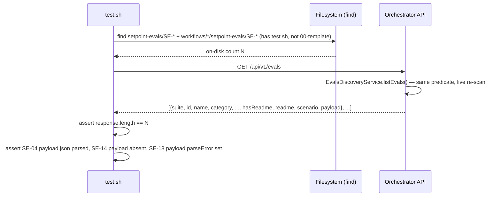

# SE-16: evals discovery lists all

## Setpoint Eval Metadata

**Category**: evals-module · **Duration**: ~5s · **Timeout**: 30s · **Isolation**: parallel-safe

## Scenario
```gherkin
Feature: GET /api/v1/evals discovers every Setpoint Eval across all four suites, live from disk
  Scenario: the discovered count matches the real on-disk SE-* estate, with parseable payloads
    Given the repo's real setpoint-evals/SE-* dirs and workflows/*/setpoint-evals/SE-* dirs,
      each with a test.sh (the exact predicate scripts/se-run-suite.sh itself uses)
    When GET /api/v1/evals is called
    Then the response array length equals the on-disk count exactly (no manifest drift possible —
      there is no manifest)
    And a known core-suite eval with a valid Payload block (SE-04-ack-delays) is returned with
      its parsed payload.json intact
    And a known eval with NO Payload section (SE-14-schema-single-source) is returned with
      payload absent, not a crash
    And this suite's own malformed-payload fixture (SE-18) is returned with a parseError,
      proving the parser degrades rather than throwing on broken JSON
```

## Architecture


## Artifacts

### Input / payload
```bash
curl -s "${ORCHESTRATOR_HOST}/api/${API_VERSION}/evals"
```
No request body — GET, discovery only.

### Expected output
```
response is a JSON array; length == on-disk SE-* count (test.sh present, excl. 00-template)
one element has: suite=="core", id=="SE-04-ack-delays", payload.json.variant=="quick-order"
one element has: suite=="core", id=="SE-14-schema-single-source", payload absent/null
one element has: suite=="core", id=="SE-18-evals-run-malformed-payload-422", payload.parseError set
```

## Assertions
- [ ] GET /api/v1/evals returns HTTP 200
- [ ] response array length equals the on-disk SE-* count (find-based, same predicate as the runner)
- [ ] every element's `suite` is one of core/order-processing/iot-sensor-pipeline/infra-provisioning
- [ ] SE-04-ack-delays (core) is present with `payload.json.variant == "quick-order"`
- [ ] SE-14-schema-single-source (core, no Payload section) is present with no payload.json
- [ ] SE-18-evals-run-malformed-payload-422 (core, broken JSON) is present with a payload.parseError

## Run
```bash
bash setpoint-evals/run-all.sh --se 16
```

Pins the ONE hard rule of the whole evals module: discovery must never drift from what the SE
runner actually executes, and it must never silently drop or crash on a malformed/missing
Payload — both regressions a bundled-manifest approach (explicitly forbidden) or a naive
`JSON.parse` (uncaught) would reintroduce.
