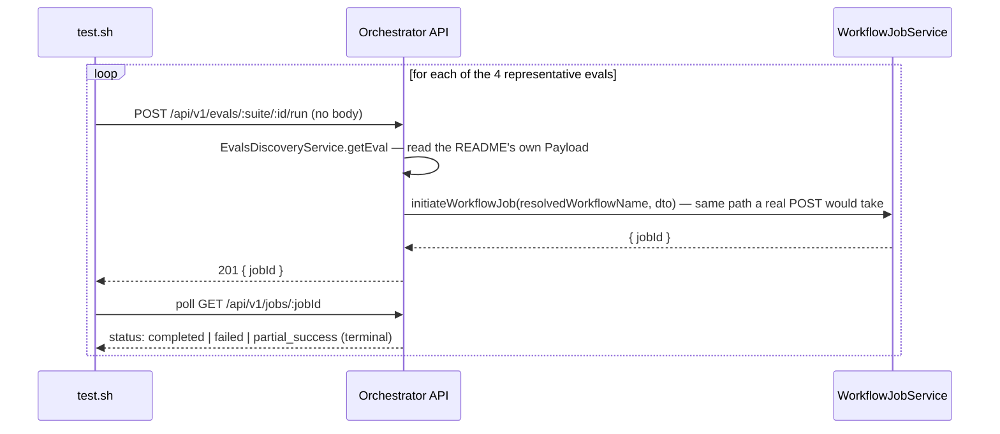

# SE-17: evals run round trip terminal state

## Setpoint Eval Metadata

**Category**: evals-module · **Duration**: ~90-180s (four sequential run+poll round-trips) · **Timeout**: 300s · **Isolation**: destructive

## Scenario
```gherkin
Feature: POST /api/v1/evals/:suite/:id/run re-issues the README's own Payload as a real job
  Scenario: one representative eval per suite reaches a terminal job state
    Given one runnable eval per suite (core/SE-04-ack-delays, order-processing/SE-01-happy-path,
      iot-sensor-pipeline/SE-01-happy-path, infra-provisioning/SE-01-happy-path)
    When POST /api/v1/evals/:suite/:id/run is called for each, with NO request body
    Then each returns 201 with a jobId
    And polling GET /api/v1/jobs/:jobId for each jobId reaches a terminal status
      (completed, failed, or partial_success) within the suite's own documented duration budget
    And the workflow actually invoked matches the suite (order-processing for the two
      order-processing-suite evals — core resolves it from the README's own
      "/workflows/order-processing/jobs" token, the workflow suites resolve it structurally)
```

## Architecture


## Artifacts

### Input / payload
```bash
curl -s -X POST "${ORCHESTRATOR_HOST}/api/${API_VERSION}/evals/core/SE-04-ack-delays/run"
curl -s -X POST "${ORCHESTRATOR_HOST}/api/${API_VERSION}/evals/order-processing/SE-01-happy-path/run"
curl -s -X POST "${ORCHESTRATOR_HOST}/api/${API_VERSION}/evals/iot-sensor-pipeline/SE-01-happy-path/run"
curl -s -X POST "${ORCHESTRATOR_HOST}/api/${API_VERSION}/evals/infra-provisioning/SE-01-happy-path/run"
```
No request body for any of the four — the DTO POSTed to `/workflows/:name/jobs` internally is
built ENTIRELY from each eval's own committed `## Payload` block (server-parsed), never from a
client-supplied body.

### Expected output
```
each: HTTP 201, body has a non-empty "jobId" (uuid)
each: GET /api/v1/jobs/:jobId eventually reports status in {completed, failed, partial_success}
```

## Assertions
- [ ] core/SE-04-ack-delays: POST /run returns 201 with a jobId
- [ ] core/SE-04-ack-delays: the job reaches a terminal status within budget
- [ ] order-processing/SE-01-happy-path: POST /run returns 201 with a jobId
- [ ] order-processing/SE-01-happy-path: the job reaches a terminal status within budget
- [ ] iot-sensor-pipeline/SE-01-happy-path: POST /run returns 201 with a jobId
- [ ] iot-sensor-pipeline/SE-01-happy-path: the job reaches a terminal status within budget
- [ ] infra-provisioning/SE-01-happy-path: POST /run returns 201 with a jobId
- [ ] infra-provisioning/SE-01-happy-path: the job reaches a terminal status within budget

## Run
```bash
bash setpoint-evals/run-all.sh --se 17
```

The monitor's "Scenarios" screen Run button is only trustworthy if the round-trip it triggers
(README Payload -> real job -> real orchestration) actually reaches a terminal state for every
suite, not just the one the feature was demoed against. destructive: creates real jobs/steps in
the shared dtm database (same reason the workflow-suite happy-path SEs themselves are not
parallel-isolated from a maintenance sweep) and is comparatively slow (four real orchestrations),
so it runs sequentially rather than racing the parallel-safe phase.
