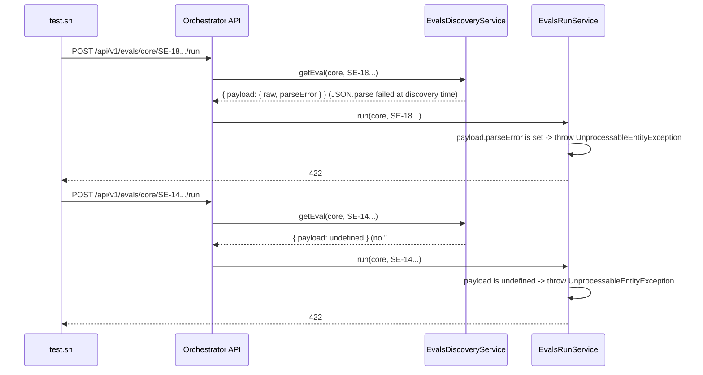

# SE-18: evals run malformed payload 422

## Setpoint Eval Metadata

**Category**: evals-module · **Duration**: ~5s · **Timeout**: 30s · **Isolation**: parallel-safe

## Scenario
```gherkin
Feature: POST /api/v1/evals/:suite/:id/run never crashes on a bad Payload — typed 422 instead
  Scenario: a malformed "## Payload" JSON fence returns 422, not a 500
    Given THIS eval's own "## Payload" block below is deliberately broken JSON
      (a trailing comma before a closing brace — a real copy/paste mistake, not synthesized)
    When POST /api/v1/evals/core/SE-18-evals-run-malformed-payload-422/run is called
    Then the response is HTTP 422, with a message naming the parse failure
    And no job is created (WorkflowJobService.initiateWorkflowJob is never called)
  Scenario: an eval with NO "## Payload" section at all also returns 422, not a 500
    Given core/SE-14-schema-single-source, a real eval with no Payload section (nothing to replay)
    When POST /api/v1/evals/core/SE-14-schema-single-source/run is called
    Then the response is HTTP 422, with a message explaining there is nothing to run
```

## Architecture


## Artifacts

### Input / payload (THIS eval's own — deliberately malformed)
```json
{ "variant": "quick-order", "payload": { "customerId": 1, "orderId": 1, "oops": , } }
```
This is the literal fence this README carries below (`## Payload`) — the parser reads it as-is;
nothing is injected at test time. The trailing `, }` after `"oops":` is the deliberate break.

### Expected output
```
POST /api/v1/evals/core/SE-18-evals-run-malformed-payload-422/run -> 422, body mentions a parse error
POST /api/v1/evals/core/SE-14-schema-single-source/run           -> 422, body mentions "no ... Payload"
```

## Payload
```json
{ "variant": "quick-order", "payload": { "customerId": 1, "orderId": 1, "oops": , } }
```

## Assertions
- [ ] POST /run on this eval (malformed JSON) returns HTTP 422
- [ ] the 422 body mentions a parse/JSON error, not a generic message
- [ ] POST /run on SE-14 (no Payload section at all) returns HTTP 422
- [ ] the 422 body mentions there is nothing to run
- [ ] neither request creates a job (no jobId in either response body)

## Run
```bash
bash setpoint-evals/run-all.sh --se 18
```

A malformed or absent README Payload block is a real, ordinary authoring mistake (this SE's own
fixture IS such a mistake, kept deliberately broken) — the run endpoint must degrade to a typed
422 client error, never an unhandled 500/crash that would take the whole request pipeline down.
