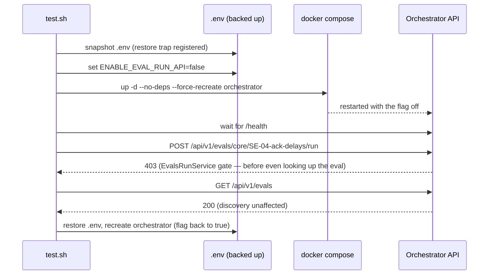

# SE-19: evals run api disabled 403

## Setpoint Eval Metadata

**Category**: evals-module · **Duration**: ~30-60s (two orchestrator container recreates) · **Timeout**: 180s · **Isolation**: destructive

## Scenario
```gherkin
Feature: ENABLE_EVAL_RUN_API=false disables the run endpoint (dev-only escape hatch)
  Scenario: the run endpoint 403s when the flag is off, discovery still works
    Given the orchestrator is recreated with ENABLE_EVAL_RUN_API=false in .env
    When POST /api/v1/evals/core/SE-04-ack-delays/run is called
    Then the response is HTTP 403, and no job is created
    But GET /api/v1/evals still returns 200 (discovery is never gated by this flag)
    And restoring ENABLE_EVAL_RUN_API=true and recreating the orchestrator makes
      POST .../run succeed again
```

## Architecture


## Artifacts

### Input / payload
```bash
# .env line toggled for the duration of this SE only (restored in a trap on EXIT):
ENABLE_EVAL_RUN_API=false

curl -s -X POST "${ORCHESTRATOR_HOST}/api/${API_VERSION}/evals/core/SE-04-ack-delays/run"
curl -s "${ORCHESTRATOR_HOST}/api/${API_VERSION}/evals"
```

### Expected output
```
POST .../run   -> 403, no jobId in the body
GET  /evals    -> 200 (unaffected by the flag)
```

## Assertions
- [ ] with the flag off, POST /run returns HTTP 403
- [ ] the 403 response body carries no jobId (no job created)
- [ ] with the flag off, GET /api/v1/evals still returns HTTP 200 (discovery ungated)
- [ ] restoring the flag to true makes POST /run succeed again (201, jobId present)

## Run
```bash
bash setpoint-evals/run-all.sh --se 19
```

The dev-only escape hatch (documented in .env.example) is only real if it actually blocks the
endpoint and — just as importantly — doesn't collaterally block discovery, and the orchestrator
comes back to normal once the flag is restored. destructive: recreates the shared orchestrator
container twice; must never race another SE hitting the API mid-recreate.
