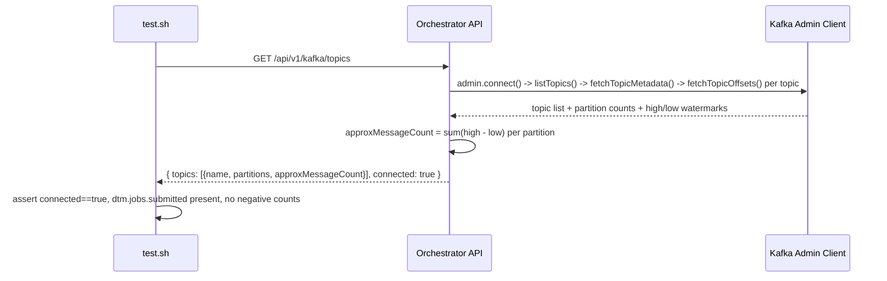

# SE-20: kafka topics lists registered

## Setpoint Eval Metadata

**Category**: monitor-backend · **Duration**: ~5s · **Timeout**: 30s · **Isolation**: parallel-safe

## Scenario
```gherkin
Feature: GET /api/v1/kafka/topics backs the monitor's "Kafka Topics" tab — read-only, never consumes
  Scenario: a real local broker reports its registered topics with a cheap approximate count
    Given a real Kafka broker reachable at KAFKA_BROKER, with the core dtm.jobs.submitted topic
      already created (KafkaHealthIndicator's own PROJECT_TOPICS list)
    When GET /api/v1/kafka/topics is called
    Then connected is true and dtm.jobs.submitted is present with >= 1 partition
    And no topic reports a negative approxMessageCount (a broken high-low watermark diff
      would go negative, not just wrong)
```

## Architecture


## Artifacts

### Input / payload
```bash
curl -s "${ORCHESTRATOR_HOST}/api/${API_VERSION}/kafka/topics"
```
No request body — GET, admin-client read only (connect/listTopics/fetchTopicMetadata/
fetchTopicOffsets/disconnect — never subscribes or consumes a message).

### Expected output
```json
{
  "topics": [
    { "name": "dtm.jobs.submitted", "partitions": 1, "approxMessageCount": 0 }
  ],
  "connected": true
}
```

## Assertions
- [ ] GET /api/v1/kafka/topics returns HTTP 200
- [ ] `connected` is `true` against the real local broker
- [ ] the core `dtm.jobs.submitted` topic is present
- [ ] `dtm.jobs.submitted` has at least 1 partition
- [ ] no topic reports a negative `approxMessageCount`

## Run
```bash
bash setpoint-evals/run-all.sh --se 20
```

Pins the Kafka Topics tab's one hard safety rule: it must NEVER become a second consumer
group (which would steal messages from the real pipeline) — RED-proofed by inverting the
admin-only contract (see DIFFICULTIES-LOG.md / PR description for the one-line flip used).
Also guards the graceful-degradation path (`connected:false`, empty list, never a 500) that
KafkaService already establishes for the producer side.
