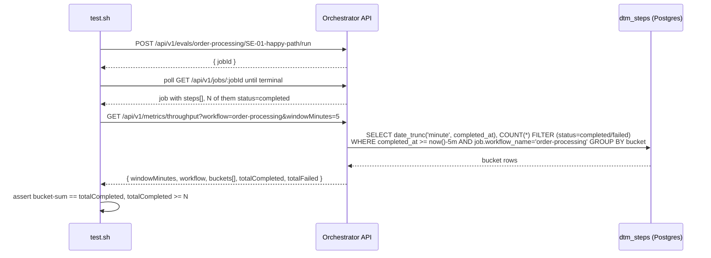

# SE-21: throughput buckets completed steps

## Setpoint Eval Metadata

**Category**: monitor-backend · **Duration**: ~90s · **Timeout**: 150s · **Isolation**: parallel-safe

## Scenario
```gherkin
Feature: GET /api/v1/metrics/throughput backs the monitor's "Throughput" tab — real dtm_steps aggregation
  Scenario: a real completed job's steps are counted within the workflow-scoped window
    Given a real order-processing job (SE-01-happy-path, run via the Evals API) that has
      reached a terminal state, with N of its steps status=completed
    When GET /api/v1/metrics/throughput?workflow=order-processing&windowMinutes=5 is called
    Then the response echoes workflow and windowMinutes back
    And the sum of per-bucket `completed` counts equals `totalCompleted` (internal consistency
      between the bucket array and the rollup)
    And totalCompleted is at least N (>=, not ==, because a concurrent SE run may add its own
      order-processing steps inside the same 5-minute window — shared-DB isolation)
```

## Architecture


## Artifacts

### Input / payload
```bash
curl -s -X POST "${ORCHESTRATOR_HOST}/api/${API_VERSION}/evals/order-processing/SE-01-happy-path/run"
# ... poll .../jobs/:jobId until terminal ...
curl -s "${ORCHESTRATOR_HOST}/api/${API_VERSION}/metrics/throughput?workflow=order-processing&windowMinutes=5"
```

### Expected output
```json
{
  "windowMinutes": 5,
  "workflow": "order-processing",
  "buckets": [{ "bucket": "2026-07-16T12:00:00.000Z", "completed": 5, "failed": 0 }],
  "totalCompleted": 5,
  "totalFailed": 0
}
```

## Assertions
- [ ] GET /api/v1/metrics/throughput returns HTTP 200
- [ ] response echoes `workflow=order-processing`
- [ ] response echoes `windowMinutes=5`
- [ ] sum of per-bucket `completed` counts equals `totalCompleted`
- [ ] `totalCompleted` >= the seed job's own completed-step count

## Run
```bash
bash setpoint-evals/run-all.sh --se 21
```

Pins the ONE thing the Throughput mini-chart depends on: real steps landing in the window
they actually completed in, aggregated from `dtm_steps.completed_at` directly (never a
cached/derived counter that could drift from what Job Detail / Payloads already show).
