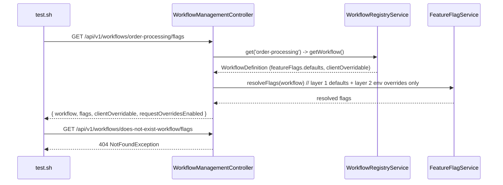

# SE-22: workflow flags layered resolution

## Setpoint Eval Metadata

**Category**: monitor-backend · **Duration**: ~5s · **Timeout**: 30s · **Isolation**: parallel-safe

## Scenario
```gherkin
Feature: GET /api/v1/workflows/:workflowName/flags backs the monitor's "Flags" tab
  Scenario: order-processing's real committed feature-flag defaults resolve unmodified
    Given order-processing's workflow.config.ts featureFlags.defaults (ENABLE_DEDUPLICATION: true,
      ENABLE_CASCADE_FK_INJECTION: true, ENABLE_SHIPMENT_TRACKING: true) and
      clientOverridable: [ENABLE_DEDUPLICATION, ENABLE_SHIPMENT_TRACKING], with no
      FEATURE_FLAG_* env override set in the local stack
    When GET /api/v1/workflows/order-processing/flags is called
    Then ENABLE_DEDUPLICATION and ENABLE_SHIPMENT_TRACKING resolve to true (layer 1, unmodified)
    And clientOverridable echoes the config's own allowlist exactly
    And an unknown workflow name 404s (never silently returns an empty flags object — a
      predicate-drift trap: 404 and empty-flags look identical to a careless UI, but only one
      is correct)
```

## Architecture


## Artifacts

### Input / payload
```bash
curl -s "${ORCHESTRATOR_HOST}/api/${API_VERSION}/workflows/order-processing/flags"
```
No request body — GET, layer 1 (config defaults) + layer 2 (env overrides) resolution only;
layer 3 (per-request client overrides) does not apply, there is no request to override.

### Expected output
```json
{
  "workflow": "order-processing",
  "flags": {
    "ENABLE_DEDUPLICATION": true,
    "ENABLE_CASCADE_FK_INJECTION": true,
    "ENABLE_SHIPMENT_TRACKING": true
  },
  "clientOverridable": ["ENABLE_DEDUPLICATION", "ENABLE_SHIPMENT_TRACKING"],
  "requestOverridesEnabled": false
}
```

## Assertions
- [ ] GET /api/v1/workflows/order-processing/flags returns HTTP 200
- [ ] response echoes `workflow=order-processing`
- [ ] `ENABLE_DEDUPLICATION` resolves to the workflow.config.ts default (`true`)
- [ ] `ENABLE_SHIPMENT_TRACKING` resolves to the workflow.config.ts default (`true`)
- [ ] `clientOverridable` is exactly the config's allowlist (2 entries)
- [ ] an unknown workflow name 404s (never silently empty flags)

## Run
```bash
bash setpoint-evals/run-all.sh --se 22
```

Pins the Flags tab's one hard rule: it reports what a job would ACTUALLY resolve to right now
(same `FeatureFlagService.resolveFlags` call path a real job submission uses), not a
paraphrase of the config file — and it must 404, not silently degrade, on a bad workflow name.
