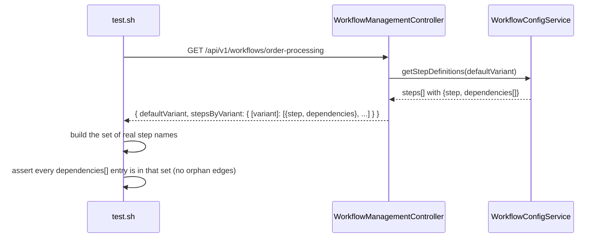

# SE-23: workflow detail exposes step dependencies

## Setpoint Eval Metadata

**Category**: monitor-backend · **Duration**: ~5s · **Timeout**: 30s · **Isolation**: parallel-safe

## Scenario
```gherkin
Feature: GET /api/v1/workflows/:workflowName's stepsByVariant is the DAG data contract for the
  monitor's new per-workflow mermaid mini-viz — it existed before Phase 4b (workflow-management
  controller), this SE pins the shape a NEW consumer (the frontend DAG) now depends on.
  Scenario: order-processing's default-variant step graph is well-formed
    Given order-processing's real registered workflow definition
    When GET /api/v1/workflows/order-processing is called
    Then defaultVariant's step list is non-empty
    And at least one step declares a dependency (a real edge, not an all-isolated-nodes graph)
    And every dependency string names a real step in the SAME variant (an orphan edge would
      silently break mermaid's flowchart parser client-side — the exact failure mode this SE
      exists to catch)
```

## Architecture


## Artifacts

### Input / payload
```bash
curl -s "${ORCHESTRATOR_HOST}/api/${API_VERSION}/workflows/order-processing"
```

### Expected output
```
stepsByVariant[defaultVariant] is a non-empty array; at least one element has dependencies.length > 0;
every dependencies[] string equals some element's own `step` field (jq set-inclusion check, 0 orphans)
```

## Assertions
- [ ] GET /api/v1/workflows/order-processing returns HTTP 200
- [ ] `defaultVariant`'s step list is non-empty
- [ ] at least one real dependency edge exists (not all isolated nodes)
- [ ] no dependency string is an orphan (every edge resolves to a real step)

## Run
```bash
bash setpoint-evals/run-all.sh --se 23
```

The frontend DAG mini-viz (apps/monitor/src/components/workflow-dag.tsx) builds a mermaid
`flowchart TD` string directly from this endpoint's `dependencies[]` arrays with no server-side
validation of its own — an orphan edge here is a client-side mermaid parse failure there. This
SE is the contract test that makes that failure mode impossible to reintroduce silently.
