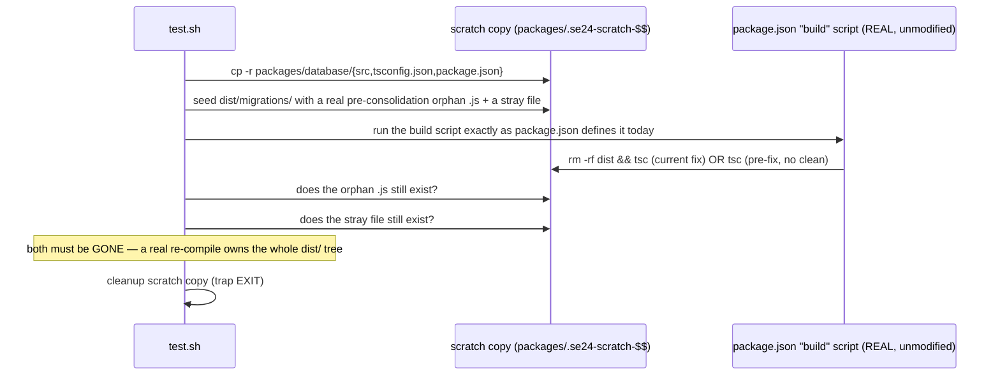

# SE-24: database build cleans orphaned migrations

**Category**: build/schema · **Isolation**: non-destructive (scratch copy) · **Duration**: ~10s · **Timeout**: 60s

## Scenario
```gherkin
Feature: packages/database's build step can never leave orphaned compiled migrations behind
  Scenario: a stale dist/migrations/ survives a plain re-compile
    Given dist/ is gitignored and "build" used to be a bare `tsc` (no clean)
    And dist/migrations/ holds a compiled migration from BEFORE a schema consolidation
      (11 real files like this survived Phase 2a's squash into one InitialSchema.ts
      on the long-lived main checkout — Fix 4c, 2026-07-17)
    When the package is rebuilt via its own package.json "build" script
    Then the orphaned pre-consolidation migration .js must NOT survive the build
    And an unrelated stray file under dist/migrations/ must NOT survive the build
    And the build script text itself cleans dist before compiling (static guard)
```

Guards the exact failure that broke a fresh bring-up on an aged checkout: TypeORM's
migration glob (`packages/database/src/config/typeorm.config.ts` →
`dist/migrations/*.js`) has no way to distinguish "current" from "orphaned" compiled
migrations — it runs everything the glob matches, in timestamp order. When 11 stale
pre-consolidation `.js` files (timestamps `1765443716000`..`1765443726000`) outlived
their `.ts` sources being squashed into one `1784147958000-InitialSchema.ts`, the old
ones ran FIRST (smaller epoch), recreated `job_status_enum` etc., and the real
`InitialSchema` migration then hit Postgres `42710` ("type already exists",
`DefineEnum`) trying to create it again. **SE-14 cannot catch this itself** — its
Path A (bootstrap) and Path B (fresh migrate) both read the same
`dist/migrations/*.js` glob, so stale dist corrupts them identically; there is no
differential signal between the two paths. This SE guards the build step directly.

## Architecture


## Artifacts

### Input / payload
A real orphaned migration artifact (structurally identical to the actual files found
on the aged main checkout, minus the full migration body which isn't needed for this
assertion) plus a stray marker file, seeded into a scratch copy's `dist/migrations/`:
```js
// dist/migrations/1765443716000-InitialMigrationSchema.js
"use strict";
Object.defineProperty(exports, "__esModule", { value: true });
exports.InitialMigrationSchema1765443716000 = class {};
```
```
dist/migrations/.stray-marker   # empty file
```

### Expected output (GREEN)
```
✓ build script (package.json "build") ran cleanly
✓ build produced the current InitialSchema migration
✓ pre-consolidation orphan migration .js does NOT survive build
✓ unrelated stray file under dist/migrations does NOT survive build
✓ build script cleans dist before compiling (static guard)
── assertions: 5 pass, 0 fail
```

### Negative-control proof (RED) — this SE can fail
Reverted `packages/database/package.json` `"build"` to the pre-fix bare `"tsc"`
(no clean) and re-ran this SE unmodified:
```
✓ build script (package.json "build") ran cleanly
✓ build produced the current InitialSchema migration
✗ pre-consolidation orphan migration .js does NOT survive build  (actual='1' expected='0')
✗ unrelated stray file under dist/migrations does NOT survive build  (actual='1' expected='0')
✗ build script cleans dist before compiling (static guard)
── assertions: 2 pass, 3 fail
```
Exit code: `1`. The revert was undone immediately after capturing this transcript
and the SE re-run to confirm GREEN again (5 pass, 0 fail) before committing —
`packages/database/package.json` in this PR carries `"build": "rm -rf dist && tsc"`.

## Assertions
<!-- one checkbox per ck call in test.sh — keep 1:1 -->
- [ ] build script (`package.json` `"build"`) exits 0
- [ ] build produces the current `InitialSchema<ts>.js` migration
- [ ] a pre-consolidation orphan migration `.js` seeded into `dist/migrations/` does NOT survive the build
- [ ] an unrelated stray file seeded into `dist/migrations/` does NOT survive the build
- [ ] the build script text cleans `dist` before compiling (static guard, backstops the dynamic ones above)

## Run
```bash
bash setpoint-evals/run-all.sh --se 24
```

Companion to SE-14 (schema single source): SE-14 proves the bootstrap path and a
fresh migrate produce identical schemas GIVEN a clean dist; this SE proves dist
itself can never carry stale migration artifacts across a schema consolidation in
the first place — closing the one input SE-14 has no way to observe.
