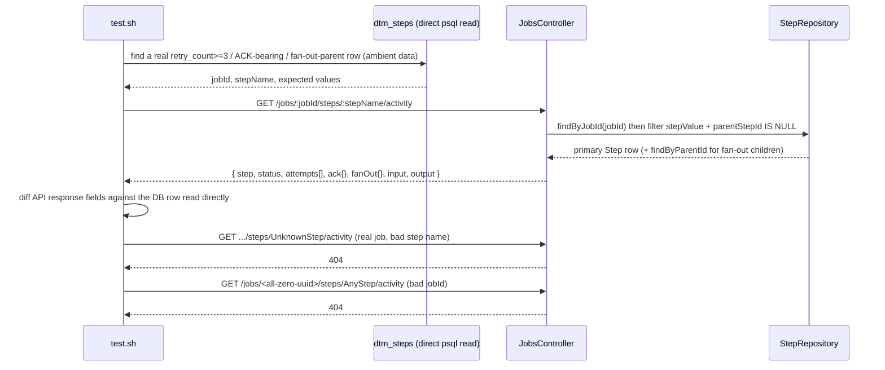

# SE-25: job step activity endpoint

## Setpoint Eval Metadata

**Category**: monitor-backend · **Duration**: ~5s (reads ambient dev-stack data, seeds nothing) · **Timeout**: 60s · **Isolation**: parallel-safe

## Scenario
```gherkin
Feature: GET /api/v1/jobs/:jobId/steps/:stepName/activity is the per-step drill-down
  data contract (capability-spec.md §3.2a, dtm-video-v2) — the DAG node-click endpoint
  the monitor's NodeDrilldownDrawer will call to render attempt timelines, ACK-wait
  bars, and fan-out rollups.
  Scenario: a step that failed and retried exposes its full attempt trail
    Given a step in dtm_steps with retry_count >= 3 (seeded by SE-01/SE-02's normal
      operation on this dev stack — this SE reads, never re-seeds, a ~90-130s retry
      timeline)
    When GET /jobs/:jobId/steps/:stepName/activity is called
    Then attempts[] has one entry per execution_history row, in the same order,
      byte-for-byte, with monotonically increasing attemptNumber

  Scenario: an ACK-bearing step exposes its ACK wait duration
    Given a step with both kafka_published_at and ack_received_at set
    When fetched
    Then ack.ackWaitMs equals ack_received_at - kafka_published_at (±5ms) and
      ack.ackMetadata is non-null

  Scenario: a fan-out parent step exposes its children rollup
    Given a discovery/parent step (parent_step_id IS NULL) with child_count > 0
    When fetched
    Then fanOut.childCount matches the DB child_count and fanOut.children has one
      entry per real child row, each carrying childIndex/childItemId/status

  Scenario: unknown job or step name never 500s or empty-200s
    When fetched with a jobId that doesn't exist, or a stepName that doesn't exist
      on a real job
    Then the response is 404 both times
```

## Architecture


## Test Data
Reads (does not own) whatever real retry/ACK/fan-out rows already exist in `dtm_steps`
on the live dev stack from prior SE runs (SE-01/SE-02 retry, SE-04/order-processing ACK
steps, order-processing's `DiscoverLineItems` or iot-sensor-pipeline's double-fan-out).
No fresh job is submitted — re-seeding a genuine 3x-retry timeline costs ~90-130s
(SQS visibility timeout × 3) purely to re-prove mechanics SE-01/SE-02 already own; this
SE exists to pin the **endpoint's shape**, not the retry/ACK/fan-out mechanics
themselves. If the dev stack has no such row yet (e.g. a freshly-provisioned stack with
zero prior SE runs), each scenario SKIPs loudly with the exact SE to run first — it
never fake-greens on absent data.

## Artifacts

### Input / payload
```bash
curl -s "${ORCHESTRATOR_HOST}/api/${API_VERSION}/jobs/${JOB_ID}/steps/${STEP_NAME}/activity"
```

### Expected output (shape)
```json
{
  "step": "ValidateCustomer",
  "status": "failed",
  "durationMs": 12345,
  "retryCount": 3,
  "maxRetryCount": 3,
  "firstAttemptAt": "2026-07-17T05:32:52.400Z",
  "lastAttemptAt": "2026-07-17T05:34:22.400Z",
  "attempts": [
    { "attemptNumber": 1, "attemptedAt": "...", "status": "failure", "error": "..." },
    { "attemptNumber": 2, "attemptedAt": "...", "status": "failure", "error": "..." },
    { "attemptNumber": 3, "attemptedAt": "...", "status": "failure", "error": "..." }
  ],
  "delegation": { "lambdaFunctionName": "...", "sqsMessageId": "..." },
  "ack": { "kafkaPublishedAt": null, "ackReceivedAt": null, "ackWaitMs": null, "ackMetadata": null },
  "fanOut": null,
  "input": { "...": "..." },
  "output": null
}
```

## Assertions
<!-- one checkbox per ck()/ck_eq() gate in test.sh, in execution order -->
- [ ] GET .../activity returns HTTP 200 for a retried step
- [ ] `attempts[]` length matches `jsonb_array_length(execution_history)`
- [ ] attempt numbers are monotonically increasing with no duplicates
- [ ] `attempts[]` matches `dtm_steps.execution_history` byte-for-byte (jq-normalized)
- [ ] `ack.ackWaitMs == ack_received_at - kafka_published_at` (±5ms tolerance)
- [ ] `ack.ackMetadata` is non-null for an ACK-bearing step
- [ ] `fanOut.childCount` matches the DB `child_count` on the discovery/parent row
- [ ] `fanOut.children` length matches the real child-row count in `dtm_steps`
- [ ] every `fanOut.children[]` entry carries `childIndex`/`childItemId`/`status`
- [ ] unknown `jobId` returns 404 (never 500, never empty-200)
- [ ] unknown `stepName` on a real job returns 404 (never 500, never empty-200)

## Run
```bash
bash setpoint-evals/run-all.sh --se 25
```

## Troubleshooting

**Everything SKIPs** — the dev stack has no retry/ACK/fan-out rows yet. Run
`setpoint-evals/SE-01-retry-transient-failure`, `workflows/order-processing/setpoint-evals/*`
(ACK), or `workflows/iot-sensor-pipeline/setpoint-evals/SE-03-double-fan-out` first, then
re-run this SE — it reads whatever is already in `dtm_steps`.

**Fan-out scenario picks a step you didn't expect** — the query intentionally filters
`parent_step_id IS NULL` (the discovery/parent row), never a fan-out CHILD instance —
a step name that only exists as multiple `parent_step_id IS NOT NULL` rows (e.g.
order-processing's `ValidateLineItem`) has no single "primary" activity record; the
endpoint 404s for those by design (see PR body / capability-spec.md §3.2 design note).

Related: `server-config/plans/dtm-video-v2/capability-spec.md` §3.2a (sibling repo, not
linkable from here).
