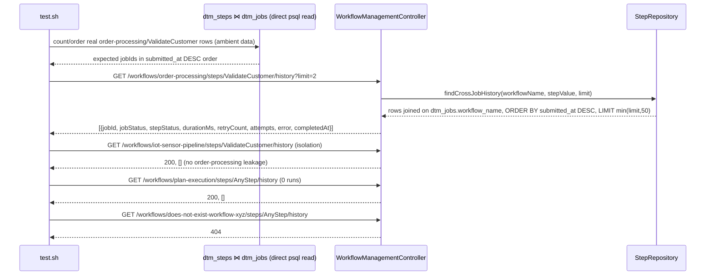

# SE-26: step cross-job history endpoint

## Setpoint Eval Metadata

**Category**: monitor-backend · **Duration**: ~5s (reads ambient dev-stack data, seeds nothing) · **Timeout**: 60s · **Isolation**: parallel-safe

## Scenario
```gherkin
Feature: GET /api/v1/workflows/:workflowName/steps/:stepName/history?limit=N is the
  "across recent jobs" contract (capability-spec.md §3.2b, dtm-video-v2 Lane A) — powers
  the drill-down drawer's cross-job sparkline/table for a step.
  Scenario: recent runs of a step, most-recent-first, capped at limit
    Given N jobs on workflow "order-processing" that all ran step "ValidateCustomer"
      with mixed outcomes (already true on this dev stack — 19 real jobs)
    When GET /workflows/order-processing/steps/ValidateCustomer/history?limit=2
    Then exactly 2 rows come back, ordered most-recent-first by dtm_jobs.submitted_at,
      and each row's jobStatus/stepStatus match the DB

  Scenario: workflow isolation — no cross-workflow leakage
    Given "ValidateCustomer" is an order-processing-only step name (it does not exist
      in iot-sensor-pipeline's step graph)
    When GET /workflows/iot-sensor-pipeline/steps/ValidateCustomer/history is called
    Then the response is 200 with an EMPTY array — never order-processing's rows
      leaking through a step_value-only filter that forgot the workflow join

  Scenario: a registered workflow with zero runs returns an empty array, not 404
    Given "plan-execution" is a registered workflow with zero dtm_jobs rows
    When queried for any step
    Then the response is 200 with an empty array

  Scenario: an unregistered workflow name 404s
    When GET /workflows/does-not-exist-workflow-xyz/steps/AnyStep/history is called
    Then the response is 404

  Scenario: limit is capped at 50 regardless of what the caller asks for
    When queried with limit=999
    Then the response array never exceeds 50 rows
```

## Architecture


## Test Data
Reads (does not own) the 19 real order-processing jobs already on this dev stack (all
of which ran `ValidateCustomer`), plus the pre-registered `iot-sensor-pipeline` (no
`ValidateCustomer` step — proves isolation without needing a literal name collision)
and `plan-execution` (registered, zero jobs — proves the empty-array-not-404 case). No
fresh job is submitted. If fewer than 2 order-processing jobs exist, the limit-2
scenario SKIPs loudly rather than fake-passing on 0/1 rows.

## Artifacts

### Input / payload
```bash
curl -s "${ORCHESTRATOR_HOST}/api/${API_VERSION}/workflows/order-processing/steps/ValidateCustomer/history?limit=2"
curl -s "${ORCHESTRATOR_HOST}/api/${API_VERSION}/workflows/iot-sensor-pipeline/steps/ValidateCustomer/history"
curl -s "${ORCHESTRATOR_HOST}/api/${API_VERSION}/workflows/plan-execution/steps/AnyStep/history"
curl -s -o /dev/null -w '%{http_code}' "${ORCHESTRATOR_HOST}/api/${API_VERSION}/workflows/does-not-exist-workflow-xyz/steps/AnyStep/history"
```

### Expected output (shape)
```json
[
  {
    "jobId": "3da99510-041e-4edc-a3ce-ee6fb4ffd3ba",
    "jobStatus": "partial_success",
    "stepStatus": "completed",
    "durationMs": 2103,
    "retryCount": 0,
    "attempts": [ { "attemptNumber": 1, "status": "success", "...": "..." } ],
    "error": null,
    "completedAt": "2026-07-17T11:28:20.123Z"
  }
]
```

## Assertions
<!-- one checkbox per ck()/ck_eq() gate in test.sh, in execution order -->
- [ ] `limit=2` returns exactly 2 rows
- [ ] rows are ordered most-recent-first (matches `dtm_jobs.submitted_at DESC`)
- [ ] returned `jobId`s match the DB's top-2 most-recent order-processing jobs for this step
- [ ] each row's `stepStatus` matches the DB `dtm_steps.status` for that job+step
- [ ] cross-workflow isolation: `iot-sensor-pipeline` + `ValidateCustomer` returns 200 + `[]`
- [ ] a registered workflow with zero runs (`plan-execution`) returns 200 + `[]`, not 404
- [ ] an unregistered workflow name returns 404
- [ ] `limit=999` never returns more than 50 rows (server-side cap)

## Run
```bash
bash setpoint-evals/run-all.sh --se 26
```

## Troubleshooting

**Limit-2 scenario SKIPs** — dev stack has fewer than 2 order-processing jobs with
`ValidateCustomer`. Run `workflows/order-processing/setpoint-evals/*` a couple of times
first.

**Isolation scenario looks wrong** — `ValidateCustomer` deliberately does NOT exist in
`iot-sensor-pipeline`'s step graph (see `GET /workflows/iot-sensor-pipeline` — its steps
are `RegisterDevice`, `ProvisionDevice`, ... no `ValidateCustomer`). The point is exactly
that: if the endpoint's SQL forgot the `dtm_jobs.workflow_name` join and filtered only on
`step_value`, this query would incorrectly return order-processing's rows — this SE
catches that class of bug without needing two workflows to literally share a step name.

Related: `server-config/plans/dtm-video-v2/capability-spec.md` §3.2b (sibling repo, not
linkable from here).
