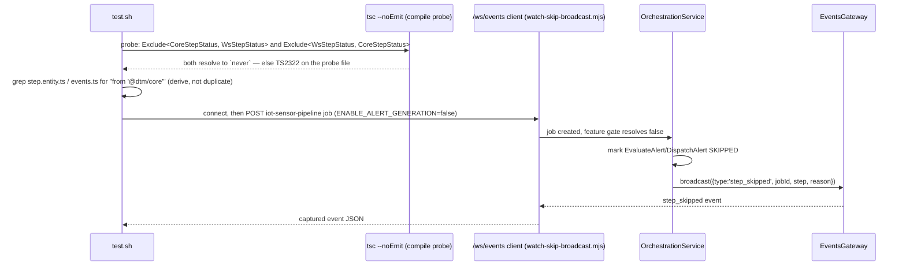

# SE-27: dag overlay status parity

## Setpoint Eval Metadata

**Category**: monitor-backend · **Duration**: ~20s (packages build + tsc probe + one fast iot job) · **Timeout**: 90s · **Isolation**: parallel-safe

## Scope note (Lane A / Lane B split — read this first)

capability-spec.md §4 SE-27 has three sub-scenarios. **This SE covers only the two that
are backend-owned** (Lane A, dtm-video-v2 build order):

- **27.1** static parity: the WS `StepStatus` union and the DB-canonical `StepStatus`
  enum are the same value set, enforced at compile time (this SE), plus the two known
  hand-duplicated declarations (`packages/database`'s entity enum,
  `apps/monitor/src/types/events.ts`'s frontend copy) both derive from the same
  canonical source instead of re-declaring it.
- **27.2** a `skipped` transition is actually broadcast live over `/ws/events` (not
  just visible on the next on-demand snapshot).

**27.3** (Playwright: a `skipped` job's DAG node carries the `dagSkipped` mermaid class)
is **explicitly deferred to Lane B's PR** — it lives in `workflow-dag.tsx`'s
`STATUS_CLASS` map, which Lane A does not touch (dtm-video-v2 build-order carve-out).
Widening `StepStatus` to 10 values here turns `STATUS_CLASS: Record<StepStatus, string>`
into a compile error until Lane B adds the 3 missing keys — that IS the handoff
mechanism (see PR body), not a gap in this SE.

## Scenario
```gherkin
Feature: The 3-way status-vocabulary drift (capability-spec.md §1.5/§2d) — DB enum has
  10 values, WS StepStatus type had 7, STATUS_CLASS had 7 — collapses to ONE canonical
  source so a missing mapping is a compile error, not a silently-unstyled DAG node.

  Scenario: WS StepStatus is exactly the DB-canonical 10-value set (compile-time)
    Given @dtm/core's StepStatus enum is the canonical 10-value source
    When a TypeScript probe asserts the WS event-types' StepStatus has no missing and
      no extra values relative to it
    Then the probe compiles clean — a future value added to one but not the other
      becomes a compile error, not a runtime "class X undefined"

  Scenario: the two known hand-duplicated declarations now derive, not re-declare
    Given packages/database's Step entity and apps/monitor's frontend event types each
      used to hand-declare their own StepStatus
    When their source is inspected
    Then both import StepStatus from '@dtm/core' instead of declaring it locally

  Scenario: a skipped transition is broadcast live, not just visible on reconnect
    Given an iot-sensor-pipeline job submitted with ENABLE_ALERT_GENERATION=false
      (EvaluateAlert/DispatchAlert are feature-gated — skipped immediately, no retry
      wait needed)
    And a WS client connected to /ws/events BEFORE the job is submitted
    When the job runs
    Then the client receives a step_skipped event naming that job and one of the
      gated steps — not only a subsequent on-demand snapshot
```

## Architecture


## Test Data
No fixture ownership — the compile probe and grep checks are pure static analysis of
this PR's own source. The live-broadcast scenario submits one fresh, fast
(~5-10s) iot-sensor-pipeline job per run (feature-gated steps skip immediately, no SQS
retry wait) — same fixture family as
`workflows/iot-sensor-pipeline/setpoint-evals/SE-04-feature-flag-disable-alerts`.

## Artifacts

### Input / payload (compile probe, written to services/orchestrator/src/ and removed after)
```ts
import type { StepStatus as WsStepStatus } from './websocket/dtm-event.types';
import type { StepStatus as CoreStepStatus } from '@dtm/core';

type Core = `${CoreStepStatus}`;
type MissingFromWs = Exclude<Core, WsStepStatus>;
type ExtraInWs = Exclude<WsStepStatus, Core>;

const _checkMissing: MissingFromWs extends never ? true : ['WS StepStatus is missing DB values', MissingFromWs] = true;
const _checkExtra: ExtraInWs extends never ? true : ['WS StepStatus has ghost values not in DB', ExtraInWs] = true;
```

### Input / payload (live broadcast)
```json
{
  "variant": "default",
  "payload": { "deviceId": "greenhouse-4", "entityId": "se27-<timestamp>" },
  "featureFlags": { "ENABLE_ALERT_GENERATION": false }
}
```

### Expected output (captured WS event)
```json
{ "type": "step_skipped", "jobId": "<job>", "step": "EvaluateAlert", "reason": "...", "timestamp": "..." }
```

## Assertions
<!-- one checkbox per ck()/ck_eq() gate in test.sh, in execution order -->
- [ ] compile probe: WS `StepStatus` is missing no DB-canonical value (`Exclude<Core,Ws>` is `never`)
- [ ] compile probe: WS `StepStatus` has no ghost value absent from DB-canonical (`Exclude<Ws,Core>` is `never`)
- [ ] `packages/database`'s Step entity imports `StepStatus` from `@dtm/core` (derives, doesn't duplicate)
- [ ] `packages/database`'s Step entity no longer hand-declares `export enum StepStatus`
- [ ] `apps/monitor/src/types/events.ts` imports `StepStatus` from `@dtm/core`
- [ ] a `step_skipped` WS event is received live, naming the submitted job and a gated step

## Run
```bash
bash setpoint-evals/run-all.sh --se 27
```

## Troubleshooting

**Compile probe reports unrelated pre-existing errors** — `tsc --noEmit -p
services/orchestrator/tsconfig.json` has ~270+ pre-existing, unrelated errors on this
repo (a duplicate `@nestjs/testing`-nested-`@nestjs/common` version mismatch) — this SE
does NOT gate on the overall exit code, only on whether the probe's OWN filename
(`__se27_probe.ts`) appears in the error output.

**Live-broadcast scenario times out** — confirm `ENABLE_REQUEST_FEATURE_FLAGS=true` and
`PUBLISH_EVENTS_TO_KAFKA`/dev-ack-simulator aren't required for this path (alert-gate
skip happens before any Kafka/ACK involvement); check
`docker logs dtm-orchestrator | grep -i "feature flag"`.