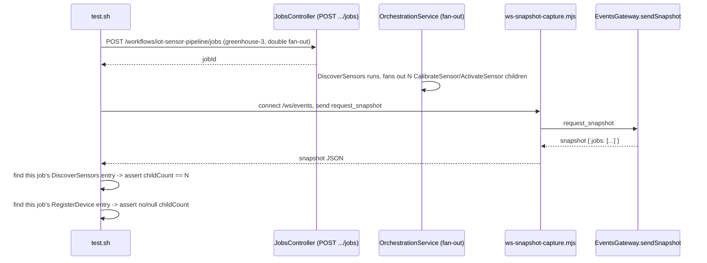

# SE-28: step snapshot childcount

## Setpoint Eval Metadata

**Category**: monitor-backend · **Duration**: ~15s idle · ~60s under contention (one double-fan-out iot job + WS snapshot capture) · **Timeout**: 240s · **Isolation**: parallel-safe

## Scenario
```gherkin
Feature: StepSnapshot (the WS snapshot/job_created payload shape, dtm-event.types.ts)
  gains a childCount field (capability-spec.md §3.4) so the DAG can render an "n/m
  children" badge on fan-out parent nodes without a second round-trip — the data
  (dtm_steps.child_count) already existed on the Step entity; only the WS-facing
  snapshot shape was missing it.

  Scenario: a fan-out parent's snapshot entry carries its real childCount
    Given a fresh double-fan-out iot-sensor-pipeline job (device with N sensors)
    When a WS snapshot is requested while/after the job runs
    Then the DiscoverSensors StepSnapshot entry has childCount == the real number of
      sensors discovered (matches dtm_steps.child_count for that row)

  Scenario: non-fan-out steps carry no childCount (regression guard)
    Given the same job's RegisterDevice step (not a fan-out parent)
    When the same snapshot is inspected
    Then RegisterDevice's StepSnapshot entry has no childCount key, or it is null —
      never a stray 0 or undefined-as-string that would render a false "0 children" badge

  Scenario: existing snapshot consumers are unaffected
    Given the same snapshot payload
    When the pre-existing StepSnapshot fields are inspected
    Then step/description/status/stepNumber are all still present and correctly typed
      (childCount is additive, not a breaking reshape)
```

## Architecture


## Test Data
Submits one fresh, fast (~5-10s) `iot-sensor-pipeline` job with `deviceId:
"greenhouse-3"` (the repo's dedicated 3-sensor fixture device — same as
`workflows/iot-sensor-pipeline/setpoint-evals/SE-03-double-fan-out`) so the job is
guaranteed to be within the WS snapshot's recency window (`findRecentJobs(20)` /
non-terminal). No shared/ambient job is reused here (unlike SE-25/26) because the
snapshot path has a real recency constraint an old job would silently fall outside of.

## Artifacts

### Input / payload
```json
{
  "enableDeduplication": false,
  "variant": "default",
  "payload": { "deviceId": "greenhouse-3", "entityId": "se28-<timestamp>" },
  "testOptions": { "...": "short simDelay/ackDelay, see SE-03-double-fan-out for the reference payload" }
}
```

### Expected output (snapshot excerpt)
```json
{
  "type": "snapshot",
  "jobs": [
    {
      "id": "<jobId>",
      "steps": [
        { "step": "DiscoverSensors", "status": "completed", "childCount": 3 },
        { "step": "RegisterDevice", "status": "completed" }
      ]
    }
  ]
}
```

## Assertions
<!-- one checkbox per ck()/ck_eq() gate in test.sh, in execution order -->
- [ ] the submitted job appears in the captured WS snapshot
- [ ] the job's `DiscoverSensors` StepSnapshot entry carries `childCount` equal to the
      real number of `CalibrateSensor` child rows in `dtm_steps` for that job
- [ ] the job's `RegisterDevice` StepSnapshot entry has no `childCount` key, or it is `null`
- [ ] pre-existing StepSnapshot fields (`step`, `description`, `status`, `stepNumber`)
      are still present and correctly typed on every entry (no breaking reshape)

## Run
```bash
bash setpoint-evals/run-all.sh --se 28
```

## Troubleshooting

**Job not found in snapshot** — the dev stack may have >20 OTHER active/recent jobs
from concurrent SE runs pushing this one out of `findRecentJobs(20)`'s window between
submission and the snapshot request; re-run, or check `docker logs dtm-orchestrator`
for the job's actual completion.