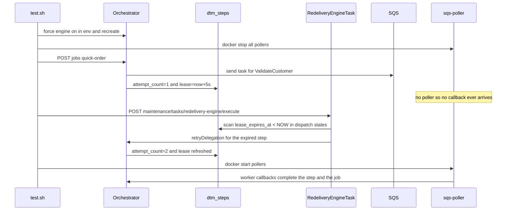

# SE-29: redelivery lease expiry

## Setpoint Eval Metadata

**Category**: recovery · **Duration**: ~90s (lease waits + job completion) · **Timeout**: 240s · **Isolation**: destructive

Flips `REDELIVERY_ENGINE_FORCE_ENABLED=true` + `REDELIVERY_LEASE_SECONDS=5` in `.env`,
force-recreates the orchestrator, stops every `dtm-sqs-poller-*` container, and
restores all of it (env, orchestrator, pollers) in an EXIT trap — mirrors the
env-flip + restore pattern of SE-19.

## Scenario
```gherkin
Feature: the redelivery engine re-dispatches lease-expired steps
  Scenario: a step whose worker never calls back is re-dispatched by the engine
    Given the redelivery engine is forced on with a 5 second delegation lease
    And every sqs-poller container is stopped so no callback can ever arrive
    When a quick-order job is started and its first step outlives its lease
    And the redelivery-engine maintenance task is triggered
    Then the task reports at least one re-dispatched step
    And the step's attempt_count is incremented and its lease refreshed
    And the job still completes once the pollers are started again
```

## Architecture


## Test Data
Reads (does not own) order-processing's seeded rows — `customer_id=1` (Ada Lovelace)
and `order_id=1`, owned by workflow suite `SE-01-happy-path`
(`workflows/order-processing/source-db/SEED-REGISTRY.md`). `entityId` is a fresh
`uuidgen` per run.

## Payload

### Orchestrator env flip (restored by trap)
```bash
REDELIVERY_ENGINE_FORCE_ENABLED=true
REDELIVERY_LEASE_SECONDS=5
```

### Job payload
```json
{
  "variant": "quick-order",
  "payload": { "customerId": 1, "orderId": 1, "entityId": "<uuidgen per run>" },
  "enableDeduplication": false,
  "testOptions": {
    "ValidateCustomer": { "simDelay": 500 },
    "ValidateProduct": { "simDelay": 500 },
    "SubmitCustomer": { "simDelay": 500, "ackDelay": 500 },
    "SubmitOrder": { "simDelay": 500, "ackDelay": 500 }
  }
}
```

### Maintenance task invocation
```bash
curl -X POST -H "Content-Type: application/json" -d '{}' \
  "${ORCHESTRATOR_HOST}/api/${API_VERSION}/maintenance/tasks/redelivery-engine/execute"
```

## Artifacts

### Expected output (task response, excerpt)
```json
{ "success": true, "metrics": { "expiredLeasesFound": 1, "reDispatched": 1, "deadLettered": 0, "skipped": 0, "failed": 0 } }
```

### DB probes
```sql
SELECT COALESCE(MAX(attempt_count),0) FROM dtm_steps WHERE job_id='<JOB_ID>';           -- >= 2 after re-dispatch
SELECT COUNT(*) FROM dtm_steps WHERE job_id='<JOB_ID>' AND lease_expires_at > NOW();   -- >= 1 (lease refreshed)
```

## Assertions
<!-- one checkbox per ck_* gate in test.sh, in execution order -->
- [ ] the maintenance task executed successfully (`success = true`)
- [ ] the engine re-dispatched at least one lease-expired step (`reDispatched >= 1`)
- [ ] the synthetic attempt counter incremented past the initial dispatch (`attempt_count >= 2`)
- [ ] the re-dispatch refreshed the delegation lease into the future
- [ ] the job completed once the pollers returned
- [ ] the attempt counter stayed above one dispatch (redelivery, not a fresh step)

## Run
```bash
bash setpoint-evals/run-all.sh --se 29
```

## Troubleshooting

**SKIP "dtm_steps.attempt_count missing"** — the running stack predates the redelivery
migration; rebuild the migration image and restart: `docker compose build init-typeorm`
then bring the stack up so migrations re-run.

**Task reports `reDispatched = 0`** — the lease had not expired yet (the SE sleeps
`REDELIVERY_LEASE_SECONDS + 3` before triggering), or the engine was not actually on;
check `docker logs dtm-orchestrator` for `RedeliveryEngineTask` lines.

**Job failed instead of completing** — pollers were down so long that the step
exhausted its attempts and dead-lettered (SE-30 territory); the SE restores pollers
immediately after the re-dispatch assertion to stay well clear of that window.

Related: `services/orchestrator/src/maintenance/tasks/redelivery-engine.task.ts`,
`services/orchestrator/src/delegation/delegation.service.ts`.
