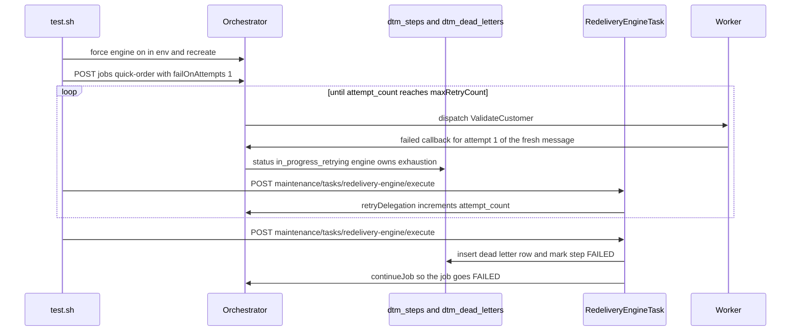

# SE-30: redelivery dead letter

## Setpoint Eval Metadata

**Category**: recovery · **Duration**: ~90s (engine-driven retry loop) · **Timeout**: 240s · **Isolation**: destructive

Flips `REDELIVERY_ENGINE_FORCE_ENABLED=true` + `REDELIVERY_LEASE_SECONDS=5` in `.env`
and force-recreates the orchestrator (restored by EXIT trap — mirrors SE-19). This is
the bus-neutral counterpart of SE-02: where SQS routes an exhausted message to a native
DLQ, the redelivery engine writes a `dtm_dead_letters` row instead.

## Scenario
```gherkin
Feature: the redelivery engine dead-letters attempt-exhausted steps
  Scenario: a step whose worker fails every attempt lands in dtm_dead_letters
    Given the redelivery engine is forced on with a 5 second delegation lease
    And ValidateCustomer is configured to fail on every delivery attempt
    When a quick-order job is started and the engine re-dispatches the step
      up to its max attempts
    Then a row appears in dtm_dead_letters naming the step and its attempt count
    And the step is marked FAILED
    And the job is marked FAILED
    And no re-dispatch happens past the attempt ceiling
```

## Architecture


## Test Data
Reads (does not own) order-processing's seeded rows — `customer_id=1` (Ada Lovelace)
and `order_id=1`, owned by workflow suite `SE-01-happy-path`
(`workflows/order-processing/source-db/SEED-REGISTRY.md`). `entityId` is a fresh
`uuidgen` per run.

## Payload

### Orchestrator env flip (restored by trap)
```bash
REDELIVERY_ENGINE_FORCE_ENABLED=true
REDELIVERY_LEASE_SECONDS=5
```

### Job payload
```json
{
  "variant": "quick-order",
  "payload": { "customerId": 1, "orderId": 1, "entityId": "<uuidgen per run>" },
  "enableDeduplication": false,
  "testOptions": {
    "ValidateCustomer": { "simDelay": 500, "failOnAttempts": [1] },
    "ValidateProduct": { "simDelay": 500 },
    "SubmitCustomer": { "simDelay": 500, "ackDelay": 500 },
    "SubmitOrder": { "simDelay": 500, "ackDelay": 500 }
  }
}
```

`failOnAttempts: [1]` is deliberate: every engine re-dispatch is a FRESH bus message,
so the worker always sees delivery attempt 1 — failing attempt 1 fails every attempt.

## Artifacts

### Expected dead-letter row
```sql
SELECT step_value || '|' || attempt_count || '|' || workflow_name
FROM dtm_dead_letters WHERE job_id='<JOB_ID>';
-- ValidateCustomer|3|order-processing
```

### Expected terminal states
```sql
SELECT status FROM dtm_steps WHERE job_id='<JOB_ID>' AND step_value='ValidateCustomer';  -- failed
SELECT status FROM dtm_jobs  WHERE id='<JOB_ID>';                                        -- failed
```

## Assertions
<!-- one checkbox per ck_* gate in test.sh, in execution order -->
- [ ] exhaustion landed a row in `dtm_dead_letters`
- [ ] the dead letter names the failing step, its exhausted attempt count, and the workflow (`ValidateCustomer|3|order-processing`)
- [ ] the step is FAILED after exhaustion
- [ ] the job is FAILED after the step dead-lettered
- [ ] the engine re-dispatched up to the attempt ceiling, never past it (`max(attempt_count) <= 3`)

## Run
```bash
bash setpoint-evals/run-all.sh --se 30
```

## Troubleshooting

**SKIP "dtm_dead_letters missing"** — the running stack predates the redelivery
migration; rebuild the migration image and restart: `docker compose build init-typeorm`
then bring the stack up so migrations re-run.

**No dead-letter row after 12 engine triggers** — check `docker logs dtm-orchestrator`
for `RedeliveryEngineTask` lines; confirm the worker is actually failing
(`failOnAttempts` reaches the worker via testOptions) and that the engine is on
(`REDELIVERY_ENGINE_FORCE_ENABLED=true` in the orchestrator env).

Related: `services/orchestrator/src/maintenance/tasks/redelivery-engine.task.ts`,
`packages/database/src/entities/dead-letter.entity.ts`, SE-02 (native SQS DLQ routing).
