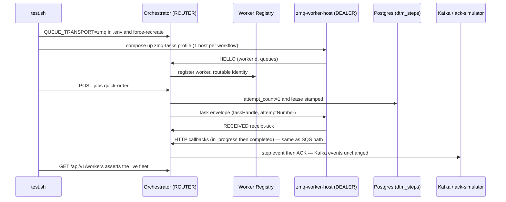

# SE-31: zmq tasks mixed mode

## Setpoint Eval Metadata

**Category**: transport · **Duration**: ~90s (fleet registration + job completion) · **Timeout**: 300s · **Isolation**: destructive

Flips `QUEUE_TRANSPORT=zmq` in `.env`, force-recreates the orchestrator with
`docker-compose.zmq.yml` merged in, brings the `zmq-tasks` profile up (one
`zmq-worker-host` per workflow), stops every `dtm-sqs-poller-*` container, and
restores all of it (.env, orchestrator, worker hosts, pollers) in an EXIT
trap — mirrors the env-flip + restore discipline of SE-29/SE-30. Mixed mode =
zmq tasks + Kafka events UNCHANGED (EventBus work is Phase 3).

## Scenario
```gherkin
Feature: the zmq task transport carries a job end-to-end (mixed mode)
  Scenario: a quick-order job completes over ZeroMQ with no SQS poller running
    Given the orchestrator runs with QUEUE_TRANSPORT=zmq
    And one zmq-worker-host per workflow has HELLO-registered its queues
    And every sqs-poller container is stopped
    When a quick-order job is started
    Then the worker registry lists at least three live workers
    And the order-processing worker-host logs the order-validate-customer task
    And the job completes
```

## Architecture


## Test Data
Reads (does not own) order-processing's seeded rows — `customer_id=1` (Ada Lovelace)
and `order_id=1`, owned by workflow suite `SE-01-happy-path`
(`workflows/order-processing/source-db/SEED-REGISTRY.md`). `entityId` is a fresh
`uuidgen` per run.

## Payload

### Orchestrator env flip (restored by trap)
```bash
QUEUE_TRANSPORT=zmq
```

### Compose invocation (zmq-tasks profile merged over the main file)
```bash
docker compose --env-file .env -f docker-compose.yml -f docker-compose.zmq.yml \
  --profile db --profile orchestrator --profile dev-tools --profile zmq-tasks \
  up -d zmq-worker-host-order-processing zmq-worker-host-iot-sensor-pipeline zmq-worker-host-infra-provisioning
```

### Job payload
```json
{
  "variant": "quick-order",
  "payload": { "customerId": 1, "orderId": 1, "entityId": "<uuidgen per run>" },
  "enableDeduplication": false,
  "testOptions": {
    "ValidateCustomer": { "simDelay": 500 },
    "ValidateProduct": { "simDelay": 500 },
    "SubmitCustomer": { "simDelay": 500, "ackDelay": 500 },
    "SubmitOrder": { "simDelay": 500, "ackDelay": 500 }
  }
}
```

## Artifacts

### Expected output (GET /api/v1/workers, excerpt)
```json
[
  { "workerId": "order-processing-<host>-<pid>", "queues": ["order-discover-line-items", "..."],
    "state": "alive", "registeredAt": "...", "lastHeartbeatAt": "..." }
]
```

### Orchestrator log line proving the transport selection
```text
ZmqTransport ROUTER bound at tcp://0.0.0.0:5557 (redelivery: orchestrator, attemptCounter: synthetic, dlq: table)
```

## Assertions
<!-- one checkbox per ck_* gate in test.sh, in execution order -->
- [ ] the orchestrator booted the ZeroMQ ROUTER transport
- [ ] the worker registry lists at least 3 live workers (one per workflow)
- [ ] an order-processing worker serves the order-validate-customer queue
- [ ] no sqs-poller container was running during the job
- [ ] the quick-order job completed over the zmq task path
- [ ] the order-processing worker-host logged a task for order-validate-customer

## Run
```bash
bash setpoint-evals/run-all.sh --se 31
```

## Troubleshooting

**Registry stays empty** — the worker-host image is stale or the workspace
dists are missing on the host (the containers mount them read-only). Rebuild:
`pnpm run build:packages && pnpm run build:workflows` then
`docker compose -f docker-compose.zmq.yml build zmq-worker-host-order-processing`.

**Job stalls in DELEGATED** — the worker hosts connected before the
orchestrator was recreated and never re-HELLOed; the ROUTER bind is
recreate-safe but check `docker logs dtm-zmq-worker-host-order-processing-1`
for connection errors.

**Job fails instead of completing** — the ack-simulator (Kafka path) is down;
mixed mode still needs the Kafka event/ACK loop for the submit steps.

Related: `services/orchestrator/src/transport/zmq-transport.service.ts`,
`tools/zmq-worker-host/src/host.ts`, `docker-compose.zmq.yml`.
