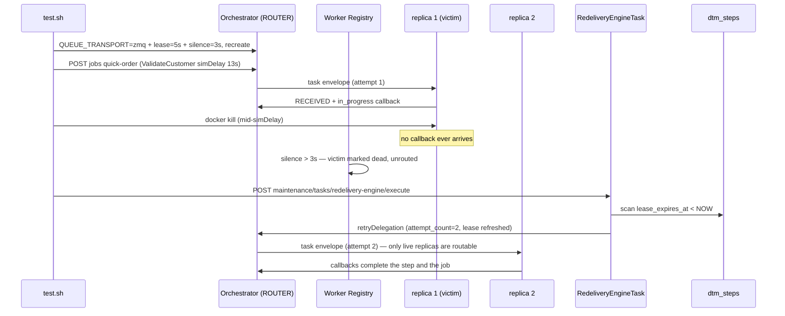

# SE-32: zmq worker crash redispatch

## Setpoint Eval Metadata

**Category**: recovery · **Duration**: ~120s (simDelay kill window + lease wait + job completion) · **Timeout**: 360s · **Isolation**: destructive

Mixed mode up (`QUEUE_TRANSPORT=zmq` + the `zmq-tasks` profile) with TWO
order-processing worker-host replicas. The replica holding a mid-flight
ValidateCustomer task (a 13s `simDelay` provides the kill window (13s is the worker-sdk maximum safe delay)) is
`docker kill`ed; the Phase 1 redelivery engine — AUTO-ON under zmq because the
transport declares `redelivery: 'orchestrator'` (no
`REDELIVERY_ENGINE_FORCE_ENABLED` needed) — re-dispatches the step on lease
expiry, and the job completes via the surviving/restarted replica. Everything
(.env, orchestrator, worker hosts) is restored in an EXIT trap.

## Scenario
```gherkin
Feature: a crashed zmq worker's task is re-dispatched by the redelivery engine
  Scenario: docker kill mid-task, engine re-dispatch, job still completes
    Given mixed mode is up with two order-processing worker-host replicas
    And the delegation lease is 5 seconds and the worker silence window is 3 seconds
    When a quick-order job's slow ValidateCustomer task is picked up by a replica
    And that replica is killed mid-flight
    And the redelivery-engine maintenance task is triggered after the lease expires
    Then the engine reports at least one re-dispatched step
    And the step's attempt_count reaches at least 2
    And the job completes via a live replica
```

## Architecture


## Test Data
Reads (does not own) order-processing's seeded rows — `customer_id=1` (Ada Lovelace)
and `order_id=1`, owned by workflow suite `SE-01-happy-path`
(`workflows/order-processing/source-db/SEED-REGISTRY.md`). `entityId` is a fresh
`uuidgen` per run.

## Payload

### Orchestrator env flip (restored by trap)
```bash
QUEUE_TRANSPORT=zmq
REDELIVERY_LEASE_SECONDS=5
ZMQ_WORKER_SILENCE_MS=3000
ZMQ_WORKER_SWEEP_INTERVAL_MS=1000
```

### Job payload
```json
{
  "variant": "quick-order",
  "payload": { "customerId": 1, "orderId": 1, "entityId": "<uuidgen per run>" },
  "enableDeduplication": false,
  "testOptions": {
    "ValidateCustomer": { "simDelay": 13000 },
    "ValidateProduct": { "simDelay": 500 },
    "SubmitCustomer": { "simDelay": 500, "ackDelay": 500 },
    "SubmitOrder": { "simDelay": 500, "ackDelay": 500 }
  }
}
```

### Maintenance task invocation
```bash
curl -X POST -H "Content-Type: application/json" -d '{}' \
  "${ORCHESTRATOR_HOST}/api/${API_VERSION}/maintenance/tasks/redelivery-engine/execute"
```

## Artifacts

### Expected output (task response, excerpt)
```json
{ "success": true, "metrics": { "expiredLeasesFound": 1, "reDispatched": 1, "deadLettered": 0, "skipped": 0, "failed": 0 } }
```

### DB probe
```sql
SELECT COALESCE(MAX(attempt_count),0) FROM dtm_steps WHERE job_id='<JOB_ID>';  -- >= 2 after re-dispatch
```

## Assertions
<!-- one checkbox per ck_* gate in test.sh, in execution order -->
- [ ] the orchestrator booted the ZeroMQ ROUTER transport
- [ ] two order-processing replicas were registered before the crash
- [ ] the ValidateCustomer task reached a replica before the kill
- [ ] the redelivery engine executed successfully (auto-on under zmq)
- [ ] the engine re-dispatched the crashed worker's lease-expired step
- [ ] the synthetic attempt counter proves a re-dispatch (attempt_count >= 2)
- [ ] the job completed after losing a worker mid-task

## Run
```bash
bash setpoint-evals/run-all.sh --se 32
```

## Troubleshooting

**`reDispatched = 0`** — the lease had not expired yet when the engine was
triggered (the SE sleeps `LEASE_SECONDS + 4` after the kill), or the engine is
not actually active: under zmq it needs no FORCE flag, but check
`docker logs dtm-orchestrator` for `RedeliveryEngineTask` lines.

**Re-dispatch swallowed (attempt_count stuck at 1, engine keeps finding the
step)** — the dead replica was still routable (silence window not elapsed);
the SE sets `ZMQ_WORKER_SILENCE_MS=3000` and waits past it precisely to avoid
this. If it recurs, raise the post-kill sleep.

**Job failed instead of completing** — the step exhausted `maxRetryCount`
while no live replica served the queue (both replicas down); the SE keeps one
replica untouched for exactly this reason.

Related: `services/orchestrator/src/maintenance/tasks/redelivery-engine.task.ts`,
`services/orchestrator/src/transport/zmq-worker-registry.service.ts`,
`tools/zmq-worker-host/src/host.ts`.
